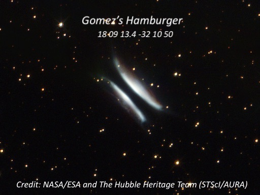
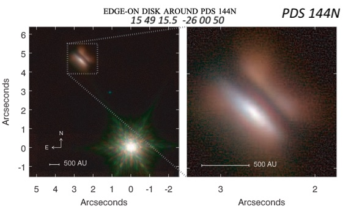
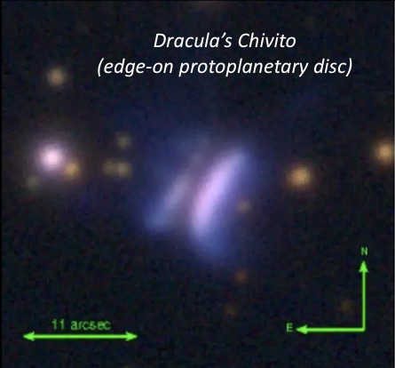
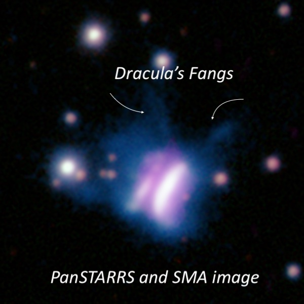

Akarsh Simha mentioned Dracula’s Chivito (nickname explained at the end) in his [August 4th 2024 Observing Report](https://groups.google.com/g/sf-bay-tac/c/kfcG4IqUiv0/m/RMJ1i6RsBAAJ). Astronomers discovered the true nature of this remarkable object only this year, so it’s worth a closer look. Don’t be confused with protoplanetary nebulae (young PN often called pre-planetary nebulae), transitioning into an ionized PN after the main sequence and AGB phase. In the case of Dracula’s Chivito, we’re talking about a protoplanetary disc that provides the physical and thermochemical environment for creating planets — and it’s the largest one currently known in angular extent!

The discovery paper was published in 2024 by Berghea et al., titled "[Dracula's Chivito: Discovery of a Large Edge-on Protoplanetary Disk with Pan-STARRS](https://iopscience.iop.org/article/10.3847/2041-8213/ad43e3/pdf)." U.S. Naval Observatory astronomer Ciprian Berghea serendipitously found this remarkable disk in 2016 on PanSTARRS images while working on a study of active galactic nucleus (AGN) candidates. A follow-up study in May titled "[High-resolution Pan-STARRS and SMA Observations of IRAS 23077+6707: A Giant Edge-on Protoplanetary Disk](https://iopscience.iop.org/article/10.3847/2041-8213/ad3bb0/pdf)"
used the Submillimeter Array (SMA) and Pan-STARRS to study the thermal
dust, gas emission, and scattered light of the disk.

How could this relatively bright object escape earlier detection? It
hadn't. In 1993, it was catalogued as a bright infrared source (IRAS
23077+6707) and observed as a possible pre-main-sequence star at radio
wavelengths. In 2014, a far-infrared survey also identified <x-dso simbad="IRAS 23077+6707">Dracula's Chivito</x-dso> as a young stellar object (YSO) candidate. A German amateur,
Mattias Kronberger, first noted its non-stellar appearance, so it's also
known as Kn 32.

Dracula’s Chivito is only the third known edge-on protoplanetary disk
(the other two are called <x-dso>Gomez's Hamburger</x-dso> and <x-dso>PDS 144N</x-dso>), in which an
equatorial lane of dust and gas completely obscures the
pre-main-sequence star (type Herbig Ae). From our vantage point, we see
two edge-on reflection nebulae (split by the dust/gas lane) illuminated
from within by the embryonic star that spans 11” in length. This
compares to 5” for Gomez’s Hamburger and only 1” for PDS 144N (the
northern component of a close double star).

I looked at PDS 144N, part of a close pair of Herbig Ae stars (N stands
for north), from the Golden State Star Party (GSSP) in early July 2024.
Like Dracula’s Chivito, the exciting YSO is hidden from direct view by
the dust lane of the edge-on proto-planetary disk, which is slightly
less than 1" in diameter. PDS 144N is the first such disk discovered
(2006) in an intermediate-mass YSO. It forms a 5.3" pair with another
mag 13.1 Herbig Ae star, which is exposed. I was able to quickly track
down the PDS 144 pair in western Scorpius (close to the Libra border) as
it sits near the center of a triangle formed by mag 7.0 HD 141063 18' W,
mag 6.6 HD 141554 24' SE, and mag 4.6 1 Scorpii 28' NE. Even at 200x, I
could split the double star, though the elevation was low and the seeing
soft. At 263x, the 5” pair split into two mag 13.1/14.2 stars oriented
SSW-NNE with the fainter 14th mag component (PDS 144N) to the NNE.
Although PDS 144N appeared perfectly stellar, the dust/gas lane
completely extinguished the central star, and the 1” circumstellar disk
is visible.

Dracula’s Chivito is the largest of these three systems, spanning 11”
(or 17” including extensions called “fangs”). At a distance of 300
parsecs (just under 1000 light-years), this translates into a disc
spanning 3300 astronomical units. For comparison, the Oort Cloud starts
at a distance of roughly 2000 a.u., so it extends out to the distance
where the Oort Cloud begins! The obscured, young central star is thought
to be still surrounded by its natal envelope, which is very faint and
dissipating. The optical spectrum is hot, most likely an Ae star (type A
with emission) with a mass of roughly 2.5x the Sun and a luminosity of
over 10x the Sun.

I looked at Dracula’s Chivito on Thursday night (9/5/24), the last of
three nights at a site near McArthur (west of the GSSP site), observing
with Carter Scholz and Jim Molinari. The Chivito lies 2.3° northeast of
mag 3.5 Iota Cephei and 9’ north of a mag 6.7 star (HD 218829). I was
using a Servocat/Nexus system, so I just entered the coordinates (23 09
43.6 +67 23 39), hit the Go-To button, and the object was nearly
centered a few seconds later. Using 325x, I immediately identified a
fairly bright fuzzy star forming the SW vertex of a triangle with two
mag 13.4 stars 1.9' NE and 2.3' E. As the seeing was only fair, the size
and shape appeared to vary somewhat but mainly was seen as an elongated
(NNW-SSE) fuzzy disc, perhaps 10" in length, with a brighter,
quasi-stellar middle. In steady moments at 508x (4.5mm Delos), the high
surface brightness disc was quite extended, at least 3:1, so I’d
estimate the dimensions at ~10"x3”. I only observed the brighter western
portion — I didn't notice the much fainter eastern half nor the dust
lane separating the two slices.

Regarding the nickname, they wanted to keep the Gomez’s Hamburger theme.
A footnote in the discovery paper states, "One of the authors grew up in
Transylvania, not far from the place where Vlad (Draculea) Tepes lived,
and another author is from Uruguay, where “chivito” is a traditional
sandwich and it is similar to a hamburger.” Googling a chivito, it
sounds like “The Lot” burger in Australia since it's "typically topped
with mozzarella cheese, ham, bacon, tomato, mayonnaise, olives, and
often a fried or hard-boiled egg, all served on a bun.”

Although Akarsh used his 28” in his observation and I was observing with
my 24”, Dracula’s Chivito has a fairly high surface brightness, and it
should be visible in a much smaller scope. Take a look — you may be
surprised!

