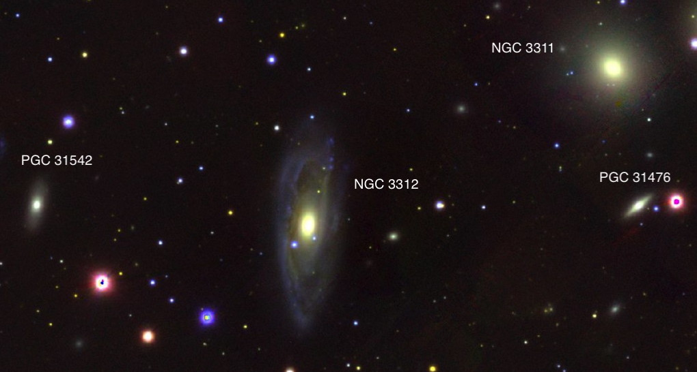

Big telescopes lead to big discoveries. Or so you would assume. After
the general success of Lord Rosse’s 72-inch reflector, a group of
leading British and Irish astronomers championed the cause of building a
large telescope in the Southern Hemisphere. The resulting 48-inch f/41
Great Melbourne Telescope (GMT) – the second largest in the world –
began service in 1869. The father and son Irish telescope engineers
Thomas and Howard Grubb built an innovative Cassegrain optical design,
open-lattice tube to avoid tube currents, and an equatorial mount with a
weight-driven clock drive. Expectations were sky high for spectacular
discoveries.

 
_Erecting the Great Melbourne Telescope, 1869 (Credit: Museums Victoria)_

Thirty-five years earlier John Herschel surveyed the southern skies with
his 18.5-inch f/13 speculum reflector from the Cape of Good Hope in
South Africa. Herschel produced a monumental catalog of over 1700
southern nebulae and clusters, nearly 1300 seen for the first time, and
a list of over 2000 double stars. Herschel also compiled an extensive
catalog of the stars, clusters, and nebulae in the Magellanic Clouds and
documented spectacular outbursts of the variable star Eta Carinae. The
nature of the fuzzy nebulae was a vexing problem – were they unresolved
star clusters or self-luminous matter?  
  
The GMT produced a few early photographs of the Moon and southern
nebulae and experimented with spectroscopy, but the telescope was poorly
designed for these new fields. Its primary mission, as determined by the
Royal Society committee, was to document changes in the structure of the
mysterious nebulae. Herschel’s published sketches served as the
reference. From the onset, various issues arose with the operation of
the telescope and the observing program. The staff used the wrong
solvent to remove a shellac coating that protected the mirror surface
during transport. As a result, the primary mirror displayed a "mealy"
appearance and required repolishing. Someone removed the eye-stops
(baffles) from the supplied eyepieces, and their performance was poor.  
  
Even after rectifying these mistakes, larger problems surfaced because
of a poor site location and lack of a dome. Only a few moonless nights a
month were useable for critical viewing. Wind caused the structure to
vibrate and the massive mirror – the last large speculum built –
tarnished rapidly in the moist Melbourne weather.

The observatory struggled to hire and maintain first-class visual
astronomers. Variability in observing conditions and the subjective
nature of recording and sketching details near the limit of visibility
led to inconclusive results. The astronomers were unaware that the
targeted objects (both emission nebulae and galaxies) were much too
distant to display any physical changes over a few decades. A series of
poor decisions and unfortunate timing doomed the project’s mission from
the start.

Robert Ellery, the director of the observatory, published one major
paper on the results: "*Observations of the Southern Nebulae made with
the Great Melbourne Telescope from 1869 to 1885. Part I. Melbourne"*.
Ellery included sketches and descriptions of many nebulae but mentioned
only two discoveries by Pietro Baracchi, and both were insignificant
finds. Despite the expectation to publish later observations, lack of
both financial resources and an effective method to produce lithographs
of the sketches squashed that goal. Was it possible the observers
discovered only two measly objects with the 48-inch GMT?

George Ritchey, the architect of the 60-inch and 100-inch Mt. Wilson
reflectors, considered the GMT an abject failure and wrote it was "one
of the greatest calamities in the history of instrumental astronomy; for
by destroying confidence in the usefulness of great reflecting
telescopes, it has hindered the development of this type of instrument…
for nearly a third of a century."

The GMT was in active service in Melbourne for nearly 20 years. While
reexamining known objects, I felt it was likely the observers noticed
many additional objects in the field – especially within southern galaxy
clusters. Perhaps there were unpublished logs and discoveries.

Trudy Bell wrote an excellent article in the October 2018 issue of *Sky
& Telescope* on a project by the Astronomical Society of Victoria to
restore the GMT. Volunteers were using surviving parts from the
telescope owned by the Museums Victoria. She mentioned that observers
on the GMT had discovered "more than 50 nebulae and galaxies",
confirming my suspicion. But were these records accessible?

I started by searching on the *Museums Victoria* website. I found
several images of the observatory and lithographs of sketches meant for
publications, including one that revealed <x-dso>NGC 1365</x-dso> as a barred spiral.
Digging further, I found more information in the publication “Board of
Visitors to the Observatory: together with the Annual Report of the
Government Astronomer”. The 1885 report (#20) stated, “of the 172
nebulae observed, 140 are Herschel’s, 3 are new one discovered by the
late Mr. Turner, and 29 new or not identified, found by Mr. Baracchi.”
The following report stated, “… 30 nebulae were found, but not
identified in the catalogues, and may therefore be regarded as new.”
Here was the confirmation that Baracchi and Turner discovered over 60
nebulae with the GMT, besides the two credited in the NGC!

Pietro Baracchi, who made most of these discoveries, was the 4th
principal observer on the telescope – following Albert Le Sueur, Farie
MacGeorge, and Joseph Turner – and the most talented. He was born in
Florence in 1851, earned a degree in civil engineering, and moved to
Australia to pursue a career. After working on a project to determine
Australia's longitudes, Ellery hired him in 1883 to replace Turner, who
had just passed away.

Baracchi spent his first year testing and improving the mechanical
operation of the telescope, eliminating instrumental errors in
determining positions. Starting in 1884, he reexamined Herschel's
nebulae for any changes and continued this work for the next 4 years.

Pietro Baracchi, GMT astronomer, 1851-1926

After searching online, I located scans of his original notebooks on the
[National Archives of
Australia](https://recordsearch.naa.gov.au/SearchNRetrieve/Interface/SearchScreens/BasicSearch.aspx)
website. I spend several days poring through Baracchi's sketches and log
entries, uncovering 58 discoveries. His predecessor Joseph Turner found
14 new objects and Albert Le Sueur 2 more.

To document his discoveries, Baracchi made careful diagrams including
nearby field stars. Sometimes he computed accurate positions (to within
a few arc-seconds) by timing offsets from known stars. As I suspected,
half of his discoveries were within galaxy clusters including 17 in the
Centaurus cluster (<x-dso>Abell 3526</x-dso>) and 6 each in the Hydra I cluster (<x-dso>Abell
1060</x-dso>) and the <x-dso>Antlia cluster</x-dso>. These three rich clusters are part of the
Hydra-Centaurus Supercluster, composed of a half-dozen rich Abell
clusters and many smaller groups.

His last discovery, <x-dso>ESO 358-59</x-dso>, was in February 1888 using the spare
mirror of lower quality since the primary mirror had tarnished
significantly after 18 years of use. Two months later he ceased all
observations and began re-polishing experiments. Baracchi eventually
produced a good figure and polish on Mirror A, but after 1890 he made
only a few scattered observations.

Let's take a tour of some of my favorite GMT discoveries.

### <x-dso>IC 4970</x-dso>, a companion to the Condor Galaxy (<x-dso>NGC 6872</x-dso>)

NGC 6872 is a remarkable gas-rich barred spiral, dubbed the Condor
galaxy, with enormous wings unfurling over 500,000 light-years from tip
to tip. This monster has a much smaller lenticular buddy, IC 4970, which
is tidally interacting. Both galaxies are flying within the <x-dso>Pavo I
group</x-dso>, a flock of a dozen or more at a distance of 190 million
light-years.

John Herschel missed IC 4970 when he discovered NGC 6872 in 1835, but
Joseph Turner picked it up during an observation on August 27, 1881. The
1882 Annual Report of the observatory has a brief mention of the
discovery, but Turner never received wider credit.

A stellar bridge connects IC 4970 with the Condor's northern tidal arm
at a break point referred to as the 'knee'. IC 4970 may not look
impressive – it's only 1/10 to 1/5 as massive as NGC 6872 – but hosts an
obscured active galactic nucleus (Seyfert 2). Astronomers propose a near
collision with NGC 6872 drove gas to IC 4970's supermassive black hole
and fueled the AGN.

In 2014, Rafael Eufrasio (NASA Goddard) and colleagues analyzed the
star-formation regions in NGC 6872 in the far-ultraviolet to
near-infrared wavelengths. Their results showed the interaction with IC
4970 wasn’t solely responsible for shaping the Condor’s arms. A second
culprit is likely <x-dso>NGC 6876</x-dso>, a giant elliptical 9' to the southeast and
the brightest member of Pavo I. The Condor passed close to this galaxy
some 130 million years ago as evidenced by the longest-known X-ray trail
that connects the two galaxies.

Several years ago I viewed NGC 6872 through a 30-inch super-sized
reflector. At 300×, it was a prominent oval, tipped 2:1 to the southwest
toward a 10.4-magnitude star. The core was bright and elongated and held
a vivid nucleus. The arms appeared as thin gossamer wings extending to
the knee of the northern arm and beyond the bright star on the south
side.

 
_Credit: FORS Team, 8.2-meter, VLT Antu, ESO, Processing & License: Judy
Schmidt_

### <x-dso simbad="H88 301">Hodge 301</x-dso> in the Tarantula Nebula (<x-dso>NGC 2070</x-dso>)

Our next stop is the *Tarantula Nebula* NGC 2070, a spectacular
naked-eye star-forming complex in the LMC. At its massive heart is <x-dso simbad="RMC 136">R136</x-dso>,
a very young (1-2 million years) super star cluster containing dozens of
massive O-type stars. Just 3' northwest of R136 is Hodge 301, the oldest
cluster in the nebula with an age of 25 to 30 million years. Hodge 301
has produced 40 to 60 supernovae and perhaps triggered R136’s formation.

Baracchi sketched the Tarantula Nebula on June 24, 1884, while still
testing the telescope. Besides the central knot of stars and many
intersecting loops of nebulosity, he included Hodge 301 as a compact
circular patch, resolved into several stars. It wasn't until 1988 that
the University of Washington astronomer Paul Hodge first cataloged the
cluster (one of 255 in the LMC).

Using an 18-inch reflector at 118× (also in Australia), the cluster
stood out as a mottled 30" knot, just 3' northwest of the Tarantula's
heart. Increasing to 225×, a half-dozen 13th to 14th magnitude stars
sparkled over a hazy background.

 
_Hodge 301 captured by the HST_

### <x-dso>NGC 6438A</x-dso>, disrupted companion to <x-dso>NGC 6438</x-dso>

NGC 6438 forms an interacting pair with a distorted irregular companion,
known as NGC 6438A. This duo lies less than 5° from the south celestial
pole in the constellation Octans. John Herschel discovered NGC 6438 from
the Cape of Good Hope but only noted a single glow. Baracchi next
observed the galaxy 50 years later. He described a “*Double nebula… with
a faint roundish flat appendage south following about 40" in diameter,
which might be a close companion*.” His sketch shows a bright, small
nebula on the northwest side (NGC 6438) and a larger, fainter glow (NGC
6438A) attached to the southeast.

A 1996 photometric and spectroscopic investigation found strong
differences between the northern wing and its southern tidal arm of NGC
6438A. The northern portion is very dusty and nearly forms a ring, while
the southern extension is straight and less dusty, with a sharp
definition. The authors conclude that NGC 6438A might be a merger of two
disc galaxies, suggesting the system is an interacting triplet.[^1]

Using a 24-inch scope at 260×, I found a strange-looking pair! The main
galaxy was moderately bright, but small and round. NGC 6438A was larger
but fainter – a diffuse wing or arc with no discernable core, spreading
southwest to northeast. A 9.5-magnitude star (an uncatalogued double)
sits 4' southwest.

 
_Image: Carnegie-Irvine Survey_

### Centaurus Galaxy Cluster (<x-dso>Abell 3526</x-dso>)

_[Link to main article](/centaur.htm)_

The Centaurus galaxy cluster lies 9° northwest of Omega Centauri, the
brightest globular cluster. It contains hundreds of galaxies that lie at
a distance of some 130 million light-years. At a declination of -41°,
the cluster scrapes the treetops from northern California, but I've
still tracked down over 30 members.

&#8203;<x-dso>NGC 4696</x-dso>, a 10.4-magnitude giant elliptical with an active supermassive
black hole, dominates the cluster's core. At x-ray and radio
wavelengths, the black hole appears to erupt every 5 to 10 million
years, producing powerful jets that create radio-emitting bubbles or
cavities in the hot intra-cluster gas.[^2] A 45' circle centered on NGC
4696 includes three galaxies discovered by John Herschel: <x-dso>NGC 4683</x-dso>, <x-dso simbad="NGC 4706">4706</x-dso>, and <x-dso simbad="NGC 4709">4709</x-dso>. But when Baracchi examined the field in May 1885, he
discovered 8 galaxies that Herschel missed and tallied 17 new galaxies
in the entire cluster.

Two months earlier Baracchi targeted <x-dso>NGC 4650</x-dso> and <x-dso>NGC 4622</x-dso>, located 1°
northwest of NGC 4696. This pair is part of the “Centaurus Chain” – a
1.3°-long filament of 9 galaxies aligned west to east. Within the chain
is <x-dso>NGC 4650A</x-dso>, a spectacular polar ring galaxy. The striking
configuration is likely the aftermath of a galactic interaction or
merger. The polar ring comprises accreted gas and stars from the hapless
companion and is now experiencing bursts of star formation.

I had a breathtaking view of this galaxy through a 25-inch reflector at
244× in April 2019. My first impression was of a rather nondescript oval
extending 30"×20" with a weakly condensed core. But with averted vision,
thin perpendicular wings popped into view. Back to direct vision and
they disappeared. Wow, a blinking polar ring galaxy!

### Hydra I Cluster (<x-dso>Abell 1060</x-dso>)

_[Link to main article](/agc1060.htm)_

The Hydra I cluster (S&T: April 2018, p. 30) resembles the Virgo cluster
in both size and richness, though is three times as distant. The
brightest of its 350 members shine at 12th magnitude and are visible in
a 6-inch telescope.

John Herschel discovered the five brightest galaxies (<x-dso simbad="NGC 3308">NGC 3308</x-dso>, <x-dso simbad="NGC 3309">3309</x-dso>, <x-dso simbad="NGC 3311">3311</x-dso>, <x-dso simbad="NGC 3312">3312</x-dso>, and <x-dso simbad="NGC 3316">3316</x-dso>) in the cluster’s core and a few fainter members.
This quintet forms a curving 19' chain that slides between 5th-magnitude
HD 92036 and 6.7-magnitude HD 91964. Baracchi observed Hydra I in early
February 1886 and discovered six dim members. The following month he
contracted typhoid fever and suspended his observations for 8 months.

NGC 3312 is the largest and brightest spiral in the cluster. An
extensive dust structure winds around the disc and delineates a massive
outer spiral arm. When Baracchi sketched NGC 3312 he discovered two 14th
magnitude dwarfs that bookend the galaxy. <x-dso>PGC 31542</x-dso>, 4' to the east of
the NGC 3312, was a small pale smudge through my 18-inch from northern
California. I needed my 24-inch to see <x-dso>PGC 31476</x-dso> as an 11th magnitude
star off its west side masks its gossamer glow. Both appeared 20" in
length and half as wide.

### Antlia Cluster (<x-dso>ACO S 636</x-dso>)

Our last stop is 8° further south at the Antlia Cluster, also a member
of the Hydra-Centaurus Supercluster. With a declination of -36°,
mid-northern observers should capture this loose cluster as it
culminates on the meridian.

A perplexing question is its range of recessional velocities, with
redshift surveys finding three concentrations around 1900 km/sec, 2800
km/sec, and 3700 km/sec. Is this a single cluster or several independent
groups along the same line of sight? Although the galaxies with extreme
velocities are likely in the foreground or background, the cluster
appears to be strung out along a filament that points in our
direction.[^3]

Two giant ellipticals, <x-dso>NGC 3258</x-dso> and <x-dso>NGC 3268</x-dso>, anchor the cluster’s core.
Each galaxy has an enormous system of globular clusters – estimated at
8000 apiece – that were likely captured over many galactic mergers in
their evolutionary past.[^4]

NGC 3258 also harbors a central supermassive black hole. In 2019, it was
the focus of high-precision kinematical study using the Atacama Large
Millimeter Array (ALMA). By modeling the high-velocity rotation of cold
gas swirling around the black hole, astronomers measured its mass at a
colossal 2.25 billion solar masses.[^5]

John Herschel picked up 15 of the brightest cluster members from 11th to
13th-magnitude during several sweeps in 1834 and 1835. Over two nights
in 1886, Baracchi found six fainter members, including <x-dso>ESO 375-041</x-dso> (also
PGC 30905). This 14th magnitude lenticular is situated 7' northwest of
NGC 3268 and is just a small oval patch in a 16-inch scope.

 
<i><https://www.rolfolsenastrophotography.com/Astrophotography/Antlia-Galaxy-Cluster/></i>

### <x-dso>NGC 1200</x-dso> Galaxy Group

NGC 1200 is the brightest member of a small galaxy group in western
Eridanus. William Herschel discovered this elliptical in November 1785
through his 18.7-inch speculum reflector. When his son John observed the
field 50 years later from the Cape of Good Hope, he also picked up
slightly fainter <x-dso>NGC 1196</x-dso>, 7' to the southwest. John Louis Emil Dreyer
next examined the field in January 1877 and added <x-dso>NGC 1195</x-dso>, which he
spied 2' north-northwest of NGC 1196. Dreyer had quite an advantage in
aperture, using Lord Rosse's 72-inch "Leviathan" at Birr Castle in
Ireland.

Baracchi was at least the fourth observer to inspect the field on
December 7, 1885. After viewing Comet C/1885 X2, discovered four nights
earlier by E. E. Barnard, he turned the large telescope to NGC 1200.
Besides the three previously discovered nebulae, he noticed **<x-dso>IC 285</x-dso>**,
only 3' southeast of NGC 1200. Baracchi commented it was "*almost as
faint and as small as \[NGC 1195\], indistinct outline.*" Through my
18-inch reflector, I found IC 285 larger and noticeably more elongated
than NGC 1195, but with a low, nearly even surface brightness.

NGC 1200 lies 3.6° southeast of 4th-magnitude Azha (Eta Eridani) at a
distance of 185 million light-years. The group also includes <x-dso>NGC 1204</x-dso>, <x-dso>IC 287</x-dso>, and <x-dso>IC 291</x-dso>.

 <i>Image: PanSTARRS DR1</i>

---

### References

[^1]: 1996 paper by Donzelli and Espindola: "NGC 6438: A Triple System?"
    (http://articles.adsabs.harvard.edu//full/1996AJ....111.1057D/0001057.000.html)

[^2]: https://chandra.si.edu/photo/2017/ngc4696/

[^3]: 2015 study by Caso and Richtler: "Deconstructing the Antlia
    cluster core" (https://arxiv.org/pdf/1510.04274.pdf)

[^4]: 2017 paper by Caso et al: "Globular cluster systems as tracers of
    the evolutionary history in NGC 3258 and NGC 3268"
    (https://arxiv.org/pdf/1812.09364.pdf)

[^5]: 2019 paper by Boizelle et al: "A Precision Measurement of the Mass
    of the Black Hole in NGC 3258 from High-resolution ALMA Observations
    of Its Circumnuclear Disk" (https://arxiv.org/pdf/1906.06267.pdf)
