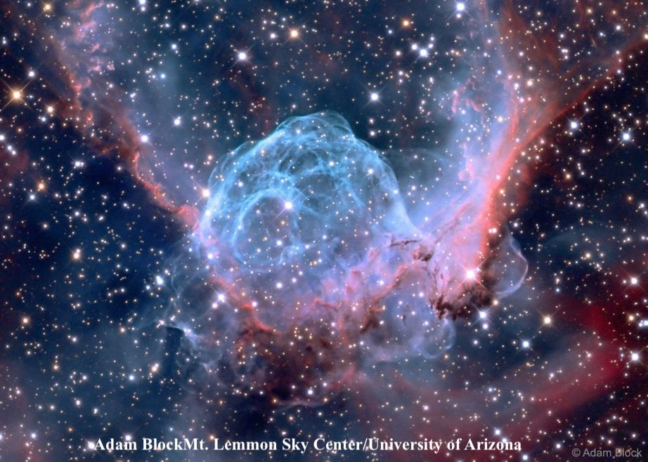

Last month Paul Alsing, Debbie Searle, Jeff Gortatowsky and I took a pilgrimage to Fort Davis, Texas to view through Jimi Lowrey's 48\-inch scope.  Dubbed Barbarella it is currently the largest amateur telescope in the world.  It was installed at Jimi's observatory (up a steep hill from a his house) by OMI (Optical Mechanics, Inc).  We came close to canceling the trip a week before departure due to a medical emergency with Jimi's wife but he insisted we still visit and he arranged for his friend's Jim and Anna Chandler to step in as hosts and telescope operator.  Besides drooling over the scope, we were given a personal VIP tour of inner workings of [McDonald Observatory](http://mcdonaldobservatory.org/) by the director Tom Barnes and were led through all their facilities including the 433\-inch HET (Hobbey\-Eberly telescope), the 107\-inch Harlan Smith telescope and the 82\-inch Otto Stuve telescope.  On another day, we toured the inside of the 82\-foot VLBA radio telescope next to Prude Ranch by the dish operator and climbing right onto the edge of the center the dish.  

  
  
The 48\-inch Astro\-Sital f/4 mirror (actually 48\.875", but who needs to nitpick) was purchased from Lomo in Russia.  At 5\-inches thick, it weighs over 700 lbs.  The steel/aluminum scope was built by OMI and the entire structure is roughly 3000 lbs.   A custom built Servocat drives the scope with computer control through an ArgoNavis and a laptop.  Still, at the end it just looks like your familiar truss\-tube dob just seriously beefed up on some growth hormone concoction.

  

  

  

  

We never pushed the scope to superhigh magnifications, but at 700x the optical performance was stunning with sharp, tiny stellar images down to 18\+ magnitude.  The mag 16\.5/16\.7 components of the Twin (gravitationally lensed) Quasar in Ursa Major were so easily resolved (6" separation) you really couldn't consider it any kind of challenge object with this scope.  All 5 components of the HCG 55 chain were easily resolved (mag 15\.9\-17\.1\) and a more serious challenge, HCG 50, was pretty easily resolved into 4 distinct components with the tiny individual galaxies from mag 18\.7 to 19\.6B. Unfortunately, the weather was mostly cloudy and we really only had one good night out of five with another couple of hours on a second night.  Still, we had a pretty good taste of how his 48" scope performs in very dark skies. In the end, there really wasn't one "challenge" object that turned out to be a real challenge!  
On the night we observed, the skies were clear but there was pretty heavy dew which probably cut down on the transparency, nevertheless the SQM reading was \~21\.75 (his house is down the road from Prude Ranch, where the Texas Star Party was taking place).  Early in the morning, Jim and I went back to observe when the relative humidity was drier and I believe the SQM reading was probably closer to 21\.85\.  I was initially a little intimidated by the thought of climbing up the huge ladder at night, but after one trip up and seeing how rock solid it stood, it wasn't an issue.  Jim Chandler, was a whiz at operating the scope through SkyTools and with his assistance we maximized the available time to see quite a few objects.  The following represents roughly 1/2 the fields I looked at with the 48\-inch, but gives a pretty good flavor of the views \-\-  

  

## <x-dso>NGC 2359</x-dso> \= Thor's Helmet

RA | 07 18 31 |
Dec | \-13 13\.5 |
Size | 8' × 6' |

 

The 5' central region of Thor's Helmet was a mesmerizing at 267x and 330x (unfiltered).  A large, bright knot was at the south end of the rim where the inner portion of the bright wing that heads southwest connects with the central bubble.  Along the northern edge of the rim are three collinear mag 11 stars (2\.2' length) oriented E\-W. The rim of the bubble is noticeably brighter in a thin arc beginning due north of center (between the two western stars) and extending about 90° clockwise to the west (this portion of Thor's Helmet is listed separately as NGC 2361\).  The rim was also brighter along a 45° thicker arc on the southeast side.  The rim had a lower surface brightness on the E and NE side and varied in thickness and brightness around the entire bubble, enclosing a darker central region.

 

Three brighter stars (nearly collinear) and several fainter stars are superimposed within the main bubble.  A second, smaller, incomplete bubble just north of center outlined an inner dark "hole", which includes one of the brighter stars.  The ionizing Wolf\-Rayet star HD 56925 is at the southwest edge of this inner bubble.  Additional thin wisps of nebulosity crisscrossed the central region.

  

  

 

## <x-dso>UGC 3697</x-dso> \= "Integral Sign" Galaxy

RA | 07 11 22\.6
Dec | \+71 50 10
V | 12\.9
Size | 3\.0' × \.2'
Surf Br | 12\.3
PA | 76°

 

The Integral Sign galaxy was examined carefully at 510x.  This superthin galaxy extended 3\.3'x0\.15' E\-W for roughly a 22:1 axial ratio!   Near the west end of the galaxy there was a noticeable hook towards the northwest as the galaxy faded and ended at a very faint star or knot.  The low surface brightness portion near the west end had an irregular, streaky appearance with an impression of knotty structure near the very tip.  At the eastern end there was a much more gradual, subtle bending so that the eastern tip was pointing due east, although the central portion of the galaxy is aligned WSW\-ENE.

  

  

 

## <x-dso>M66</x-dso>

RA | 11 20 15\.0
Dec | \+12 59 22
V | 8\.9
Size | 9\.1' × 4\.2'
Surf Br | 12\.7
PA | 173°

 

This showpiece galaxy stretched 7'x3' N\-S.  The central region was dominated by prominent, 3'x1\.2' central bar elongated NNW\-SSE.  It had a mottled, irregular surface brightness and increased gradually towards the center and then suddenly to a very bright, stellar nucleus.  A very faint star or knot was seen at the very north tip of the bar.  The longer, better defined arm was attached at the north end and it swept directly south along the western flank of the galaxy for a total length of \~5'.  The western edge of this arm was very well defined as it faded to the southern tip, though the inner edge merged with the glow within the central region.  The arm and bar were brightest where they merged at the north end of the central region. The second spiral arm was attached at the south end of the bar and shot north on the eastern side of the galaxy.  This arm faded after a shorter distance, so was not as prominent, but appeared brightest at the SE as it emerged from the bar.

  

  

 

  

## <x-dso>NGC 2438</x-dso>/<x-dso>M46</x-dso>

RA | 07 41 50\.6
Dec | -14 44 07
V | 11\.5
Size | 73" × 68"

 

At 700x, NGC 2438 was a beautiful "cheerio" ring with a sharply defined rim of 1\.2' diameter and a fairly large, dark central hole between 25”and 30".  The mag 12\.8 star in the center was prominent with a second mag 14\.5 star \~15" SW of center.  A third mag 16 star was just inside the annulus on the SE side, \~20" from center.  The rim had a very uneven surface brightness with an impression of some radial streaks and one or two additional faint, embedded stars.  The rim was noticeably brighter along the NE quadrant and to a slightly lesser extent along the opposite SW portion of the rim, creating a bipolar appearance.  A bright mag 11 star is just off the SE side and the planetary floats in the beautifully rich star field of M46\.

  

  

 

## <x-dso>NGC 2403</x-dso>

RA | 07 36 54\.5
Dec | \+65 35 58
V | 8\.5
Size | 21\.9' × 12\.3'
Surf Br | 14\.4
PA | 127°

 

This amazing multi\-arm spiral stretched across the entire 15' at 330x, with the major axis running NW to SE.  The spiral arms were striking with the more prominent arm attached near the NW end and sweeping counter\-clockwise 180° along the northern side of the galaxy. It tapered as it extended to a point roughly 5' SE of the core.  This arm was widest near the NW end, where it begins sweeping east.  A second inner arm attached near the SE end of the main body. It hugged the southern side of the galaxy tightly as it sweept to the NW side.  A more ill\-defined branch headed west from the SE end past a mag 11 star situated 2' WSW of the core.  The field was too small to trace out the outer arms.  Numerous splotches of HII regions stained the surface and I only had time to quickly sketch the most obvious knots.

 

The supergiant HII complex <x-dso simbad="HK NGC 2403 128">NGC 2404</x-dso>, located 1\.7' ENE of the core and 1\.5' NNW of a superimposed mag 10\.5 star, appeared as a very bright, irregular, 20" knot.  On the NW side of the galaxy is a collinear string of 3 stars oriented NE to SW with an obvious knot along this line an additional 50" SW (catalogued as <x-dso simbad="[SPC90] 44">#44</x-dso> in the 1990 paper ["Optical HII Regions in NGC 2403"](https://articles.adsabs.harvard.edu/pdf/1990A&A...237...23S)).  Just north of the core are two HII knots, separated by 45" and both 12" in size.  The western knot is catalogued as <x-dso simbad="[SPC90] 174">#174</x-dso> and the eastern one as <x-dso simbad="[SPC90] 224">#224</x-dso>\.

 

On the SE side of the galaxy are another pair of HII knots separated by 40".  The eastern knot is <x-dso simbad="[SPC90] 346">346</x-dso> and is situated 1\.6' SE of the mag 10\.5 star and the western one includes <x-dso simbad="[SPC90] 221">221</x-dso>\.  At the SE end of the spiral arm containing NGC 2404 I found another 10" knot, catalogued as <x-dso simbad="[SPC90] 348">#348/351/352</x-dso>\.  It can be pinpointed 1\.0' NE of the mag 10\.5 star.  Finally, on the SE end of the galaxy a fairly faint, irregular knot (<x-dso simbad="[SPC90] 331">#331</x-dso>\) was noticed 1' W of a mag 14 star.

  

  

 

## <x-dso>NGC 2537</x-dso> \= "Bear\-Paw" Galaxy

RA | 08 13 14\.5
Dec | \+45 59 31
V | 11\.7
Size | 1\.7' × 1\.5'
Surf Br | 12\.6

 

At 624x, the view of the highly irregular "Bear\-paw" galaxy (Arp 6\) was fascinating.  The galaxy was fairly large, roundish, 1\.5' diameter and broken up into bright knots and arcs that bordered a large curving dust lane that wound through the glow and traced out a dark "U" inside the galaxy.  The main bright regions form the three "toes" of the Bear\-paw.  On the NW side, the first "toe" consisted of the brightest knot, \~0\.3' diameter, with a second smaller and fainter knot close south.  In the center is a brighter core, \~0\.3' diameter, which is nearly isolated by the obscuring dust, but the glow extended to the south end of the galaxy where it brightened slightly at the rim, forming the middle toe.  The third toe is on the following side of the galaxy (\~0\.3' diameter) and was less prominent, though slightly brighter due east of center.   A curving "U"\-shaped dust channel entered the galaxy both west and east of the middle toe in two parallel lanes and curved around the core, forming a noticeable arc on the north side of the core.

  

  

 

  

## <x-dso>IC 2233</x-dso>

RA | 08 13 59\.0
Dec | \+45 44 38
V | 12\.6
Size | 4\.7' × 0\.5'
Surf Br | 13\.3;
PA | 172°

 

This remarkably thin, beautiful superthin edge\-on extended 4\.0'x0\.25' (\~15:1 axial ratio) NNW\-SSE.  It contained a brighter elongated central region with a slightly brighter nucleus (though no bulge).  The overall surface brightness was fairly low and the galaxy gradually dimmed near the ends of the extensions.  The center is situated only 0\.9' SW of a mag 10 double (a mag 13\.5 companion lies 13") and the orientation aligns with the center of the galaxy.  A mag 14 star is roughly midway along the northern extension.  Beyond this star the galaxy gradually faded to the tip, extending to within 0\.6' of a faint star off the NNW tip.  On the south extension, the galaxy also faded, but after nearly dimming out, there was a feeble glow at the very tip, which was slightly angled or bent towards the east.  This superthin is located 17' SE of the Bear\-Paw galaxy.

  

  

 

  

## <x-dso>M81</x-dso>/<x-dso>Holmberg IX</x-dso>

RA | 09 55 33\.2
Dec | \+69 03 55
V | 6\.9
Size | 26\.9' × 4\.1'
Surf Br | 13\.2
PA | 157°

 

The view of M81 at 267x (21mm Ethos) and 330x (17mm Nagler) was dazzling.  The galaxy was elongated 2:1 NNW\-SSE and extended at least 20'x10'.  The brightness level increased gradually to the center from the large, very bright oval core but was punctuated at the center by an extremely bright, quasi\-stellar nucleus.  A bright spiral arm was attached to the main body on the NW end and bent abruptly to the south, passing across a mag 12 star located 5' NW of center.  As it headed SE, the arm separated from the main glow of the galaxy, and I traced it as it passed just north of STF 1387 (10\.8/10\.8 pair at 9"), ending to the NE of another striking double, STF 1386 (9\.3/9\.3 at 2\.1").  The total length of this arm was estimated at 15'.  The second main arm was more prominent and attached to the main body on the south end.  This arm was much brighter in a narrow arc as it curved around at its south end.  As it swept NNW, this arm was relatively narrow with a very well defined edge, and gradually separated from the main body.

 

Holmberg IX, an irregular dwarf located just 10\.5' E of the center of M81, was visible near the edge of the field.  At 330x it appeared very faint, fairly large, 2' diameter, round, low even surface brightness with no noticeable concentration.  The galaxy is nestled within a kite asterism including a mag 13 star 1\.3' S.

 

This M81 companion was discovered by Sidney van den Bergh in 1959 and is similar to IC 1613\.  Holmberg IX has the [youngest mean stellar population age of any nearby galaxy](https://arxiv.org/PS_cache/arxiv/pdf/0802/0802.4446v1.pdf) and may be a young tidal dwarf assembled from gravitational collapse of gas and stars stripped off during the last close encounter of M81 with M82\.

  

  

 

<x-dso>M82</x-dso>

RA | 09 55 53\.5
Dec | \+69 40 54
V | 8\.4
Size | 11\.2' × 4\.3'
Surf Br | 12\.5
PA | 65°

 

At 330x numerous irregular dark rifts were visible slicing up the mottled, clumpy surface.  Very small, bright knots or condensations lie just west of a dark wedge that pierces the galaxy on the south side and tapers as it cuts across the center at an oblique angle.  The very bright section of the galaxy to the NE of the dark absorption wedge also displayed mottled structure.  Another prominent dark inclusion cut into the galaxy from the north on the NE side of the galaxy.  A very faint extension of low surface brightness haze bulged out from the main portion of the galaxy on the south side.  This glow is W of the dark wedge and E of a mag 10\.5 star located 5\.8' SW of center. On images this large bulge appears to explode out from the galaxy with filamentary structure.  Overall, there was too much visible structure to describe from a couple of minutes at the eyepiece.

  

 

## Double Quasar \= <x-dso>Q0957+561</x-dso>

RA | 10 01 20\.8
Dec | \+55 53 53
V | 16\.5
Separation | 6"

 

The gravitationally lensed Twin Quasar was very easily split in the 48" at 700x.  At this magnification, the two components, separated by 6" were widely separated with lots of clean space between the quasar images.  The individual components appeared as perfectly sharp mag 16\.5 and 16\.7 stars oriented \~N\-S, with the slightly brighter "A" component (delta mag \= 0\.2\) to the north.  At a redshift of z \= 1\.41, the distance to the Double Quasar is roughly 9 billion light years.

  

 

## <x-dso>M97</x-dso> \= Owl Nebula

RA | 11 14 47\.7
Dec | \+55 01 08
V | 9\.8
Size | 202" × 196"

 

The Owl Nebula was stupendous at 330x (unfiltered) and exhibited a fascinating amount of detail.  The mag 16 central star was easily visible at the center of the 3\.4' disc.  To the NW and SE of the central star are two large, darker "holes" (Owl's "eyes"), each roughly 45" in diameter.   The SE eye had a little more contrast with a very faint star close to its SE edge.  The NW eye was a little larger, though not quite as dark in the center.  A mag 12 star lies 2\.6' NE of center and a mag 14 star lies 3' S of center.

 

 Galaxy <x-dso>MCG +09-19-014</x-dso> \(mag(B) \= 16\.1\) is located just 3\.8' SSE of the center of M97\.  It was easily visible in the field at 330x as a fairly faint, small glow elongated NW\-SE with a fairly low surface brightness.  A mag 14 is at the north edge of the glow and detracted from viewing the galaxy.

  

 

  

## <x-dso>HCG 50</x-dso>

RA | 11 17 06
Dec | \+54 55\.3
Size | 0\.6' × 0\.4'

 

Four members of HCG 50 \= SHK 5 from mag 18\.7(B) to 19\.6(B) were visible at 623x and 701x.  Three members were seen immediately at 623x and the 4th picked up and sketched at 701x (without prior reference to an image).  All 4 of these galaxies were very small (at most 10" diameter) and crammed into a region measuring 39"x24".  The field of HCG 50 is located just 21' ESE of M97\.  This is a very distant group with a redshift of z \= .139, corresponding to a distance of \~1\.9 billion light years (nearly twice that of the Corona Borealis cluster).

 

50A: at 700x appeared very faint, very small, 10" diameter.  Just 16" E is HCG 50B.  Situated 20" NE of a mag 16 star.

 

50B: the "B" component of HCG 50 lies 16" E of 50A (closest member) and 35" NE of a mag 16 star.  At 700x, it appeared very faint and small, roundish and a little fainter than 50A.  No elongation was noted.

 

50C: the "C" component lies 27" N of a mag 16 star and 25" NW of 50A.  This was a difficult object at 700x (faintest of 4\) with a low surface brightness and less than \~6" diameter.

 

50D: the "D" component was the third brightest of 4\.  At 700x it appeared extremely faint and small, \~6" diameter.  Forms the northern vertex of an equilateral triangle with 50A (22" S) and 50C (24" SW).

 

2MASX J11165388\+5456268 (B \= 16\.5\) was picked up in the same high power field as HCG 50\.  At 700x, it visible as a faint, very small glow just 15" NW of a mag 13 star.  HCG 50 lies 2\.3' SE.

  

  

## <x-dso>HCG 55</x-dso>

RA | 11 32 07\.0
Dec | \+70 48 56
V | 14\.9
Size | 1\.1 × 0\.3

 

I was surprised to find that all five members were visible without much effort at 700x, which cleanly resolved the 1\.1' N\-S chain into five "knots", strung out like beads on a necklace.  While at the eyepiece, I carefully described the relative placement of all the components to Jim Chandler, who verified the descriptions using the DSS image on a laptop.

 

55A: at 700x, the brightest member of the HCG 55 (UGC 6514\) chain appeared moderately bright, slightly elongated, small, \~15"x12".  This galaxy is the middle of 5 in the 1\.1' chain with 55E 12" N and 55C 19" S.

 

55B: southernmost member of five in the chain and second brightest.  It was easily visible as a fairly faint, very small knot, \~10" diameter.

 

55C: this member of HCG 55 was the 4th of five in terms of visibility at 700x and appeared very faint and small, with a low surface brightness halo that faded out into the background.  Squeezed between 55A 19" N and 55B 15" S.

 

55D: northernmost galaxy in the 5\-member galaxy chain (total length 1\.1').  It appeared faint, very small, round, \~8" diameter.  In terms of visibility, I placed this member as 3rd of 5\.

 

55E: this galaxy was the smallest and faintest (B \= 17\.4\) of 5 in the HCG 55 chain.  It appeared extremely faint and small, round, \~4" diameter.  Sandwiched between 55D just 9" NNW and 55A just 12" SSW!  This galaxy has a discordant redshift (over twice the redshift of the other 4 members), so appears to be a superimposed member, though it is situated right along the chain.

  

  

 

  

## <x-dso>Terzan 1</x-dso>

 

RA |17 35 47
Dec | \-30 28\.9
V | 15\.9
Size | 2\.8'

 

This was the last deep sky object observed as twilight was beginning and the east was brightening quickly.  Once the field was identified, Terzan 1 was immediately picked up at 330x in a very rich star field as a fairly faint, ill\-defined glow, situated between two mag 10 stars that were separated by 2\.5'.  The glow was mottled with a few very faint stars superimposed.  At 624x, the globular lies just west of the line (SSW\-NNE) connecting the two stars; 1\.2' from the brighter star (V \= 9\.7\) to the NE and 1\.7' from the mag 10\.0 star SSE.  The globular appeared fairly small, 1\.5'\-2\.0' diameter, and extended nearly to the star to the NE.  At this magnification, at least half–dozen very faint stars were resolved over the glow.  Several brighter stars were scattered around the periphery of the cluster, though these appeared to be field stars as they seemed too bright to be cluster members.

 

This highly reddened bulge cluster has the smallest projected distance of any globular to the galactic center (2\.7 degrees).  According to an HST study in 1999, the brightest members in the central part of the cluster are V \= 18\.5 with V(HB) \= 21\.4\.

  

  

  

  

