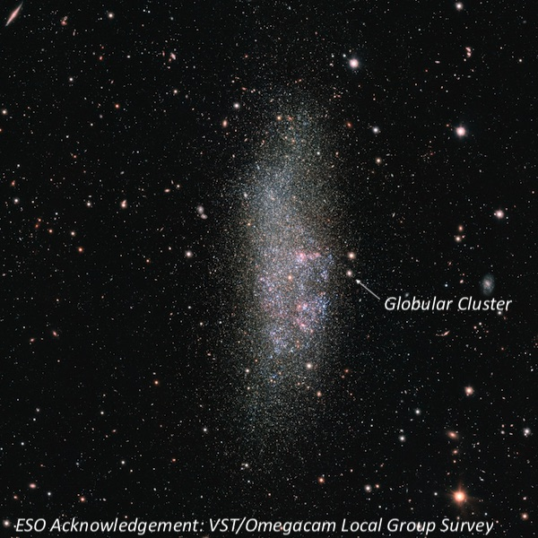
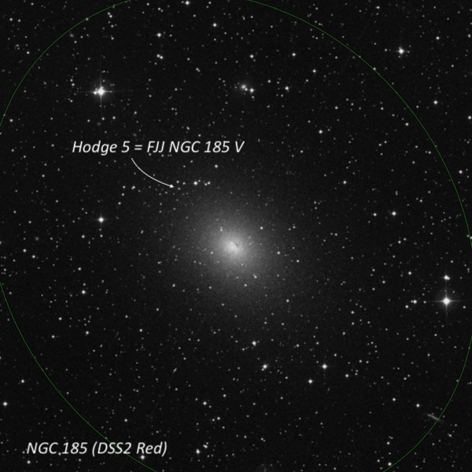
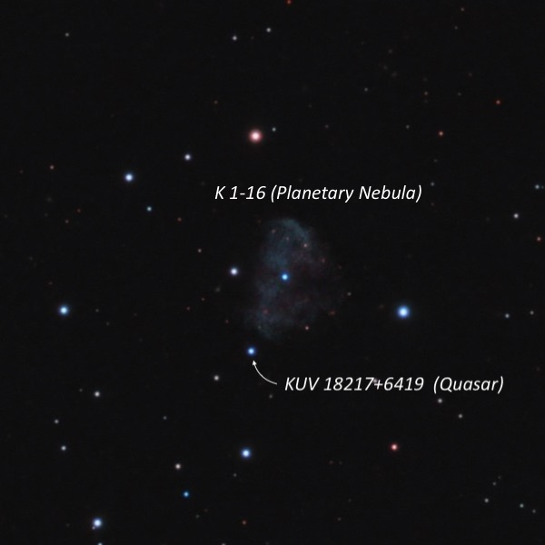
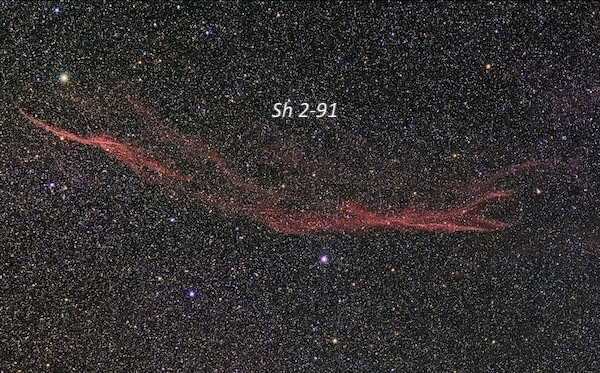
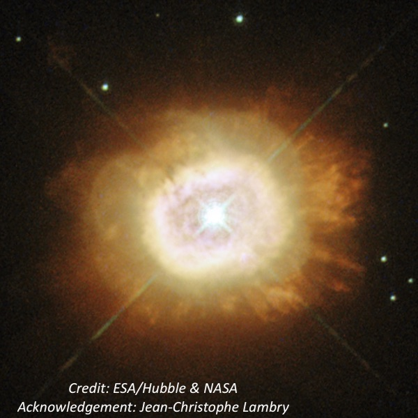
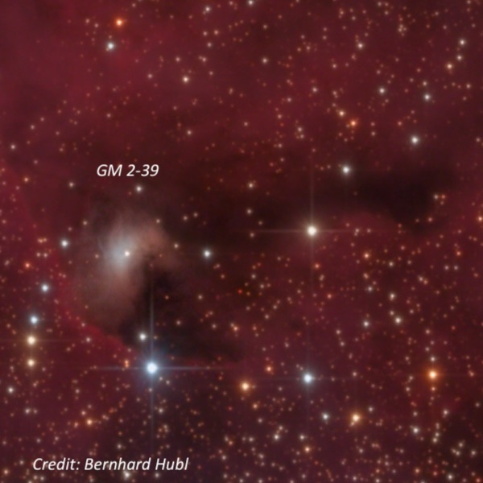
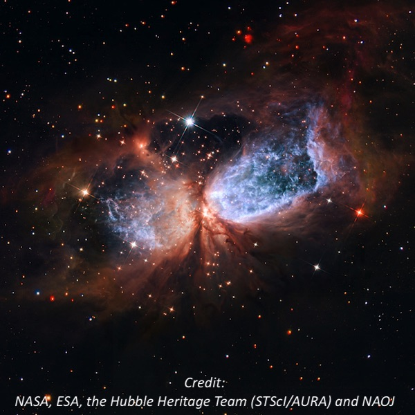
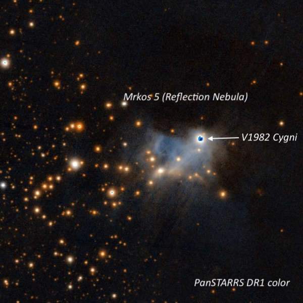

OK, you've probably heard about the daytime heat at the star party, the
various ways folks avoided the heat, the meals at Chez Dan, the fallen
tree trunk, the socializing and reuniting with old friends. Oh, did I
mention the heat? But I'm just going to focus on observing -- which
was excellent at times, particularly after midnight, with SQM readings
approaching 21.7. As an example, the gegenschein was an obvious oval just
south of the Pisces Circlet .  After 27 years viewing with 17.5-inch and
18-inch scopes, I finally have moved on up to a 24-inch f/3.7
Starstructure just a few months ago and observing has taken on a new
excitement again.  I enjoy tracking down little-known
objects, particularly if they're of special interest astrophysically, so
here's a small selection of the 125 or so objects I logged over the 3
nights at CalStar.  
  
### 1)  <x-dso simbad="WLM Globular Cluster">Globular cluster</x-dso> in the <x-dso>Wolf-Lundmark-Melotte</x-dso> (WLM) galaxy

RA| 00 01 56.9
Dec| -15 27 01

This low surface brightness Local Group dwarf irregular galaxy (distance
~3 million light years) was discovered photographically by Max Wolf in
1908 though first classified as a galaxy by Lundmark and Melotte in 1926.  As a result, all three astronomers have their names attached to
the galaxy. This is a pretty tough object, just a dim, unconcentrated
glow, spread out over 11'x4' in a north-south orientation.  After the
galaxy was identified I also picked off (barely) its brightest globular
cluster – just a 16th magnitude speck off the west side of the galaxy. 
A photographic finder chart helps, as there is a much easier mag 14.5
star just 38" N that you don't want to confuse it with.  
  
  
  
  
### 2)  Globular cluster <x-dso>FJJ NGC 185 V</x-dso> (or Hodge 5)

RA| 00 38 57.2
Dec| +48 20 15

NGC 185 is a dwarf elliptical galaxy and a satellite member of the M31
group.  Although I've viewed the galaxy a number of times, my target was
FJJ NGC 185 V, the brightest of a handful of globular clusters in the
galaxy, which were discovered by William Baade in 1944.  A finder chart
is definitely necessary here to identify a very dim V = 16.7 "star",
3.8' NE of the center of NGC 185.  Fortunately, it forms a "triple star"
with two mag 14.5 and 15 stars, so it was easy to pin down the
location.  Still this globular was a fairly tough object, even in my
24”.  
  
  
  
  
### 3)  <x-dso simbad="PN K 1-16">Kohoutek 1-16</x-dso> and <x-dso>KUV 18217+6419</x-dso>

RA| 18 21 52.2
Dec| +64 21 54

K 1-16 is a very challenging, low surface brightness planetary, visible
at 125x using an OIII filter as a dim, irregular glow, ~60" diameter
with a mag 13.3 star just off the east edge.  Only the portion of the
rim on the northwest side was seen as an arc, as the low surface
brightness glow generally did not have a definitive edge.  By a cosmic
coincidence, KUV 18217+6419 is a 14th magnitude quasar just off the
southeast side, 1.4' from center. This is a pretty cool juxtaposition --
the light from the distant quasar (z = .30) just arrived after speeding
along for 3.4 billion years while the planetary is relatively nearby!  
  
  
  
  
### 4)  <x-dso simbad="Sh2-91">Sharpless 2-91</x-dso>

| | 9 Cyg filament |ϕ Cyg filament|
|---|---|---|
|RA| 19 32 42|19 39 42|
|Dec| +29 36|+29 57|

The little-known Sharpless HII region in Cygnus is virtually unknown
among amateurs but is one of just a handful of visible supernova
remnants.  Sh 2-91 is part of a huge shell discovered in 1997 during an
emission line survey of the galactic plane.  The entire shell is as
large as the Veil Nebula, spanning 4 degrees x 3.3 degrees, though only
the brightest individual filaments are visual targets.  One of my
favorite "obscure" summer objects is a long, narrow, faint filament that
stretches 14' southwest to northeast, and situated just 15' south of mag
4.7 Phi Cygni.  At CalStar, I also tracked down another long filament
northwest of 9 Cygni, which is not plotted on any atlas.  Using 125x
with an OIII filter, a huge filament stretched at least 30' east-west
across much of the field in my 21mm Ethos.  The filament tapered at the
east end and fanned out on the west end.  The location of this glowing
thread is 1° SSW of Campbell's Hydrogen Star – my next target.  
  
  
  
  
### 5) <x-dso>Campbell's Hydrogen Star</x-dso> (BD+30 3639)

RA|19 34 45.2
Dec|+30 30 59

Another one of my favorite summer objects, as it's one of only two
planetary nebulae (along with <x-dso omit="true">IC 418</x-dso>) that clearly display a reddish
halo!  At 260x and 325x, a tiny 8" ruby red ring was easily visible,
creating a beautiful, colorful halo surrounding a bright central
star.  Adding an H-beta filter at 325x, the 10.5-magnitude central star
nebulosity dims significantly and the halo really pops out as a small
prominent disc.  Without a filter, this is also a good "blinking"
planetary, with averted vision bring out the halo better and direct
vision the central star.  
  
  
  
  
### 6) <x-dso>GM 2-39</x-dso>

RA|20 17 08.2
Dec|+38 59 29

Armenian astronomers Armen Gyulbudaghian and Tigran Yu Magakian
discovered this "Young Stellar Object" (emission-line star) and
surrounding reflection nebula in 1977 and included it in a list of "*New
red objects resembling Herbig-Haro objects*".  You certainly won't find
it plotted on any star atlases, but it was easily picked up at 200x as a
diffuse glow surrounding a very faint "star".  A north-south chain of
mag 12-14 stars is off the east side.  At 325x the nebula appeared
slightly elongated 5:4 N-S, ~20"x16".  The young illuminating source was
visible most of the time and was possibly slightly nonstellar.  This
obscure object resides just 1.2° northeast of NGC 6888
(Crescent Nebula), another summer/fall all-time favorite!  
  
  
  
  
### 7) <x-dso simbad="Sh2-106">Sharpless 2-106</x-dso>

RA|20 27 26.9
Dec|+37 23 49

Ever since I saw images of this amazing bipolar emission nebula, I've
wanted to observe it.  Infrared images reveal a stellar nursery obscured
by dust with sweeping side wings that look similar to the Orion
nebula!  Unfortunately, because of interstellar extinction this nebula
is very red and a difficult visual target.  A previous attempt with my
18" Starmaster resulted in just a marginal sighting. But it was fairly
easy to pick up at 175x unfiltered and was seen immediately as a small,
slightly elongated glow SSW-NNE, perhaps ~25"x18", situated
close east-southeast of a mag 10.4 star.  With averted vision, the lobe
increased a bit in size to 30"-35", though the fainter northern lobe was
not seen.  Sh 2-106 is certainly not an exciting object visually, but I
was thrilled to pick up this challenging object.  
  
  
  
  
8)  Mrkos 5 = <x-dso>GN 21.02.3</x-dso>

RA|21 03 56
Dec|+50 14 54

Haven't heard of this object, you say?  It was discovered by Czech
astronomer Antonin Mrkos at the Skalnate Pleso Observatory before 1950
and reported in his paper "*Six New Bright Diffuse Galactic Nebulae*".
Mark Wagner tracked down this obscure "cometary nebula" in 2010 at
Bumpass Hell parking lot in Lassen and I was hooked.    In the 24-inch,
a faint glow was easily visible with the young star V1982 Cyg at the
northwest edge.  The patch is irregular, but extended WNW-ESE, roughly
1.0'x0.8'.  Even more exotic, the pre-main sequence star LKHa 324SE was
just visible at the southeast end using 325x.  This is an interesting
region; to the west is dark nebula LDN 988, part of the Cyg OB7
molecular cloud, and LBN 408, a faint glow surrounding a mag 10 star,
was alsoeasy to identify.  
  

