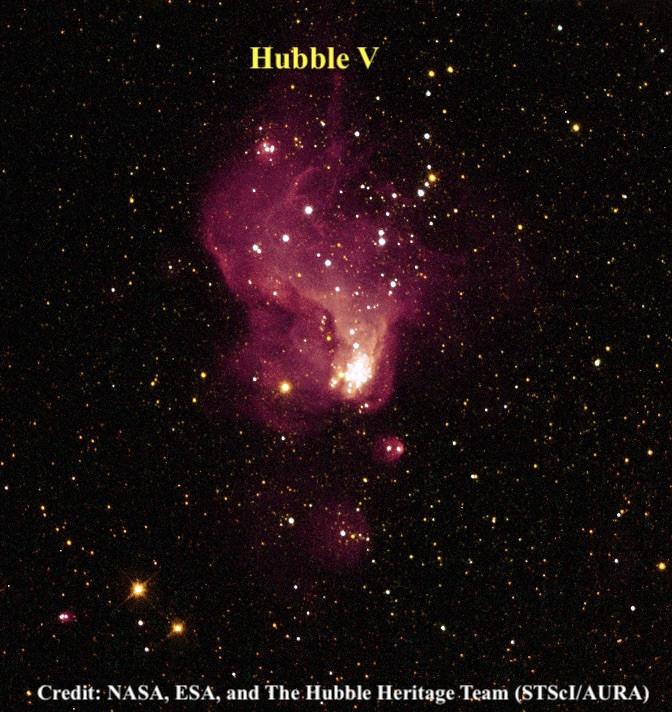
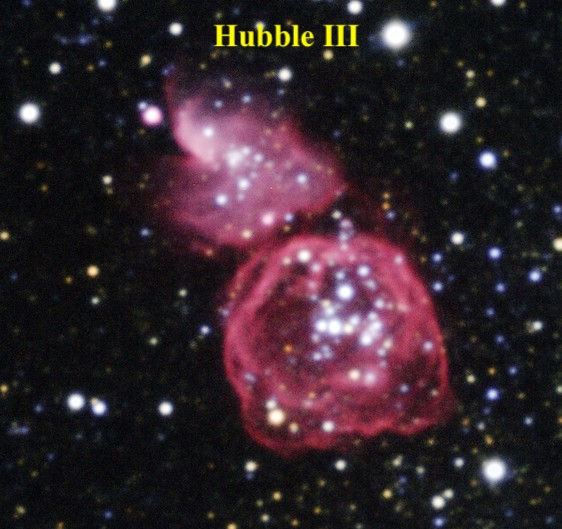
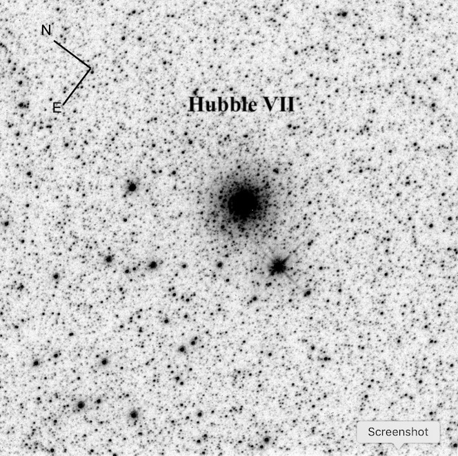

One of my favorite late summer targets is Barnard's galaxy (<x-dso>NGC 6822</x-dso>) in
Sagittarius. This Local Group dwarf played a pivotal role in the history
of astronomy as it was the first galaxy in which Edwin Hubble identified
Cepheid variable stars, which clearly established this system was
extragalactic.  
  
Visually, this is a classic, large low surface brightness object –
difficult or impossible in light-polluted skies, but readily visible in
small apertures in a dark sky. The galaxy was discovered by E.E. Barnard
using just a 5" refractor, but it really doesn't even take this aperture
to view the galaxy under excellent conditions -- I've glimpsed it with
15×50 IS binoculars from a 7200' site from the Sierra Buttes. In fact,
in Hubble's 1925 paper on Barnard's Galaxy titled "NGC 6822, a remote
stellar system", he made the comment "NGC 6822 is fairly conspicuous in
a short 4-inch finder with a low-power eyepiece, but is barely
discernible at the primary focus of the 100-inch. The latter, however,
shows the bright details which are invisible in the finder."  
  
As far as these "details", Hubble recorded ten non-stellar objects in
NGC 6822 that were measured on a 3.5 hour exposure with the 100-inch
reflector. Later studies revealed his list included several giant HII
regions as well as a couple of clusters. I took a look at a few of these
objects last week while observing at Lassen's Bumpass Hell parking lot
(elevation 8170') with my 18-inch Starmaster along with Mark Wagner,
Richard Navarette, Ray Cash, Ken Archuleta and Mina Reyes.
  
On the north end of the galaxy are Hubble V and X, two relatively high
surface brightness HII "knots" that may be visible even when the galaxy
is not seen.

  
  
&#8203;<x-dso simbad="[H25] X">Hubble X</x-dso> (also known as IC 1308) was easily picked up unfiltered at 225×
and stood out fairly well at 285× as a 25" irregularly round knot. This
HII region is located on the north side of the galaxy, 1.7' NW of a mag
12/14 pair at ~8" separation. <x-dso simbad="[H25] V">Hubble V</x-dso> is slightly brighter and is
situated just 3' west. It was picked up unfiltered at 175×, though to
add contrast a UHC filter will work on both of these HII regions. I felt
the best view was unfiltered at 225× and 285×. Hubble V has a higher
surface brightness than Hubble X, though it may be slightly smaller at
~20" diameter and it forms a "pair" with a 12.5-magnitude star 1' SE. A
more challenging object is <x-dso simbad="[H25] III">Hubble III</x-dso>, a giant ring or shell at the NW
side of the galaxy, which was barely visible.

&#8203;<x-dso simbad="[H25] VII">Hubble VII</x-dso> is the oldest and brightest globular cluster within Barnard's
galaxy. I've tried for this globular a few times previously without a
convincing sighting and I've never read any online visual observations
of this object. A high resolution image is necessary to pinpoint the
location in the center of the galaxy as a number of very faint Milky Way
stars are superimposed on the face of Barnard's galaxy including a
15th-16th magnitude star just 30" WSW. In addition, a fainter star is
very close to the SSE edge of the globular. But under superb conditions
at Lassen (see Mark Wagner's post "[Observing Report: Friendly Skies](http://deepskyobserving.blogspot.com/2010_08_01_archive.html)"),
the globular was visible at 285× about 1/2 the time as an extremely
faint and small glow, ~10" diameter. I couldn't resolve the adjacent
star on the SSE edge, but the appearance was definitely non-stellar. I
also viewed this challenging object at 393× and it appeared roughly
similar in terms of visibility.

Here are the positions of these objects and Hubble even provided a
finder chart in his [seminal paper](http://cdsads.u-strasbg.fr/full/1925ApJ....62..409H).

RA|Dec|Object
---|---|---
19 44 34.4|-14 42 20|Hubble III  
19 44 52.2|-14 43 09|Hubble V
19 44 55.8|-14 48 56|Hubble VII
19 45 05.3|-14 43 16|Hubble X 
  
For more info on these and other objects in Barnard's Galaxy check out [Rich
Jakiel's article on Adventures in Deep Space](/barnard.htm)
