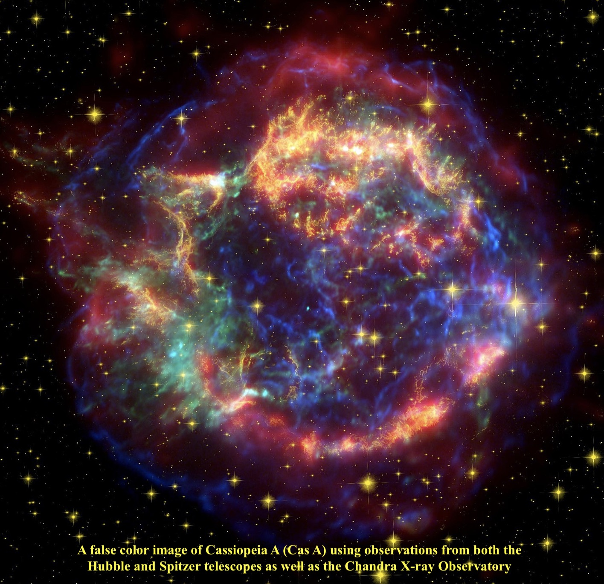

**Update from Steve Gottlieb**: Since this observing report was written, Cas A has been dethroned from being the youngest known galactic supernova remnant to second place. According to Wikipedia, 
"The discovery that G1.9+0.3 had been identified as the youngest-known Galactic SNR was announced on May 14, 2008 at a NASA press conference. In the days leading up to the announcement, NASA said that they were going "to announce the discovery of an object in our Galaxy astronomers have been hunting for more than 50 years.” Before this discovery, the youngest-known Milky Way supernova remnant was Cassiopeia A, at about 330 years."

The title of the OR has been updated to reflect this change.

We're talking about Cas A, the strongest extra-solar radio source in the
sky at frequencies above 1 GHz.  Based on the expansion rate of the
filaments in Cas A, light from this supernova must have reached earth
~340 years ago (roughly 1667). Although the event wasn't noticed as a
'new star' at the time, it may have been catalogued by Astronomer Royal
John Flamsteed in 1680 as a 6th magnitude star. There is no known
counterpart today for his star identified as 'Cassiopeia 3.'  
  
Available images have traditionally been at radio wavelengths or x-ray,
although HST captured the SNR in 2006
([<u>http://spacetelescope.org/news/heic0609/</u>](http://spacetelescope.org/news/heic0609/)).

As a result of its prior reporting and images, it was never known as a
visual target to amateurs and the first observation was probably made in
the last couple of years.  So, this SNR was high on my observing list
earlier this month when I observed with Ray Cash, Mark Wagner, Richard
Navarette, Ken Archuleta and Mina Reyes at the Bumpass Hell parking lot
of Lassen National Park. The date also corresponded with the peak of the
Perseids.  
  
Due to the lack of prior observing reports, I really didn't know what to
expect. But here's the good news -- using a 21mm Ethos (108x) and an
OIII filter, I was surprised to easily pick up the brightest filament in
my 18-inch f/4.3 Starmaster!  With this combination a small, elongated,
fairly low surface brightness glow was immediately noticed, ~1.2' ×
0.4', extended ~E-W.  The SNR was not seen unfiltered at 108x or at
175x, so it responded strongly to the OIII filter. The visual filament
that I observed forms the northern edge of the 4' diameter supernova
remnant. The glow is situated at the vertex of an isosceles triangle
with a magnitude 11.4 star 2.5' SW and a magnitude 11.7 star 2.5' NNW.
 The 56' field at 108x included a number of mag 10 stars and appeared
fairly rich, but there were no brighter stars.  Now you know about it,
so give it a try!

– Steve Gottlieb

