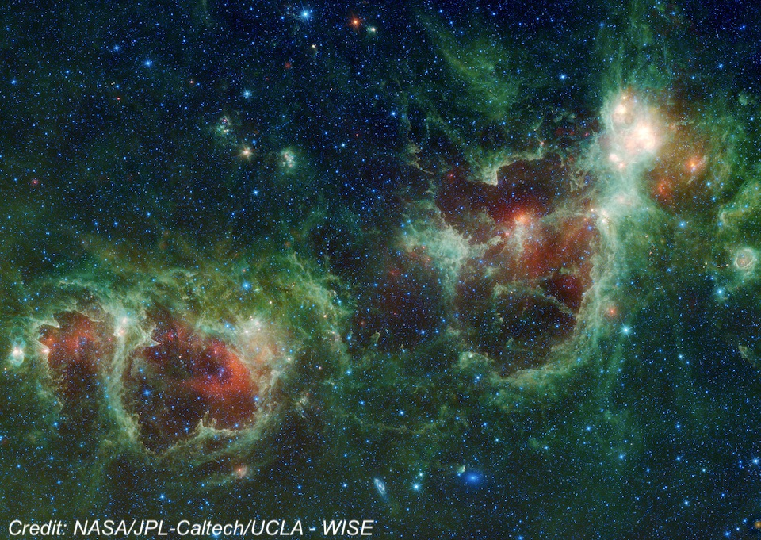
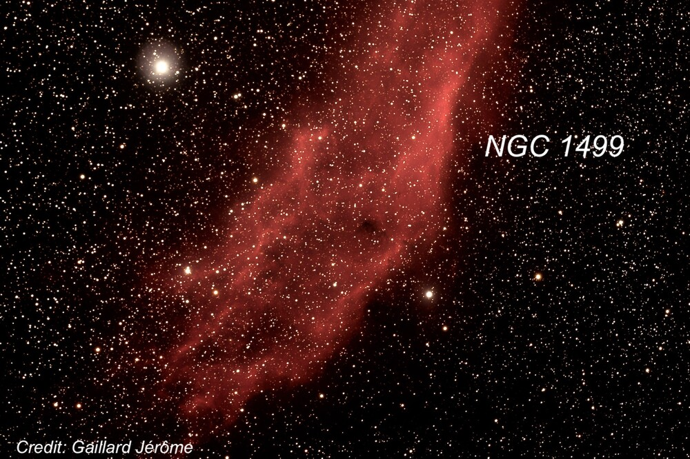
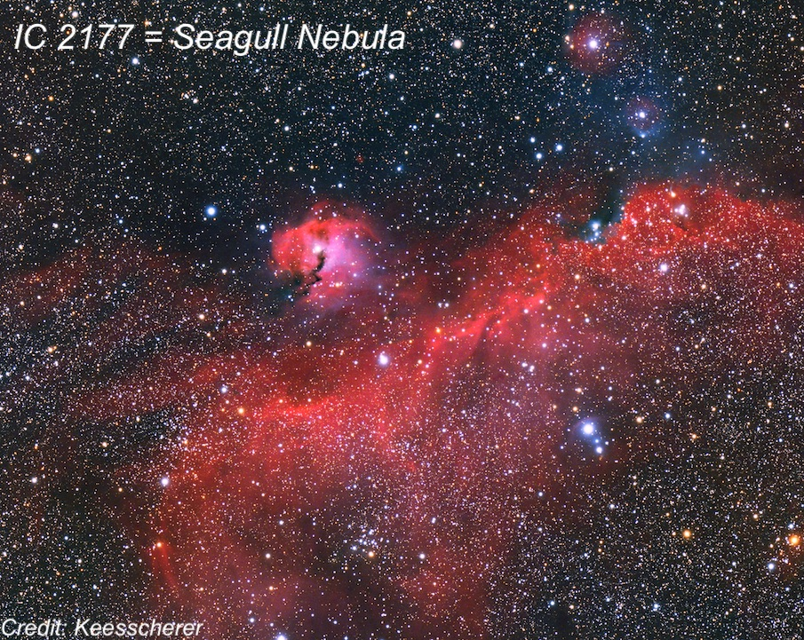
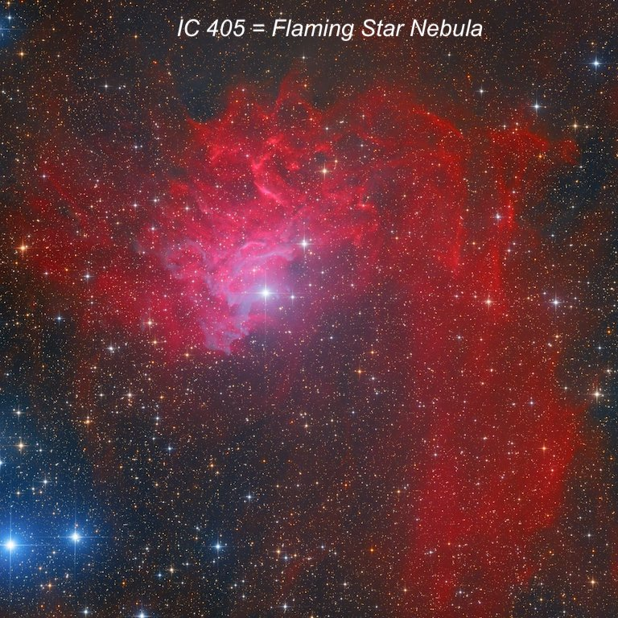
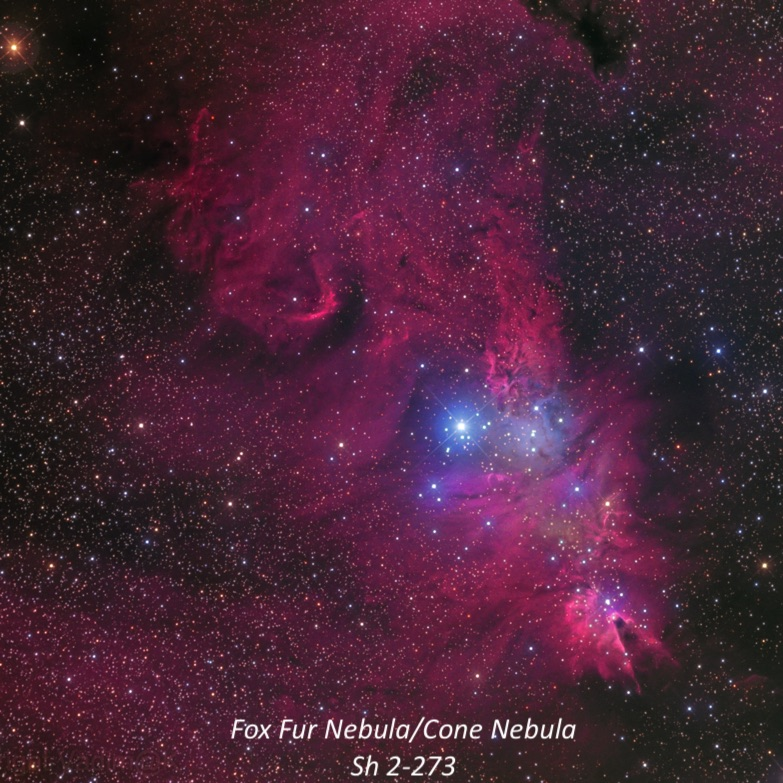
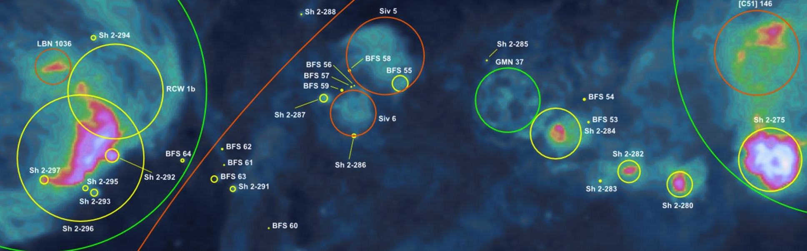
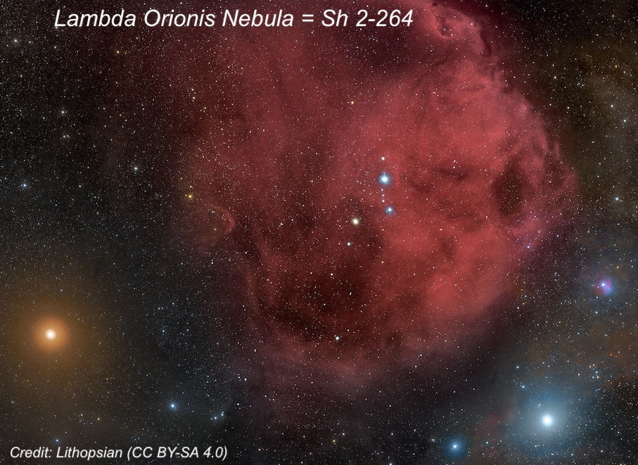
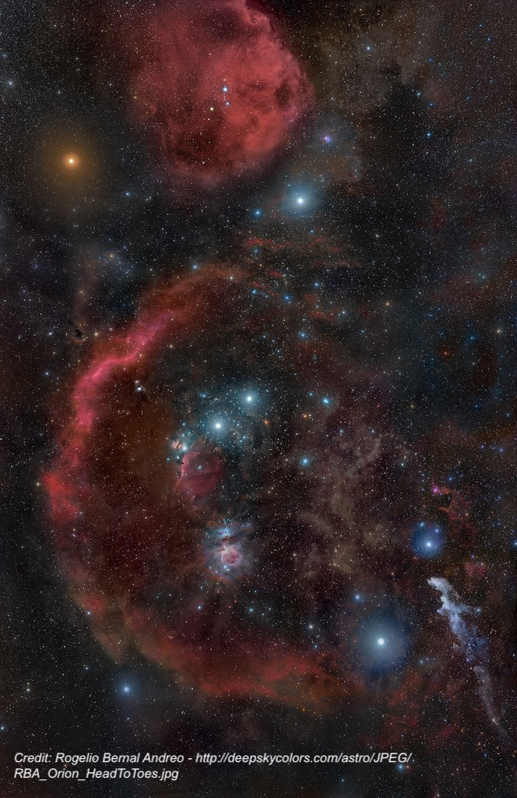
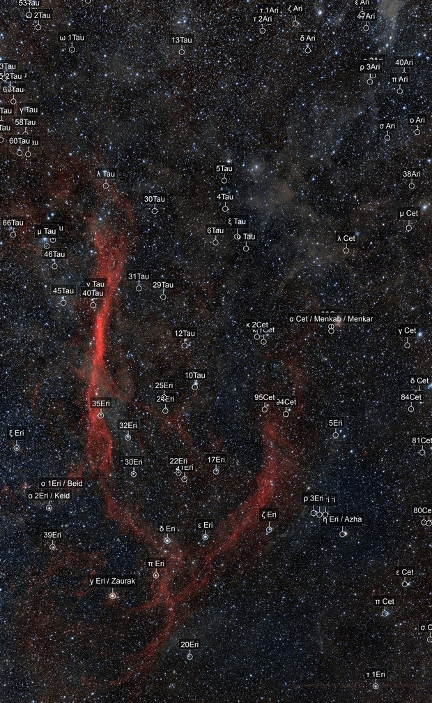

On Tuesday night, February 25, 2025, we had a group of 6 observers at Lake Sonoma from the north and east bay. During twilight I spotted Mercury (actually it’s quite bright) quite low before 7:00, but Saturn had already set. Within the next half-hour it was fully dark with a fairly prominent zodiacal cone angling up from the western horizon towards Taurus.  
  
I spent the first hour and a half of the night just sitting or lying back in my zero gravity chair scanning the winter sky with my night-vision device (Gen 3 white-phosphor PVS-14) handheld at 1x. With a 6nm H-alpha filter attached, you have a new window into the universe with eyes sensitive to H-alpha. And with a 40° actual field of view at 1x, the view of large objects in the Milky Way is quite a trip. I logged about two dozen nebulae, but here’s a rundown of 10 huge HII regions. Most of these objects are strikingly bright with night-vision (and popular wide-field imaging targets) and even visible from my badly light-polluted backyard in Albany. But they are much more impressive from a dark site.  
  
1) **The "Heart" Nebula (<x-dso>IC 1805</x-dso>) and "Soul" or "Baby" Nebula (<x-dso>IC 2848</x-dso>)** form a prominent night-vision pair at 1x. IC 1805 is the brighter and slightly larger of the pair. It appeared slightly elongated or irregular in outline. <x-dso>NGC 896</x-dso> is a small, bright knot at the NW end or just detached. <x-dso>IC 1848</x-dso> is slightly fainter but still quite bright and large. It extends 2:1 E-W, ~1.7° in length.

2) **The California Nebula (<x-dso>NGC 1499</x-dso>)** is one of the brightest NV targets at 1x displaying a high-contrast, very elongated glow. A faint, gently-arcing extension on the east end towards the SE makes the total length about 3.5°. The Pleiades, nearly 13° to the SSW, shares the same field at 1x.

  
  
3) **The Seagull Nebula (<x-dso>IC 2177</x-dso>)** is another prominent 1x night-vision target to the north of Gamma CMa and east of Theta CMa. It extends mainly N-S and is slightly curved in a relatively narrow outline for nearly 2.5°. Besides the main section, a very large, lower surface brightness region extends to the east from the upper ~1/3 of the main strip.

4) **The Flaming Star Nebula (<x-dso>IC 405</x-dso>)** is a fairly prominent glow (1.1° x 0.8') close NE of 3 colllinear mag 4.5-5.5 stars (all are pairs in binoculars). The shape was very irregular. A large faint strip is attached on the NW end and extends due south on the west side (this is <x-dso simbad="Sim 126">Simeis 126</x-dso>) to within ~20' of 5th magnitude 14 Aur. The Tadpole Nebula (<x-dso>IC 410</x-dso>), which is smaller, is symmetrically placed on the SW side of the three naked-eye stars and is also a bright glow about 40’ in size.

  
  
5) **The Fox Fur Nebula** surrounding the Christmas Tree Cluster (<x-dso>NGC 2264</x-dso>) is an amazing region at 1x. The irregular shaped glow extends ~3° in diameter and more including a partial outer loop around the south and east periphery. Two large fainter arcs (forming the Monoceros Loop Supernova) are attached at the southeast and southwest sides. They extend at least 3° south and connect to the ultra-high surface brightness Rosette Nebula.  
  
  
  
  
6) From **the Rosette Nebula (<x-dso>NGC 2237</x-dso>) to Sivan 5**, a string of three fainter puffs of nebulosity (<x-dso>Sh 2-280</x-dso>, 2-282, and 2-284) extends southeast. Continuing in the same direction (southeast) for ~5°, leads to a very large fainter glow (Sivan 5), which is ~1.5° in diameter. The total length from the Rosette to Sivan 5 is about 10°!

  
  
7) **<x-dso>Sh 2-310</x-dso>** is one of largest H II regions in the sky – spanning over 5° – though is little known. It’s very easy to find about 11° southeast of Sirius and not far to the east and northeast of Wizen (Delta Canis Majoris). With 1x night vision, it’s easily visible as an extremely large glow extended ~ N-S in the direction of IC 2177.

8) **Lambda Orionis (Meissa) Nebula = Sh 2-264** is a huge, circular glow (about 5° across) centered on Meissa, the star that marks Orion’s head. It’s also a prominent object in night vision, comparable to Barnard’s Loop, with a well defined circular outline but no structure.

9)  **Barnard****’****s Loop (<x-dso>Sh 2-276</x-dso>)** is the most stunning single object at 1x in the winter skies – bright and fantastically large. At the north end it begins roughly north of Alnilam (middle belt star). The nebulosity brightens in a strip to the NE of the belt stars and wraps around the entire east side of the constellation. A faint, narrow filament branches off on the east side and angles directly towards Betelgeuse! As the loop curves around the southeast side of Orion it passes north of second magnitude Saiph (southeast star in Orion’s outline) and crosses the southern end of Orion's outline. It ends just east of Rigel and the visual length of entire arc or loop approaches 20°. By the way, the entire constellation of Orion easily fits in the field of view of the device.

10) **The Eridanus Loop (<x-dso>Sh 2-245</x-dso>)** is a fainter, but also fantastically large loop on the west side of Orion. The brighter eastern of this ginormous Loop (part of the Orion-Eridanus Supershell) begins a couple of degrees north of mag 3.9 Nu Eridani. It extends due south in a faint, narrow strip for 16° to 20° in length! The brightest strip (which was immediately seen) is directly south of Nu Eri and I’ve observed this section visually from Willow Springs. The southern half of this strip is somewhat fainter, but still was easily seen. It appears to curve west at the S end towards mag 3.5 Delta Eridani, but loses its coherent structure. I wasn't able to confidently trace the western part of the loop as it curves north.

