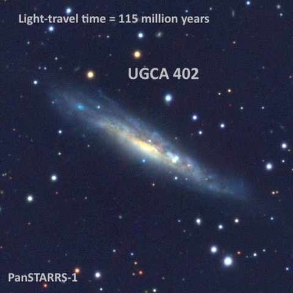
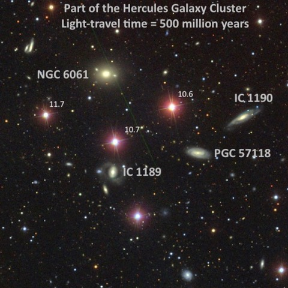
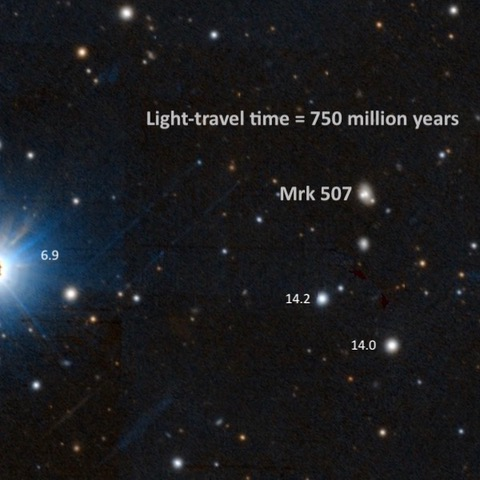
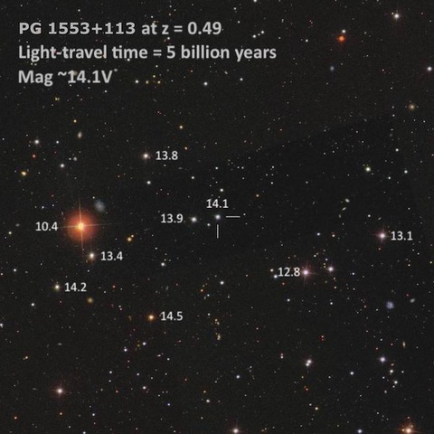
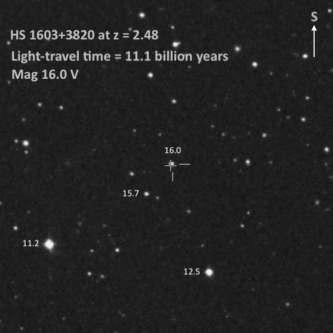

This year was my 17th Golden State Star Party (that’s all of them since the 2007 Lassen Star Party) and the event is still one of my observing highlights of the year.  Alan Agrawal and I gave presentations this year on Thursday and Friday nights and Dan Smiley happened to catch Alan (left) and I admiring Regulus and Mars lining up with the crescent moon during twilight on Saturday night.

Since I got asked "How far can you see with your telescope?", I thought I’d answer this question with a few examples of the dozens of objects I viewed in my 24-inch f/3.8 Starstructure over 5 nights.

**<x-dso>UGCA 402</x-dso> at 115 million light years**  
15 13 30.9 -20 40 30  
V = 12.7;  Size 3.5'x0.7';  PA = 62°  
  
This faint edge-on lies in Libra just 1° WNW of the loose globular cluster <x-dso>NGC 5897</x-dso>.  At 327x, it appeared as a faint, thin slash ~5:1 WSW-ENE, roughly 1.8’ in length. It contained a slightly brighter core and the surface brightness was low and irregular.  
  

**<x-dso>NGC 6061</x-dso> at 500 million light years**  
16 06 16.0 +18 15 00  
V = 13.8;  Size 1.0'x0.8';  Surf Br = 13.3;  PA = 95°  
  
This galaxy is located in the **Hercules Galaxy Cluster** (<x-dso>Abell 2151</x-dso>), whose members lies a half-billion light years away.  Although I’ve viewed NGC 6061 five previous times, I like to try to pick out a few new cluster members each summer. At 375x, NGC 6061 was a moderately bright, roundish glow with a small bright core that increased to the center.  It forms the northern vertex of a rhombus with two mag 10.6/10.7 stars 3' SW and 3' S and a mag 11.7 star 3' SE. I also viewed three additional cluster members that lie just outside the rhombus: <x-dso>IC 1190</x-dso>, <x-dso>PGC 57118</x-dso>, and PGC 57118.

  
  
  
**<x-dso>Markarian 507</x-dso> at 750 million light years**  
17 48 38.3 +68 42 16  
V = 15.4  
  
Markarian (Mrk) 507 in Draco is a compact narrow-line Seyfert 1 galaxy.  This is a subclass of active galactic nuclei (AGN) with properties of type 1 Seyferts (both broad and narrow emission lines formed in the accretion disc of an actively feeding supermassive black hole).  But this subclass displays the narrowest Balmer lines, the strongest Fe II emission (ionized iron), and extreme properties in X-rays emission.

At 375x, I found it faint, round, at most 10" diameter, visible continuously. The bright nearby star is 7th magnitude <x-dso>HD 163214</x-dso>.  Two 14th mag stars lie less than 2’ south.

  
  
  
**<x-dso>PG 1553+113</x-dso> at 5 billion light years**  
15 55 43.0 +11 11 24  
V = 14.2  
  
I told a few people who took a look in my telescope that this blazer in Serpens was 4 billion light years away, but after doing some research at home I found it was even more distant at 5 billion light years!  At 14th magnitude, it was a cinch in my 24-inch at 200x and it was a snap to locate. It forms a "double" with a similar 14th-magnitude star 0.8’ east with the pair is collinear with a mag 10.4 star 4.3' E of the blazar.

A blazar is also a type of AGN powered by a supermassive black hole (SMBH).  As heated material spirals down the accretion disc surrounding the SMBH, the intense magnetic field produces high-energy, relativistic plasma jets along the polar axis.  One of the these jets happens to point in our direction, so we’re looking down the throat of the jet.

  
  
  
**<x-dso>HS 1603+3820</x-dso> at 11.1 billion light years**  
16 04 55.4 +38 12 01  
V = 16.0  
  
Although only 16.1 visual magnitude, HS 1603+3820 is an exceptionally bright quasar (and that’s saying something for quasars) in Corona Borealis.  Its light left when the universe was 2.7 billion years old and has been speeding in our direction for the past 11.1 billion years.  It forms the soutnern vertex of a triangle with a mag 11.2 star 4.3' NW and a mag 12.5 star 3.3' NNE.  Averted vision clearly showed the quasar, along with a slightly brighter mag 15.8 star 1' NW.  
  
