First time here since 2012. A few notable comments about the skies since
I last came. The northern horizon is no longer completely dark due to
the Permian basin, but it does not detract from observing at all. I also
noticed that the skies aren’t as dark as they used to be. A few
long-time TSPers commented to me that the skies grew progressively worse
in the last ten years due to the factories just south of the border and
general increased particulate matter. I should note that the humidity
was a little higher than average, which contributed to loss of
transparency.

The following notes are of select objects observed on two of the three
nights I was there, specifically Monday, May 11 and Tuesday, May
12th. Monday night, the skies averaged NELM 6.7-6.8, while
Tuesday night was a little better at NELM 6.9.

## Monday night NELM = 6.7-6.8

Observed 23 flat galaxies from my observing guide. This session
completes all observations in the book.

### <x-dso>UGC 4277</x-dso>

22" at 230 and 287x - thin even surface brightness glow with little
central brightening and tapering tips. PA = 80 and 2.5' long

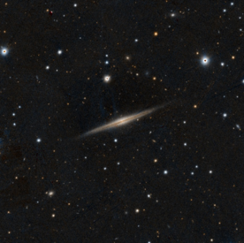

### <x-dso>NGC 4356</x-dso>

22" at 287x - considerably bright, thin, even surface brightness streak.
No central brightening. PA = 150 and 3' long. A mag 13.2 star lies just
off the east of center.

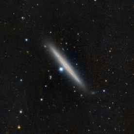

### <x-dso>IC 3311</x-dso>

22" at 287x - considerably faint, thick, flat galaxy. Even surface
brightness. PA = 45 and 1.2’ long.

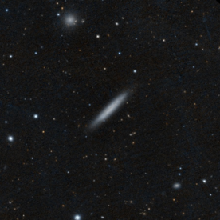

### <x-dso>IC 3322A</x-dso>

22" at 287 and 383x - considerably bright thin glow. A very faint, very
small knot was detected near the northwest tip. PA = 30 and 2.9’ long.
Two nearby galaxies, MAC 1225+0710 and MAC 1225+0712, were picked up as
very faint, very small round glows.

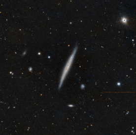

### <x-dso>UGC 7522</x-dso>

22" at 287x - faint thin glow with a star near the NW tip. PA = 60 and
2.2’ long.

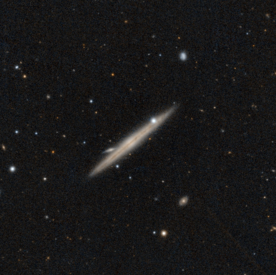

### <x-dso>IC 3474</x-dso>

22” at 287 and 383x - considerably faint, even surface brightness, thick
glow. No central brightening. A faint star seen to the NW. PA = 135 and
2’ long.

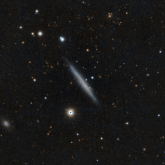

### <x-dso>NGC 4517</x-dso>

22" at 287x - Bright, mottled, large thin glow. Dust lane is off-center
to the north and not complete. More to the east, to about 2/3 of the way
from E to W tips. A star just NW of the center. PA = 100 and 8’ long.
Note: This is a quick observation as I have seen this several times in
the past.

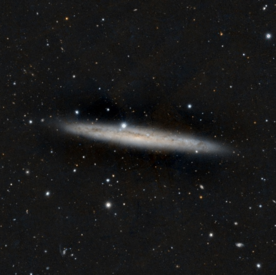

### <x-dso>UGC 7802</x-dso>

22” at 383x - Considerably faint, thin glow. Even surface brightness
throughout and no central brightening. PA = 120 and 1’ long. A 12.6 mag
star lies 1’ NW from the center.

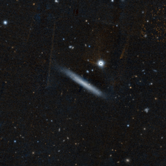

### <x-dso>IC 3608</x-dso>

22” at 287 and 383x - A faint, small, thin glow with an obvious central
region. Very faint thinning tips. PA = 90 and 1’ long. A faint
16th mag star lies just NE from the center.

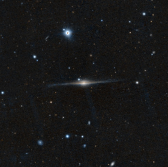

### <x-dso>NGC 4703</x-dso>

22” at 287 and 383x - Considerably bright thin glow with a brighter
central region and a nearly stellar core. Faint dust lane across the
entire length of the galaxy. PA = 30 and 3.2’ long. A faint
16th mag star lies 0.6’ due south from the center.

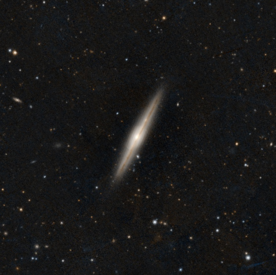

### <x-dso>NGC 4700</x-dso>

22” at 287x - Bright thick 6:1 elongated glow with defined edges. Seems
a little thick to be a flat galaxy. Higher than usual surface
brightness. PA = 135 and 2.6’ long. A 15th mag star off the
SW tip and a very faint star off the NE tip.

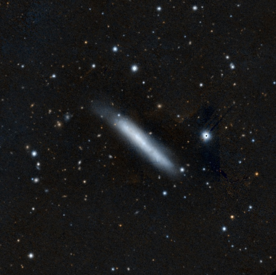

### <x-dso>UGC 7991</x-dso>

22” at 383x - Considerably faint, flat, even surface brightness with
somewhat diffuse edges. A mag 15.5 star was detected just east of the
northern tip. PA = 0 and 1.7’ long.

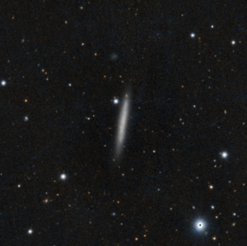

### <x-dso>MCG-3-33-28</x-dso>

22” at 287 and 383x - Considerably faint, thin glow with thinning
tapering tips. Minor central bulge and brighter nearly stellar center.
PA = 135 and 2.2’ long. An extremely faint galaxy was detected just
north of the SW tip. A pair of 15th mag starts to the north
of the center.

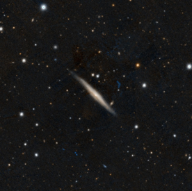

### <x-dso>MCG-3-33-30</x-dso> (UGCA 320)

22” at 287x - Considerably bright, thick, slightly mottled 5:1 glow.
This appears brighter than the nearby flat galaxy, MCG-3-33-28. PA = 60
and 6.1’ long. Two extremely faint round glows were detected to the
north. One at PA = 45 (<x-dso>MCG-3-33-29</x-dso>) from the center and the other (MAC
1303-1723) at PA = 330 from the center.

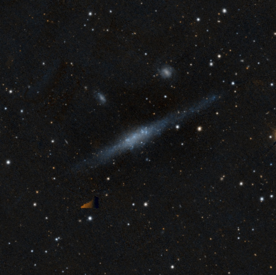

### <x-dso>MCG-3-34-18</x-dso>

22” at 287 and 383x - Considerably faint thin glow with a significant
central brightening. Diffuse edges. PA = 0 and 2.7’ long. A
15th mag star is SE from the center. An extremely faint round
glow with a star on the edge was seen about 0.9’ SW from the center.

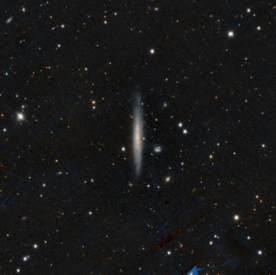

### <x-dso>NGC 5073</x-dso>

22” at 287x - Bright, thick, flat galaxy with well-defined edges. A
faint stellar core and tapered ends. PA = 30 and 2.9’ long

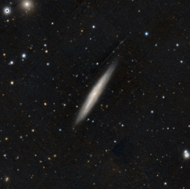

### <x-dso>NGC 5022</x-dso>

22” at 287 and 383x - Considerably bright, even surface brightness glow
with a brighter center. Somewhat defined edges. PA = 170 and 2.0’ long.
Two very faint stars were detected on the west side of each end. A
couple 12th mag stars in the north and western part of the
field. Near <x-dso>NGC 5018</x-dso>.

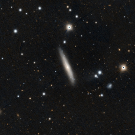

### <x-dso>MCG-3-34-41</x-dso>

22” at 383x - Faint even surface brightness, thin glow with tapering
ends. PA = 0 and 2.0’ long. A faint, small, round glow, <x-dso>MCG-3-34-42</x-dso>, NE
from the north tip.

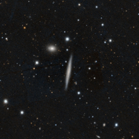

### <x-dso>NGC 5170</x-dso>

22” at 230 and 287x - Considerably bright, long, thin glow with a
brighter central region. The south edge of the middle part is a bit more
defined than the north side, which suggests a dust lane. PA = 45 and
7.5' long. A very faint diffuse glow, <x-dso>ESO 576-78</x-dso>, was detected 2.9’
north of the center.

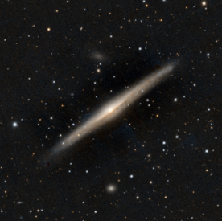

### <x-dso>UGC 8543</x-dso>

22” at 287 and 383x - Faint, small, thin glow with no central
brightening. Even surface brightness glow with somewhat defined edges.
PA = 30 and 1.2’ long. A faint star, mag 15.6, lies 0.4’ west of the
center.

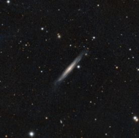

### <x-dso>NGC 5496</x-dso>

22” at 230 and 287x - Considerably bright, mottled thick glow with
diffuse edges. PA = 0 and 3.8’ long. 4 stars on the disk. Two near the
south end, one halfway from the center to the north tip, and the fourth
on the north tip. An extremely faint knot was seen almost between the
two stars on the south side.

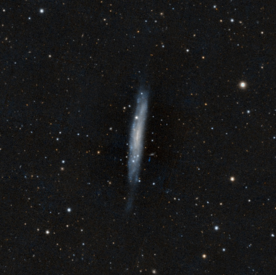

### <x-dso>MCG-3-30-3</x-dso>

22” at 287x - It was low above the horizon when I observed this object.
Considerably faint, thin, even surface brightness glow. PA = 0 and 1.9’
long. An extremely faint, round glow seen 2.2’ WSW from the southern
tip.

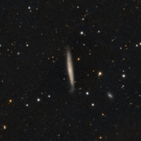

### <x-dso>IC 3799</x-dso>

22” at 287 and 383x - Considerably bright, even surface brightness glow
with well-defined edges. PA = 150 and 2.4’ long. A 15th mag
star just off the edge towards the NE. A ‘bright’ mag 9.9 star lies 5.7’
WSW from the center.

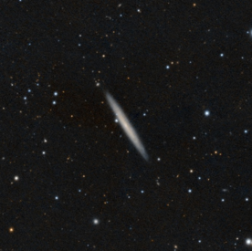

## Tuesday night (NELM 6.9)

I included 10 Small Galaxy Groups, 3 Shakhbazian Compact Galaxy Clusters
and 5 galaxies with extragalactic features.

### <x-dso>NGC 3090</x-dso> group
RA: 10 00 30.2  
Dec: -02 58 08

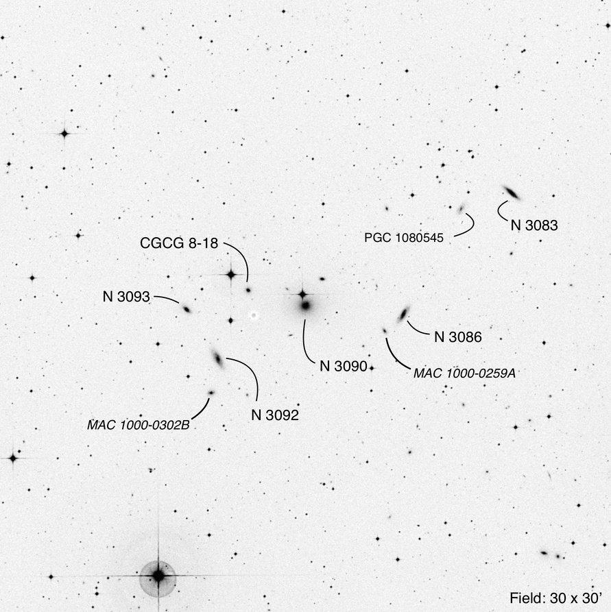

22" at 230, 287, and 383x

MKW 1 – a group of 5 NGC and 4 other galaxies in the field seen. I
missed a few galaxies.

**NGC 3090** fairly bright round glow with a brighter center. 0.9’
across. A mag 11.4 star lies about 0.6' north.

**<x-dso>NGC 3083</x-dso>** is a considerably faint 3:1 elongated glow with a slightly
brighter center. PA = 135 and 0.8’ long. **<x-dso>PGC 1080545</x-dso>** lies 2.7' east
and is an extremely faint round glow.

**<x-dso>NGC 3086</x-dso>** is a faint 5:2 elongated, even surface brightness glow with
a compact, very small core. PA = 30 and 0.6' long. **MAC 1000-0259A** -
A very faint, small, slightly elongated glow was detected 1.2’ SE.

**<x-dso>NGC 3092</x-dso>** is a faint 5:2 elongated even surface brightness glow with
a slightly brighter compact center. PA = 150 and 0.8' long. **MAC
1000-0302B** - A very faint, very small round glow seen about 1.8' due
south.

**<x-dso>NGC 3093</x-dso>** is a very faint, 2:1 elongated, even surface brightness
glow. PA = 135 and 0.4' long.

**<x-dso simbad="Z 8-18">CGCG 8-18</x-dso>** is very faint and rather difficult to see, as it is about
1.3' SW of a mag 10.7 star. Small, round, even surface brightness glow.

### <x-dso simbad="Z 9-42">CGCG 9-42</x-dso> group
RA: 10 27 10.2  
Dec: -03 19 06

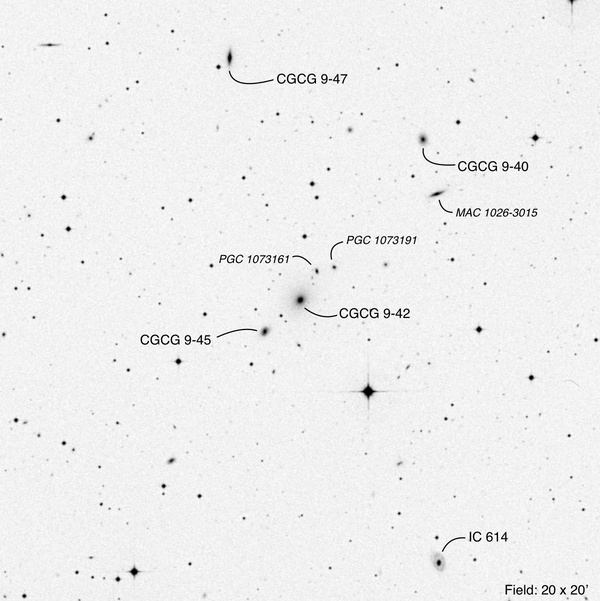

22" at 230, 287, and 383x

MKW 2s – a group of 5 galaxies with several other galaxies.

**CGCG 9-42** is a fairly faint, slightly elongated glow with diffuse
edges and a slightly brighter center. 0.5' across. PA = 45. Two
extremely faint glows, **<x-dso>PGC 1073161</x-dso>** and **<x-dso>PGC 1073191</x-dso>,** were picked
up about 1’ NW. Both are very small round glows, about 0.1’ across. A
mag 10.4 star lies 3.7’ SW.

**<x-dso simbad="Z 9-45">CGCG 9-45</x-dso>** lies 1.6' SE of -42 and is a very faint, small, round,
even surface brightness glow. 0.3' across. A very faint star lies
exactly in between this and -42.

**<x-dso simbad="Z 9-47">CGCG 9-47</x-dso>** lies 8.4’ NNE of -42 and picked up as a faint, 3:1
elongated glow with tapered tips. Slightly brighter center. A mag 14.4
star lies just 0.4’ SE from the center. PA = 0 and 0.5' long.

**<x-dso simbad="Z 9-40">CGCG 9-40</x-dso>** is a very faint, round glow. 0.2' across.

**MAC 1026-3015** lies 2.0' slightly west of due south of -40. Very
faint 2:1 elongated glow. PA = 90 and 0.3' long.

**<x-dso>IC 614</x-dso>** lies 10.0 SW of -42. A very small considerably bright round
glow was picked up. Then after a few moments, a very faint slightly
elongated glow ‘halo’ was picked up. PA = 0 and 0.5’ long. This is one
of the collisional ring galaxies. I didn’t see any brightening of the
ring structure.

### <x-dso>MCG+0-27-23</x-dso> group
RA: 10 30 10.6  
Dec: -03 09 50

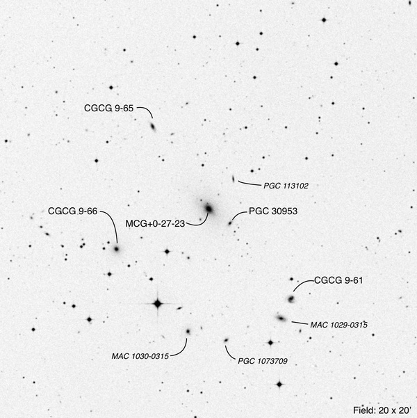

22" at 383x

MKW 2 – group of 5 galaxies with 4 other galaxies picked up. A mag 9.9
star lies 5.1’ SSW of the MCG and best to keep off the field for
observation. I used the 6mm ZAO-II for the observation after centering
it with the 8mm Delos.

**MCG+0-27-23** is a fairly bright, slightly elongated glow with a
brighter center. PA = 135 and 0.6' long. **<x-dso>PGC 30953</x-dso>** lies 1.3’ SW and
has a faint, slightly elongated glow. PA = 45 and 0.2' long. A very
faint short thin streak, **<x-dso>PGC 113102</x-dso>**, lies 1.9’ NW. PA = 0 and 0.2’
long.

**<x-dso simbad="Z 9-61">CGCG 9-61</x-dso>** is a considerably faint, even surface brightness, round
glow with slightly uneven edges to the west. About 0.3' across. A faint
3:2 elongated glow, **MAC 1029-0315**, lies 1.1’ SSE. PA = 90 and 0.3'
long.

**<x-dso simbad="Z 9-66">CGCG 9-66</x-dso>** considerably faint, round glow with a slightly brighter
center. 0.2' across. A pair of 15th mag stars lies to the
east.

**<x-dso simbad="Z 9-65">CGCG 9-65</x-dso>** picked up as a faint, 3:2 elongated, even surface
brightness glow. PA = 150 and 0.2' long.

**MAC 1030-3015** was very difficult as it was near the mag 9.9 star,
about 2’ SW. Picked up as an extremely faint very small round glow. I
did not see <x-dso>PGC 113109</x-dso> which is even closer to the star at less than 1’
due west.

**<x-dso>PGC 1073709</x-dso>** picked up as a very faint small round glow. Lies 2’ west
of MAC 1030-3015

### <x-dso>UGC 4956</x-dso> group
RA: 09 20 01.9  
Dec: +01 02 20

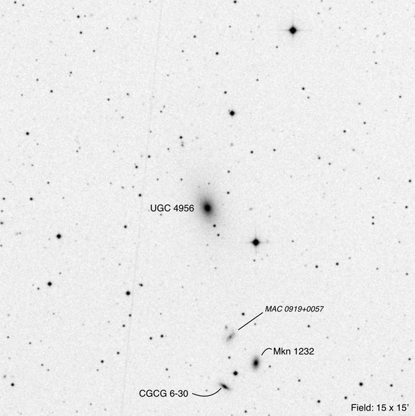

22" at 230, 287, and 383x

MKW 1s - 4 galaxies seen

**UGC 4956** is a bright, slightly elongated glow with a much brighter
center. PA = 150 and 0.7' long. A pair of nearly collinear
16th mag stars lie SSW and a ‘bright’ mag 10.6 star lies 2.1’
SW.

A triangle of galaxies surrounding a mag 13.6 star lies between 5 and 6’
south of the UGC.

**Mkn 1232 (<x-dso simbad="Z 6-29">CGCG 6-29</x-dso>)**: a considerably faint, 2:1 elongated, glow with
a compact center. PA = 0 and 0.3’ long.

**<x-dso simbad="Z 6-30">CGCG 6-30</x-dso>**: a faint, 3:1 elongated, even surface brightness glow with
defined edges. PA = 120 and 0.4’ long.

**MAC 0919+0057** was picked up as a very faint amorphous, slightly
elongated glow. No central brightening. PA = 45 and 0.3’ long. A faint
star lies just north.

### <x-dso>IC 4064</x-dso> group
RA: 13 01 06.7  
Dec: +39 50 29

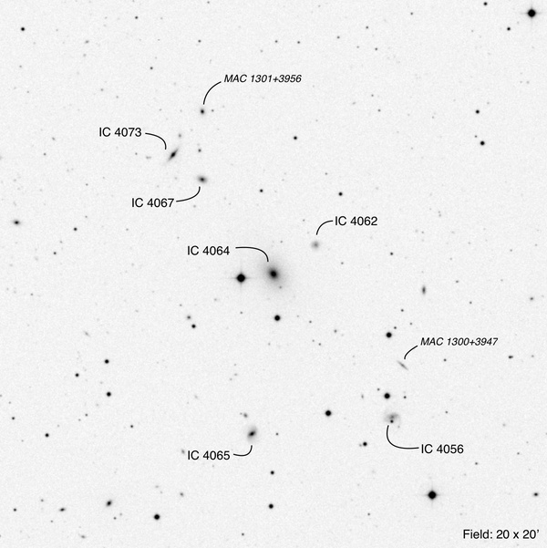

22" at 230, 287, and 383x

AWM 6 - 8 galaxies seen in the field. Most of the observations was with
the 6mm ZAO-II

**IC 4064** is a fairly bright, slightly elongated glow with a gradually
brighter center. PA = 135. A mag 9.9 star lies 1.2’ east, and a mag 12.2
star lies 1.6’ south.

**<x-dso>IC 4062</x-dso>** is a very faint, small, round glow. 0.1' across. Lies 1.9’
WNW of IC 4064.

**<x-dso>IC 4056</x-dso> (<x-dso>VV 418</x-dso>)** is a very faint, slightly elongated glow with a
faint star on the southern edge. PA = 90 and 0.3' long. A slightly
crooked 45-degree right triangle of equally bright stars lies north and
to the east, with one mag 12.2 star just 0.8’ north.

**MAC 1300+3947** lies 2’ north of IC 4056. Picked up as a very faint,
thin, short streak. PA = 135 and 0.3' long.

**<x-dso>IC 4065</x-dso>** picked up as a 5:2 elongated glow with a PA of 60 and 0.2’
long. With averted vision, a very faint halo was picked up at PA 0 and
0.4’ long. This suggests a possible barred spiral with the bar at 60
degrees and the galaxy at 0 degrees.

**<x-dso>IC 4067</x-dso>** is fairly faint, slightly elongated glow with a compact
center. PA = 90 and 0.2' long.

**<x-dso>IC 4073</x-dso>** faint 3:1 elongated glow with a brighter round center and
tapered tips. PA = 45 and 0.5' long.

**MAC 1301+3956** lies 1.9’ NW of IC 4073 and 2.5’ north of IC 4067.
Picked up as a faint, small, round glow. 0.1’ across.

### <x-dso>NGC 5096</x-dso> group
RA: 13 20 30.0  
Dec: +33 05 17

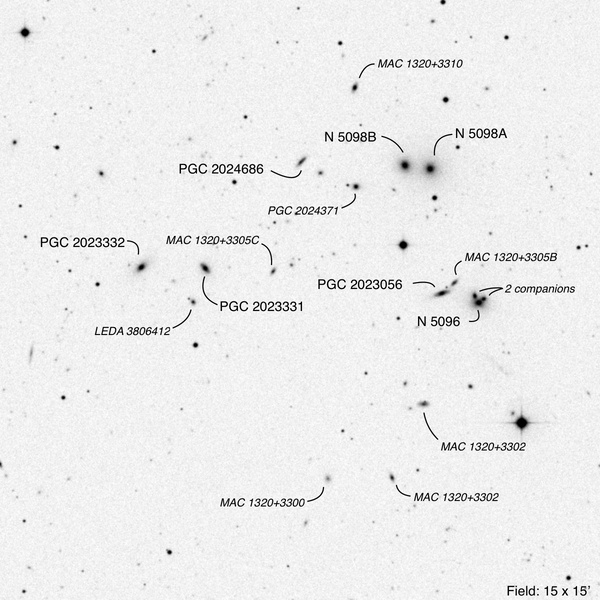

22" at 230, 287, and 383x

17 galaxies seen in the field. Most of the observations was with the 6mm
ZAO-II

**NGC 5096** is a triple galaxy. Fairly bright round glow with two
'**companions'** at the 11 and 2 o'clock positions. Both companions are
faint, very small, round glows.

**<x-dso>PGC 2023056</x-dso>** lies 0.9’ west and is a fairly faint 3:1 elongated glow
with a slightly brighter compact center. PA = 80 and 0.4’ long.

**MAC 1320+3305B** lies just 0.4 NW of the PGC and is a very faint,
slightly elongated, very small glow. PA = 45 and 0.2’ long.

**<x-dso>NGC 5098A</x-dso> and B** form a double galaxy arranged E-W, respectively.
Both are considerably bright, round glows with gradually brighter
centers. They lie about 3.7’ NNE of NGC 5096.

**MAC 1320+3310** is a faint 3:2 elongated glow with a slightly brighter
center. PA = 20 and 0.2' long. It lies 2.3’ NE of <x-dso>NGC 5098B</x-dso>.

**<x-dso>PGC 2024686</x-dso>** is a faint 3:1 elongated glow. PA = 45 and 0.3' long.

**<x-dso>PGC 2024371</x-dso>** is a faint, small, round glow with a very faint star
just off the east edge.

**<x-dso>PGC 2023331</x-dso>** is a faint 2:1 elongated glow with a brighter compact
center. PA = 135 and 0.3' long. An extremely faint, very small, round
glow (**<x-dso>LEDA 3806412</x-dso>**) was picked up 0.9 SSE.

**<x-dso>PGC 2023332</x-dso>** is a faint 2:1 elongated glow with somewhat diffuse
edges. PA = 45 and 0.3' long.

**MAC 1320+3305C** is a very faint, small, slightly elongated glow. PA =
30 and 0.2’ long.

**MAC 1320+3302** is a very faint, small, 2:1 elongated glow. PA = 90
and 0.3’ long. A ‘bright’ mag 9.8 star star lies 2.5’ west and is best
to keep off the field.

**MAC 1320+3300A** is a very faint, slightly small, elongated glow. PA =
150 and 0.2’ long

**MAC 1320+3300** is an extremely faint, very small, round glow.

### <x-dso>NGC 5280</x-dso> group
RA: 13 42 55.6  
Dec: +29 52 06

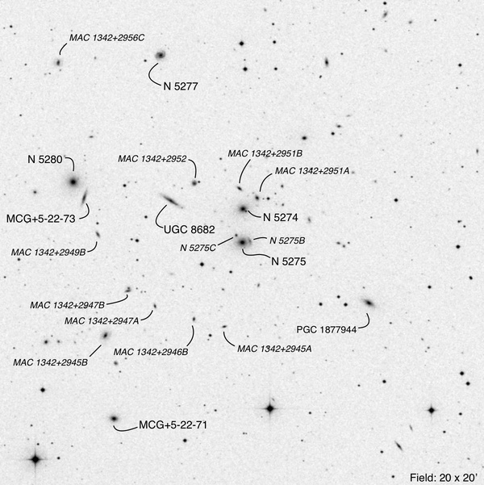

22" at 230, 287 and 383x

A field of 20 galaxies picked up with others I have not looked for nor
seen.

**NGC 5280** a considerably bright round glow with a much brighter
center. 0.4’ across.

**<x-dso>MCG+5-22-73</x-dso>** lies 0.7’ SW of NGC 5280. Fairly faint 5:1 elongated
even surface brightness glow. PA = 15 and 0.6' long.

**MAC 1342+2949B** lies 1.6’ SSW of the MCG and is a very faint 2:1
elongated even surface brightness glow. PA = 150 and 0.2’ long.

Going 6.3’ NE, **<x-dso>NGC 5277</x-dso>** was picked up as a faint round even surface
brightness glow. 0.2' across. A faint mag 16 star lies 0.6’ due east.

**MAC 1342+2956C** lies 4.2’ due east of NGC 5277 and picked up as a
faint slightly elongated even surface brightness glow. PA = 0 and 0.2’
long.

Going back to NGC 5280 and looking 4’ west, **<x-dso>UGC 8662</x-dso>** picked up as a
4:1 elongated thick streak with a slightly brighter very small round
center. PA = 120 and 0.7' long.

**MAC 1342+2952** lies 1.3’ NW of UGC 8662 and is an extremely faint
round glow. A faint star is just off the west edge.

**<x-dso>NGC 5275</x-dso>** considerably bright round glow with a much brighter very
small center. A very faint very small round glow (**<x-dso>NGC 5275C</x-dso>**) visible
just off the NE edge. Another extremely faint 2:1 elongated glow (**NGC
5275B**) is on the west edge. PA = 0.

**<x-dso>NGC 5274</x-dso>** slightly fainter than NGC 5275 and slightly smaller but
similar in appearance. A star is just off the SW edge.

**MAC 1342+2951A** lies 0.7’ NW of NGC 5274 and picked up as a faint,
small, slightly elongated glow with a slightly brighter center. PA = 150
and 0.2’ long

**MAC 1342+2951B** is a very faint 2:1 elongated even surface brightness
glow. PA = 120 and 0.2’ long. It lies 0.9’ due north of NGC 5274.

**MAC 1342+2947B** is a very faint 2:1 elongated glow. PA = 90 and 0.2’
long. I didn’t see the tiny galaxy on the north edge. It lies 5.0’ SSW
of NGC 5280 and 5.1’ ESE of NGC 5275.

**MAC 1342+2945B** is a faint 3:2 elongated even surface brightness glow
with a slightly brighter compact center. PA = 45 and 0.3’ long. Lies
2.0’ SSE of +2947B.

**MAC 1342+2947A** picked up as an extremely faint very small round
glow. Lies 1.3’ SW of +2947B. Continuing 1.7’ WSW from +2947A, another
extremely faint very small round glow, **MAC 1342+2946B,** was picked
up. Another extremely faint very small round glow, **MAC 1352+2945A**
lies 1.4’ WSW of +2947B.

**<x-dso>MCG+5-22-71</x-dso>** is a considerably faint slightly elongated glow with a
brighter center. PA = 90 and 0.3’ long.

**<x-dso>PGC 1877944</x-dso>** is a faint 5:2 elongated glow with a slightly brighter
center. PA = 120 and 0.3’ long. A triangle of stars lies to the east.

### <x-dso>NGC 4104</x-dso> group
RA: 1206 38.9  
Dec: +28 10 27

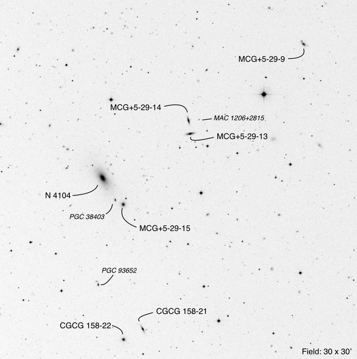

22" at 230, 287 and 383x

MKW 4s – field of 7 galaxies with 3 extra galaxies.

**NGC 4104** is a bright 5:2 elongated glow with a much brighter center.
PA = 150 and 1.2’ long.

**<x-dso>MCG+5-29-15</x-dso>** is a considerably faint round glow with a brighter
center. A star just off the NE edge. **<x-dso>PGC 38403</x-dso>** lying 0.8’ ENE is a
extremely faint very small round glow.

**<x-dso simbad="Z 158-22">CGCG 158-22</x-dso>** is a faint small round glow.

**<x-dso simbad="Z 158-21">CGCG 158-21</x-dso>** is a faint thin streak with a slightly brighter round
center. PA = 150 and 0.2’ long.

**<x-dso>PGC 93652</x-dso>** lies 5.1’ NNE of CGCG 158-22 and picked up as an extremely
faint very small round glow.

**<x-dso>MCG+5-29-13</x-dso>** is a faint 3:1 elongated glow with a very small slightly
brighter round center. PA = 90 and 0.7’ long.

**<x-dso>MCG+5-29-14</x-dso>** is a faint 3:1 elongated glow with a much brighter very
small round center. PA = 0 and 0.6’ long. A fleeting tiny glow, **MAC
1206+2815**, was picked up 0.9’ due west.

**<x-dso>MCG+5-29-9</x-dso>** is a very faint 2:1 even surface brightness elongated
glow. PA = 135 and 0.3’ long. A star is just off the NE tip.

### <x-dso>NGC 4213</x-dso> group
RA: 12 15 37.6  
Dec: +23 58 56

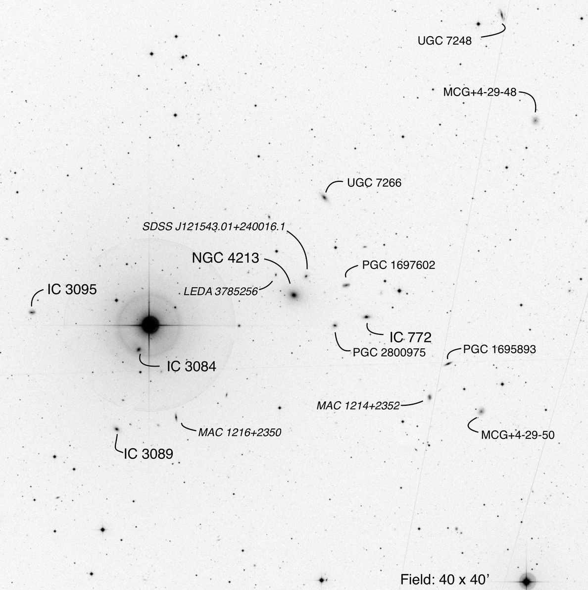

22" at 230, 287 and 383x

AWM 2 - 16 galaxies in the field seen.

**NGC 4213** a bright round glow with a much brighter center. Two nearby
galaxies. Lying 1.8’ NE is **<x-dso>SDSS J121543.01+240016.1</x-dso>** and is picked up
as a very faint slightly elongated even surface brightness glow. PA = 0
and 0.1’ long. **<x-dso>LEDA 3785256</x-dso>** is 1.5’ ENE of NGC 4213 and is a very
faint round glow with a slightly brighter center.

Three galaxies forming an almost perfect equilateral triangle lies about
3.5’ west of NGC 4213. **<x-dso>PGC 1697602</x-dso>** on the north corner is a faint
2:1 elongated glow with a very faint nearly stellar core. PA = 90 and
0.3’ long. **<x-dso>IC 772</x-dso>** on the SW corner is a considerably faint 5:2
elongated glow with a brighter center. PA = 90 and 0.3’ long. **PGC
2800975** on the SE corner is the faintest of the three. Faint round
glow with a slightly brighter center. 0.2’ across.

Continuing 10’ SE there is another triangle of three galaxies. **PGC
1695893** - faint 3:1 elongated glow. PA = 60 and 0.3’ long. Continuing
2.1’ SW is a mag 14.2 star and going another 2’ SW,

**<x-dso>MCG+4-29-50</x-dso>** is picked up as a very faint round low surface
brightness glow. Going 3.7’ ENE is **MAC 1214+2352** seen as a very
faint slightly elongated glow. PA = 0 and 0.2’ long.

Going back to NGC 4213 and looking to the NE quadrant. **<x-dso>UGC 7266</x-dso>** lies
7’ NNE and seen as a considerably, faint 2:1 even surface brightness
glow. Low surface brightness. PA = 135 and 0.4’ long.

**<x-dso>UGC 7248</x-dso>** - very faint thin even surface brightness glow. PA = 160
and 0.5’ long. A mag 11.8 star lies 1.8’ ESE.

**<x-dso>MCG+4-29-48</x-dso>** - very faint low surface brightness round glow. 0.2’
across.

Back to NGC 4213 and looking 10’ east, I see a ‘very bright’ mag 5.0
star. It is so bright that it must be completely off the field to see
anything around that star.

**<x-dso>IC 3084</x-dso>** - difficult to observe with the star lying just 1.7’ NNW.
Very faint round glow.

**<x-dso>IC 3095</x-dso>** - faint small very slightly elongated even surface
brightness glow. PA = 90 and 0.3’ long. Low surface brightness. Lies
7.9’ due east of the bright star.

**<x-dso>IC 3089</x-dso>** - faint slightly elongated glow with a brighter center. PA =
120 and 0.2’ long. Lies 7.3’ slightly east from due south of the star.

**MAC 1216+2350** - very faint 3:1 elongated even surface brightness
glow. PA = 0 and 0.3’ long. Lies 6.5’ SSW of the star.

### <x-dso>MCG+0-36-22</x-dso> group
RA: 14 17 35.5  
Dec: +02 03 11

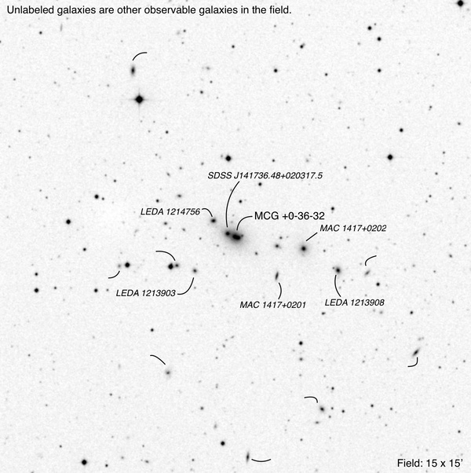

22" at 287, 383, and 690x

This small galaxy group, MKW 6, is rather challenging compared to the
other small galaxy groups. I picked up only 8 galaxies. This group
should be reobserved when it is higher in the sky.

**<x-dso>MCG+0-36-32</x-dso>** is a double galaxy resolved only at 690x. Picked up as a
faint, slightly elongated glow with two slightly brighter centers
aligned E-W. **<x-dso>SDSS J141736.48+020317.5</x-dso>** lies just 0.3’from the ENE
edge and a very faint, very small round glow. Continuing 0.6’ to the NE,
lies **<x-dso>LEDA 1214756</x-dso>,** which is a faint, very small, round glow.

**<x-dso>LEDA 1213903</x-dso>** is a very faint, very small, round glow. A pair of 13th
mag stars lie to the east. The two galaxies next to each star were not
detected.

**MAC 1417+0202** is a very faint, small, round glow lying 2.2’ west of
the MCG.

**MAC 1417+0201** is a fleeting thin glow 1.2 SE of +0202. PA = 0 and
0.3’ long.

**<x-dso>LEDA 1213908</x-dso>** is a very faint, very small, round glow. Lies 1.3’ ESE
of MAC 1417+0202

### Shakhbazian 358
RA: 14 23 46  
Dec: +06 35 05

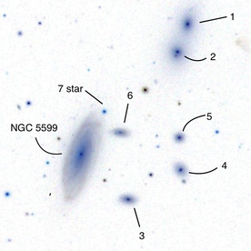

22" at 383x

Used <x-dso>NGC 5599</x-dso> as a reference.

Components 1 and 2 were seen first as two faint round glows. 4 and 5
picked up as very faint glows. I didn't see 3 and 6 at first. Keith R
saw 1, 2, 4, and 5 only. Scott H saw all six; he saw 3 before 4 and 5.
Then I went back and picked off component 3. Component 6 was the most
difficult, but using the star (7) as a landmark made it easier to find
6.

### Shakhbazian 15
RA: 14 20 56  
Dec: +44 33 19

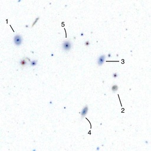

22” at 383x

Group of galaxies in a 2.3’ field. I was able to pick up only three of
the five galaxies.

Components 1, 5, and 3 were picked up as extremely faint tiny glows. A
mag 14.3 star lies 0.5’ south of component 1.

### Shakhbazian 14
RA: 14 25 21  
Dec: +47 14 45

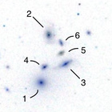

22” at 383 and 690x

A tight group of six galaxies in a 1’ circle.

At 690x, I picked up three of the six galaxies. Components 1, 2, and 3
are extremely faint, very small, round glows arranged in a 45-degree
right triangle. Component 4 was suspected at the location, but I didn’t
see it three times, so I marked it as a negative observation.

### <x-dso>NGC 4102</x-dso>
RA: 12 06 23.0  
Dec: +52 42 40

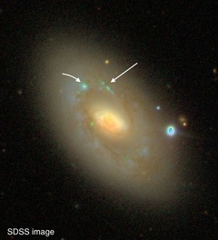

Bright 2:1 elongated core with a fairly faint 2:1 elongated halo. The core is 0.6' long and the extended halo is 2.2' long. The PA for both is 135. A faint knot was detected 0.6' NE from the center. A second knot is suspected 0.5' due north from the center. A mag 12.2 star lies on the ESE edge of the halo.

### <x-dso>NGC 5430</x-dso>
RA: 14 00 45.8  
Dec: +59 19 43

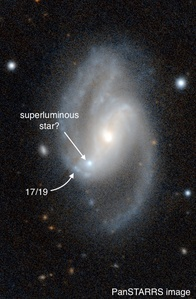

22" at 287 and 383x

Pretty bright 5:2 elongated glow (PA = 30 and 2' long) with a much fainter 2:1 elongated halo (PA = 150 and 2.5' long) with a much brighter round center. This suggests a bar structure. A faint, very small round knot was detected near the south end of the bar, which is likely a super luminous star and not likely [BCS2012a] 17/19.

### <x-dso>NGC 4258</x-dso> (<x-dso>M106</x-dso>)
RA: 12 18 58.1  
Dec: +47 18 13

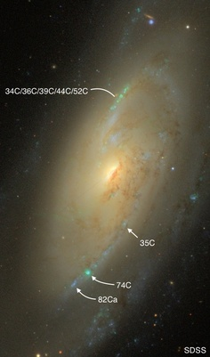

22" at 230, 287, and 383x

Very bright 3:2 elongated core with a much brighter center. One arm starts at the north end, arcing to the NNW, and a much shorter arm starts at the south, arcing to the SSE. The north arm contains a pretty faint brightening about 0.9' long and located 2' due north of the center. This brightening is the combined light of HII regions [CPH] 34C/36C/39C/44C/52C. On the southern arm, [CPH] 74C is a fairly faint clump about 2.7' south of the center. Another clump was suspected 0.5' further along the arm, which is [CPH] 82Ca.

### <x-dso>NGC 4395</x-dso>
RA: 12 25 48.7  
Dec: +33 33 01

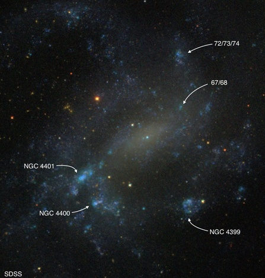

22" at 287 and 383x

A fairly bright, low surface brightness galaxy with multiple knots all over the place. <x-dso>NGC 4401</x-dso> is a fairly bright irregular 2:1 elongated clump located 2.3' ESE from the core. PA of the clump is 30 and 0.3' long. <x-dso>NGC 4400</x-dso> is a faint, very small, round clump located 2.6' SE from the core. <x-dso>NGC 4399</x-dso> is an irregular clump that is brighter on the north edge than on the south edge. It lies 2.4' SSW from the core. A star lies in the west. [RBD96] 72/73/74 is a very faint, very small, round clump about 2.5' NNW from the core. [RBD96] 67/68 detected as an extremely faint, very small patch. An extremely faint amorphous glow lies 4.2' NNE from the core. It is not labeled in the chart in our observing guide.

### <x-dso>NGC 4861</x-dso>
RA: 12 59 02.3  
Dec: +34 51 34

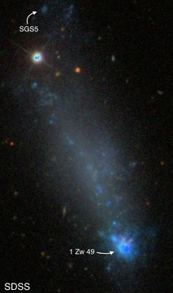

22" at 383x

Pretty faint 3:1 elongated low-surface brightness glow with a star on the north tip and an obvious non-stellar clump, 1 Zw 49, at the south end. PA = 160 and 2.8' long.
