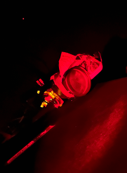
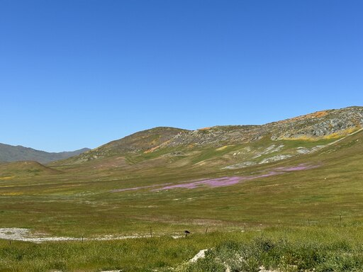
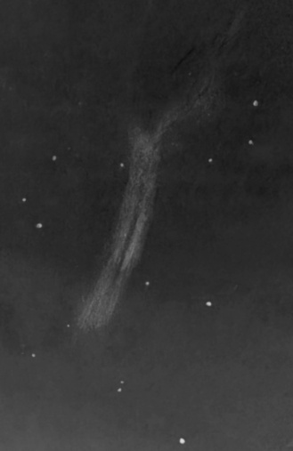

We had a bunch of people show up on Friday night at a site affectionately named Guacamole. Those assembled included [Mark Wagner](/whoswho.htm#Wagner), Chris, Arvind, Aris and Pawan. It started out fairly good in the early evening leading to plummeting transparency where even 13th mag NGC galaxies were difficult in 18 inchers. Then bands of clouds started marching in, and much hope was lost. Nevertheless there were still objects to be checked off, so I powered through with whatever I had for a couple hours as did Pawan. Transparency subsequently improved and seeing was stable, leading to some very good Bortle 3 conditions that persisted until moonrise. As a first timer at Guacamole, I was pleased with the conditions. My haul from the night was a satisfying two dozen log entries, and a total of about three dozen individual objects (counting within Hickson groups, HII regions of galaxies, and Abell clusters).

  

I had packed up for a multiple night trip, so I was vacillating on whether to do a second night or not, especially given the satisfying outcome of Friday night. But a look at the deep blue skies over the Panoche hills generated substantial FOMO. I wanted to go to a site near LSA frequented by target shooters and ATVers, but the potential for marine layer / high altitude moisture as well as Mark McCarthy’s liking for avocado convinced me to dip into Guacamole again. This turned out to be a healthy choice as Mark and I enjoyed steady Bortle 3 conditions. There was only one filament of haze I saw throughout the night, and the transparency got very good for at least a couple hours and the seeing was steady whenever I checked. The early evening was rather bright, but the skies got steadily better, both from what I could tell and Mark’s SQM readings. On this second night, I was already fatigued from a whole night, tear down, several hours of driving and also a short hike, and set up again. So I paced myself and did not chase the numbers or checklists game, logging only 10 objects until 4:30AM. However, I made one high quality observation that was verified and in fact exceeded by Mark who has ample experience in low surface brightness nebulosities.

  

One bane that came with the good skies was dew. Everything was wet by the morning, making me wonder if the atmospheric river filled up an atmospheric lake. The great news is that it was warm enough that the eyepieces wouldn't fog up with breathing. I guess the residual heat from my eyepiece coat must've managed to keep them above the dew point. But what did dew up was my Telrad and electronic finder. I had to jury rig a make\-shift dew heater from a hand\-warmer and snack\-bar wrapper, and after I got rid of the already existent dew with canned air, it held up nicely.

*Makeshift dew heater on finder scope*

As a bonus our Guacamole came with beautiful wildflowers — Michelin star presentation.

  

Here are the highlights of the first night for me:  

  

**<x-dso>Arp 245</x-dso>**: NGC 2992's tidal tail and the tidal dwarf <x-dso simbad="[BLD2000] A245N">Arp 245N</x-dso>

There aren't many tidal tails that show up nicely in an 18", but NGC 2992's is one of the best. Looking at the field without preconception, I "felt" something protrude from one of the galaxies, as if it had a faint edge\-on extension. Sure enough, orientation matched the POSSII. Then with varying powers, I was able to pick up the brightening in the tidal tail, a tidal dwarf designated as Arp 245N. I have seen this earlier in my 18" as well as Jimi Lowrey's 48", but it was fun to revisit. Mark Wagner came over to have a look and spotted the faint extension of the tidal tail in the opposite direction as well, which I later was able to see. This is on my GalStar list under "Insanity" \-\- probably should be demoted to "Challenge" given how little we had to struggle, but we did have good conditions early on Friday night.

  

**Hydra\-I Cluster**: <x-dso>Abell 1060</x-dso>

The last time I tried observing this object, Easswar and I were at Pinnacles West, and we were attacked by clouds in the middle of observing the cluster. So I had to go back and do a more thorough study. I picked up 10 galaxies. An added motivation to come back here was to study the [overlap NGC 3314A](https://en.wikipedia.org/wiki/NGC_3314) (the overlapping members are designated in Wikipedia as NGC 3314a and NGC 3314b, not to be confused with the other designation system NGC 3314A \= ESO 501\-46 combined for both members of the overlap, and NGC 3314B \= PGC 87327 used by Steinicke). I found out about this overlap from one of [Larry Mitchell's excellent TSP lists](https://texasstarparty.org/activities/tsp-observing-programs/tsp-observing-program-archive/). Unfortunately, I was not able to discern any signs of the overlap in NGC 3314A. It looked like a run\-off\-the\-mill edge\-on. For some reason, the NGC galaxy NGC 3307, 13\.5 mag, posed a lot of difficulty to discern. I was surprised, but Mark Wagner was having similar results with other NGC galaxies in that range, indicating poor transparency. Still seemed much harder than an NGC should be. The Dreyer description is "eeF" and [Steve's notes concur](http://ngcicproject.observers.org/NGC/NGC_33xx/NGC_3307.htm) on its difficulty, but it is still quite amazing that John Herschel discovered it with only an 18\.3". By contrast, PGC 31537's core seemed easier. The 10 galaxies picked up were NGC 3308, NGC 3309, NGC 3311, NGC 3307, IC 629, NGC 3314A, NGC 3314B, NGC 3316 (2 galaxies, one pretty much stellar), PGC 31537\.

  

**<x-dso>AM 1204-292</x-dso>**: NGC 4105 and NGC 4106

I wanted to see if I could pick out this bright tidal tail, but the transparency was poor and this is a low southern object. Negative. But Mark Wagner and I were able to see the two bright cores. I mentioned that it was two ellipticals interacting, to which Mark Wagner pointed out that he saw some spirality in one of them. Indeed, the smaller galaxy NGC 4106 turns out to be classified as a barred spiral. As we were observing, I mentioned "Arp\-Madore" and Chris chimed in "Oh, I knew Barry Madore. He used to play Volleyball at DDO!" It's not every day when someone on the field knows one of the people whose names are in your observing list. Can't remember if Chris looked at this one: all 4 visual observers were trading views.  

  

**<x-dso>NGC 4775</x-dso>**

This spiral galaxy looks a little wonky. I thought it might be a [Jellyfish galaxy](https://en.wikipedia.org/wiki/Jellyfish_galaxy), but I could not find any webpages or research papers to that effect. [Veteran astrophotographer Rick Johnson](https://www.mantrapskies.com/) also [noted](https://www.cloudynights.com/topic/410984-ngc-4775-a-slightly-sloshed-galaxy/) that it looks "sloshed up". In the eyepiece, it appeared slightly elongated and mottled. There was more light on the southern end than on the northern. The light cut\-on in the southern side is sharper. Mark Wagner looked at it too.  

  

**<x-dso>Arp 326</x-dso>**

I had only looked at this galaxy chain with Jimi Lowrey's 48". In my 18", as the transparency was improving, I picked out 4 galaxies and did not attempt the faintest (PGC 1302784\). UGC 8610 shining from about half a billion ly away at about mag 14\.5 was continuously held with averted vision. PGC 48117, ostensibly at the same distance (NED) but fainter at about 15\.2 mag was held about 60% of the time. UGC 8613, over 200 Mly closer to us than the aforementioned pair and shining at about 14\.8 mag was only held 30% of the time averted, as it is low surface brightness. PGC 214126, at the same distance but fainter (15\.5 mag) flashed in a few times vaguely, but was confirmed when it was held for 2\-\-3 seconds.

  

**<x-dso>NGC 4214</x-dso>**

Irregular dwarf galaxy NGC 4214 in CVn is beautiful in photographs for its many HII regions. This time I took a more careful look to try and isolate some of the HII regions, but without a proper image, I had to do a blind dive. Scott Harrington has an annotated finder chart in his May 2021 S\&T article on HII regions, but I didn't make the connection to open it and check. But comparing my sketch with his labeled image, I picked out NGC 4124\-I as the brightest clump, slightly elongated NW\-SE, which is the rough elongation of the main bar of the galaxy. The second most prominent knot was NGC 4214\-II. I also seem to have picked up NGC 4214\-IVs marked in Scott's finder chart.

  

**<x-dso>NGC 4395</x-dso>**

Such a fascinating galaxy. This is a barred spiral some 15 million ly away, but its surface brightness is so low that it looks like a collection of four nebulous spots, each of which has its own NGC number. "Most of the galaxy is blended into the background but the knots give the sky background a mottled appearance. 3 knots are readily picked out (without knowing exactly where to look), the foremost being NGC 4401 followed by the core \[NGC 4395] followed by NGC 4399\. NGC 4400 was picked out as a slightly NW\-SE elongated patch after knowing exactly where to look."

  

**<x-dso>Antares B</x-dso>**

By this time, Antares was high and the seeing was steady. Pawan called me over to his 22" because he had split Antares! Indeed, there it was, a bluish blip on a reddish Antares halo. I could not convincingly see it as being green (Pawan did), just more blue than Antares.

**<x-dso>M 51</x-dso>**

Pawan was close to winding down at about 3 AM, and was doing his eye\-candy tour. In his 22", M 51 looked simply stunning! Photographic spiral arms. What struck me was that I was able to detect the central prong of the "E", the three tidal tails emerging northwards from the smaller galaxy.

  

At this point, 3 AM, I wrote of the conditions: "Transparency and seeing are great, but dew everywhere. Crazy dew."
  

**<x-dso>Arp 302</x-dso>**

The "Exclamation mark" was tiny in my scope, but the main features were noted. Lack of tracking made it very challenging. Edge\-on seemed to brighten away from the superposed star. The face on appeared occasionally, almost perfectly round.

  

**<x-dso simbad="ESO 455-11">Haute-Provence 1</x-dso>**

An obscure globular cluster of the Milky Way found in [the Harris list](https://physics.mcmaster.ca/~harris/mwgc.dat), I was able to readily pick it out as a modestly faint, slightly E\-W elongated nebulous patch brighter in the center, while scanning the field for the object. The object persists at high (350x) power, but was not resolved. Brighter than most Palomars and some Terzans.

  

**Minkowski's Footprint** (<x-dso simbad="PN M 1-92">M 1-92</x-dso>)  

It's sort of strange, but many famous objects have slipped past me in my nearly 2 decades of visual observing, like the double\-double. This too is one of those. Finally, I pointed my telescope at this object which I had heard of (but thought I would never see) back in 2006\. I was very confused because there was a star in its place, even though I was at about 350x. Confused, I checked the POSSII plates carefully, and figured out it was indeed the object! It was still indistinguishable from a star at such high power. I went up to 590x with my newly acquired 3\.5mm Pentax. It was a pain to manually track the scope at this power, but I was finally able to confirm that it was not a star. It appeared very slightly elongated N\-S, with the southern side more prominent. Perhaps Rudolph Minkowski would've enjoyed this era of nanofabrication so he could finally have a properly\-sized shoe.

  

I packed up at 5 AM, Chris was intermittently awake around this time. I slept in until about 1 PM, after which a bunch of wildflower enthusiasts stopped by, taking pictures, my truck photobombing. Then I went to Pinnacles east for some amenities, water and a short hike.

Rinse and repeat, Saturday night, I arrived at 7:30 PM, finding Mark McCarthy almost fully set up. It was much brighter than the previous night in the evening, to the point where I asked Mark at 9 PM, "is it dark yet?". Being already both fatigued and satisfied by the previous night, I took it easy. I started on the Rosette Nebula, adding some more aspects of the nebula to a sketch I had started in February near LSA. This was my first time adding more to an already existing sketch, something that astro\-sketching guru [Howard Banich](https://sites.google.com/site/howardbanichhomepage/) does all the time. It is not ready yet. Then, I went on to an object that would become the highlight of the run for me.

  

**Hamburger Galaxy** <x-dso>NGC 3628</x-dso>

Do we see a gastronomical pattern here: [TACos](https://observers.org), Guacamole, and Hamburgers? Alas, all I got to eat was some tired photons.  
  

Almost everyone has seen this galaxy, which is the faintest and arguably the most beautiful member of the Leo Triplet. It is interacting strongly with the other members of the triplet making it heavily distorted. In fact, Mark McCarthy was coincidentally observing it while I had pointed my 18" on it. Since the transparency looked good, I thought perhaps I should try look for its tidal tail. Before Howard Banich's April 2021 article on the Leo Triplet, I don't know if many people had attempted the tidal tail at all. The tidal tail of NGC 3628 had eluded me at least thrice earlier (March 2022, last month...), even under what I thought were decent conditions, but this [DeepSkyForum thread](https://www.deepskyforum.com/showthread.php?1479-Object-of-the-Week-March-28-2021-NGC-3628-Tidal-Tail) gave me renewed confidence: lots of people had seen it in aperture smaller than my scope. I decided I would start out by making a detailed sketch of NGC 3628 which would force me to see more and more until maybe, just maybe, the tidal tail would yield.
  

So I started with a 31mm Nagler and 20mm Pentax, trying to get a lay of the land for my sketch. I was then excited to see the full photographic extent of NGC 3628's body with an 18mm orthoscopic. The more I studied it, the more apparent it became how puffy and long the galaxy stretched. It even got marginally brighter at its eastern terminus (which I now notice in photographs as the absence of the dust lane), but I did not sketch it well as it was hard to tell the details. At this point I had mostly got the star pattern down and the main body of the galaxy, so I bumped up the power using a 14mm eyepiece (147x, 3\.1mm ExP) and started studying the features. Slowly the eastern terminus started looking like it was curved northwards. I found my averted vision sweet spot to see the best puffiness in the eastern end of NGC 3628, and then placed the northward curve area in that location. Slowly, I was able to develop confidence in a feeling of a northward curve that thickened right around where the DSS2 image showed the tidal tail. Then after this sensation became strong enough, I exclaimed! Not sure whether it was the hours of study of the field, or if the transparency had just gotten way better, but it was now clear enough that I could use the verb "see" as opposed to the verb "feel". I exclaimed and got very excited, telling Mark McCarthy that I had finally seen the tidal tail. Mark has extensive experience with low surface brightness nebulae, but I was still amazed when he came over to the eyepiece and readily saw the tail! He even pointed out to me an aspect of the tail which I had "felt" but never put down. With our shared observation, I felt confident in studying the further extents of the tail. Mark and I saw the tail almost go out to almost 25' distance, filling the eyepiece field of my 14mm Pentax from one end to the other, with a thick curvy blip at the brightest position (not exactly as seen in the DSS2\). I hastily added this to my sketch with an approximate star\-field... I now wish I had done a better job since I had to do some guess work to figure out which stars we had seen the tail extend up to (I drew them in the wrong orientation).

  

*Over 2 hours of exposure with the human eye*  

(Sorry about the black lines near the tidal tail, as usual my sketch looks way better in paper than in the photograph)  

  

Perhaps we should have studied further to see how far the tail would go (it extends even further, almost 40' where it culminates in a tidal dwarf Leo\-TDG). But I was tired of the several hours I spent here, and have vowed to return under darker and more transparent skies to fill in more details into my sketch.

  

At this point, you can imagine I was jumping with joy. I didn't want to see anything faint for a while, so I looked at the beautiful Needle Galaxy, NGC 4565, which I had probably never seen in my 18". Then I went back to regular programming.

  

**<x-dso>Kiso 5639</x-dso>**

This tiny far\-out galaxy features in Scott Harrington's May 2021 articles because it is a "cometary" or "tadpole" galaxy with a bright HII region. Appearing like nothing more than a tiny blivet in my telescope, I wrote of it "Extremely faint. Several occasional flashes @ 7mm (295x). Not seen in low power. Not seen at 5mm (413x)".

  

**<x-dso>HCG 70</x-dso>** (6 galaxies spotted)  

A beautiful Hickson group. Digging into SDSS and SIMBAD data shows that this is not a single group but two overlapping groups. In the foreground at about 390Mly away are UGC 8990, IC 4371, and PGC 50159, shining at about mag 14\.3, 14\.2, and 15\.4 respectively; and in the background about 875 Mly away are PGC 50138 (IC 4370?), PGC 50123, IC 4369, shining respectively at mag 15\.4, 15\.4, 15\.6\. I found UGC 8990 (foreground), IC 4371 (foreground) and PGC 50123 (background) to be the easiest members, held \~80% of the time with averted vision. I found faint foreground\-group edge\-on PGC 50159 (15\.4 mag) the hardest, and it was very intermittently sensed. Also in the background group is mag 16\.8 PGC 50133, which I did not attempt owing to its low surface brightness

  

**<x-dso>IC 4628</x-dso>**

Onto much brighter things, this is a bright emission nebula in the false comet of Scorpius. With a UHC filter, I found it to be a rectangular region of nebulosity about \~29' in length, and about a third of that (i.e. \~10') in breadth.

  

Well, I'm very pleased with finally seeing the NGC 3628 tidal tail, and so much more. Hope you enjoyed this report as much as I liked my avocado.  
