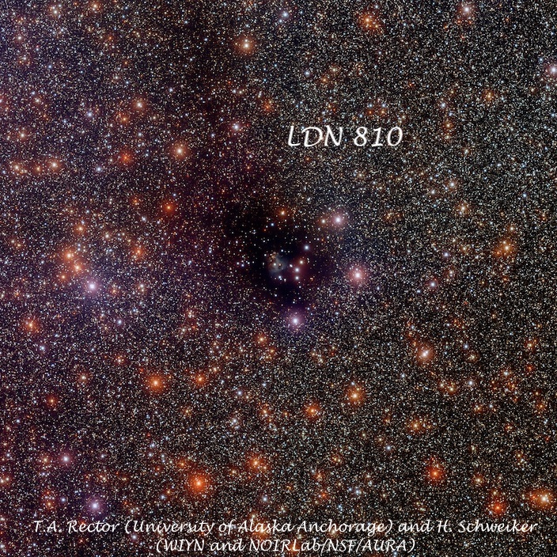
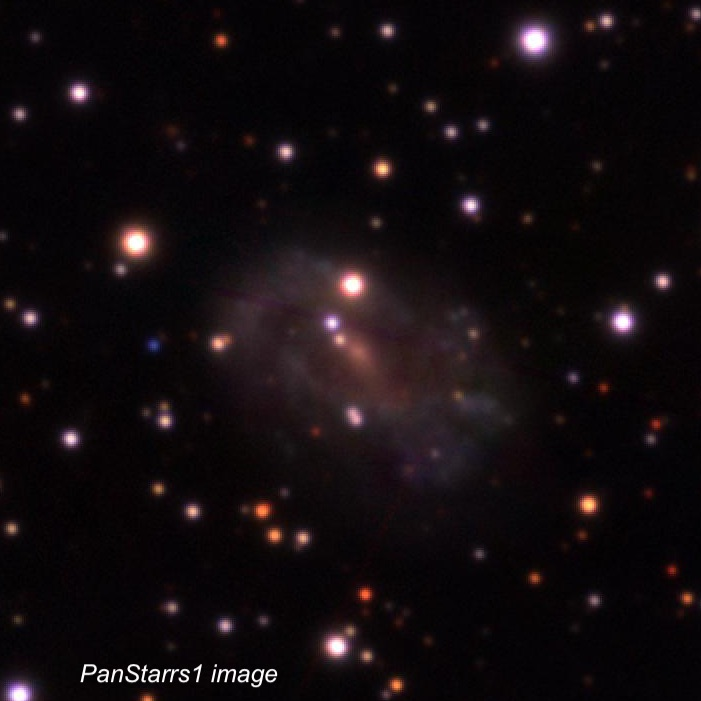
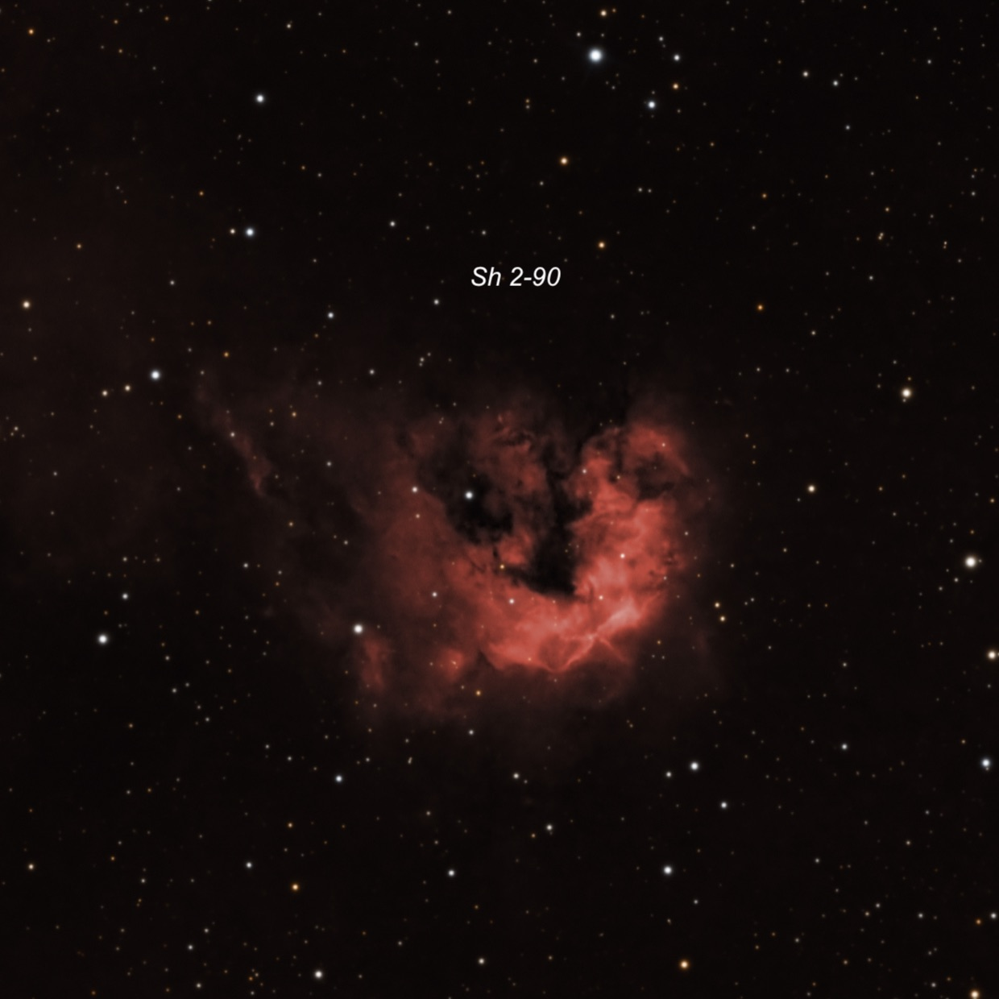
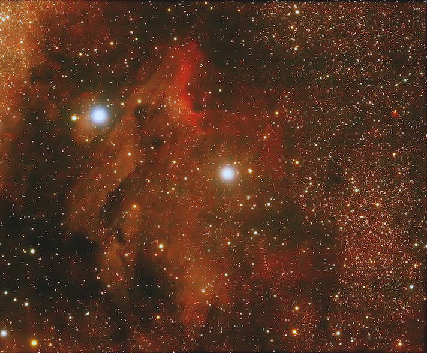
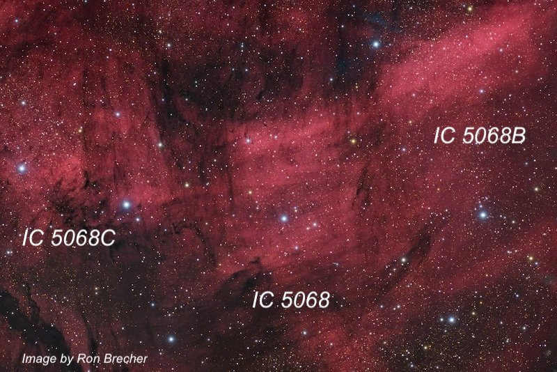

On Monday night, Sept. 25th, I met a couple of North Bay amateurs at Lake Sonoma for a very pleasant evening of observing with my 18\-inch Starmaster. Despite calling ahead to notify the rangers of our plans, the gate at Lone Rock was locked when I arrived at sunset, so we ended up using the Grey Pine Flat lot just below to observe. Overall, conditions were very good with a slight warm breeze and low humidity \- so I observed all evening in just a short\-sleeve shirt. Transparency was only fair, particularly low in the south and east, probably due to thin clouds, but was quite good at higher elevations, so I mostly hung around in the northern Milky Way and logged several interesting objects. Needless to say, I was a bit tired teaching Calculus the next morning at 7:30 on very little sleep!  

– Steve

---
  
**Name: <x-dso>LDN 810</x-dso>** (Lynds Dark Nebula)  
**RA:** 19 45 24\.1  
**Dec:** \+27 51 01  
**Size:** 18’ × 9'  
  
LDN 810 was first catalogued by Beverly Lynds in 1962\.  I found this Vulpecula dark nebula surprisingly prominent at 115x. It appeared as an irregular dark region, \~11’ × 8' (with extensions to 15’ × 10') embedded within a rich star field. This dark cloud is surrounded by a fairly bright Milky Way background that provided a good contrast. Two mag 9 stars are located on the west side (LDN 810 extends beyond these two bright stars). A chain of five mag 13\-13\.5 stars is superimposed near the center with a second fainter chain (more curving) that is close following the brighter chain.  

LDN 810 is a stellar nursery containing gas and dust that are forming new T Tauri\-type stars. A bipolar outflow of gas from one of these nascent stars is visible in the center of the dark nebula in this  image from NOIRLab.

  

  

  
  
  
---

**Name: <x-dso>LEDA 63630</x-dso>**

**Aliases:** Abell 64 \= PK 44\-9\.1 \= CGCG 397\-5  
**RA:** 19 45 34\.8

**Dec:** \+05 33 52  
**Size:** 40” × 27"

**PA:** 69°  
  
Fritz Zwicky first catalogued this object in 1965 as a magnitude 15\.3 galaxy in the 5th volume of his Catalogue of Galaxies and Clusters of Galaxies (CGCG).  A year later, George Abell catalogued it again, but this time as \#64 in a list 86 new **planetaries** discovered on the Palomar Observatory Sky Survey (POSS1\)!  Because of Abell's entry, this object was included in Perek\-Kohoutek Catalogue of Galactic Planetary Nebulae as PK 44\-9\.1\. In 1966, Marzke, Huchra, Geller presented redshifts for 2020 galaxies selected from the CGCG and listed a redshift of 0\.01 (39 Mpc) which proves this object is a distant galaxy and the Abell number was a misclassification. 

  

This unusual galaxy resides in a rich star field (galactic latitude of only \-9°) in Aquila. At 220x, it appeared very faint, slightly elongated, \~35” × 30". Once it was identified, I didn’t find it difficult to hold steadily, though it appeared featureless. A small right triangle of stars consisting of two mag 10 and a mag 12 star lies close SE (the hypotenuse has a length of \~ 3’).  Our target is collinear with the shorter leg. Check out the PanSTARRS image – you can easily see why it was mistaken as a planetary!!

  

  

  
---

**Name: <x-dso>Sh2-90</x-dso>**

**Alias:** LBN 144  
**RA:** 19 49 12

**Dec:** \+26 50 48  
**Size:** 8’ × 3'

  
I was surprised to easily pick up this faint emission nebula unfiltered at 115x as I missed it on back on July 20, 1998 from a darker and much higher elevation site at the Sierra Buttes with my former 17\.5". It appeared as a large, \~5’ x 4', diffuse oval glow in a very rich star field. A number of mag 12\-14 stars are superimposed. There was no response, though, using O III or H\-beta filters. The periphery is not well defined but the surface brightness was higher than the surrounding Milky Way and the observation felt secure despite the lack of filter response. Sharpless 2\-90 is located \~18' SW of mag 6\.5 HD 187614\.  
  
  

---  

**Name:** <x-dso>IC 5070</x-dso>

  

**Aliases:** Pelican Nebula \= LBN 350  
**RA:** 20 50\.8

**Dec:** \+44 21  
**Size:** 80' × 70'

  
I hadn't visited the Pelican Nebula in quite awhile and had forgotten about this huge, interesting emission nebula. The view was fascinating at 113x with an OIII filter as this object overfilled the 44' field. I started exploring to the west of 4\.8\-magnitude 57 Cygni. The brightest section is probably on a line with this star and a mag 7\.2 star further east and corresponds with the neck portion on the Pelican. This is where the ionization front is most evident on photographs. Th elongated "neck" of the Pelican also begins to the west of the bright star and streams off in a wide river of nebulosity towards the southeast and passing out of the field. A long darker lane apparently free of nebulosity isolates the "neck" from the main body of the Pelican. The irregular body spreads out to the south of the neck well beyond the southern edge of the eyepiece field and extends at least 65' from the neck terminating at the SE end with a roundish bright patch of nebulosity \~12' in diameter. The Pelican is located directly west of the North American Nebula and part of the same huge complex of nebulosity in this region.  
  
  
  
  
  
---

**Name: <x-dso>IC 5068</x-dso>**

**Alias:** LBN 328  
**RA:** 20 50 29

**Dec:** \+42 30  
**Size:** 30'  
  
IC 5068 is the second of three very large emission nebulae roughly one degree south of the southern end of the Pelican Nebula. At 113x and an OIII filter, this H II region appeared very large, diffuse, irregular, roughly 25' × 20'. It is noticeably brighter in a 12' circular region about 10' north of a mag 7\.3 star (HD 198690\) and a group of brighter stars that are near the southeast side of the nebula.

  
To the northwest of IC 5068 is an obvious second large patch of nebulosity, generally designated as <x-dso simbad="LBN 329">IC 5068B</x-dso>, though not by SIMBAD. This piece is very large and elongated NW to SE, extending perhaps 40’ × 15'. It contains a bright circular 10' patch to the south of a mag 8 star (SAO 50061\). A broad river of faint nebulosity streams away towards the northwest from this brighter region.

  
To the east of IC 5068 is the least conspicuous section of three very large patches of nebulosity, dubbed <x-dso simbad="LBN 332">IC 5068C</x-dso>.  At 113x and OIII filter, this detached piece extends 30’ × 15' (elongated E\-W) and overall has a low surface brightness appearing as a hazy glow. A mag 6\.7 star is at the south west end and a mag 7 star is at the eastern edge.

  

The late Bob Ayers, who specialized in visually observing large emission nebulae, referred to these three regions as the “clouds the Pelican sits upon”.  

  

