I was in southern California for Thanksgiving and this year, and the new moon was shortly after – I believe on the Saturday after Thanksgiving. Therefore I spent a few extra hours packing in my telescope and camping / hiking gear into my truck.

I happened to be in San Diego the day after Thanksgiving, so I visited fellow visual deep-sky observers Paul and Debbie Alsing. We talked shop, and Paul and Debbie showed me a Teleport 7" – a fascinating creation. This is an airline-portable travel dob that was very thoughtfully designed. It's always fun to meet fellow visual astronomers – there is so much in common and fun stuff to talk about.

I left for the desert the next day, the Saturday after Thanksgiving. Unfortunately, the forecast was dismal, so I just ended up finding a place to park for the night near the Alabama Hills in Lone Pine, with the intent that I'd go there the next day for some sightseeing. The famous place was unusually sparse in that I had the Möbius Arch to myself for several minutes on a Sunday afternoon during a holiday weekend.

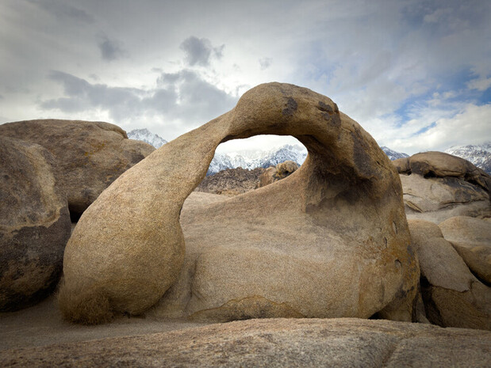

*
Möbius Arch in the Alabama Hills
*

## Night 1
---

The day was really cloudy, but the forecast seemed to suggest that the sky would clear up by 8PM, so I anyway went to my favorite spot in Saline Valley (just outside Death Valley National Park) and set up my telescope. The clouds parted by 6 PM opening up large portions of the clear sky just as I finished setting up. I wanted to start on something bright, so I joyously pointed to the Crescent Nebula and was working on it for about 30 minutes when I sensed the transparency plummet. I looked at the sky and there was a huge halo around Jupiter and about 70% of the sky looked distinctly hazy. Ugh. I looked for any suckerholes. Seeing that Cepheus was moderately clear, I started a star-hop to the <x-dso simbad="PN A66 1" noindex>PN Abell 1</x-dso>, finding open cluster NGC 7762 to establish my bearings. As I was looking at the open cluster, I found out that the haze had caught up with me, and by the time I logged it the sky was essentially overcast.

I caught up with a bunch of camper chores and a suckerhole had opened up around Camelopardalis in about half hour, so I quickly caught planetary nebula NGC 1501 before the sky became overcast again. I was disappointed. Moreover, with no internet, no book to read, I was trying to think of ways to use my time as it was too early to go to bed. I pulled out my iPad and started editing a video. About an hour and a half later, the southern sky seemed clear and it looked like it was the end of the stream of clouds coming in from the south. Finally, the forecast was correct after all, but 40% of the sky was still overcast and the transparency was only so-so. I started getting to work, observing several Hickson groups and other frustratingly faint galaxies. A quick fix I made on my equatorial platform before leaving home worked very well and the platform tracked marvellously all night. The seeing was very good too – these factors made picking up the faint galaxies possible despite the transparency. I believe the transparency worsened through the night, and I eventually gave up and switched to sketching a few bright galaxies. I ended the night perhaps at 3:30 AM.

## Night 1 Observations
---

<strong><x-dso simbad="NGC 6888">Crescent Nebula</x-dso></strong>

My friend from college days Akshay Subramaniam took a beautiful image of the Crescent Nebula perhaps a month earlier, which prompted us to [look at it through my 18-inch](https://groups.google.com/g/sf-bay-tac/c/fkgHWTgDO8U/m/2L2ZPnimAgAJ) at our local site "Montebello". Akshay brought up that the nebula has different outlines in H-Beta and OIII, and that piqued my interest in trying to study this Wolf-Rayet shell better. I sketched the view through a 20mm Pentax (103×) eyepiece and an OIII filter.

The brightest portion, which is a filament on the north end, was visible with direct vision. The filamentous crescent-shaped rim was bright and easily seen with averted vision, but what I had not noticed before is that the entire oval shape is completed by more faint nebulosity that is dimly visible to averted vision. If you look at OIII images of the nebula like [this one by Terry Hancock](https://www.astrobin.com/ezsx1t/), you can see that there is a faint protrusion of the OIII bubble further north of the bright crescent-shaped rim. I unfortunately did not pick up on this. BTW, north is at about 7 o' clock in my sketch below.

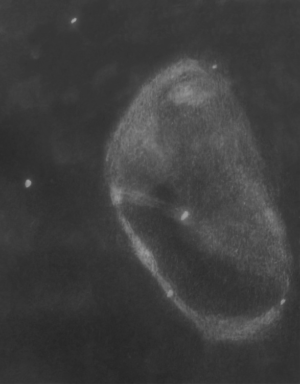{:.small}

With an Hβ filter, the edges and filaments seemed less pronounced and the interior glow was more noticeable.  Only the bright portion of the crescent on the north end was clearly filament-like and stood out from the background nebulosity. Averted vision weakly showed the brightening on the left rim. Here is the image by Akshay that prompted this observation:

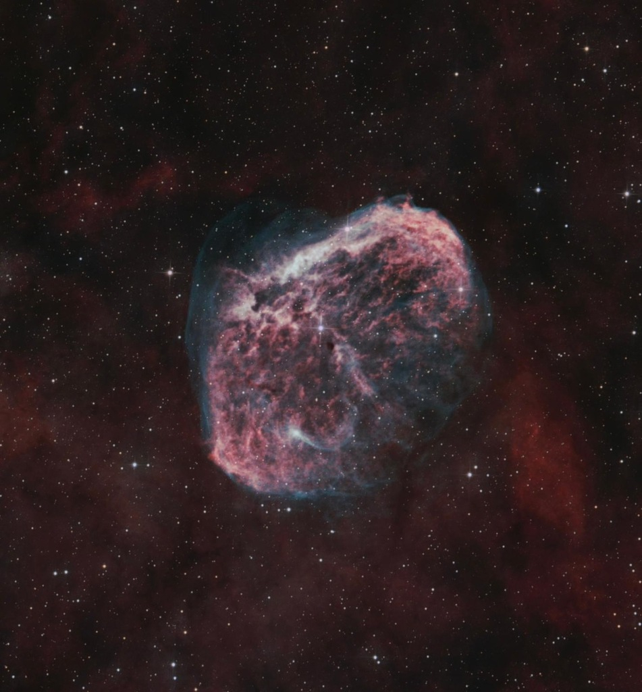{:.small}

*
HOO image of Crescent Nebula by Akshay Subramaniam, full resolution <a href="https://astrob.in/ez3twl/0/">here</a>
*

---

<strong><x-dso simbad="NGC 7762">NGC 7762</x-dso></strong>

I observed this open cluster at 103× through substantial haze, and under the conditions it was not very impressive. A number of dim stars appeared scattered in a region that was elongated NW-SE. The star density was very vaguely triangular in shape.

---

<strong><x-dso>NGC 1501</x-dso></strong>

This beautiful planetary nebula is featured in many famous observing lists like Steve Gottlieb's [DeepMap 600 list](http://www.raycash.org/dmcon.htm) and in Alan Dyer's [RASC Finest NGC](https://www.rasc.ca/finest-ngc-objects), but somehow I had never looked at it before! I caught this in a fast-closing suckerhole, so I couldn't spend enough time studying it.

At 103×, I caught a circular disk-shaped glow not far from the open cluster <x-dso noindex>NGC 1502</x-dso>. Upping the magnification to 207×, the glow showed a slightly brighter, mottled rim at the edge. The ring-shaped brightening at the rim could be held nicely with averted vision.

I observed this again on my second observing night, look under [Night 2 Observations](#night-2-observations) for the results.

---

<strong><x-dso simbad="HCG 19">Hickson 19</x-dso></strong>

Over a decade ago when I acquired my 18-inch, I had told myself that I'd work through as many of the Hickson groups as possible. I've been putting in some more time into this project in the recent past.

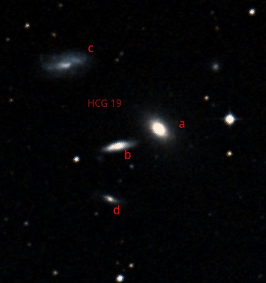

*
DSS2 Color image of HCG 19
*

**<x-dso noindex>HCG 19a</x-dso>** appeared stellar at 207× and was easy, continuously visible to direct vision. It appeared as a star with a superposed halo with averted vision, but clearly looked like a galaxy at 459×.

**<x-dso noindex>HCG 19b</x-dso>** was held in view perhaps 70% of the time with averted vision at 459×. I was able to locate it without prior knowledge of it's position.

**<x-dso noindex>HCG 19c</x-dso>** was very dim, but nevertheless picked out without knowing where to look a priori. I could only glimpse it itermittently with averted vision for short durations. The best view was at 207×.

Component 'd' was not detected despite trying.

---

<strong><x-dso simbad="HCG 11">Hickson 11</x-dso></strong>

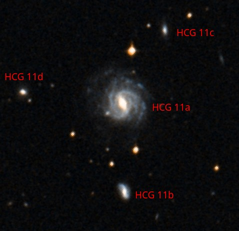

*
DSS2 Color image of HCG 11
*

The conditions when I was looking at this object were not great as a thin cloud sort of floated right into the area.

**<x-dso noindex>HCG 11a</x-dso>** was picked up easily at low power, and continuously visible to averted vision at 345×. I got occasional glimpses of the north-south running bar and the halo around it. Most of the time, it was a non-descript core.

**<x-dso noindex>HCG 11d</x-dso>** was located without prior knowledge of its exact position at 207×. It was picked up as weak and vague intermittent flashes to averted vision.

**<x-dso noindex>HCG 11b</x-dso>** was only found after knowing exactly where to look for it, but I can confirm the observation at 345×. It flashed intermittently to averted vision. I occasionally sensed its slight north-south elongation. It was brighter than component 'd' but still very faint.

Component 'c' could not be confirmed.

---

<strong><x-dso simbad="HCG 23">Hickson 23</x-dso></strong>

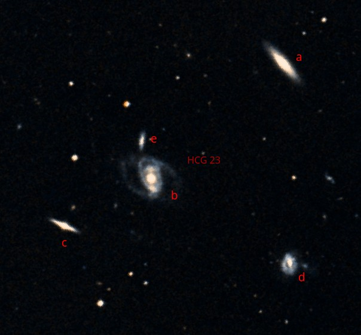

*
DSS2 Color image of HCG 23
*

This is a nice, bright Hickson group. In my finder eyepiece at 103×, I immediately picked out three collinear galaxies (components 'a', 'b' and 'c'), and after a few seconds of observation, a fourth galaxy off this line (component 'd')

**<x-dso noindex>HCG 23a</x-dso> = NGC 1214** showed a roughly NE-SW elongation and a much brighter middle to averted vision at 207×.

**<x-dso noindex>HCG 23b</x-dso> = NGC 1215** was visible continuously with direct vision at 207×. 413× revealed a bright core embedded in an ENE-WSW elongated halo that flashed in intermittently to averted vision. At 345×, I noted the brightening to the ENE of the core being brighter than that to the WSW.

**<x-dso noindex>HCG 23c</x-dso> = NGC 1216** appeared virtually stellar although staring carefully with averted vision revealed that it was elongated at an estimated 35° east of north. 413× distinctly showed the fuzzy core and elongation.

**<x-dso noindex>HCG 23d</x-dso> = PGC 11673** was picked up at 207× and visible continuously with averted vision. Higher power of 345× showed it as a roundish amorphous glow.

Component 'e' (<x-dso noindex>PGC 11690</x-dso>) was not confirmed despite sincere attempts.

A few bright galaxies lie nearby, which I describe below:

**<x-dso>NGC 1208</x-dso>** appeared as a bright glow at 207×, with the core continuously visible to direct vision. A mild NE-SW elongation flashed to my averted vision intermittently.

**<x-dso>IC 1880</x-dso>** was picked up at 207× as a slightly ENE-WSW elongated glow with a much brighter core. The core was barely visible as a stellar point to direct vision, but was clearly seen with averted vision.

---

<strong><x-dso simbad="NGC 1516">NGC 1524</x-dso> and <x-dso simbad="NGC 1516A">1525</x-dso></strong>

There seems to be a good deal of confusion on the designations of this cool interacting pair. I used the designations from Steinicke's NGC/IC catalog above. It looks like the pair carries the designation VLG 074 (for "Very Luminous Galaxy"), see [this 2003 paper](https://www.aanda.org/articles/aa/pdf/2003/36/aa3637.pdf). Oddly, it seems to carry neither an Arp nor a Vorontsov-Vel'yaminov (VV) designation. However, the reference I linked measured the redshifts and determined them to be in physical proximity. Indeed the [Legacy Survey](https://www.legacysurvey.org) image below shows the interaction in its glory, tidal tails and all. They also measured the redshift of <x-dso noindex>PGC 146089</x-dso> and found it to be a group member; had I known this earlier I would've tried to observe it.

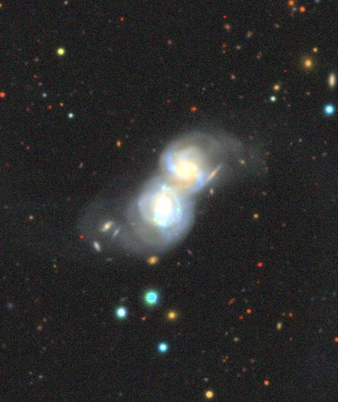{:.small}

*
NGC 1516 from the Legacy Survey
*

I was able to pick up this pair immediately at 103× as an elongated glow, that intermittently resolved into two. At 413× I was able to see two glows embedded in a peanut shaped shared halo.

---

<strong><x-dso simbad="40 Eri">Keid = 40 Eridani</x-dso></strong>

Head TACo Jamie Dillon [wrote](https://groups.google.com/g/sf-bay-tac/c/T7F-2ewm5ac/m/ZSNwj0a2BAAJ) a very beautiful description of this system on [TAC](https://groups.google.com/g/sf-bay-tac), which I quote below:

> Spent extra time on 40 Eridani, the triple star Gottlieb was looking at from Lake Sonoma. Marko hasn’t complained when I’ve evangelized this object shamelessly. It’s astounding, not for the visuals but for what you’re looking at. A regular K-type main sequence star (one of the few K-type stars we can see naked eye, it being only 16 lightyears from here), then a close pair of a white dwarf and a red dwarf. The white dwarf is far and away the easiest white dwarf to catch with our scopes.
>
> What kills me is the timelines. It’s presumed they formed together. Here’s a main sequence star in the midst of its ca 8 billion year lifetime, then a star that must have been more massive and already run out of fuel, collapsed into a very hot cinder that’ll go along that way for a long time.
>
> With the red dwarf, we have no idea what it’ll turn into when it uses up its fuel, the universe isn’t old enough. They’re very patient and go on for what Kaler calls “a seeming eternity.”
>
> James Kaler has a fascinating description of 40 Eri on his Stars site - [http://stars.astro.illinois.edu/sow/keid.html](http://stars.astro.illinois.edu/sow/keid.html)

I'm not much of a multiple star person, but with such a tantalizing backstory, I simply had to take a look. I disagree with Jamie, in that it was also very cool visually to see three colors in the eyepiece – yellow, white and red. Looking at the system at 345×, I wrote "Beautiful! Bright star distinctly yellow. The tight double is blue-red. Colorful!". I find it hard to tell the difference between white and the various shades of blue.

---

<strong>Sazhen 30</strong> (weak observation)

Victor van Wulfen brought to our attention this reflection nebula discovered by [Vlad Sazhen](https://www.astrobin.com/users/astrochumak/) on [his Deep Sky Forum post](https://www.deepskyforum.com/showthread.php?1745-The-Hunter-and-the-Deep-Sky).  The position is copied below for convenience:

|RA|05:58:39.2|
|Dec|+20°11'14.0"|

At 103×, I immediately picked up a glow around a bright-ish star with two faint stellar companions. Initially, I declined to attribute it to poor transparency or dirty optics as the brighter star due northeast did not have as big a halo. At higher power 207×, I noticed that the halo of Sazhen 30 appeared asymmetric and it elongated eastwards into a region away from the asterism, further suggesting that I was seeing real nebulosity. The best view was at 148×.

However, I need to repeat this under better conditions and with cleaner optics for a true confirmation. Because of the asterism formed with the two faint stars, it was hard to conclusively attribute at least some of the glow to real nebulosity. Other asterisms found in the field also had halos that were only slightly smaller, perhaps, than Sazhen 30. That's why I'm calling this a weak observation.

---

<strong>Dusty Hand Galaxy (<x-dso>NGC 2146</x-dso>)</strong>

Having last observed this through my 18" almost a decade ago in 2015, it was time to give it another go. I tried to make a detailed sketch of the object and here is the result. Also shown is a DSS2 Color image of the galaxy opriented to match the sketch.

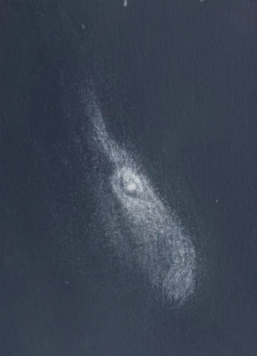{:.small}  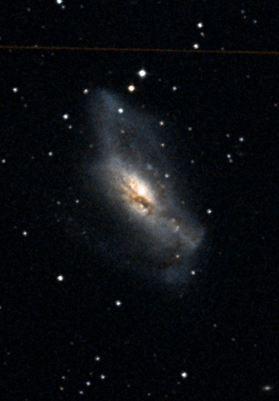{:.small}

My sketch is a bit hard to reconcile with an image, but here is my explanation: north is at about 9 o' clock in the sketch. This checks out against the prediction from a feature I added to [KStars](https://kstars.kde.org) that computes the [orientation as seen in the eyepiece](https://www.youtube.com/watch?v=icqQOmi52_8) and rotates the sky map and DSS2 overlay accordingly. The inner dust lane cutting the core, as can be seen goes past the top-right (southwest) of the core. The protuberance headed NNW from the galaxy is rendered in my sketch as a curved feature with a fork. The clockwise curve maps to the right-angled turn seen in the image, and the fork is the darker gap between the bright and long (tidal?) tail and the short stubby companion to its right. The ESE tail maps on pretty nicely, but I could not see the faint "loop" in it – I don't know why because in my 2015 sketch, I saw this part but failed to see the right-angle turn on the other protuberance.

Finally, a mis-sketch: I sensed that the light from the galaxy was sharply cut-off on the southwestern side when compared to the northeastern side. I attributed this to a dust lane, since it's sort of typical in my experience that the other side of the dust lane is low-contrast with the background, so the dark lane sometimes appears only as an abrupt cut-off in light on one edge of the galaxy. I therefore sketched in a second dust lane weakly, and wrote in my notes that I was only suspecting the lane. Instead what I think I saw was that the natural edge of the galaxy and it was the northeastern side that tapered slowly because of the "looping" ESE stream connecting back near the core. That is likely the actual explanation for my observing the southwestern side looking abrupt. In any case, I have left my sketch un-doctored.

Here are the accompanying notes I wrote down: "A bright galaxy with a stellaring in the center. A dust lane is seen hugging the nucleus and curving as shown. The galaxy has a more prominent and bushy NW extension visually. The galaxy's northwest extension seems to curve clockwise, but the region seems nonuniform. The galaxy's light is cut abruptly on its southwestern side which made me suspicious of a second dark lane. Tough target for detail under these conditions with 18-inch".

It looks like there was a supernova (SN2024abfl) when I observed this beautiful galaxy, but unfortunately I was not aware and did not plot any of the field stars in my sketch. [Here is an excellent image](https://app.astrobin.com/i/n75v7k) showing the supernova.

I certainly must revisit this object under better conditions, when the contrast between the galaxy's fainter outskirts and the background would be better.

---

With deteriorating transparency which rendered "Bortle 4" conditions in a normally Bortle 2 site, I decided to stop trying to observe faint objects and decided to use the wee hours to sketch a couple bright objects. I chose to sketch M 81 and M 82, mostly to capture the beauty of the bright and structured M 82. I'm fairly pleased with my sketch of M 82, and I will post the same on [my sketching website](https://asimha.net/Astrosketches) instead of here.

I ended observing night 1 at about 3:30 AM, resolving to do another night, not having hit all of my fall observing goals due to the clouds and poor transparency. I slept really sound.

## Between Night 1 and Night 2
---

The next night (of 2nd December 2024) was forecast to be cloudy, so I decided to drive to the outskirts of Bishop, CA the next day and camp somewhere off highway CA-168 (west of US-395). The idea was to try snowshoeing for the first time. My brother advised me that there is high avalanche danger and I should stick to simple low-slope trails, and a ranger at the Inyo National Forest visitor center in Lone Pine suggested snowshoeing on the closed road from Aspendale to Lake Sabrina.

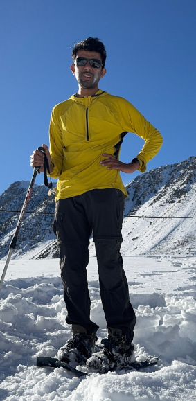

The good thing about planning an observing trip in an area like the eastern Sierra is that there is plenty of hedge against poor weather. There are so many activities to do in the area – hiking, snowshoeing, landscape photography, sightseeing, 4-wheeling, etc. That made it worth my time sticking around.

During the day, I also prospected a few observing sites closer to Bishop, on Death Valley road. I've earlier observed from spots off highway CA-168 (east of US-395) but they are too exposed – to wind, traffic and lights from Big Pine. This time I found an excellent spot at about 6500 feet elevation. As a bonus it had cellular network, a good measure for emergencies and also for looking up astronomical data. The only downside was that it had a hill to the south, but I used SkySafari to verify that all of Pisces Austrinus (as an example) would clear the hill. The only target on my list that suffered obstruction was the <x-dso noindex>Grus Quartet</x-dso> – I'll reserve that for a Texas or India trip.

The next day, the updated forecast still maintained that it would be clear with average transparency. I finished my snowshoeing and promtply drove to the aforementioned site, reaching about half hour before dark.

## Night 2
---

### Biting cold
When I got to my observing site, it was already getting very chilly. I looked at the forecasted low temperature and it was 28 °F (-2 °C). Yikes! Anyway, I was prepared to tackle this cold, having managed observing in colder temperatures in the Indian Himalayas two months ago. Saskatchewan amateur astronomers Chris and Shane of the [Actual Astronomy podcast](https://actualastronomy.com/) are an inspiration, observing in -13 °C. What really got me was the windchill: for most of the time through the night, there was a breeze blowing from the southeast which made for biting cold. I am usually reluctant to wear gloves or mittens while observing, but I simply had no other choice on this night. Eventually I also had to rely on hand-warmers for heat. I still avoided pulling out my heavy "Carhartt Extremes" artic quilt-lined coverall, which I keep as a last resort – I had to use that in the Himalayas. For those interested, here are all the layers I used:

* *Legs*: Shorts, Three Layers of simple Covington long underwear, and a felt track pant
* *Chest*: A hiking base layer, a thin wind jacket, a light primaloft jacket and a heavy duty down jacket
* *Head*: A felt balaclava, a woolen cap, and a handwarmer tucked between them
* *Hands*: 3M Thinsulate-based flip mittens, hand warmers
* *Feet*: Regular crew socks, polyester warm socks, felt-lined snow boots

I was comfortable except when the wind breeze got colder later in the night. Between being tired from all the hiking and driving, and the biting cold, I took several breaks to snack, warm up water or cook food with my Jetboil, or to text my family.

### Conditions

There were a few clouds at sunset, but as the forecast predicted, they vanished as it got darker. That's the good part. The [sky was surprisingly bright](https://www.cloudynights.com/topic/868085-night-sky-getting-brighter/page-3) for where I was, though. I attributed it to airglow. There was one notable light dome in the northwest, which was blocked by a hill. Perhaps this was Bishop and Big Pine. I could not see any other prominent light-domes, although perhaps they were hiding behind hills. After all, I was in a narrow valley in the Inyo mountain range. This site therefore has great prospects.

It also looked like the forecast was right about the "average" transparency; the milky way was looking somewhat crisp in the evening, got murkier as the night progressed. This, and the coating of dust on my mirror, both contributed to poor contrast in the eyepiece. Yet, it was much better than what I had on night 1.

The seeing started out bad, worsening every time the breeze would blow. I had to catch glimpses of whatever I was observing when the breeze momentarily died. The seeing did get better as the night progressed and it seemed like the effect of the breeze was also lesser later in the night.

It wasn't a pleasant night to observe, but I had a list to get through which kept me motivated along with the many sugary snacks I had packed in.

## Night 2 Observations
---

**
NGC 7385 group
**

Picked out from the [Seasonal Favorites – Autumn](autumn.htm) list.

When I centered the field in my 20mm Pentax finder eyepiece (103×), I could quickly pick up five glows – NGC 7385, NGC 7386, NGC 7387, NGC 7389, and NGC 7383. All five were visible continuously with direct vision. NGC 7385 and NGC 7386 were significantly brighter than the rest.

Here are my notes on the members:

**<x-dso>NGC 7386</x-dso>** sported a stellar nucleus and somewhat brighter middle, slightly elongated SE-NW (207×)

**<x-dso>NGC 7385</x-dso>** was the brightest in the group, condensed brighter middle, slightly elongated ENE-WSW (207×)

**<x-dso>NGC 7387</x-dso>** sported a central brightening which was stellar, slightly elongated NE-SW (345×)

**<x-dso>PGC 69835</x-dso>** (V ~ 16mag) is the companion to NGC 7387. It was very very faint, flashing very rarely to averted vision, and appeared as an amorphous glow with no discernible features (345×)

**<x-dso>NGC 7389</x-dso>** sported a condensed center, was visible continuously with averted vision. I could not discern any elongation (345×)

**<x-dso>NGC 7390</x-dso>** showed a condensed nucleus and was visible for most of the time to averted vision, no further details were detected (345×)

**<x-dso>PGC 69788</x-dso>** was flashing in and out of averted vision, visible for about half the time. I had to know where to look to find it, though. It appeared roundish and seemed to have a brighter core region.

---

**
<x-dso>NGC 247</x-dso>
**

At 103×, it appeared like a comet, with the foreground star at the southern end resenbing the coma and the tapering galaxy, a tail. The galaxy was elongated and low in surface brightness, and spanned about 20' in length. It appeared to widen as we went north from its southern end. A significantly brighter, elongated core lay off-center, shifted to the south. A weak brightening was detected at the northern end.

---

**
<x-dso simbad="VV 518">Burbidge's Chain</x-dso>
**

See also: [feature on Burbidge's Chain](burbidge.htm)

Moving off from NGC 247 into the region at 207×, two galaxies were easily picked up – one (<x-dso noindex>PGC 2791</x-dso>) flanking a prominent star, the brighter of the two. The other galaxy was <x-dso noindex>PGC 2796</x-dso>.

After knowing the exact location and spending substantial time concentrating on the field, **<x-dso noindex>PGC 2794</x-dso>** flashed into view several times. Upping the power to 295× rendered it better, but the galaxy still appeared amorphous with no definition. I could confirm and reproduce the location of the glow. I got about a dozen flashes of PGC 2794 at the exact location.

**PGC 2791** at the higher power of 295× appeared elongated WSW-ENE and was high in surface brightness. It was visible continuously to direct vision. The elongation was roughly directed towards the star flanking it.

**PGC 2796** at this higher power was visible continuously with averted vision and sported a brighter core. I got a weak sensation of elongation directed SSW-NNE. This is the second brightest galaxy of the chain.

The three observed galaxies could be held in view simultaneously for short intervals with averted vision. <x-dso noindex>PGC 2798</x-dso> was not detected despite sincere efforts.

Here is a DSS2 Color image showing NGC 247 and Burbidge Chain. Burbidge Chain is seen on the top right.
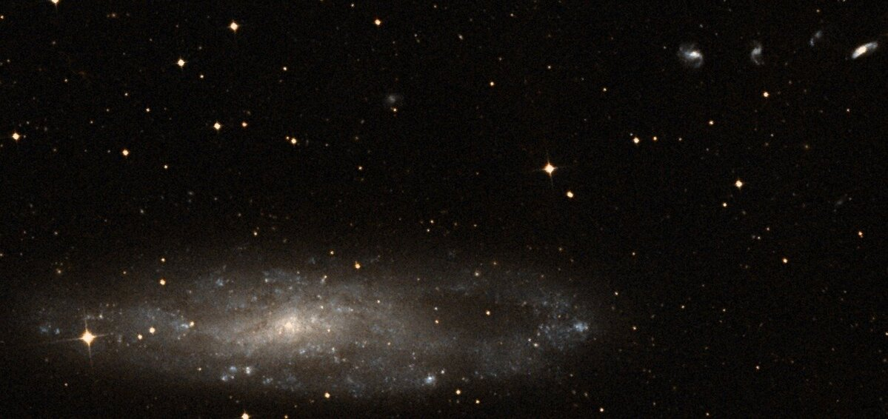

---

**
<x-dso>Arp 86</x-dso>
**

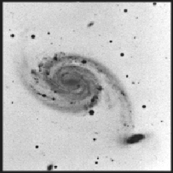

This [M51-type interaction](https://link.springer.com/article/10.1007/s10509-008-9826-3) showed up in my finder eyepiece (103×) as a bright pair of glows, one substantially larger than the other. The larger glow sported a stellar nucleus, a brighter core and appeared somewhat elongated.

I was pleasantly surprised to get a flash or two of the "connecting" arm, i.e. the tidal arm pulled from the larger galaxy (<x-dso noindex>NGC 7753</x-dso>). I spent the next half hour or so confirming the sensation. It was hard to disprove. I got multiple strong flashes of it in a 14mm Pentax XL (148×) eyepiece and a 18mm Baader Classic Ortho (115×). The ortho showed it the best. At 345×, I sensed ESE-WNW elongation of the smaller galaxy (<x-dso noindex>NGC 7752</x-dso>). I also picked up hints of the inner spiral structure of NGC 7753, as mottling in its halo.

---

**
<x-dso simbad="NGC 3">NGC 3 group</x-dso>
**

Picked out from [Off the Beaten Path with Steve Gottlieb](offpath.htm).

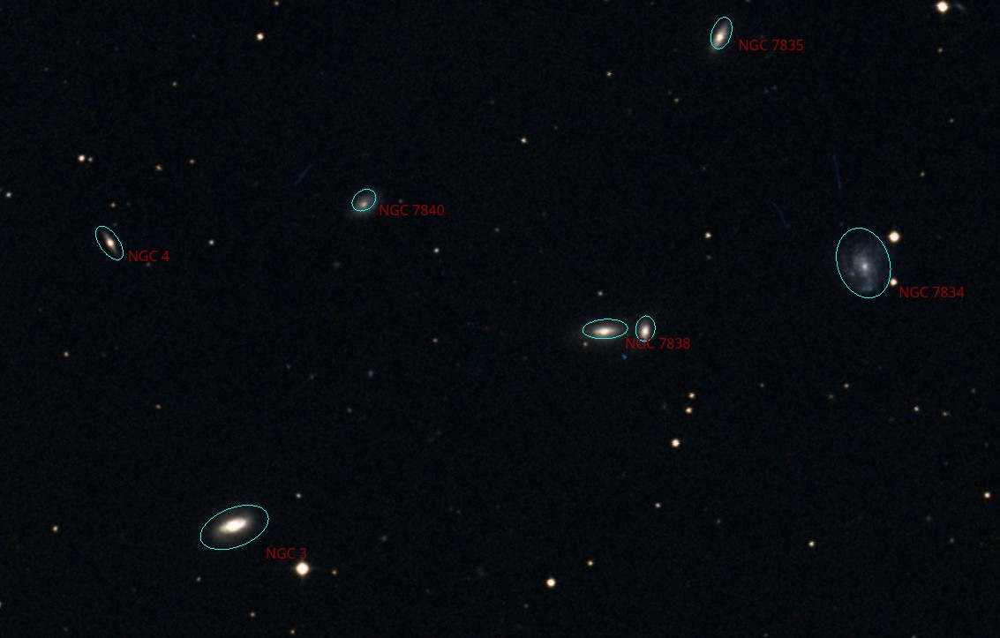

*
Screenshot of NGC 4 and its neighbors from KStars, overlay imagery from DSS2/Color. The unlabeled galaxy to the right of NGC 7838 is NGC 7837
*

The group was rather dim in my finder eyepiece (20mm Pentax XL giving 103×) and I had to struggle somewhat to find it. The diminutive angular size of NGC 3 may have been part of the problem. I first stumbled upon UGC 52 nearby.

**<x-dso>UGC 52</x-dso>** appeared as a roundish glow that was moderately dim. The glow tapered in brightness into the sky background. It lay not far from a prominent star, to its southeast. It was visible continuously to averted vision.

I then managed to catch NGC 3.

**<x-dso>NGC 3</x-dso>** appeared at 148× as a slightly ESE-WNW elongated bright glow with a much brighter middle. It lay to the ENE of a bright star.

Once NGC 3 was brought into view, two other galaxies came into view immediately without having to consult a chart or image: NGC 7838 and NGC 7834. Eventually I picked out NGC 7840 and NGC 7837. Of these five galaxies (NGC 3, 7838, 7837, 7834, 7840), only four could be observed simultaneously with averted vision.

Upping the power to 207×, I observed the following:

**<x-dso>NGC 7838</x-dso>** was dim, visible continuously to averted vision, elongated E-W, sported a brighter middle.

**<x-dso>NGC 7837</x-dso>** was visible most of the time with averted vision, appeared roundish, lay to the W of NGC 7838, perhaps less than an arcminute apart from 7838's western edge.

**<x-dso>NGC 7834</x-dso>** was a weak amorphous glow flanking a star, with the centroid of the glow lying SSE of the star. The glow almost appeared to touch the star. I could not detect any central condensation or variation in brightness. It was continously visible to averted vision once I placed it in the sweet spot. Another fainter star seemed superposed on the western side of its halo, to the south of the brighter star.

**<x-dso>NGC 7840</x-dso>** was a very dim, amorphous glow visible almost continuously to averted vision. I could not discern any elongation.

**<x-dso>NGC 4</x-dso>** was popping in and out of averted vision. It appeared very condensed and very dim. I initially confused a 15.7-mag star <x-dso noindex>HD 212715</x-dso> for the galaxy but studying the image allowed me to find and confirm the galaxy. The galaxy had about the same brightness as this star, albeit perhaps was slightly easier to see. Occasionally, the galaxy seemed to have a stellar condensation at its center. As Steve mentions in his [feature on this group](sept.htm#ngc3group), the 16th-mag galaxy proved to be a torture! Whenever I see an NGC galaxy this dim, I wonder on what telescope it was first discovered! [Steve has the answer](NGC%201-1000.html#NGC%204) in his notes – it was on a 48-inch. BTW it appears that SIMBAD now correctly identifies NGC 4 = PGC 212468.

**<x-dso>PGC 1342413</x-dso>** seemed to be the only other fairly tractable galaxy in the field. Its recent cataloging indicated by the high PGC number probably results from its proximity to a star, and not from its brightness. Upping the power to 345×, I was able to see a distinctly non-stellar glow with averted vision at the location. This could either be the combined glow of the star and the galaxy, or mostly of the galaxy (since the star seems to be fainter). In any event I could not resolve the galaxy and star separately.

---

**
<x-dso simbad="HCG 5">Hickson 5</x-dso>
**

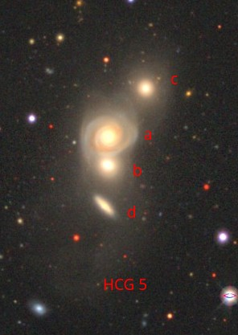

*
Hickson 5, image from the Legacy Survey
*

In my finder eyepiece at 103×, the group was already visible as an elongated glow. I made the following observations at 345×:

Two members (**<x-dso noindex>HCG 5a</x-dso>** and **<x-dso noindex>HCG 5b</x-dso>**, together NGC 190) were about similar in brightness and visible continuously to averted vision. They were resolved almost continuously.

**<x-dso noindex>HCG 5c</x-dso>** appeared as a non-stellar but condensed glow, flashing in and out with averted vision.

Despite my best efforts, <x-dso noindex>HCG 5d</x-dso> was not detected. A strong breeze hindered the observation.

---

**
NGC 383 Chain = <x-dso>Arp 331</x-dso>
**

Featured on the [Galaxy Chain](chains.htm) page, [notes by Steve Gottlieb](ngc383ch.htm)

Wow! What a view! This object turned out to be the highlight of my night. I had seen it previously back in 2013, but my notes then were sparse: "Saw all seven galaxies!" I had to see it again, and I'm glad I did.

In my finder eyepiece, a slightly meandering chain of five bright galaxies and a couple faint ones came into view at 103×. The bright five (NGC 384, 385, 383, 380, 379) could all be held in view simultaneously. Two fainter members could also be picked up at this power albeit not visible simultaneously.

The view was even better at 207× in my 10mm Delos eyepiece, which fit the entire chain nicely! Eight galaxies were visible in the same FOV. The sub-chain NGC 384-385-386-387 could be held in view continuously as well. Seven of the galaxies, excluding NGC 387, could be seen with direct vision; NGC 386 was tough with direct vision, though.

**<x-dso noindex>NGC 379</x-dso>** appeared elongated north-south, slightly brighter middle, roundish, stellar nucleus.

**<x-dso>NGC 383</x-dso>** was round, with a gradually much brighter middle.

**<x-dso noindex>NGC 382</x-dso>** was almost in the halof NGC 383, tiny, round and high surface brightness.

**<x-dso noindex>NGC 386</x-dso>** appeared elongated N-S, very faint, continuously visible with averted vision.

**<x-dso noindex>NGC 387</x-dso>** appeared exceedingly faint, flashing in and out of averted vision, with no details.

**<x-dso noindex>NGC 384</x-dso>** appeared roundish, sported a sharply brighter middle.

**<x-dso noindex>NGC 385</x-dso>** appeared roundish, sported a brighter middle.

I did not elaborate on **<x-dso noindex>NGC 380</x-dso>** in my logs.

I did not look for <x-dso noindex>NGC 388</x-dso>, <x-dso noindex>NGC 375</x-dso>, and <x-dso noindex>NGC 373</x-dso> nearby.

---

**
<x-dso>NGC 936</x-dso>
**

Appears in both [Alan Dyer's Finest NGC](https://www.rasc.ca/finest-ngc-objects) and [Gottlieb's DeepMap 600](http://www.raycash.org/dmcon.htm)

A bright core sports a roughly E-W elongated bar that is pretty bright. Bar is more noticeable at 207× whereas the halo / disk is better seen at 103×. The halo is elongated SE-NW with a major axis of about 2 bar lengths and a minor axis that appears slightly smaller than a bar length [indicating I only saw a brighter portion of the halo].

I also picked up **<x-dso>NGC 941</x-dso>** nearby. At 207×, it appeared as a dim amorphous patch with perhaps a gradually brighter middle. No symmetric structure was discerned. It was visible continuously with averted vision. Direct vision rendered it very dim and deflated in size.

In addition, **<x-dso>UGC 1945</x-dso>** nearby appeared (at 207×) as a dim elongated glow oriented NE-SW, lying to the SW of a dim star. It was visible with averted vision continuously.

---

**
<x-dso simbad="HCG 34">Hickson 34</x-dso>
**

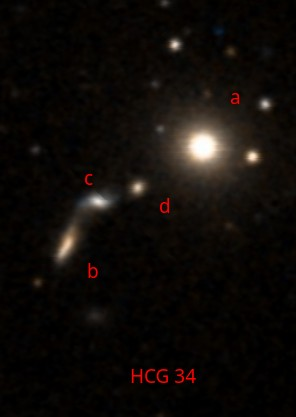

*
DSS2/Color image of HCG 34
*

At 103×, the nebulous glow of **<x-dso>NGC 1875</x-dso> = HCG 34a** is readily detected with averted vision. A confounding asterism lies nearby which should not be confused for the galactic glow.

At 395×, I could still only pick out NGC 1875. Upping the power to 413×, I got multiple flashes of a faint glow while knowing only the rough position of the remaining galaxies. It was in exactly the same location and reproducible. I later confirmed against the image that the object is **<x-dso noindex>HCG 34b</x-dso>**. The seeing was pretty good when I made this observation.

I tried hard to see any of the remaining two members. Of <x-dso noindex>HCG 34c</x-dso>, the more tractable-looking of the two, I only got flashes too weak and inconclusive to log it.

However, with averted vision, the entire chain of b,c,d compobnents flashed in tantalizingly, as a long streak of light emanating from NGC 1875.

---

**
<x-dso simbad="PN Ba 1">Baade 1</x-dso>
**

At 148× with an [OIII] filter, a circular disk-shaped glow was held ion view continuously with averted vision. It was not terribly difficult. I estimated the diameter to be about 1.25' (actual dia closer to 45"). The nebula was still weakly visible unfiltered, and there was no sign of the central star.

Using various higher magnifications (207×–413×), I got weak glimpses of the ring structure, i.e. a brighter rim. The rim appeared to be brighter in the north/north-west sector. I am not very sure of this observation as the glimpses were too weak despite trying for a while.

---

**
<x-dso>NGC 1501</x-dso>
**

I had another go at NGC 1501 since I was interrupted by clouds on night 1.

At 345× with a UHC filter, I saw a bright circular disk with a slightly brighter rim. Removing the filter, the rim was better differentiated. The northeastern portion of the rim appeared brighter. The central star was bright and continously visible to averted vision. Upping the power to 413× confirmed the brightening of the northeastern portion of the rim.

The planetary nebula appeared beautiful!

---

**
<x-dso>NGC 1664</x-dso>
**

Part of the [Herschel 400](https://en.wikipedia.org/wiki/Herschel_400_Catalogue) and [DeepMap 600](http://www.raycash.org/dmcon.htm) lists.

At 103× this open cluster showed a distinctly higher desnity than the surrounding milky way star field in Auriga. A chain of stars started out at the south and headed towards northwest to connect with a vaguely oval shaped chain of stars reminiscent of the Pisces circlet although the resemblance is very crude. The oval shape was elongated NE-SW. A fainter chain of a few stars continued to the NNW on the opposite side of the oval. A bright star was seen SE of the cluster.
The cluster spanned about 14' in diameter.

---

**
<x-dso>NGC 1857</x-dso>
**

At 103×, many stars medium to dim in brightness were seen around a bright orange star. An equally bright blueish star lay northwest. The cluster was rich with the highest density lying to the southwest of the orange star.

---

**
<x-dso simbad="Cl Tombaugh 1">Tombaugh 1</x-dso>
**

Found in [Off the Beaten Path with Gottlieb](offpath.htm).

At 103×, two bright stars almost pointed to a cluster of mostly faint stars with a smattering of a few moderately bright stars. Pretty rich cluster with a nice appearance. The diameter of the cluster was perhaps around 3'.

---

**
<x-dso simbad="Cl Tombaugh 2">Tombaugh 2</x-dso>
**

Found in [Off the Beaten Path with Gottlieb](offpath.htm).

Wow, this is a really cool open cluster! Tightly packed and rich in stars, it sported a granular nebulous appearance even at 395×. Lower power however presented the more aesthetically pleasing view. A bright star lay to the north. The glow apepared slightly elongated E-W and about 2.5' in size.

---

**
<x-dso>NGC 2685</x-dso> = Helix Galaxy
**

At 207×, an edge on galaxy with a much brighter middle, perhaps nucleated. I could not confirm the helix structure although I got vague, repeated hints of something going WNW from the central region of the galaxy.

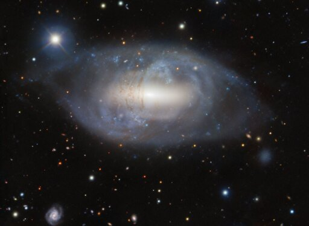

*
Image of NGC 2685 from <a href="https://noirlab.edu/public/images/iotw2415a/">NOIRLab</a>
*

---

## Epilog

With this ended my second observing night. I was too tired to continue although there was perhaps an hour left before the zodiacal light started brightening. I tore down the telescope part way and went to bed. My sleep was interrupted by a raven trying to walk on my truck and then by a vehicle that pulled into the same parking spot to troubleshoot some mechanical issue. I still managed to get enough rest to drive home.

I was surprised to see Monitor Pass (CA-89) open this late in the season. Wanting to take in the views of snow dusted peaks bathed in evening twilight, I planned my day to end up at this beautiful vista point right after sunset. The belt of Venus over the vast meadows with towering snow-dusted peaks made for a very memorable terrestrial sight. There were few deer on CA-88 and my drive home was pleasant except for the confusion at the I-580/I-680 interchange where ramps are closed for road work.

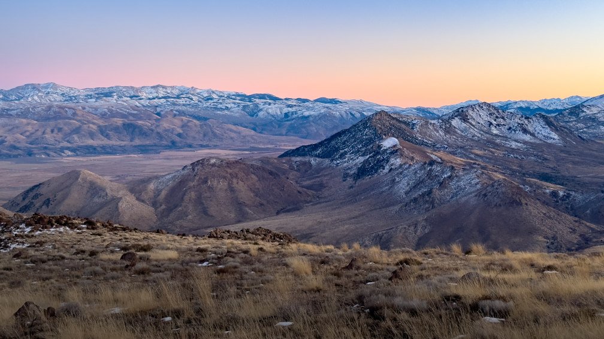

