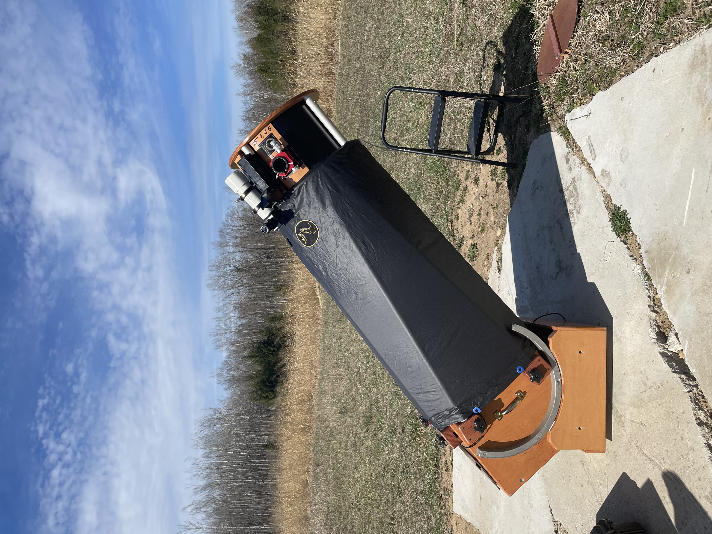

Saturday was a long day. After a morning work event an hour south of home, I picked up the truck and hit the road, in pursuit of clear and dark skies in Northern Michigan.

The weather looked great all week. Clear skies were predicted with good transparency and decent seeing. You can't really ask for more in a wet climate. Speaking of precipitation, the previous weeks had not been kind to the forested land I frequent. A massive ice storm damaged or destroyed countless trees across the area. The roads were blocked, and power was down for days. Thankfully, my family members had a generator.

Some relatives had already gotten to work clearing the field, but my grandfather and I spent some time clearing the back trails to get my truck back into the woods. Those weak yet fast\-growing populus trees are going to be a clean\-up pain for years to come. Thankfully, the evergreens held up much better. 

Some popule leaning over near my observing pad. They will need to come down soon.

Anyways, it was finally time to get observing. I didn't have a massive list of objects prepared, but this was a strategic decision. It's been a while since I dedicated much of a night to an observing project, and tonight I wanted to go far. 

<x-dso>APM 08279+5255</x-dso> is a lensed quasar in Lynx. It was discovered during spectroscopic observations with the 2\.5 m Isaac Newton Telescope in La Palma. A whopping 12 billion light years away, this insanely distant object has high\-speed winds that are blowing gas away from the supermassive black hole at 40% the speed of light! 

To get started, I used a chart from the great website [Deep Sky Corner.](https://www.deepskycorner.ch/obj/apm_08279+5255.en.php#ref145 "External link") It did a fantastic job of guiding me to the target. Getting there was only half the battle through. As Lynx descended from the Zenith, I was in a race against time. The lower it got, the poorer my seeing conditions would become. Thankfully, I found the field fairly quickly. You can see my route using the map (once again, sourced from Deep Sky Corner) below.

I narrowed in on the four stars that are circled. These faint stars ranged from 15\.5 magnitude to 17\.5\. Essentially, I was looking for a needle inside a haystack that I could only see with averted vision. Persistence paid off, though. After deep concentration, 330x and several moments of steady air, I was able to confirm a tiny stellar point in exactly the correct spot. It brought a chill up my spine. Here was a faint redshifted glow 2\.5 times older than our solar system. I was glimpsing a snapshot from the early days of our universe, an impossible distance to comprehend. Beautiful. I gave my telescope a little pat. This (relatively) small instrument was glimpsing targets meant for the Chandra X\-ray Observatory.

This whole process took around 2 hours. I started this hunt at 12:00, and I was finally done at 2:00\. During this pursuit, I confirmed my faintest stellar object to date. A 17\.5 magnitude field star southeast of the quasar. This insanely faint star was only glimpsed 2\-3 times, but it was instrumental in securing the quasar. It reaffirmed the correct position to my sceptical (yet hopeful) mind.  

After this exciting yet tiring endeavor, I abandoned the Hickson groups that I had prepared as a backup project. My mental tank was out of gas around 2:30, so I spent a good 30 minutes staring up at the rising Milky Way. With good transparency and fully dark\-adapted eyes, it was a spectacular sight

While my observing list ended up being quite short, I did look at some other cool stuff. While I was still trying to 100% confirm the quasar, I peeled off to look at nearby <x-dso>Markarian 90</x-dso>, a little 13th\-magnitude galaxy.  It was a circular glow with a brighter core region. It looked like a Messier showpiece in comparison to the tiny stellar points I was concentrating so hard to glimpse. 

Speaking of Messier showpieces, I warmed up for the night by spending a good 30 minutes on <x-dso>M51</x-dso>\. I could look at it all night. Those beautiful arms full of mottling and H\-II regions never get old. The arm that links to the companion NGC galaxy was noticeably brighter than I remembered. The bridge had an almost 3D look. Like someone outlined the edges with a white highlighter. It looked bold and concentrated compared to the other arms.

Another good galaxy was <x-dso>NGC 2357</x-dso>\. It'd been on my list for a long time, but I finally got it as true darkness set in. Appearing as a faint edge on, direct vision revealed a thin smudge of light slightly bringer in the middle. Averted vision and 250\-330x was best to reveal the outer regions. 

Saturday night was the type of session that kept me obsessed with this pastime. Great observing conditions combined with that late\-night thrill of identifying something that human eyes were never meant to see. My 15" might not be one of those massive 7 feet tall dobs, but it's now glimpsed three lensed quasars and two protoplanetary disks, feats I never imagined when I purchased it. 

{:.medium}

Hopefully, this post serves as motivation to go out there and redline your instrument and skills. It's exhausting, but well worth it...

  

