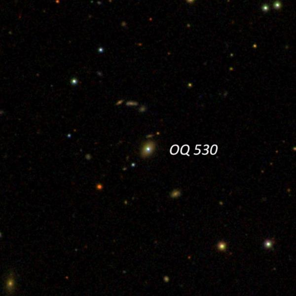
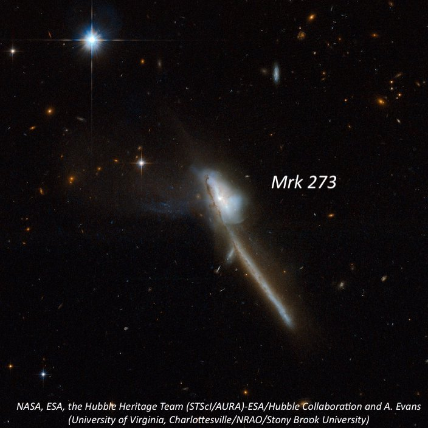
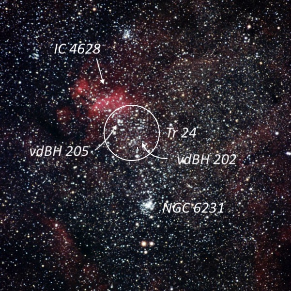
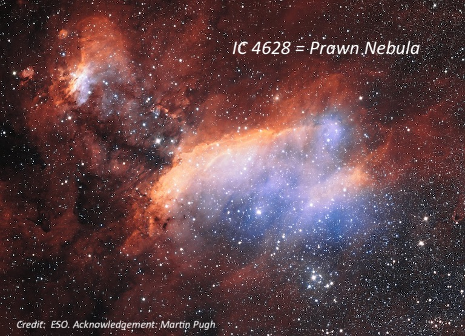

On Saturday night, June 12th, I headed south to Willow Springs (Kevin Ritschel's Deep Sky Ranch) immediately after the end of my last full school year teaching at Albany High School!!  
  
The observing conditions were easily the best we've had in central California in awhile \-\- warm, dry, good seeing and SQM readings around 21\.7\.  In attendance were Mark Wagner, Richard Navarette, Rashad Al\-Mansour and myself.  Between the five of us, our scopes included four 18\-inch dobs, a 130mm APO, and Dobzilla, the 33\.4\-inch resident of the ranch.  I logged a total of 27 objects including the following lesser known ones:  

  
**Name:** <x-dso>OQ 530</x-dso>

**Alias:** PG 1418\+546 

**RA:** 14 19 46\.6

**Dec:** \+54 23 15  
  

OQ 530 (yes, that's the main catalogue designation) is an optically variable blazar in Bootes. The letter O refer to a [radio source survey conducted at Ohio State](https://articles.adsabs.harvard.edu/pdf/1971AJ.....76..777B)  and "Q" refers to the right ascension band of 14 hrs.  In 1978, H. Richard Miller of George State University discovered the radio source was a [violently variable BL Lacertae Object](https://adsabs.harvard.edu/pdf/1978ApJ...223L..67M).  This distant galaxy (1\.9 billion light years) hosts an actively feeding black hole at its heart with a jet pointed right in our direction! Long\-term optical observations from 1979 to 1989 found V magnitudes ranging from 14\.8 to 16\.2\. Short\-term optical variations of 0\.12 magnitude per hour have been recorded.

  
At 175x, I identified it as a dim "star" but it was better seen at 300x as a faint mag 15\.5 “star” (my rough estimate) that was visible without much effort. You won't find this object listed in any of the standard galaxy catalogue.

  

  
  
  

**Name**: <x-dso>Mrk 273</x-dso>

**Alias**: UGC 8696

**RA**: 13 44 42\.2

**Dec**: \+55 53 13

**Size**: 1\.1’ × 0\.3'

**Mag**: 14\.6V

  

Markarian (Mrk) 273 is an active Seyfert galaxy that contains two nuclei with a single, spectacular tidal tail and a 'ring' of star formation. Much of the activity in the system is associated with the northern nucleus, where there is a considerable amount of young star formation. Edwin Hubble first photographed Mrk 273 on a plate taken between 1914\-1916 with the 24\-inch Yerkes reflector while working on his 1917 PhD thesis "Photographic Investigations of Faint Nebulae"  
  
I easily picked up Mrk 273 at 175x. At 260x it appeared faint, small, elongated 5:2 N\-S, 0\.6 × 0\.25'. A mag 12 star lies 1\.5' N of center. A mag 6\.5 star located 4\.3' made viewing difficult unless it was placed outside the field. The galaxies forms a pair with MCG \+09\-23\-002 just 3\.3' SW.

  

  

  
  
  

I spent some time on the NGC 6231 area, sometimes referred to as the naked\-eye "False Comet", located between Zeta and Mu Sco, in the southern section of Scorpius. Cr 316 refers to the entire, large scattered field of stars (105') immediately north of NGC 6231 and includes Tr 24 (60') and the emission nebula IC 4628 within the NE quadrant. Several small groups of stars within have separate catalogue designations including vdBH 205, vdBH 211, <x-dso>ESO 332-8</x-dso>, <x-dso>ESO 332-11</x-dso>.  Viewing with the naked\-eye, this cluster contains the tail of the "False Comet", which comprises a stream of mag 7 to 9 stars that flow north directly from NGC 6231 for one degree.

  
**Name**: <x-dso simbad="Cl Trumpler 24">Tr 24</x-dso>

**Alias**: Harvard 12

**RA**: 16 57 00

**Dec**: \-40 40

**Size**: 60'

  

At 108x, Tr 24 is a bright, very large scattered group that overfills the 56' field. A number of the stars appeared to be grouped into long chains with smaller knots and concentrations including <x-dso simbad="Cl VDBH 202">vdBH 202</x-dso> and vdBH 205\. On the northern side is IC 4628, a very large, irregular HII nebula that shows up best with a UHC filter. On the south edge of IC 4628 is mag 7\.2 HD 152723 and 5' SW is a distinctive 8' string oriented NW\-SE. About 20' S of the mag 7\.2 star is a mag 6\.2 star (V861 Sco) and to the NW is another 20' string extending WNW. To the south of this string is another 20' string oriented NW\-SE that includes vdBH 202\.

  

  

  
  

  

**Name**: <x-dso simbad="Cl VDBH 202">vdBH 202</x-dso>

**RA**: 16 55 08

**Dec**: \-40 56 48

**Size**: 3'

  

<x-dso simbad="Cl VDBH 202">vdBH 202</x-dso> is located in a beautifully rich region on the SW side of Tr 24\. This small cluster is situated just south of a long, 20' string of brighter stars oriented NW\-SE. Within this string is a 15" pair of mag 10 stars and just south of a mag 9 situated 2' NW of the double is Ru 122 \= vdB\-Ha 202, a faint, very rich dusting of stars that is elongated \~N\-S. The cluster is dense, just 2' in length and only partially resolved. A group of faint stars spread out E\-W off the south end.

  

**Name**: <x-dso simbad="Cl VDBH 205">vdBH 205</x-dso>

**RA**: 16 56 11

**Dec**: \-40 40 06

**Size**: 4'

  
vdBH 205 consists of 20 stars mag 7\.5 to 13\.5 in a distinctive 4' group. The brightest star is on the NW side. The center and south side of the group is devoid of stars. This group is 10' NNW of the mag 6\.1\-6\.4 variable star V861 Sco. A smaller clump of stars 7' S of vdBH 205 is catalogued as ESO 332\-011\. Another string of stars 7' NE is listed as ESO 332\-013\.  
  
**Name**: <x-dso>IC 4628</x-dso>

**Alias**: Prawn Nebula

**RA**: 16 57 00

**Dec**: \-40 20

**Size**: 90’ × 60'

  

IC 4628 is a large, HII region embedded on the northern half of Tr 24 and sometimes called the "Prawn Nebula". Using 108x with an UHC filter, IC 4628 stood out as a very large, fairly bright glow within Tr 24\. The main body was elongated E\-W, roughly 30' × 12' with mag 7\.2 HD 152723 just off the south side. A number of mag 8\-10 stars are embedded along the SW and W end of the nebulosity. The northern side has a fairly well\-defined edge and a number of mag 8\-10 stars are embedded along the SW and W end of the nebulosity. A fainter extension begins on the E end and extends NE for \~15', ending in a brighter HII patch (G345\.31\+01\.47\) peppered with several stars and involving the infrared cluster \[DBS2003] 114\.

  

