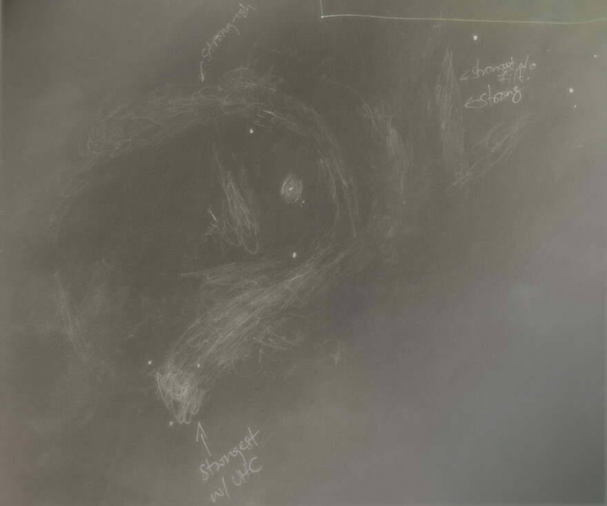

The eastern Sierra may just be my favorite region of California.
The eastern slopes of the Sierra Nevada mountains fall off rather sharply into  Owens Valley, and then again the topography rises into the towering White Mountains (14000 feet) and the less high (11000 feet) Inyo Mountains.
On the south-east side of the Inyo Mountains lies an undulating terrain called the Talc City Hills. Here is a map to locate the general region:

For astronomy, this region has several benefits.
The nearby towns of Lone Pine and Big Pine provide useful services for campers and tourists.
Highway US-395 through Owens Valley is very pleasant  to drive on and  a beautiful route. Campgrounds and public land (BLM / Forest Service) abound.
The remote mountains and valleys 
are reasonably far from major sources of light pollution, provide high-altitude observing sites to get above the desert dust, pleasant temperatures in the winter and fall, low humidity and 
decent cellular network connectivity. This is my chosen region for Bortle 2 skies in the fall and winter, when the more northern options can get very cold. It is about a 6.5--7 hour drive from my home.

My adventure of five nights begins at Talc City Hills on Friday evening, when I arrived just around sunset.
I split my drive into two days, starting Thursday night, so I could get enough time for work on Friday.
On Thursday evening, I saw a notice that the main roads into the area from the south, CA-14 as well as US-395, were closed due to heavy flash flooding from a storm system that had passed through earlier that day. Thankfully, the roads were rapidly restored and I had no trouble getting there on Friday.
The observing site I frequent in Talc City Hills seems to be a moderately popular camping spot; it lies on public BLM land, has decent horizons, steady seeing, and a good altitude of about 5800 feet. Unfortunately, the city of Ridgecrest and the associated area has grown rapidly and is a major source of light pollution today. I would rate the skies as Bortle 2 on a good night. Dispersed camping has become very popular of late, given the popularity and affordability of overlanding setups and plenty of material on the internet to guide people as well as apps like On X or iOverlander; so I wasn't certain if I'd snag the spot on a Friday evening, but I did!

It took me a while to set up my 28-inch f/4.1 telescope, as it always does. By the time I set up the scope, got dressed for the cold of the night, and ate my supper, it was 9 PM.

The skies were clear on Friday  night as forecast, but oddly for the arid desert, there was plenty of dew! Perhaps this was from the moisture laden clouds left behind by the storm that dissipated by nightfall. By the end of the night, my light shroud was so wet that I likened it to an oasis in the desert!

When I started "serious work" at 9PM PDT, there was already some dew on surfaces! I started on a planetary nebula <x-dso>NGC 6886</x-dso>.

### Nebulae in the king

I then pointed to <x-dso>NGC 7129</x-dso> in Cepheus, which I had not hit up in all these years of observing.
I made the following sketch

In addition to the main portion of the reflection nebula I picked up on a dim filament of nebulosity north and east of the main portion. I think this is because the eye + brain system is more sensitive to contrasty edges, and there is a faint filament of nebulosity seen in images yonder but what makes it stand out is the dark nebula intervening between this filament and the main reflection nebula.

Staying in Cepheus, and inspired by [Mel Bartels' report](https://www.cloudynights.com/topic/976477-cta1-supernova-remnant-a-drawing-through-my-16-inch-f29-scope/) and Howard Banich's follow-up (on a private forum), I decided to give the supernova remnant <x-dso>CTA 1</x-dso> a try. I had no finder chart or image of the nebulosity, knowing only that it was around the Bow-Tie nebula <x-dso>NGC 40</x-dso>. Pointing my scope to NGC 40 first without a filter, I noticed some sprawling diffuse nebulosity in the region. To confirm that the sensations were repeatable and also nail down their positions and flow took me about an hour and a half of work. During the course, I also popped in a nebula filter. The Lumicon UHC filter I used drastically enhanced the visibility of some filaments, which are the supernova remnant. There is also a [lot of dust](https://app.astrobin.com/i/p35l92) in the area, and it is possible that I also caught onto some of that because there was a portion (that I have marked) which seemed to not be enhanced by the UHC filter. Getting the orientations and scales down in my sketch was a problem, so I'm not sure how to match my sketch but the region that did not respond as strongly to the filter was around 00h 09.1m 72° 46'.

I'm sorry that the photograph of the sketch didn't turn out as good, it looks better in my logbook as always :)
### Deep South

I stayed on the southern meridian for a while as is typical of my workflow in the fall, to harvest some of the delicious galaxies over there. I probably had observed the <x-dso>Grus Quartet</x-dso> as a teenager, but had no logs of it. <x-dso>NGC 7582</x-dso>, <x-dso>NGC 7599</x-dso> and <x-dso>NGC 7590</x-dso> were all seen in the same ~43' FOV of my widest eyepiece, a 21mm Ethos. <x-dso>NGC 7552</x-dso> was not far away.

Then came galaxy chain <x-dso>VV 167</x-dso> also known as Arp 325, which I have observed several times earlier in several instruments but wanted to re-observe in the 28-inch to see if I could do better. I was only able to pick out two of the cores out of five.

As Fomalhaut was transiting the southern meridian, I remembered <x-dso>NGC 7293</x-dso> the Helix Nebula, which lies not far. Having never seen it through the 28", I decided to take a look. Wow! What a fantastic view!! There was so much subtle structure in the bright and huge planetary nebula! I felt compelled to spend some time sketching it and here is my result:

I feel like I did a shoddy job and the sketch really doesn't do justice to the view.

Just as I finished the sketch, I noticed a subtle arc of nebulosity beyond the "usual" picture of the Helix. I marked in my notes "Is there a subtle bowshock-shaped outer halo, especially strong to the northeast?". It isn't apparently a bow shock, but indeed there is a northeastern arc! The arc is seen [in the famous Hubble image](https://upload.wikimedia.org/wikipedia/commons/b/b1/NGC7293_%282004%29.jpg), I just hadn't noted it before. I'd spent enough time sketching, so I didn't add the arc to my sketch instead making only a rough illustration of it elsewhere.

The maximum aperture I'd observed the <x-dso>Cartwheel Galaxy</x-dso> with was a 25-inch. This was over a decade ago from central Texas, and I've posted about that on [the DeepSkyForum here](https://www.deepskyforum.com/showthread.php?1624-Object-of-the-Week-September-11-2022-Cartwheel-Galaxy-et-al). My experience with the 28-inch was in fact not as good as the 25-inch observation, perhaps because of being 6° higher up north, having worse conditions, and also aging. Yet, it was a pleasure to perceive the ring with my own telescope! I was able to see the brightest part of the ring, which goes south from a superposed star, about a third of the time with averted vision. I got occasional glimpses of the entire ring. But the most exciting part was when the whole ring was viewed, to my utter surprise, it was heavily mottled -- bejeweled with starburst; only these brighter knots flashed into view. After I wrote my notes, I went back to the eyepiece for a few more satisfying flashes. With that, I decided to get out of the deep south.

Conditions had tanked a bit, and the dew was getting heavier. I moved higher up into Pisces

### More galaxies and groups

<x-dso>NGC 520</x-dso>, also known as Arp 157 and VV 231 is a galactic interaction with tidal tails. The tidal tail is so bright that I could see it in my 18-inch without a lot of difficulty. The 28-inch view was, of course, fantastic. The tidal tail still appeared similar as it did in my 18-inch, but in addition, I was able to pick out another tidal extension going northwest, and also the inner structure of the galaxy like the dark dust lane was spectacular. I felt compelled to make a sketch!

<x-dso>NGC 1084</x-dso> in Eridanus presented an incredible view, bursting with knots! Even though it is an unbarred spiral galaxy, at low power it for some reason resembled a barred spiral. The western rim appeared prominent and knotty. The brightness of the galaxy was shifted to the south and west in its halo. I wrote that it was "mostly just a mess of knots" despite my best efforts to trace any spiral arms properly. I should revisit it again when my telescope tracks so I can enjoy the knots!

<x-dso>NGC 1052</x-dso> and its neighborhood belong to the same galaxy group as NGC 1084. Four galaxies -- <x-dso>NGC 1052</x-dso>, <x-dso>NGC 1042</x-dso>, <x-dso>NGC 1047</x-dso>, and <x-dso>NGC 1035</x-dso> -- barely fit into the FOV of the 21mm Ethos eyepiece. Also in the same neighborhood, <x-dso>NGC 1048</x-dso> and <x-dso>NGC 1048A</x-dso> form a line with a star. <x-dso>NGC 1042</x-dso> showed weak hints of spiral structure, I suspected it might be barred whereas it seems to be intermediate. The northern rim appeared notably brighter. The almost edge-on galaxy NGC 1035 appeared weakly mottled and I noted a star on the south east end and a brighter patch northwest of the core. <x-dso>PGC 1002216</x-dso> flashed in many times after knowing where to look. It was dim.

At this point, it was 4:30 AM, way past my planned bedtime of 4AM, and I wasn't even done observing!

### Dessert

After the heavy main course of dim galaxies, I pointed to Orion Nebula, which I had never seen in my 28-inch or for that matter in Jimi's 48-inch when it was high up in the sky. Holy smokes! It was incredible! There was so much detail and it was so bright! I immediately understood why Howard Banich was so drawn to sketching and writing entire articles on single objects through his 28-inch: there is just so much structure! Certainly I could spend several nights just looking at the detail in the Orion Nebula.

Similar was my experience with the Flame Nebula, <x-dso>NGC 2024</x-dso>. Looking at it in my 28-inch, I would certainly not agree that it was "so last year"! There was so much structure in the dark rifts. The Horsehead Nebula was still subtle, but showed much more detail than in my 18-inch.

On that happy note, I covered the mirrors, put the caps on the eyepieces, locked my scope in altitude (with a ratchet strap and carabiner!), put on its dust cover, put away my laptop and observing logbook, reparked the truck so I could see the telescope in case it got too windy, and tucked myself into a sleeping bag. Without the distraction of the internet, it was easy to drift into sleep.

It looks like the sky was overall dark, but transparency wasn't exceptional. At about 4AM, I could see a sizable elongated Gegenschein and a Zodiacal Band segment making a nice V-shape with the milky way. Yet, after the Cartwheel observation or so, the sky background in the eyepiece appeared bright and galaxies weren't very contrasty. It dewed all through the night, and my Telrad was fogged up by the morning, but the mirrors remained untouched.

Click [here for Part 2](/OR__202509_EasternSierra_Part2.html)