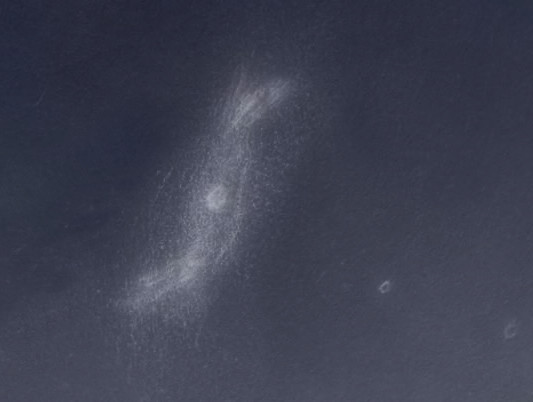

This is a continuation from [Part 1](OR__202509_EasternSierra_Part1.html), reporting on five nights in the Eastern Sierra region of California. For more on the region and such, see Part 1.

I woke up fairly early next day, not getting enough sleep for some reason. I tried to just relax for a while and fall back into sleep and succeded partially. Anyway, I did feel sufficiently rested to start my day.

Camping always comes with chores, like organizing stuff in the small space one has, cooking and cleaning, and also taking care of yourself. It was warm, but breezy enough to not feel the heat as much. I made myself coffee and rehydrated some dehydrated soup. To spend the time during the day, I worked on planning and making measurements for some telescope / camping setup improvement projects. There was enough to do. I also worked a bit on pruning my observing list. I also tried iPhone's satellite messaging feature to contact my family and friends -- it works but it's nowhere as reliable as my Garmin InReach in keeping connected to the satellites. Somehow just the project planning and chores made the few hours of daylight feel short and the light was starting to fade before I knew it.

I was excited to start my observing early, with no set up work whatsoever! I pulled the covers on the telescope and started collimating it. In the excitement of collimation, I decided to try improve the secondary mirror angle. Oops I messed it up badly! I vaguely recall tinkering with it in the first place because I noticed some minor issue. Yes, my secondary mirror wasn't exactly positioned correctly, but I just made it worse without having the right tools to fix it.

The sight tube I purchased from Agena Astro was too long, and my janky home-made collimation cap to which I had taped in a 1.25-inch T-ring adapter to act as a sight tube was inadequate. The positioning of the secondary mirror can impact how much of the telescope primary mirror's aperture is actually used, and a regular laser collimator will not help with this step. Looking at the defocused star image, and also sending my mobile phone flashlight through the peephole in my collimation cap, it was clear I was maybe getting about 25 inches of aperture and not more. I was disappointed, but I told myself I'd spend time and fix this somehow with some thinking.

Normally this operation has to be done in twilight, when you can see all the reflections properly, and it had already gotten too dark to fix this. I used my cellphone flashlight to illuminate the secondary mirror from below so I could see its outline. Eventually I realized that I could put my Glatter parallizer (1.25" to 2" adapter) on the inside end of the focuser drawtube and the janky collimation cap on the front end and make an "adjustable length" sight tube, by moving the adapter in and out! What a find. With this, I quickly managed to adjust the secondary mirror's position. Not only was the angle off, somehow the axial distance was also incorrect, and this helped me tune it. It usually takes two people to tighten the mirror in place, one person looking through the peephole and holding the mirror in place, while the other operates the wrench on the lock nut. I somehow managed to do it by myself. It wasn't perfect, but I had gotten to where I was at most losing half an inch of aperture! That was good enough for me to proceed with observing. The ultimate test for me was to see if the (substantially) defocused star image appeared circular, indicating that all of the mirror was being seen, and it was finally close enough. I started observing at about 21:20 PDT, which meant I'd lost perhaps an hour and a half of observing time to this problem.

To relax from all the tension around the secondary mirror, I pointed to the bright globular cluster M 30. It sports two chains of stars that look like legs, which gives it a nickname "walking globular cluster" amongst some of my friends. Then I looked briefly at Saturn with the edge-on rings and moons, and then went to M 22, the big globular cluster in Sagittarius. With that I was ready to start digging into the deep sky.

## Galaxies Galore

I started on <x-dso>NGC 6962</x-dso>, the anchor of a galaxy grouping in Aquarius. NGC 6962 is a spiral with faint arms, but a bright core. I had no trouble seeing the core -- which was visible continuously to direct vision. I was also pleased to see an extended diffuse halo, the galaxy's disk, and it appeared brighter on the east northeast. No spiral arms, though! I picked up eight other galaxies in the region -- <x-dso>NGC 6964</x-dso>, <x-dso>NGC 6961</x-dso>, <x-dso>NGC 6959</x-dso>, <x-dso>NGC 6966</x-dso>, <x-dso>NGC 6967</x-dso>, <x-dso>IC 5058</x-dso>, <x-dso>PGC 65356</x-dso> and <x-dso>PGC 162626</x-dso>. Even the dim PGC galaxies were visible almost continuously to averted vision.

<x-dso>II Zw 92</x-dso> was next, also known as SPRC 69. SPRC stands for the Sloan Polar Ring Catalog, a catalog of confirmed, candidate and similar-to polar ring galaxies. I had not expected my 28-inch to reveal the faint polar jet-like structures from it, which I believe is the polar ring viewed edge-on. I got several flashes of the ring at 583×, and the north-northeast filament was easier to see than the other side.

<x-dso>II Zw 96</x-dso> came to be on my list from Steve Gottlieb's article on objects in Delphinus, published in the September 2025 issue of Sky & Telescope magazine. I thought it was a pretty neat merger, and gave it a look at 583x. It appeared to have a V-shape with a knot hanging off one of the arms of the V.

## Lacerta

Tired of chasing galaxies and not knowing what to observe for a bit, I actually hit some open clusters in Lacerta. <x-dso>IC 1434</x-dso>, <x-dso>NGC 7245</x-dso> and <x-dso>IC 1442</x-dso>, the three I observed, weren't particularly exciting.

I moved on to the planetary nebula <x-dso simbad="PN A66 79">Abell PN 79</x-dso> which looks awesome in photographs. I like to liken it to a fish. I've seen it before with my 18-inch, but I really wanted to see if the 28-inch would reveal the fishy structure. Nope, I was only able to clearly pick out a curved bright segment, which is one of the outlines of the tail fin of the fish. It was dim even in the 28-inch.

<x-dso>Sh2-132</x-dso>, called the Lion Nebula, was a field star-hop from Abell 79. I picked it out pretty easily as there was a clear glow running through a star-devoid region. That was in fact the most contrasty portion, a wall of nebulosity running roughly east-west and lying south of a keystone-like asterism. There was patchy nebulosity scattered around mixed in with starglow to the northeast of this filament.

<x-dso simbad="PN A66 80">Abell PN 80</x-dso> came next, and I hadn't seen it before. It was dim! I could only confirm the eastern rim of the nebula, and of the western rim I perhaps got 2--3 flashes after knowing where to look.

## Maybe a horse but not a flying one

After this observation, I was going around to my truck to get something, and I heard something rustling in the bushes not too far away.
I freaked out, tried to quickly get my hands on some pepper spray just in case. I threw some light in the general direction, and the outline of a sizable animal with retroreflective eyes staring at me came into view.
My heart racing, I shone a white flashlight at it trying to determine what it was. I've never seen a mountain lion at night, but the size certainly seemed compatible.
Of course I guess a mountain lion would be prowling and not reveal itself this easily, but I was nervous!
The animal showed little fear from my loud noises and walked along its way, getting a bit closer to me in the process, still looking at me. I couldn't quite see anything apart from its eyes with my cellphone flashlight. I should've brought out something brighter, but I was facing the animal and watching it for my own safety.
When it got closer, I realized it was probably a burro. There are invasive wild burros in Death Valley. It could've also been a particularly large bighorn sheep, as it seemed like it had antlers. In any case, it continued moving on, staring at me while I stared at it. I eventually bent down and picked a few rocks and flung them in its general direction and it scurried away. Phew.

I took a moment to calm myself, and tell the rational thinking which was coming back that the animal, whatever it was, was not a threat and it had scurried off although not too far away. I couldn't hear it or see its eyes anymore. I texted my friend over satellite about what had happened and calmed myself down. I sat down at my "desk" (my truck's tailgate), happened to look up and saw a beautiful fireball with a long trail. All was well. The night sky is always a source of security for me.

## A flying horse

Next up was <x-dso simbad="HCG 96">Hickson 96</x-dso> in Pegasus. I've been slowly making progress towards the goal of observing all Hickson groups, a project I started ostensibly in 2013 with my 18-inch. Three of the four components were bright and continuously visible to direct vision. <x-dso omit>PGC 71507</x-dso>, the other component, was intermittently visible to averted vision. <x-dso>PGC 214960</x-dso> nearby was also picked up, and sported a north-south elongated halo.

Staying in Pegasus, <x-dso>NGC 7769</x-dso> and <x-dso>NGC 7771<x-dso> form a nice trio with <x-dso>NGC 7770</x-dso>. All three were fairly bright, with NGc 7771 showing some interesting structure -- it's western extension seemed to curve northward or was in general misaligned with the rest of the body of the galaxy.  I also picked up <x-dso>PGC 72612</x-dso> nearby, which was bright enough to be continuously visible with direct vision. I did not bother with the other two faint field galaxies.

## More Hickson groups

<x-dso simbad="HCG 8">Hickson 8</x-dso> in Andromeda was bright. I immediately picked up on a mottled, even resolved, galactic glow in my wide-field finder eyepiece. Tacking on 291 I was able to pick out the four members, all visible continuously to averted vision simultaneously. I also picked up <x-dso>PGC 1689970</x-dso> nearby.

<x-dso simbad="HCG 9">Hickson 9</x-dso> in Cetus, in contrast was surprisingly dim. <x-dso omit>HCG 9a</x-dso> and <x-dso simbad="HCG 9b" omit>9b</x-dso> were visible continuously to averted vision. The remaining two components were visible only intermittently. <x-dso>IC 1599</x-dso>, an edge-on spiral likely in the foreground, was dim but eye-catching and continuously visible to averted vision.

## Sculptor

I found myself digging down in Sculptor again. <x-dso>NGC 613</x-dso> features on many lists including Herschel 400 and Deep Map 600, but I had never observed it. When I pulled it in, I immediately understood why it was so popular. The view was excellent! I wrote in my notes, "this galaxy ought to be better known"! Maybe it was just not known to me. Sculptor has lots of good galaxies and perhaps NGC 613 is overshadowed by the presence of NGC 253, NGC 55 and NGC 134.

Deep-sky observing is doing the same thing over and over again and expecting different results. Although the <x-dso>Cartwheel Galaxy</x-dso> was a bit past meridian, impressed with the seeing and transparency, I decided to give it a shot again to see if I could eke out something more from it. The persistence paid off, and the view was way better than the previous night! With averted vision, I repeatedly sensed an oval glow which flashed in resolution as a rim and core intermittently. The rim appeared heavily mottled! The brightest part, which was seen more often, was the western edge south of a star superposed on the rim. I wish I could one day drive my telescope to Baja California or south Texas and observe this beauty!

## NGC 147 and NGC 185

These two less well-known satellites of Andromeda Galaxy are found about 7.5° away in Cassiopeia. Of course, I've seen them before, what brought me here are the globular clusters. On the [Extragalactic Globulars](/gcextra.htm) page are listed the brightest globulars in eight galaxies, including <x-dso>NGC 147</x-dso> and <x-dso>NGC 185</x-dso>. Somewhere else I noted a second globular in each galaxy and put it on my observing list.

<x-dso simbad="FJJ NGC 185 V">NGC 185 Hodge V</x-dso> is the brightest of the four clusters. I had struggled to confirm it in my 18-inch, finally getting a convincing observation after a few attempts. In the 28-inch, it was much easier in comparison, of course! I'm not sure why Hodge V is marked as brighter, because <x-dso simbad="FJJ NGC 185 III">Hodge III</x-dso> is the brighter globular both on images and visually. It flashed in intermittently to averted vision rather frequently.

Two globulars in NGC 147, <x-dso simbad="FJJ NGC 147 I">Hodge I</x-dso> and <x-dso simbad="FJJ NGC 147 III">Hodge III</x-dso> were both much more difficult than the globulars in NGC 185. Of Hodge I, I wrote "Holy smokes, this was tough. I'm also too tired to do this kind of observing now. After studying the field with knowledge of the globular's location for a loong time, I got 4--5 convincing flashes. Very difficult even on a 28-inch. Perhaps it would be a lot easier if my scope tracked". But this wasn't the toughest of the lot, that medal goes to Hodge III, which I considered "observed" in my second attempt, conditioned on the globular being substantially brighter than the star flanking it because I could not resolve the two. Looking at the POSS images, this doesn't seem to be the case... so maybe I didn't see the globular. Hand-tracking at 583x was not fun, maybe tracking will help.

At this point, it was 4:30 AM, I was tired. I shut down for the night.

