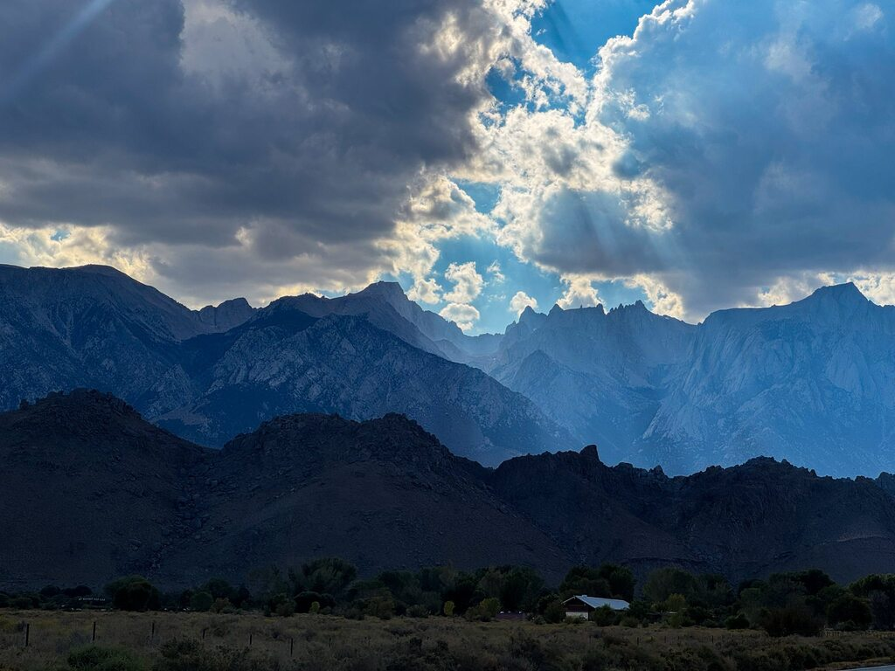
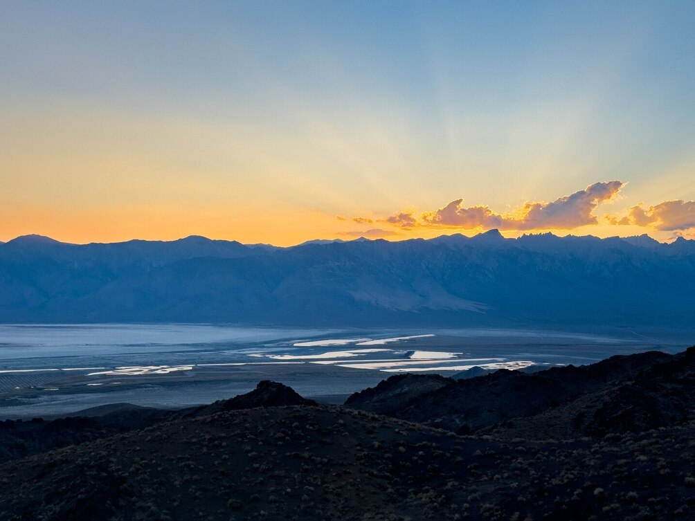
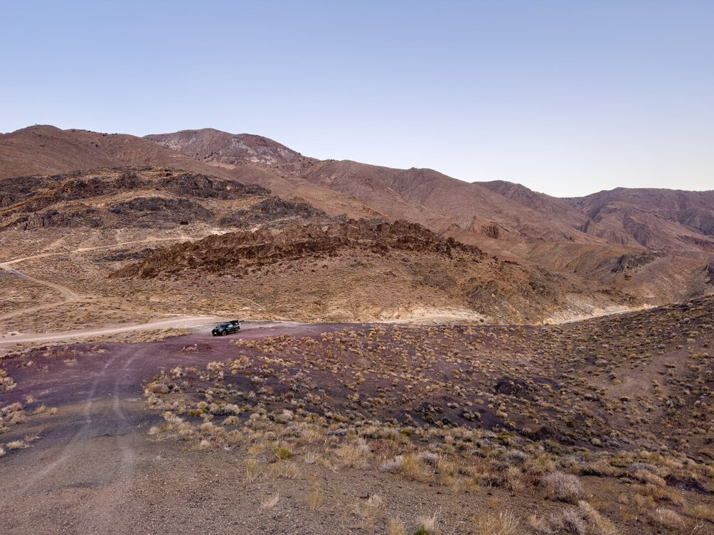
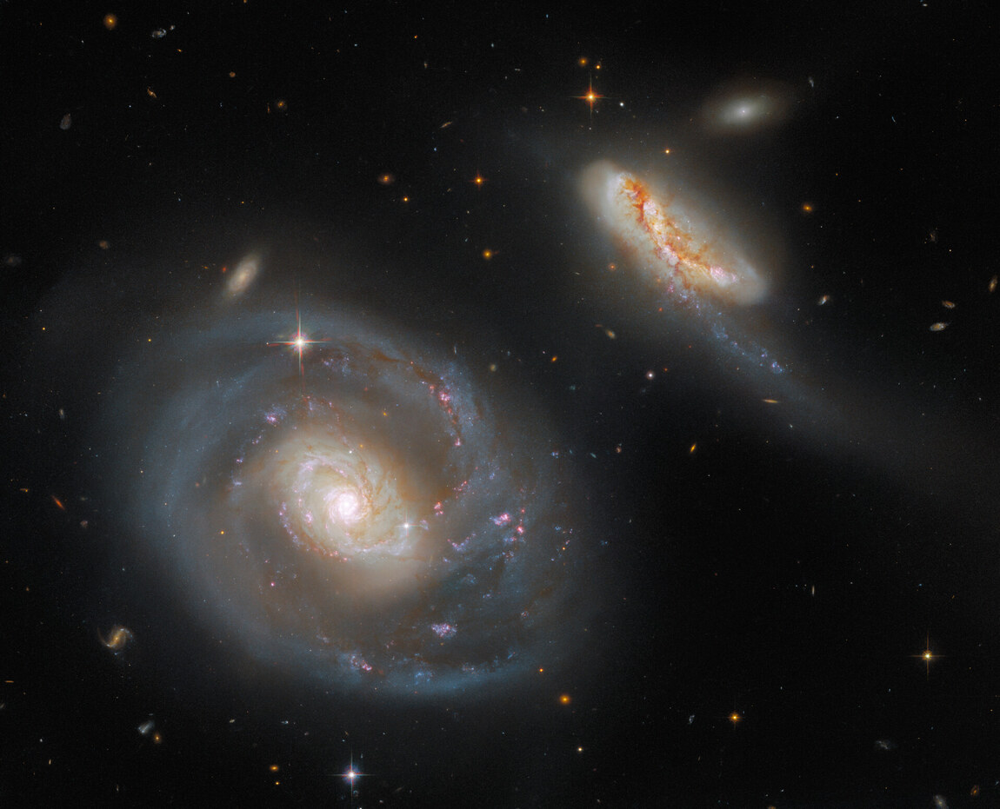
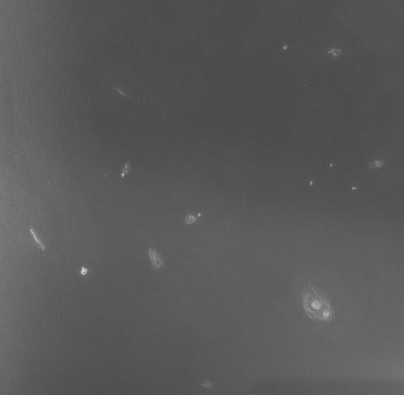

This is a continuation from [Part 1](/OR__202509_EasternSierra_Part1.html) and [Part 2](/OR__202509_EasternSierra_Part2.html).

## Decisions, decisions

My Sunday started with me waking up and satellite-messaging my family saying that I may spend another half night in the Talc City hills and pack up late at night around 2AM and drive off to park somewhere on public land that had cell service so I could work on Monday. I was a 15-minute drive away from cell service. As I started my day, I saw a band of clouds on the southern horizon. It didn't look good. I then recalled that the forecast for Sunday was not particularly good and there  may be clouds in the south, which is why I had considered driving up north to near Monitor Pass for a brief half-night of observing. So at the very least I had to drive 15 minutes each way to cell service to check on the forecast.

I looked at the time, and it was already around 1 PM; I had slept in as much as I could. With sunset at around 7 PM, I had but five hours to figure out, and if needed pack up and leave.
I decided I might as well pack up and head to someplace with cell service that also supported a clear sky. So I spent two arduous hours playing tetris with my 28-inch in what I thought was a big pickup truck when I purchased it (clearly I got it before I saw the telescope). To quote Randy Pufahl when he saw my truck loaded with gear: "Gosh, that's 7 pounds of shit in a 5 pound bag!". This would've been a lot easier had I had a trailer, but then I'd need to deal with finding the space to park it yada yada. The present setup is inefficient but works for me.

## Location, location, location

I got to Lone Pine by about 4:30PM, by when I had refreshed Astrospheric and realized the forecast was crystal clear and the clouds  were slated to vanish after dark. The clouds made for amazing light and shadow on Mt. Whitney and the high Sierra peaks. I was famished, low on water supply, and craving caffeine -- all three were easily fixed in 20 minutes in Lone Pine. The longest wait was to get a nice sandwich at the Lone Star Bistro.

I hadn't figured where I was going to set up for the night yet. I had to have cell service so I could work, and I had to ideally get there before dark so I could find a good spot when there was light.  I reasoned that if I went high up in the Inyo mountains, I would be within line-of-sight of a cell tower: it was only in the canyons that I wouldn't have connectivity. I remembered San Diego visual observer Paul Alsing mention a road that went up into the Inyo mountains to a ghost town called Cerro Gordo, and although the town itself was private property, there was plenty of BLM land around.  I pulled out a Benchmark map of California that shows land ownership, and sure enough, the town was surrounded by BLM land. Phew. I looked up the iOverlander app and someone had  marked a camping spot on there with "passable cellular service". Great, this was a good road to explore.

In the waning daylight, I ascended the washboardy Cerro Gordo road, making sure to drive slowly remembering that I was carrying precious glass.
Not even a mile in, I already found a few viable spots -- there was cell service, and plenty of space in the rocky washes on the side of the road to set up.
Yet, I would really want to get out of a canyon to have nice atmospheric seeing and get to higher altitude. I drove on, and after about 20 minutes of driving all of a sudden the hills around opened up to a vista of Owens Valley and the Eastern Sierra peaks, the cell service returned, and I found out I was at the spot marked on iOverlander. It was an excellent camping and observing site! Plenty of room, very scenic, cell service, and just enough flat space to set up my scope. Soon as I parked, I had a friend hop on a zoom call to ensure that I was able to take a meeting.
I also logged into work and checked my calendar and messages. Once that worked, I was set. I pulled my truck around and backed up to the flat spot and unloaded my telescope.

All of this would not be possible if not for my strong-willed mother, who decided to handle certain things by herself so that I could do my astronomy. The least I could do was call in and check in on her, and doing so also made the mundane task of putting together my telescope much more pleasant. Clouds hovering over Mt Whitney in the evening made for excellent views, but around 20:30 when I had finished setting up, they starting moving closer. They were nowhere in the forecast. I hoped that they'd settle into the valley and leave me alone.

## Warm up

As usual, I start on something light, and this time I chose M 13. Why not check out <x-dso>NGC 6207</x-dso> nearby? For some reason, I was expecting it to be a lot brighter in the 28-inch. Anyway, it was still beautiful.

Next up, <x-dso>VV 750</x-dso> is an interacting pair in Capricornus sporting some nice tidal tails. It comprises of <x-dso omit>PGC 65220</x-dso> and <x-dso omit>PGC 65221</x-dso>. I was easily able to see two cores. Over the course of several minutes of observation, I got several flashes of a tidal tail going west from the southwestern galaxy and curving back towards a star clockwise. The other tail from the northeastern galaxy was marginal, although I did get its general orientation correct. At least one tail was nailed down solid.

Oh no! Just as I finished this observation, the clouds had actually made it atop the Inyo mountains. There would be suckerholes though, and the clouds were only attacking the northern sky. I was seeing a lot of astigmatism in my stars and had to re-settle the mirror in the cell to remove it. By the time I finished this, I was officially in solid suckerhole land.

## Chasing suckerholes

<x-dso>NGC 7025</x-dso> in Pegasus lies in a naked-eye star desert, but I fortuitously found it. At 291×, a bright core harbored a stellar nucleus, both visible continuously to direct vision. Averted vision revealed a dim halo extended slightly around the core, elongated northeast-southwest.

I foolishly attempted extremely dim globular cluster <x-dso>Laevens 3</x-dso>, which I have only seen with Lowrey's 48-inch. Not only did I fail to see it, I got suckerholed before I could give it a solid attempt.

<x-dso>NGC 7115</x-dso> is a nice edge-on, somewhat dim. A star flanked the leading (western) edge of the halo. The lagging (eastern) side of the brighter core seemed brighter than the leading side. The halo seemed weakly mottled. I suspected a knot detached from the core on the eastern side. Then I got suckerholed.

Soon after, the sky got totally skunked. At least I had internet. I vented out my frustration in an astronomy chat group. Who ordered these clouds, they weren't in the forecast.

About 20 minutes later, the clouds rapidly began receding back to where they came from, i.e. west. Looks like the wind direction had changed and some winds were now blowing from the east. I was joyous that my night may be saved, but at the same time really perplexed in the bizarre ways of the wind and clouds.

First the north cleared, so I looked at my list for objects in Cassiopeia and Perseus (this is unfortunately not easy at present with [KStars](https://kstars.kde.org)), found that I could go for <x-dso>NGC 278</x-dso>. It appeared bright with a very bright stellar core. There were numerous arcing structures, probably spiral arms. The galaxy was heavily mottled by numerous knots. The starkest knot I could isolate was suspected at the south-southeast of the core. (I can't corroborate this with an image).

By this time, Pegasus had opened up. <x-dso>NGC 7469</x-dso> and <x-dso>IC 5283</x-dso>, a nice pair there also known as Arp 298, was my next target. NGC 7469's visual halo touched a bright star on the north edge. I could not however see the ring-like spiral arms in it. However, the inner halo disk had that appearance -- I noted "Is the inner halo also ring-like or spiral?". Although overexposed on the DSS2, the inner spiral structure is seen nicely in the HST image:

IC 5283 appeared as a lower surface brightness, elongated glow. It didn't appear straight, but curved clockwise going from west-northwest to east-southeast. The overall appearance was mottled and patchy. I did not pick up on its very dim tidal tail.

## Astigmatism

Rocking the focus back and forth, I kept seeing astigmatism in the image. I was using small exit pupil (1.5mm), so it couldn't be the astigmatism in my vision. Was it something related to the mirror cooling? Or was it the cell? I pointed to Polaris so I could study the star image without tracking. The astigmatism was gone! Just as I started analyzing it further, I got suckerholed! The clouds had to interfere not just with my observing, but also with a star test!

I had a chance to dig further into the astigmatism the following night, and confirmed for my own curiosity -- it wasn't in the mirror or the annealing of the glass, it was in the cell. My running theory is that the felt support pads for the flotation system have lost their low friction over the years and needs to be replaced. Older mirror cells were invariably made with felt furniture pads as support; more recent cells are generally [built with nylon or delrin supports](https://www.loptics.com/articles/mirrorsupport/mirrorsupport.html) to avoid this problem. I would at some point need to replace the felt with delrin or nylon and see what happens.

People are sensitive about optics, cell designs and stuff. I would like to be as scientific in my approach as possible and as emotionless about the nature of these things. I encountered a telescope in an observatory of a similar size to mine with a very astigmatic figure. I'm not sure what the source of astigmatism is, it may well be the mirror mount; but the important thing is that hundreds of people enjoy excellent views through this telescope each year, and to me that makes this telescope much more successful than a hypothetical perfect mirror. I don't want to obsess over the figure of my mirror and cell and lose sight of what I really want to do -- observe the deep sky. Yet, I would like to leverage the best possible performance out of my setup when viewing dim extragalactic features at high power. Resettling the mirror in the cell made my astigmatism almost vanish, and I continued to enjoy observing rather than visual pixel-peeping.

## More galaxies

<x-dso>NGC 7606</x-dso> was fortutiously in my 5mm Pentax XW FOV (7 arcminutes) after I pointed at the region with a Telrad. It was a nice-looking galaxy, pretty bright with an elongated halo with a weak mottled appearance. I saw a couple condensations which looked like knots which I later verified were superposed stars.

Next I brought up <x-dso>NGC 7242</x-dso> which anchors a group of galaxies in Lacerta, featured both on [Autumn Favorites](/autumn.htm) and the week's [DeepSkyForum Object of the Week](https://www.deepskyforum.com/showthread.php?1870-Object-of-the-Week-September-14-2025-USGC-U811).
I was using a 10mm Delos eyepiece which gives a true field of view of about 15 arcminutes.
I wow'd when I counted nine glows within the field of view after centering NGC 7242.
Of the nine glows, one of them turned out to be a star.
The rest were <x-dso>NGC 7242</x-dso>, <x-dso>NGC 7240</x-dso>, <x-dso>IC 5191</x-dso>, <x-dso>IC 5192</x-dso>, <x-dso>IC 5193</x-dso>, <x-dso>IC 5195</x-dso>, <x-dso>IC 1441</x-dso> and <x-dso>PGC 68416</x-dso>.

After studying the DSS2 image and noting the positions of <x-dso>LEDA 3088467</x-dso> and <x-dso>LEDA 3088465</x-dso>, I was able to also pick them out easily. All ten galaxies fit in the FOV of the eyepiece and all of them except PGC 68416 were also visible almost continuously to direct vision or at least near-averted vision. This observation was one of the highlights of my observing run, and I was very impressed seeing so many galaxies in the same FOV.

For what it's worth, I also picked up <x-dso>PGC 68435</x-dso> as a flashing non-descript point, but it seems like it's a double star.

After I finished sketching the field, I spent some time fixated on the field, enjoying the glowing blobs of light scattered in the dark field amidst stars, conetmplating for a moment what I was witnessing.

Somewhere along the night, there was a barn owl screeching in the distance. Owl hoots have become associated with enjoyable nights of astronomy now, and so I have come to love them and other sounds of the night.

I had already observed <x-dso>Arp 256</x-dso> with my 18-inch, but the distorted spiral <x-dso omit>PGC 1221</x-dso> piqued my interest. The logs from my 18-inch observation don't make much sense to me now, but anyway, the 28-inch had no trouble showing the distorted form of the spiral.
The northern tidal arm was visible over half the time with averted vision, showing up in long flashes. Of the southern arm I got very infrequent flashes. The other galaxy <x-dso omit>PGC 1224</x-dso> was seen as a roundish glow. I failed to look for <x-dso omit>PGC 978951</x-dso> nearby.

Next up <x-dso>Arp 19</x-dso> also known as NGC 145 was a fantastic sight! I was able to easily see the bright spiral arm. The galaxy sported a bright-ish mottled halo in which I could see a "7"-shaped structure (the bright portion of the "bar" and a spiral arm) pretty easily. With a little more work I picked up the other curved arm (going south and east) which was diffuse in comparison and less bright. A bright knot was picked up on the southern end of the top stroke of the "7", and this knot wasn't centered. Tacking on higher power (486x), the curved arm now appeared heavily mottled, but the view wasn't crisp enough to nail down the exact positions of the knots. Yet, it was very enjoyable.

The surrounding field is dotted with distant and dim galaxies. Of these, <x-dso>PGC 1962</x-dso> was the easiest, visible continuously to direct vision. <x-dso>PGC 1048844</x-dso> was tough, but I managed to detect it without knowing where to look for it. To identify the remaining glows, I had to study an image and go after them carefully.
The faint chain of three galaxies southeast of Arp 19 were dimly seen with great difficulty, and I struggled to nail down their locations properly. They are in the high 17th or low 18th magnitude range, so they are naturally difficult even in this aperture class. They constitute a weak observation. <x-dso>PGC 1049398</x-dso> was readily seen once I knew where to look.
By this time, it was 2AM, and I had to work the next day. So I wrapped up looking at the double cluster and <x-dso>NGC 891</x-dso> for "dessert" before going to bed. NGC 891 was definitely a beautiful sight! I put the covers on the telescope and locked it in altitude as usual, so that it won't point to the zenith where the wind could knock the mirror box out of place, as has happened to many other telescopes. I was very satisfied with the views of <x-dso>Arp 19</x-dso>, <x-dso>Arp 256</x-dso> and the <x-dso>NGC 7242</x-dso> group and felt fortunate that the clouds left me alone to be able to enjoy these views, something that was not clear would happen earlier in the night.

