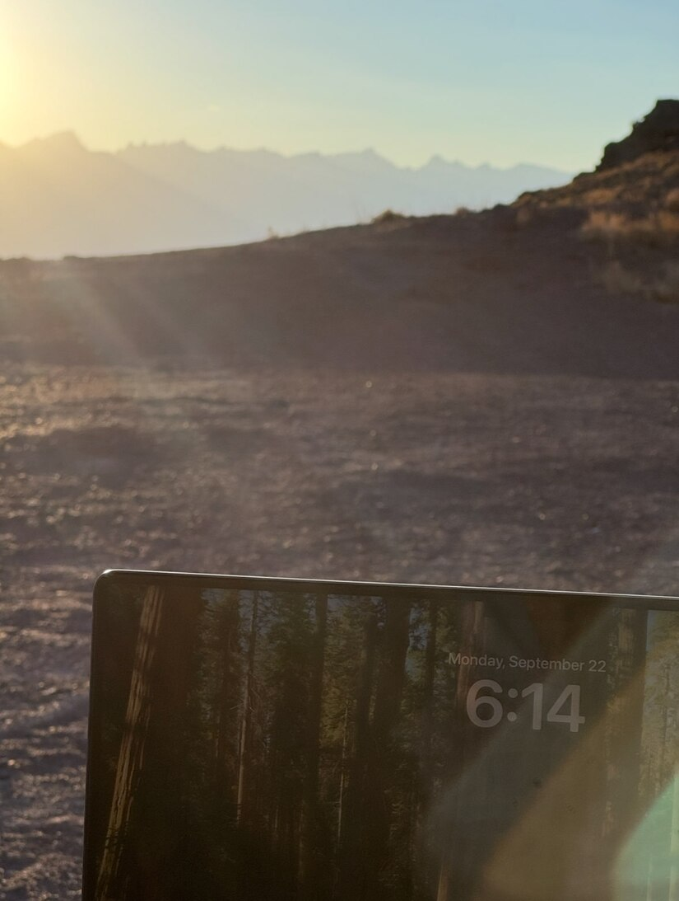
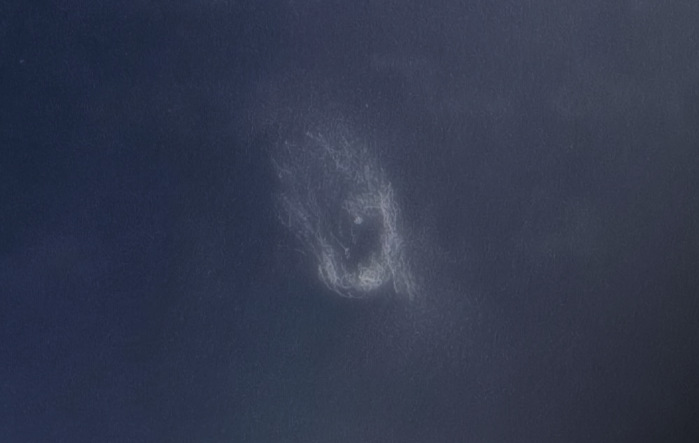

This is a continuation from [part 1](/OR__202509_EasternSierra_Part1.html),  [part 2](/OR__202509_EasternSierra_Part2.html) and [part 3](/OR__202509_EasternSierra_Part3.html).

It was rather warm, and I had to tuck myself under a summer sleeping bag. I had aluminet draped over my truck for shade. I woke up earlier than I had wanted to, at perhaps 9:30 AM rather than 10:30AM which is when I'd set my alarm for. There was a decent amount of traffic on the road, perhaps 10 vehicles drove up during the morning hours and perhaps 4 or 5 drove down in the evening. Some of them looked like contractor trucks working for the ghost town's tourism industry. Some of them looked like off-roaders, perhaps interested in getting to surprise valley. Nobody disturbed me, or even drove by to explore the beautiful vista point "attached" to my campsite.

I had an extremely productive day at work. This is despite the quality of cell service being variable to terrible. With no distractions in this remote place, I was able to focus very well. I had two SIMs, one my actual Verizon connection and the other an eSIM from the travel app Airalo that I used as a hotspot data pack. Both had modest connection, Verizon being the worse of the two. The quality of cell service had degraded during the day, and I had to find a sweet-spot in line of sight of the tower. It turns out that my truck would block the cell signal, whereas I wanted to sit by my truck for shade, so I had to get creative in how I positioned my phone and where I sat. Yet, it was awesome to be working out in the open, with a view of the Sierra Nevada mountains every time I looked up from my laptop screen. The new LiFePO4 battery I had purchased was waaay overkill in capacity for remote work. I had only charged it maybe to 30--40% and it had plenty to drive both my work laptop during day and personal laptop at night without any solar charging. Perhaps if I were using a microwave and a refrigerator I would have run out of power, but there is no room for that in my truck anyway!!

A good amount of coding later, by 6PM, I was starting to re-organize camp and gear up for the night. Around 7PM, I walked up to the view point to take in the amazing evening twilight views before the light vanished. Then I started my observing program early, around 19:55 when it was still not fully dark. I started on M 22, and then moved on to globular cluster <x-dso>NGC 6642</x-dso> which was a short hop therefrom.

After all the heavy extragalactic work of the previous night, I was looking at some light and bright observing material. I looked for NGC planetary nebulae one after another.

## Planetary Nebulae

<x-dso>NGC 6563</x-dso> was a roundish disk embedded in a dim, E-W elongated oval halo. The weak mottling was suggestive of a bipolar structure similar to Blue Flash nebula, but the details were too weak for full confirmation.

<x-dso>NGC 6629</x-dso> was reminiscent of the Ghost of Jupiter Nebula (<x-dso omit>NGC 3242</x-dso>) albeit much smaller. It sported an oval halo slightly elongated south-southwest to north-northeast. In it lay a brighter inner halo. The central star was very bright and visible continuously to averted vision.

<x-dso>NGC 6751</x-dso> was very beautiful! It was a moderately bright, slightly elongated halo with a bright central star and a brighter oval ring around it. The ring appeared mottled, kinda "sparkly". A UHC filter greatly enhanced contrast and made the ring stand out at the expense of obliterating the central star.

I struggled to find <x-dso>NGC 7094</x-dso>, because I matched a wrong pair of stars. It was very dim and large compared to most NGC planetary nebulae, but not difficult per se. It sported a distinct central star around which there was a dim round rim that appeared weakly mottled. The northwestern side was significantly brighter both at the rim and also in the glow within the rim. A brightening was caught on the western edge. I wrote in my notes, "a very cool object"!

<x-dso>Sh2-71</x-dso>, oddly, is also a planetary nebula as I learned while writing this report. It is pretty large for a planetary nebula, and appears very red on the DSS2 Color images. Red, the color that makes a visual observer shudder. Yet, this wasn't tough in my 28-inch. The outer regions were faint. A bright "hook-like" feature on the northern side was observed. As for the faint outer regions, I struggled to ferret the structure out of them. With  careful use of averted vision, I made a best attempt to sketch it, and here is my result.

## Billion year-old light

Just for the challenge, I tried <x-dso>Abell 2349</x-dso>. The members of this cluster aren't really listed in SIMBAD, but I took it to be the several galaxies scattered around the position returned by SIMBAD, of which I had a very good chance of seeing at least the brightest two: <x-dso>PGC 1261208</x-dso> and <x-dso>PGC 1260895</x-dso>. Averaging the `g` and `r` band photometry in SDSS DR16, the former galaxy shines at about 15.5 magnitude and the latter around 15.4, both well within the reach of my 28-inch. Naturally, they were visible continuously with averted vision.
The third easiest galaxy was the 16.1 mag <x-dso>2MASX J21312304+0357475</x-dso>, which was almost continuously visible with averted vision. <x-dso>PGC 1260961</x-dso> at 16.4 mag was visible about a third of the time with averted vision. The hardest of the lot was <x-dso>SDSS J213121.82+035607.1</x-dso> at 16.7 mag, and it flashed in occasionally to averted vision. I did not know to look for the several other faint galaxies in the area, and they would've probably been very difficult to pin down without tracking anyway. The redshift data for the last mentioned galaxy puts it at a light-travel time of 1.1 billion years, and the 2MASX galaxy is at 1.2 billion years. Perhaps the 2MASX galaxy may not be a cluster member but a background one. The redshifts for PGC 1261208 and PGC 1260961 seem concordant with the SDSS galaxy, but the redshift for <x-dso>PGC 1260895</x-dso> suggests that it is in the far foreground with a mere 770 million year light-travel time. Either the data is not of good quality, or what I saw is actually a hodge-podge of galaxies at different distances, and only three of the five I observed are actually in the same region of space over a billion light years away! Although perhaps the allure on the field of this galaxy cluster was the challenge it posed, coming back home and researching it, the allure is now the third dimension. It is really fascinating that modern astrophysics and cosmology gives us some, although shaky, way to determine the distances to galaxies and really appreciate the third dimension that we would not otherwise be able to fathom.

## Other galaxies

I vaguely remembered that there was an interesting spiral galaxy listed in Steve Gottlieb's article in the September 2025 issue of Sky & Telescope, on observing in Delphinus, that I hadn't checked out yet. <x-dso>NGC 6956</x-dso> sported a subtle barred spiral structure at 486×. It formed a nice isosceles triangle with two dimmer galaxies <x-dso>UGC 11620</x-dso> and <x-dso>UGC 11623</x-dso>. NGC 6956 looked sort of theta-shaped at the eyepiece, even though it doesn't quite look that way in images.

I was looking at a chart I had made with all the Arp objects I hadn't observed, and <x-dso>Arp 3</x-dso> caught my attention because it was well-placed. A dim low surface brightness galaxy barely visible on the DSS2. It wasn't all that tough in the scope, though. I was able to pick it up pretty easily, and it even had a dim mottled appearance with an off-center brightening close to its western end.

An interesting object I observed was <x-dso>VV 669</x-dso> also known as NGC 7656, which I found on [Jimi Lowrey's Ring Galaxy List](https://www.astro-richweb.net/astro/ring_galaxies.htm). I wasn't exactly hoping to see much of the ring, but wow! Before studying the image, I was able to call out the orientation of the ring but not its size. At 486×, I was able to see many fleeting flashes of the ring! In addition, there was a dim sensation of a plume going north-northwest. I was also able to isolate and confirm the dim galaxy <x-dso>PGC 860406</x-dso> involved in the plume. Going back to the ring, the brightest portion of the ring was its northwest portion which was seen fairly frequently with averted vision. Of the entire ring, I got only occasional flashes as I mentioned earlier. Superposed on the ring, the image shows a stellar brightening at `23:24:32` `-19:03:14`. This brightening was rather difficult in the telescope, indicating that it was likely a galactic core and not a star. This blob flashed in intermittently after locking it into my averted vision sweet-spot. I could not confirm any of the other condensations on the ring.

The Fiddlehead Galaxy <x-dso>NGC 772</x-dso> makes it onto Arp's list as Arp 78 because of the high surface brightness companion <x-dso>NGC 770</x-dso>. I'd never taken note of the galaxy, but I was intrigued by the chain of dim galaxies collinear with NGC 770 to do so. The Fiddlehead Galaxy has always been visually a let down for me, and I don't know why. Perhaps it will shine in excellent conditions, but this was the brightest of my four nights. Yet I could easily discern its single prominent spiral arm. The halo at 486× appeared heavily mottled and I also noted a brightening at the end of the spiral arm.
As for the chain with NGC 770, I picked up <x-dso>PGC 212884</x-dso> and <x-dso>PGC 7509</x-dso>. The former was visible almost continuously to averted vision and the latter was very tough, offering intermittent but not fleeting glimpses. <x-dso>PGC 1575861</x-dso> was not seen. <x-dso>PGC 7493</x-dso> is unfortunately not a galaxy but a star. I didn't really spend a lot of time confirming it given that it is a star.

## Dessert

This night, I decided to have galaxies for dessert. <x-dso>M 77</x-dso> was quite a view! A bright stellar nucleus in an inner halo, and then a dark gap, and then a faint glow of light surrounding the dark gap with a sense of some subtle spiral structure. <x-dso>NGC 1055</x-dso> was still kinda dim, perhaps if I had less airglow and light pollution it would've really stood out. Yet, a beautiful thick black lane it had. The core region looked a lot like the light dome of a city at night and the dark lane like a thin band of cloud blocking that light, as seen from a hilltop.

## A solemn end

Three years ago to the date, I was at Calstar 2022 observing the night sky. I had just finished observing for the first time Abell 426, the Perseus Cluster, in Marko's 18-inch and had tucked myself into my sleeping bag. Then I got a dreadful call, my dad had passed on.
Astronomy and observing gave me great strength to handle the days that ensued. As one of those people who believes that we know little about what the purpose of life or the universe is, I feel all I can do is stare up in search for answers that may never come, albeit in utter awe at the majesty of the skies.

They say grief is a form of love, and I concur. To connect back to my good memories with my father, I observed Abell 426 again, thinking poetically and not rationally, that somewhere there was a galaxy shining there for him. The distant galaxies reminded me of the insignificance and futility of our lives, yet, it means everything to us.

I contrast the connection I have with the Perseus Cluster to Albert Highe's, which was a much happier one. He wrote in [his deep dive on the Perseus Cluster](https://web.archive.org/web/20110926205645/http://pw2.netcom.com/~ahighe/a426.html), that the Perseus Cluster had special meaning to him after he "discovered" it on his birthday. It is interesting that we observers have so many memories and emotions of our lives associated with deep-sky objects.

I consoled myself and started packing up my telescope at about 1:30AM, knowing that I had to work the next day.

Click [here for Part 5](/OR__202509_EasternSierra_Part5.html)