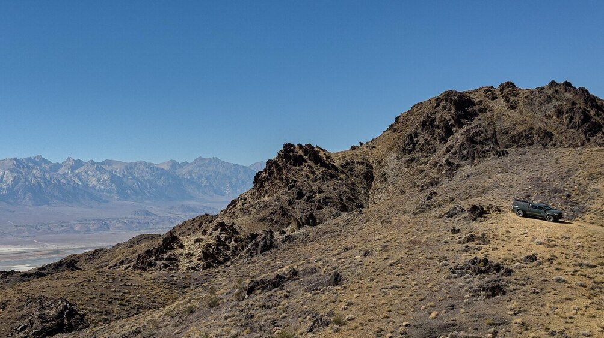
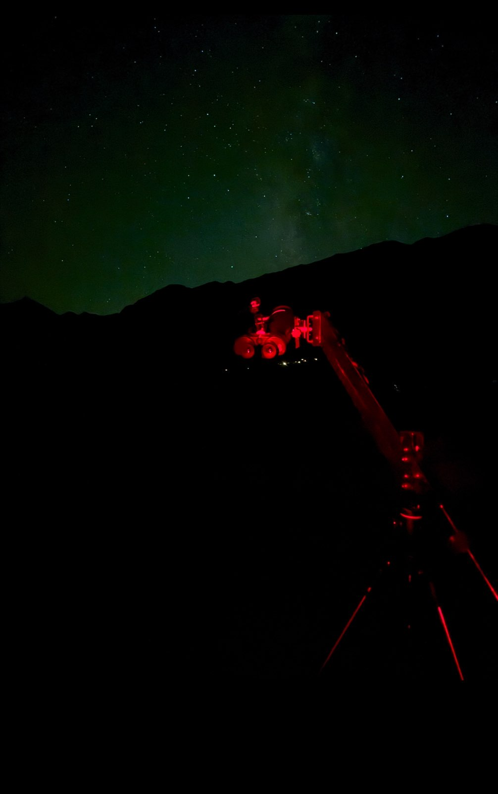
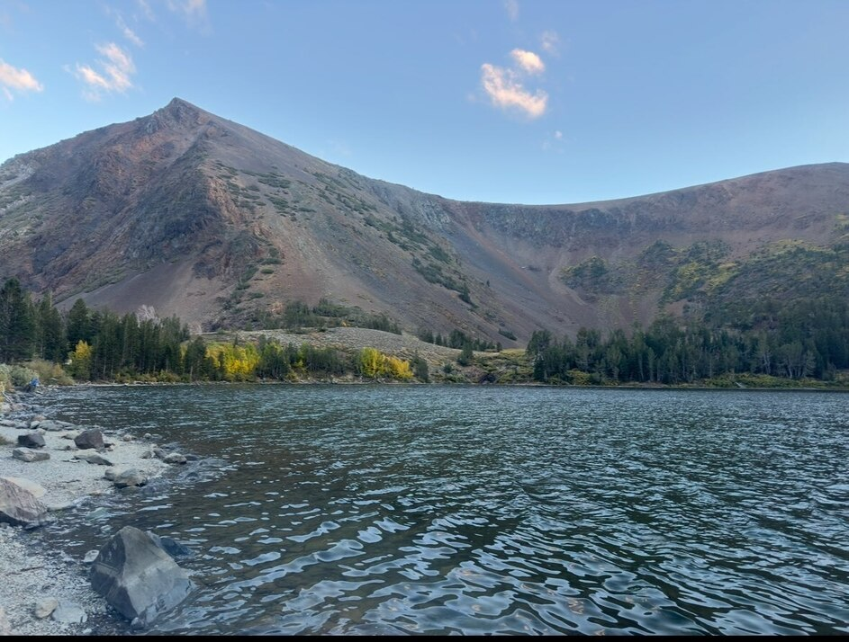

This is a continuation from [part 1](/OR__202509_EasternSierra_Part1.html),
[part 2](/OR__202509_EasternSierra_Part2.html), [part 3](/OR__202509_EasternSierra_Part3.html), [part 4](/OR__202509_EasternSierra_Part4.html).

I woke up at my beautiful observing site to a nice vista and lesser traffic.
I had already mostly packed up the telescope the previous night, leaving a few bits outside; especially the secondary cage, because that impedes my ability to recline and sleep in the cabin of my truck.

I spent some time after I woke up packing the remainder of items in and drove up to the "vista" at the edge of the cliff I was camping on to set up for work. Work was fairly productive, with the bonus of an amazing view. Around 3 PM, I decided to make it out so I wasn't driving a sketchy two-track road after dark. It definitely felt safer to drive down the steep road in 4LO even though the traction was good.

I didn't have much "business" in Lone Pine so I drove on towards Independence. After a nice hot shower (phew, 4 days of camping and you know the value of one!) in Independence, CA I drove up to a rest area  to finish up the rest of my work for the day. I drove on further to Bishop to grab dinner at a nice taqueria and drove out just as it was getting dark to set up my binoculars for a few more hours of observing.

My aim was to get to an observing site in the public land around Mammoth which lies at an elevation of about 8000 feet, perhaps around Benton Crossing. Instead just as I crossed the Sherwin Summit where the vista point for Bishop is on 395, I found an Inyo National Forest road going out to the right from US-395N. Just to explore it, I drove a bit and found a lot of campers parked. I finally found a fork of the road with a camping spot that was unoccupied, pulled in my truck and set up my binoculars. The elevation at this location was 6800 feet.

I was amazed by how good the sky was! This was pretty close to Bishop and Mammoth Lakes, but still at least a good Bortle 3 if not a Bortle 2. The sky was darker than the previous night in the Inyo mountains, which could be due to lower airglow, higher altitude or lesser light pollution (Ridgecrest is a major source). The city lights from Bishop were unshielded at this location, but they were not at all bothersome. The concern with this location is the seeing, since it is on the leeward side of the Sierra Nevada: one would theoretically need to go further east and up into the White Mountains to recover good seeing.

When I'm using my 25×100 binoculars on a parallelogram mount, I usually like to keep my laptop packed up and just use the Interstellarum Deep-Sky Atlas to star-hop. I find it detailed and full of interesting objects and the "pick a region of the sky and explore" method works very well with binocular observing. Moreover, its limiting magnitude for plotted stars is good enough for star-hopping with binoculars: I'd like much fainter stars that my laptop can plot for star-hopping with my telescope.

<x-dso>M15</x-dso> was easily visible to the naked eye, a lot easier than the previous night when I had used it to star-hop to a planetary nebula. I started n the Snake Nebula (<x-dso>Barnard 72</x-dso>) region and gave up rapidly because it was very low and the contrast was very poor as a result. I have seen it before in my 25×100 binoculars at the Anza-Borrego desert.

With binoculars, the usual rule of observing objects when they are as high as possible is too cumbersome unless one has one of those reclining chairs. I stuck to Sagittarius for a bit despite it being low in the western horizon. <x-dso>NGC 6652</x-dso>, <x-dso>M 69</x-dso>, <x-dso>M 70</x-dso>, <x-dso>M 54</x-dso> were some of the globular clusters I observed. The last of these is actually the stripped-out core of the Sagittarius Dwarf Ellipsoidal Galaxy, a dwarf galaxy cannibalized by the milky way.

Next up was <x-dso simbad="Cl Collinder 367">Cr 367</x-dso> a loose open cluster not far from <x-dso>M 8</x-dso> the Lagoon Nebula. As I was observing the cluster, there was one star that looked fuzzy on the bottom end of it. Looking at the Interstellarum Deep Sky Atlas, turns out it is the nebula <x-dso>NGC 6559</x-dso>. Neat, I hadn't expected to see a nebula that I'd never seen before. In the same region I picked up open cluster <x-dso>NGC 6546</x-dso> as a nebulous glow, followed by globular cluster <x-dso>NGC 6544</x-dso> which was minute.

Working my way up to Aquila, globular cluster <x-dso>NGC 6760</x-dso> was visible as a rather diffuse glow. I randomly tried out a few of the Barnard dark nebulae and stumbled upon a very remarkable object: <x-dso>Barnard 139</x-dso>. This one made my night, an almost perfectly circular arc of dark nebulosity! In comparison, most Barnard objects I encounter are like my next one -- <x-dso>Barnard 141</x-dso> was a non-descript patch of darker nebulosity in a region already strewn with less dark nebulosity. <x-dso>Barnard 135</x-dso> was similarly nondescript, but <x-dso>Barnard 133</x-dso> was reasonably interesting.

The skies were excellent and I was having a lot of fun, but I'd already spent over two hours and I had to work and drive home the next day. It really takes a good sky like this one for the binoculars to shine. Under a Bortle 2 sky, I can have as much fun with them as I have with my telescope, observing nebulae. I looked at the northeastern sky that is abuzz with nebulae in Cassiopeia and Perseus. I remembered the last time I was under a great sky with the binoculars in October 2023, I had just traced the entirity of the Heart Nebula in the instrument without a filter. Yet, I managed to restrain myself and put the binoculars away into the truck.

I drove off subsequently to a different location a bit further north. I realized I was starting to tire and I wouldn't drive very much further, so I pulled into a dispersed camping area that is near Mammoth Lakes, with the prospect of great food in the town next morning.

I was a bit nervous that I was in bear country with a lot of food, especially having forgotten to discard my utensils from dinner. I slept with the windows up. In the morning I woke up to the sound of some animal somewhere around the truck. Usually my first worry when this happens is a [marmot chewing on the wires in my engine bay](https://www.nps.gov/seki/planyourvisit/marmots.htm). Indeed, there were tiny paw prints of some small animal all over the engine cover, but no wires were damaged and the vehicle started fine! Phew!

I poured some water on myself before I left the camp to feel a bit fresh. I realized I was out of instant oatmeal and other camping goodies, so drove promptly to town to get brunch. I was dreaming of the Soyrizo Breakfast Burrito at the Looney Bean Cafe in Mammoth, but they were sold out by the time I got there. I had to settle for a Subway sandwich from next door, at least the coffee was decent.

I had a productive several hours of work at the coffee shop and by evening, as I was about to leave, I started getting a bit hungry. I remembered from my first ever visit to Mammoth in 2016 that there was a bakery in the neighboring complex that was very good, so I drove to it from my vague memory. I was pleasantly surprised to discover that it was the Shea Schat's bakery that Rod mentioned in his observing report! Yes, they are certainly worth the hype. Everything I had there (very limited because I should be watching my health), including the coffee was incredible. I packed some raisin walnut bread for home and started my drive back.

I had forgotten how much I enjoy the mountains every time I'm out there. US-395 is a most amazing drive. I took a short detour to Virginia Lakes just to go see it after many years. My favorite hike in the Sierra, Summit Pass, starts there. Too bad I didn't have a lot of twilight left to enjoy the mountains, especially at Sonora Pass.

On my way home, I took Sonora Pass road so I could explore the "Niagara Flat OHV Area" for potential observing sites. I spent about 40 minutes doing some exploration. Then I promptly drove back home, stopping at El Rancheros Mexican drive-through in Riverbank, CA for a burrito. The food was heavenly!

With that, ended another great observing trip! I enjoy writing these reports because they make me re-live those amazing memories under the stars and in the mountains when I'm just at my desk at home!