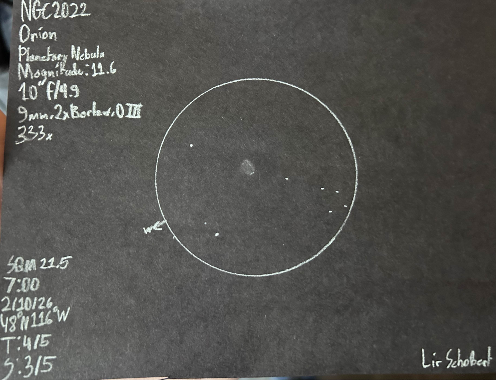
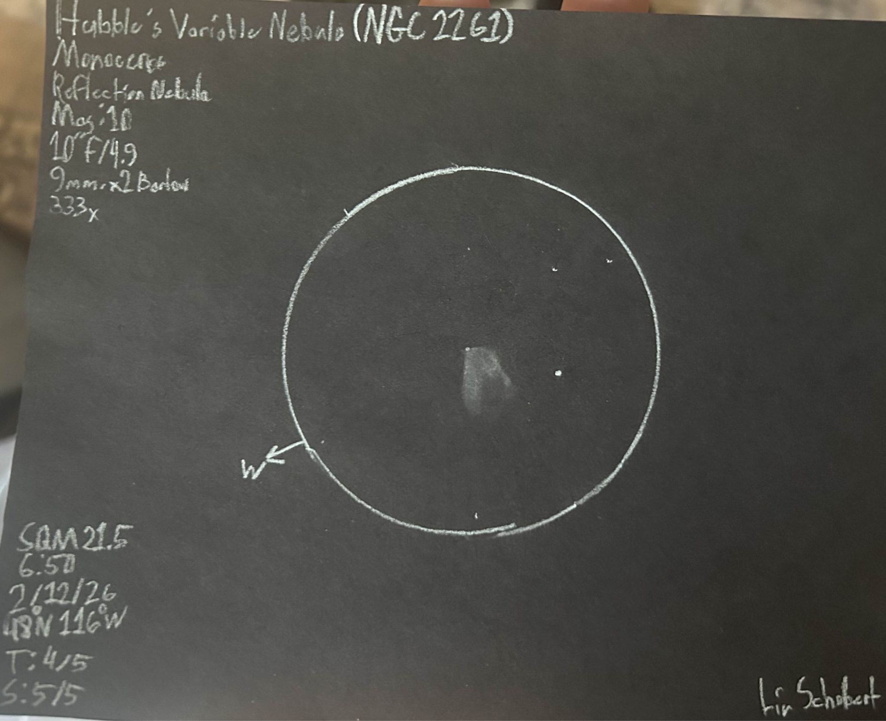
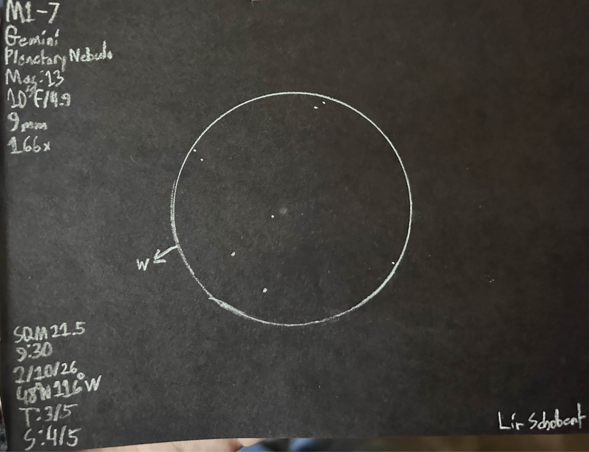

Tonight was a long awaited night under the heavens. I had been looking
forward to this for a long time, and just got back from doing my written
test for drivers ed, so safe to say I was in good spirits.

My name is Lir Schobert, I live in the state of Idaho. Here in Idaho we
do have very dark skies, along with abundant and breathtaking nature. I
am 16, and have been into amateur astronomy for almost a year now.

I observe with a modest 10” of aperture and a median focal ratio of 4.9.
My eyepieces are a 9mm Plossl, and a 30mm SuperView. I have a x2 Barlow
lens, with both OIII and UHC filters at my disposal. I live under Bortle
3 skies, so setting up is as simple as bringing my equipment out into
the driveway.

The moment I got home I brought out the telescope and chair, the sun had
set about 30 minutes before, I saw Mercury, and I could already feel the
rush of the universe in my veins. After I had set everything up I left
to get some dinner for the time being, some good old fried chicken
before an observing session never goes wrong!

To start the night off I began with collimating my telescope, and then
doing Jupiter observations now that I was collimated, and the mirror was
acclimated to the temperature. Jupiter looked quite amazing, saw a lot
of new details and clouds, certainly a beautiful object to start off the
night.

I began my deep sky observing this night with the <x-dso simbad="M 42">Orion Nebula</x-dso>. I came
here with no real goal in mind except to revel in its beauty. The shades
of green and fish scale appearance of the Huygens Region was incredibly
rich and stunning. What was most noticeable for me was the nearby
Running Man Nebula, I had easily seen both of the lobes of the nebula,
with some faint detail in the nebula. It had appeared less like a
running man, and more like a river and its surrounding banks.

I then moved on to a serious observation of <x-dso>NGC 2022</x-dso>. NGC 2022 is a
faint, but unexpectedly awestriking planetary nebula in Orion. It was
first seen at 50x as a very hazy star, reminiscent of the Orion Nebula
to the naked eye. NGC 2022 is in a humdrum section of space, near Lambda
Orionis. Its field is also mingled in nebulosity which is visually very
difficult. As I cranked the magnification to 100x it lost any stellar
appearance, and now appeared as a hazy smoke ring. It reminded me of
M57, but only much smaller and dimmer. It had begun to truly reveal
itself when I pushed magnification to 166x. At this magnification I
observed it with the OIII and UHC. This is when I first noticed a hint
of annularity, and a slightly elongated body. On closer inspection I
began to notice very peculiar brightening at either end of the nebula,
it made me think of the stellar details in <x-dso noindex omit>NGC 2371</x-dso>. These details
weren’t vaguely star-like, but they were certainly noticeable. When I
had cranked the magnification to 333x the nebula stood shaky in the
decent seeing (for North Idaho standards). This increase in
magnification did not add much to the nebula, other than making those
pole details all the more apparent. I made a quick sketch of the object
in my book, logged all details and field stars visible, and then later
made the drawing here off that sketch. This nebula was a wonderfully
subtle display of a dying star's final proclamation to the universe of
its existence. It truly belongs to the legendary deep sky objects of
Orion.

I then moved over the Monoceros and decided to glance passingly at some
object. I went to the <x-dso>Rosette Nebula</x-dso> and with the OIII I noticed dark
nebulosity in the brightest arc of the nebula. I then moved to the <x-dso>Christmas Tree Cluster</x-dso> where I immediately noticed the reflection
nebulosity in the north part of the cluster. I then panned around that
nebula in and around the cluster and noticed it all very faintly, makes
me wonder what a truly wide view of this scene would look like!

I moved on next to <x-dso simbad="NGC 2261">Hubble’s Variable Nebula</x-dso> which was nearby. At 50x
magnification it appeared as a fluffy tail, with defined edges, and
varying brightness across the nebula. I then pulled the magnification to
166x where the nebula had suddenly gained a whole new layer of intrigue
and detail. Here I had seen the outer fan, the nebulosity around R Mon,
and some dark details within the nebula. As I gazed upon it I was
reminded heavily of the photos. This object, other than color, looked
very close to the photo, even in my 10”. It had truly left me at a loss
for words. The knife's edge definition of its edge was one of the most
notable things for me, the white fire of heaven cutting into the void of
the universe. As the nebula went further out I noticed faint dark detail
within the nebula, and a very diffuse edge at the very end.

This is a drawing I made of the nebula at 333x magnification. This
sketch was made to show the details I saw within the
nebula.

After this observation I moved onto <x-dso>NGC 1999</x-dso> in Orion. This is a small
reflection nebula surrounding a star only about a degree from Messier 42.
It was easy to see at 50x as a haze around the 10th magnitude star.
When I cranked it up to 333x I was able to see mottling in the nebula
itself, though thanks to dew on my eyepiece I could not see the famous
keyhole in this nebula, I will be trying for this again.

I then moved over to Gemini to hunt for some faint planetary nebulae.
This winter I have gained a fixation on planetary nebulae, as any
observer would understand it is the thrill of the hunt and the feasting
of a beautifully detailed catch. I started this hunt with <x-dso simbad="PN M 1-7">Minkowski 1-7</x-dso>.

Minkowski 1-7 is a very simple, but rather faint object in Gemini. My
journey to finding it was quite simple. I began at Epsilon Geminorum,
and then I traveled to a triangle of magnitude 6 stars to the west, and
nearby to them is the asterism Kratz’s Cascade. When viewing this
asterism victory has been achieved in locating. Nearby to the cascade is
a magnitude 10 star, and but a dozen arcseconds away from it is
Minkowski 1-7. It was easy unfiltered, appearing as a small patch of
nebulosity, round, and faint. The most dramatic aspect was when
threading the OIII in, suddenly the nebula became stellar! Appearing
almost as bright as its neighboring star, though it has lost any hint of
nebulosity, so for this drawing I have decided to do the unfiltered view
to show its true nature. This was in a truly lonely expanse of space,
with this desolate nebula placed directly in the center of it. Seeing
this faint and unremarkable smudge made me think of the planets that
star may have hosted, the billions of years spent floating in space with
all of the other fellow stars, and eventually dying a death not worth
remarking from a distant planet.

I then moved on to the <x-dso>Medusa Nebula</x-dso> on the other side of the
constellation. The position of the nebula was very easy to find, since
it was near the bright 6 CMi star, then following to the north until you
find the star cluster <x-dso noindex>NGC 2395</x-dso>, and nearby it lies Medusa’s hair. In the
unfiltered view it was extremely faint, and almost entirely blended in
with the background Milky Way. Once the OIII filter was threaded in I
suddenly saw a much different view, Medusa showed herself to me, very
faintly, but she was certainly present. It was at this moment that I had
proclaimed in excitement “Yes!” and clapped my hands. The nebula
appeared as a thick arc with very hard to see darkness between the arcs.
To me it resembled the appearance of a hardware nut seen from side on.
It was an intensely enjoyable nebula.

At this point I had decided that it was a good way to end the night, for
the bitter cold was definitely getting to my bones and I needed to get
decent sleep for school the next day. Overall this was a wonderful
night, with many breathtaking celestial sights, and a wonderful night of
clear skies to follow is going to happen!
