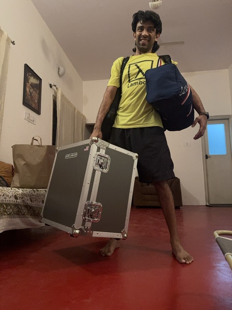
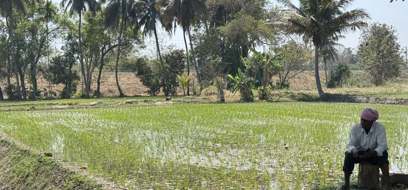
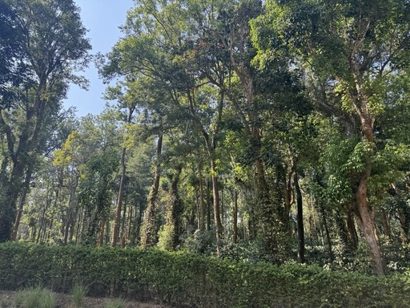
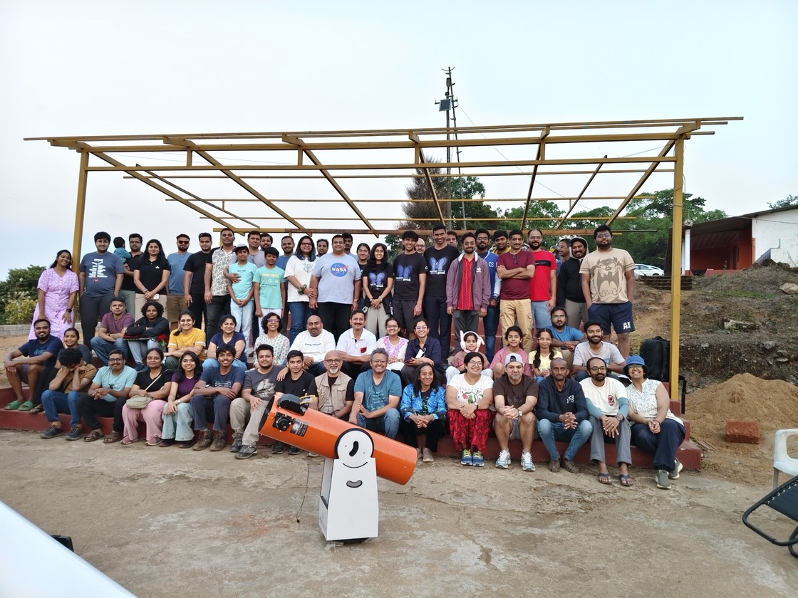
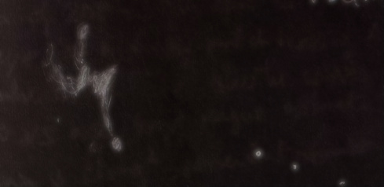
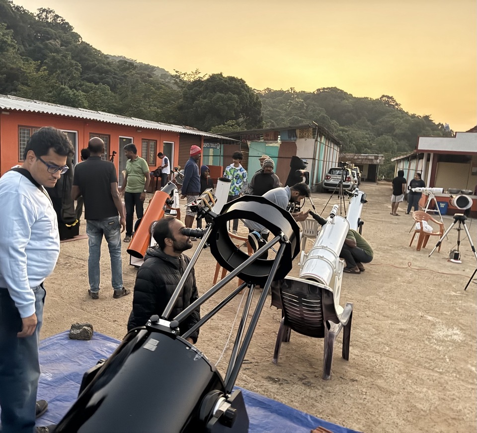
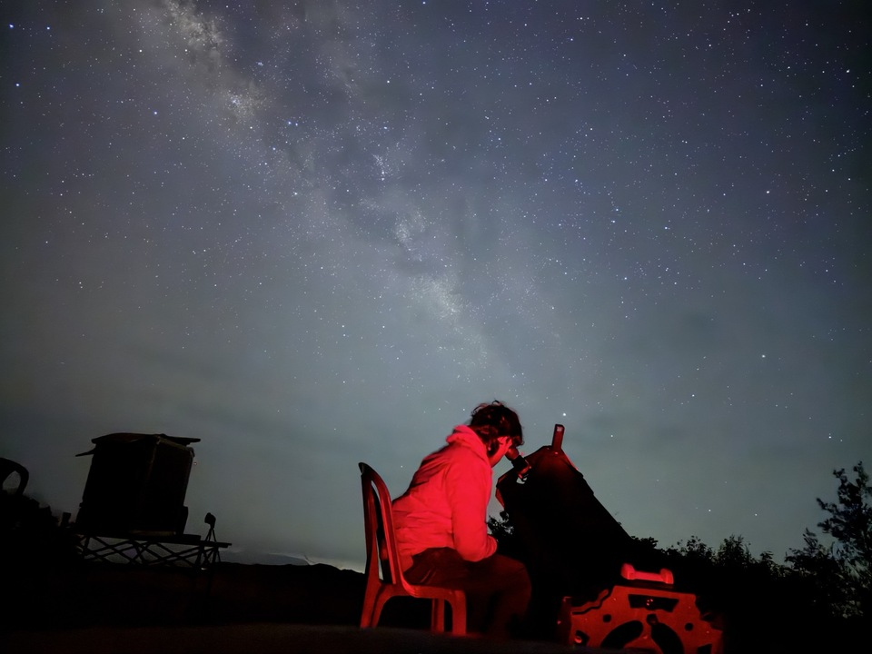
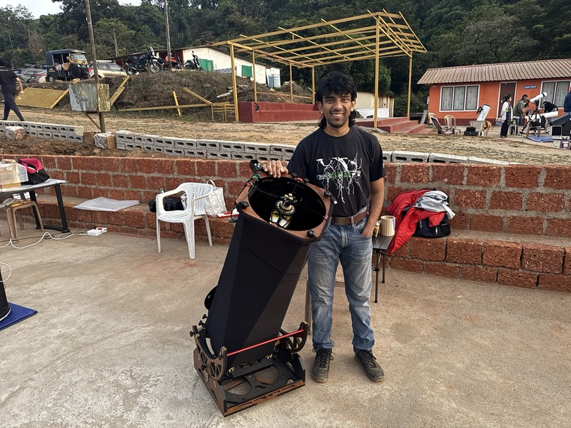

I made a trip after the January new moon to south India to spend time with my mother who lives here. Although the conditions in south India for observing are not as conducive as in California, I try my best to use whatever skies I have.

In the past years, I did not have a telescope to call my own in India. Since last year, I acquired an [AstroLabs 12-inch travel telescope](http://astrolabs-usa.com/) made by my friend Sanath. I was impressed with the instrument, and supported his showcase of it at [NEAF 2025](https://www.astronomy.com/observing/the-best-new-astronomy-products-we-saw-at-neaf-2025/) where both Phil Harrington and Sean Walker featured it in the Astronomy and Sky & Telescope magazine reviews of NEAF. The telescope has served me well since I started beta-testing it in early 2025. Sanath has made several improvements since, making the telescope even more of a pleasure to use. Portability is key to my successful observing here in India, since I don't own a car or know how to drive here, and am usually managing with public transport, ride-share apps, or carpooling with fellow astronomers.

*Carrying all my goods for the star party at once: The 12-inch telescope, my sky atlas and a few odds and ends lie within the carrying case except for the secondary mirror; that along with the eyepieces are in my backpack, along with my laptop, logbook and red filter. Hanging on my shoulders are my clothes and a roll-up camping table*

My trip to India started with a terrifying situation where the checked baggage that had the telescope did not make my flight connection! The airline delivered it home a couple days later and I was relieved to luckily find everything intact inside. I was more concerned about airline security officials messing up the telescope because of its curious appearance than the rough handling that the baggage goes through, since the construction of the telescope has proven to be very good at resisting shock in our experiments.

The [Bangalore Astronomical Society](https://bas.org.in) organizes star parties each year from December to March, at a site in the western mountains of south India and about 300km from the city. It usually takes over six hours to make the drive due to traffic congestion and winding mountain roads. After passing the city of Mysore, the drive becomes a bit more interesting with paddy and sugarcane fields dotting the road sides, eventually giving way to coffee and spice plantations in the hills.

*A scene along the road to the star party, when we stopped for fresh coconut water, showing a rice paddy field*

*The windy roads in the hills are dotted with large plantations growing coffee and spices*

Due to proliferation of light pollution, the site generally presents Bortle 3 conditions at best -- I remember the times 15 years ago when it used to be Bortle 1. The other problem the region presents is moisture and extinction. The region is extremely wet and the mountains make their own clouds. It's unusual to have a night without dew or poor transparency. Despite these challenges, it seems to be one of the best sites in south India.

My primary attraction here is the 13° N latitude, which allows access to a band of the southern hemisphere that I cannot observe from California. The star party is unfortunately conducted at a lodge that has a hill obstructing the south up to to where Canopus transits, hiding most of what I want to observe. This year, I joined some of my co-observers and astrophotographers in heading to a parking lot atop the same hill, revealing the full southern sky over a valley. The compact nature of the telescope allowed me to fit it along with my fellow observers' telescopes, a few chairs and a foldable camping table in my friends' hatchbacks or crossovers. Now the enemy that remained was heavy extinction from moisture and clouds that form over the valley. Although I could see down to Acrux, the bottom star of the southern cross, stars below that altitude were typically virtually invisible. 2nd magnitude Miaplacidus (beta Carinae) would sometimes be visible as a dim smudge with averted vision! I have previously seen the Coalsack from this location, but this year the extinction was bad enough that I could not. Yet, the thrill of observing something otherwise inaccessible kept me trying.

## February 2026

At the February star party, I was joined at the parking lot by visual observer Ranjit Neelakandan and his 10-inch goto telescope on two nights. We had to start a bit late after dusk to ensure that the parking lot was empty and we wouldn't attract unwanted attention from curious bystanders :-).

*Group photograph from the February 2026 Star Party. Ranjit and my mother are seated in the front row, while I stand with new alumni of my alma mater.*

The skies were not very transparent and punctuated by intermittent periods of clouds. I spent a total of two nights at the parking lot and two nights at the lodge. One of the nights was of better transparency during the early evening, and unfortunately I had decided to stick to the lodge that night. On that night at about 3 AM, a group of us decided to drive up to the parking lot to appreciate the southern skies. I rapidly dismantled my telescope to a transportable state and reassembled it at the parking lot to continue observing. At this time the southern skies were not particularly clear. The second full night at the parking lot was markedly better. An initial crowd of about 20 people made it to the lot and the skies were unfortunately poor. Unimpressed, most of the crowd decided to retreat to the lodge and its creature comforts, except for Ranjit and I. My mother later returned from the lodge to the parking lot, bringing us the catered meals from down there. It was a nice experience to eat under the stars. My mom remained with us through the night although she slept in the car early. I did bring her out to check out eta Carina nebula, but otherwise left her undisturbed. The sky improved later that night, and Ranjit and I continued observing into the wee hours. Here are my observing highlights from February, although I have introduced some follow-up observations from March herein as well.

### <x-dso>NGC 1566</x-dso>, the Spanish Dancer

To my knowledge, this would be amongst the top five galaxies of the deep southern skies. Starting at 60×, <x-dso>NGC 1566</x-dso> appeared as a brightish patch with a condensed, much brighter core. The halo appeared amorphous and "spikey" with a north-south elongation. Tacking on 200×, I got several fleeting glimpses of the northern spiral arm. The extinction was way too strong, for I could only see alpha and gamma Doradus and alpha Reticuli with the naked eye.

### <x-dso>NGC 1553</x-dso> and <x-dso>NGC 1549</x-dso>

NGC 1566 is the brightest member of the Dorado Group. I glimpsed a few other members of the group, including the interacting pair NGC 1553 and NGC 1549. NGC 1553 appeared bright, slightly elongated towards NGC 1549. NGC 1549 appeared condensed, smaller, fainter and roundish. Both were visible to direct vision. A star lay between them, collinear and closer to NGC 1549.

Other observers in BAS have had better luck with this group when the conditions are more transparent. 

### <x-dso>NGC 2070</x-dso>, the Tarantula Nebula

The Tarantula Nebula, the brightest star-forming region in the LMC, is generally considered one of the best nebulae in the night sky. Due to extinction, the nebula, let alone the LMC is difficult to catch in this part of south India. I had seen it once before around 2008 with a 12-inch telescope, but never made a note of what I saw.

The LMC itself was invisible. I have [once seen it](https://kstars.wordpress.com/2010/01/20/trip-to-rameswaram-to-view-the-ase-2010/) from the shores of the Indian Ocean at 9°N latitude with the naked eye, but never from 13° N.

Despite the heavy extinction, and catching it way past meridian (due to varying haze), the nebula appeared bright. Ranjit first found it with his 10-inch goto telescope and confirmed the star-pattern against an image to identify the object. I then managed to find it in my telescope, just before it tracked behind a tree. The core structure appeared like a butterfly in my scope, with spikey extensions from it. The most prominent extension headed NNE from the eastern "wing" of the nebula, and sported a detached brightening at its end. Another extension was vaguely visible going south from the western wing. I made the observation at 135× with a DGM NPB filter.

### <x-dso>NGC 2516</x-dso>, the Southern Beehive Cluster

A beautiful cluster of bright stars about half a degree in diameter. The cluster was easily visible to the naked eye as a fuzzy patch leading Avior in the false cross. The cluster sported perhaps 60--80 stars according to my vague estimate. The star density is somewhat elongated ENE-WSW.

### <x-dso>IC 2220</x-dso>, Toby Jug Nebula

I imagined that the nebula would appear very bright, but it was incredibly dim. The red color does not help. The DGM NPB filter obliterated it, indicating it is a reflection nebula. I had the best view at 200×. The nebula appeared as a subtle pair of "spikes" around a modestly bright star. One thin spike headed north of the star, and another more diffuse glow fanned out to the southwest. This fan out had a brightening at its visual end.

I re-observed the nebula in March, where I noticed the same two spikes but failed to note the detached brightening. This time the nebula was less difficult, perhaps because I knew what to expect.

### <x-dso>NGC 2808</x-dso>

At 135×, this globular cluster appeared bright, with a gradually much brighter middle. No strong core condensation was observed. The fringes were not resolved at this power.

NGC 2808 is believed to be the remnant core of a former dwarf galaxy that collided with the Milky Way, called the "[Gaia Sausage](https://en.wikipedia.org/wiki/Gaia_Sausage)".

### <x-dso simbad="PN PB 4">Peimbert-Batiz 4</x-dso>

Planetary nebula PB 4 in Vela was visible unfiltered intermittently with averted vision as a slightly defocused star, much dimmer than the real star flanking it to the west. It showed a strong response to the DGM NPB filter through which it appeared almost continuously to averted vision. The observation was made at 200×. I tried to tack on more power but did not pick up any more detail.

### <x-dso simbad="NGC 2736">Herschel's Ray</x-dso>

Herschel's Ray, NGC 2736, also known as the Pencil Nebula, is a bright segment of the sprawling Vela Supernova Remnant. Although this nebula is well visible from the southern USA, I have only observed it from south India. Through my 12-inch at 60× with a DGM NPB filter, the nebula appeared flanking a pair of stars, about 11´ in length.

### <x-dso>NGC 2867</x-dso>

This planetary nebula in Carina appeared as tiny, slightly east-west elongated disk with an appearance of being brighter in the middle, perhaps due to an unresolved central star. I suspected a thin, dimmer halo hugging it. The observation was made at 270×.

### <x-dso>NGC 2899</x-dso>

This planetary nebula in Vela was virtually invisible unfiltered at 135×, but appeared as a dim nebulosity with a slight east-west elongation after popping in the DGM NPB filter. It was visible continuously to averted vision and appeared perhaps slightly brighter in the middle.

### <x-dso>NGC 3114</x-dso>, the Hand Cluster

A nice cluster of reasonably bright stars that spans about 1°. The stars appeared organized in a spiral pattern, kinda like a spiral galaxy. Very cool! This observation was made at 60×.

### <x-dso>NGC 3199</x-dso>, the Banana Nebula

At 60x with an NPB filter, a crescent-shaped filament of nebulosity that appeared curved concave eastwards.

### <x-dso>NGC 3372</x-dso>, the Eta Carina Nebula

I observed the nebula at 60× with a DGM NPB filter. The nebula filled and exceed the 1° FOV of the eyepiece. It appeared beautiful and showed numerous dark rifts. All my attempts at seeing the Homunculus Nebula were met with failure, I imagine it needs to be higher in the sky and a precisely collimated scope.

### <x-dso>NGC 3918</x-dso>, the Blue Planetary

I observed this beautiful planetary at 270× unfiltered. It appeared as a subtly bluish round ball.

### <x-dso>NGC 4755</x-dso>, the Jewel Box Cluster

At 60×, a triangular patch of bright stars organized in an A-shape, with a smattering of dim stars on one side. Very beautiful cluster.

### <x-dso>NGC 3766</x-dso>, the Pearl Cluster

At 60×, a dense, rich cluster of bright stars in a slightly elongated region, triangular in pattern.

### <x-dso>IC 2948</x-dso>, the Running Chicken Nebula

This is very low in the sky and therefore heavily impacted by extinction. In my first attempt, I found the nebulosity very subtle at 60× with a DGM NPB filter. I placed it to the south-southwest of a chain of three stars south-east of NGC 3766. The sky background in th eyepiece was divided by a line from a darker to a brighter background level, indicating the presence of the nebulosity. The south-southwest side of the FOV was brighter.

Under somewhat better conditions, I was able to pick up a vaguely triangular region of diffuse nebulosity around a chain of four stars southeast of lambda Centauri. Contrary to the image, I found more nebulosity to the northeast of the chain of stars than the southwest.

### <x-dso>NGC 1261</x-dso>

The globular cluster in Horologium was caught way past meridian, but was bright enough to survive the extinction. I noticed a gradually brighter middle at 135×, averted vision showed a condensed brightening in the core.

### <x-dso>IC 2488</x-dso>, Strings of Pearl Cluster

At 60×, the cluster showed three chains of stars placed next to each other. The most distant chain from N Velorum had a bit of a meander to it. The arrangement gave the star-rich region a rather boxy rectangular appearance.

### <x-dso>IC 2602</x-dso>, the Southern Pleiades

Also known as the theta Carinae cluster. About seven stars form a meandering sickle-like chain in a field containing over a dozen other stars.

### <x-dso>NGC 3293</x-dso>, the Gem Cluster

This beautiful, tight cluster sported about three and a half dozemn bright stars. A DGM NPB filter rendered a nebulous background to the cluster, but I had no way of confirming that this was a real nebula as opposed to scattering around the bright stars.

### <x-dso>NGC 3324</x-dso>

This is a nebulous knot on the outskirts of the eta Carina nebula. The most contrasty region is around and north of a pair of dim stars, although a dim rift of nebulosity seems to flow from here south to a bright star.

### <x-dso>NGC 3247</x-dso>, the Whirling Dervish Nebula

Most NGC catalogs list this as an open cluster, but in the DSS2 image, it is clearly nebulous. I therefore tacked on an NPB filter and at 60× I saw a diffuse, elongated, and extremely dim glow at the location. It is a definite observation as I first called out the location and later confirmed it against the DSS2. The nebulosity appeared very low in surface brightness.

Hoping to see the proclaimed open cluster, I removed the filter and tacked on 135× and was greeted by a fuzzy blob that was reminiscent of a dim globular cluster. This glow lay just off the end of a chain of dim stars. I could not resolve the stars even at 200×.

### <x-dso>NGC 3532</x-dso>

This is a nice cluster of many moderately bright stars scattered in an elongated region whose major axis is about half a degree in length. A yellowish star stands out in the northeast, brighter than the cluster stars.

### <x-dso>NGC 3590</x-dso>

This star cluster in Carina appeared as an elongated fuzzy patch at 60×, and at 135× it resolved into a nebulous clump with four resolved stars.

### <x-dso>NGC 3579</x-dso>, the Statue of Liberty Nebula

This nebula was observed along with NGC 3603 at 60× through a DGM NPB filter. The nebula's brightest part was its southern end, which appeared as an elongated bar running roughly east-west. The west side of the bar is thickened by a northbound extension of somewhat dimmer nebulosity that culminates in a east-west filament. A northbound spike is occasionally seen with averted vision.

### <x-dso>NGC 3603</x-dso>

Once again listed as an open cluster in the NGC catalog I was using, Ranjit told me this is indeed a nebula. I saw it as a fan-out of nebulosity from a stellar point to the north. The stellar point seems to have been cataloged as HD 97950 but is apparently a compact star cluster which I did not resolve.

## March 2026

I spent only two nights at the March star party. Turns out in both Feb and March, the night before I arrived was the best. My first night at the star party was not bad, though, especially in the early morning hours when the summer milky way rose high up. I spent the first night at the parking lot with astrophotographer Viswanath S K drove me and my telescope up along with his SeeStar S50 automated telescope. Vishwa and I spent the whole night up there, although he had the luxury of sleeping while his images were being acquired. We had our caterer bring us some fried rice and coffee around supper time. I spent the second night at the lodge, showing objects to the newbies that we typically invite during the weekend. The star party crowd usually peaks on Saturday, and this time we had registrations north of 80 people! I tend to also want in on the spirited observing that happens on the field, with about 8--10 other dedicated visual observers and enthusiastic beginners.

*Public night at the March 2026 star party. People are viewing the crescent moon.*

When we arrived at the parking lot, there were people still enjoying the evening vista. We delayed our setting up until they left in a short ten minutes or so. The conditions started out being so-so, the southern beehive being barely visible to averted vision.

I warmed up on tau Canis Majoris cluster and the Southern Beehive cluster before revisiting the Toby Jug Nebula. I had finished a few open clusters in Puppis and then observed IC 2501 in Carina when our caterer came with dinner. After dinner, we saw a group of four people walk up to us with lights and say "Excuse me, I was told there is a telescope here." Turns out our caterer had tipped them off! I begrudgingly agreed to show a few objects to our visitors starting with the Orion Nebula, but I quickly became much more excited after realizing they had a fairly deep knowledge of astronomy and definitely a lot of interest. What ensued was almost a two hour outreach session to this very engaged audience, where I showed M 42, M 41, M 104, M 51, Alcor-Mizar, M 94, eta Carina Nebula, and so on. During this time, the southern skies cleared up substantially to the point where I could see the Carina Milky Way, and I was raring to get back to my observing program. Yet fueled by my audience's excitement, I continued the outreach. When our visitors left, I was utterly disappointed to see a large cloud cover up the south. It did yield after some time, but the conditions were not as good until the early morning hours. For the first time in my life, I saw the Norma Star Cloud clearly, and the Milky Way ran all the way down to alpha Centauri. That was an excellent teaser of what a true southern hemisphere observer might see!

*I took a moment out of my observing to set up for this photo-op at the parking lot with my 12-inch telescope. The resolved star cloud just above the center of the frame is the False Comet. In the center of the frame is the Norma Star Cloud. The Milky Way stretched all the way to alpha and beta Centauri*.

### <x-dso>IC 2501</x-dso>

This planetary nebula in Carina appeared practically stellar at 60× and barely nonstellar at 270×. It was only identified by its strong response to the NPB filter.

### <x-dso>IC 2553</x-dso>

Another stellar planetary nebula in Carina, only identified by its strong response to the NPB filter. It lies east of a prominent double star. Observation made at 120×.

### <x-dso>NGC 3699</x-dso>

At 200× with a DGM NPB filter, I was able to hold this planetary nebula in Centaurus with averted vision about 80% of the time. It appears collinear with a pair of dim stars. At best, it looked non-stellar and amorphous, perhaps squarish or roundish.

### <x-dso>NGC 4349</x-dso>

At 120×, a fairly dense cluster of dim stars that seems to be coralled by a vaguely triangular outline of dim stars. One prominent star stands out substantially brighter on the east-northeastern edge. It looked grainy at 60× and was easily missed by blending into the bright background.

### <x-dso>IC 4191</x-dso>

My first object in Musca! This planetary nebula, at 120×, appeared as a dim object with a slightly dimmer star to its south-east. I star hopped to it from beta Muscae which was extremely vaguely detected with the naked eye due to severe extinction. The PN showed a strong response to the NPB filter which obliterated the flanking star. No detail discerned.

### <x-dso>NGC 5286</x-dso>

I've observed this bright globular cluster flanking naked eye star M Centauri several times now. It appeared compact and unresolved although it appeared granular at the fringes with averted vision. A lone star stood out on its northwestern fringe. The yellow star M Centauri is to the southeast in the same FOV at 200×.

### <x-dso>NGC 5927</x-dso>

Fairly bright, large diffuse globular nestled off-center in an obtuse isosceles triangle of dim stars. It has a gradually much brighter middle, and appears "fluffy" at 60×. At 270×, averted vision gives the cluster an intermittently resolvable grainy feel. The core region seems to split into 3--4 condensed clumps arranged in an asymmetric manner.

### <x-dso>NGC 5946</x-dso>

A rather dim, small, fuzzy glow without much obvious gradation of brightness although it is non-uniform. It is rather weakly brighter in the middle. It is flanked by a star on the west which makes it somewhat harder to study.

### <x-dso>NGC 5315</x-dso>

My first object in Circinus! This is yet another virtually stellar planetary nebula. I could not confirm the nonstellar nature even at 270×. I identified it by checking the location precisely against images and observing a strong response to a DGM NPB filter.

### <x-dso simbad="PN Sp 1">Shapley 1</x-dso>

At 60× with the NPB filter, this donut planetarty in Norma was readily detected as a dim, roundish glow intermittently visible to averted vision. Bumping up to 87× yielded the best view, where it appeared as a distinct dim round glow almost continuously to averted vision. Bumping up to 200× yielded occasional sensations of the donut shape, usually by picking up glimpses of part of the rim.

### <x-dso>NGC 6067</x-dso>

A beautiful bright open cluster in the Norma star cloud (which also was a pleasure to scan through). Lots of stars densely organized in a circular region.

### <x-dso>Lynga 7</x-dso>

Lynga 7 was one of the clusters identified by Swedish astronomer Gösta Lyngå in a 1964 survey of open clusters. However, in 1993, it was recognized that this is a globular cluster. 

It appeared as a distinct but subtle overdense clump in the Norma cloud. It had superposed on it (off-center) the middle star of a chain of three dim stars. A star flanked it to the west-southwest. I had to isolate this from another confounding overdensity lying to its south-southeast. It was picked up readily when moving the scope, but got less distinct when observing it steadily.

### <x-dso>NGC 6188</x-dso>, the Firebird Nebula

This nebula on the border of Ara and Norma was a beautiful sight! Although the glow was subtle at 60× with a DGM NPB filter, the parallel alternating dark and bright filaments made for a fantastic view. Especially a stark dark region lies in the southern portion of the nebula, southwest of the western star in a pair of stars.

### <x-dso>NGC 6164</x-dso> and <x-dso>NGC 6165</x-dso>, the Dragon Egg Nebula

I panned here from NGC 6188 with the NPB filter at 60× and immediately noticed that the star HD 148937 looked strange. It seemed to have a SE-NW elongated oval halo that appeared larger than anticipated. Eventually I started seeing flashes of a detached glow to the southeast (NGC 6165). Careful study showed the northwest end of the oval halo also curving down, but this glow (NGC 6164) did not appear detached. The nebulosity strongly responded to the filter although it remained subtle. NGC 6164 was harder to detect than NGC 6165.

This fascinating object appears to be ejecta from a unique magnetic star believed to be formed by the merger of two stars in a triple system!

### <x-dso>NGC 6352</x-dso>

At 87×, this globular cluster in Ara appeared as a nebulous, granular, asymmetric glow with a few resolved stars. It was pretty large and diffuse.

### <x-dso>NGC 6397</x-dso>

At 87×, this globular cluster in Ara was fully resolved and appeared "teardrop" shaped as if it was smudged. A pretty sizable cluster.

NGC 6397 is one of the two closest globular clusters to the earth, along with M 4.

*Here is me with my 12-inch at the lodge on the Saturday night of the March 2026 BAS star party.*

