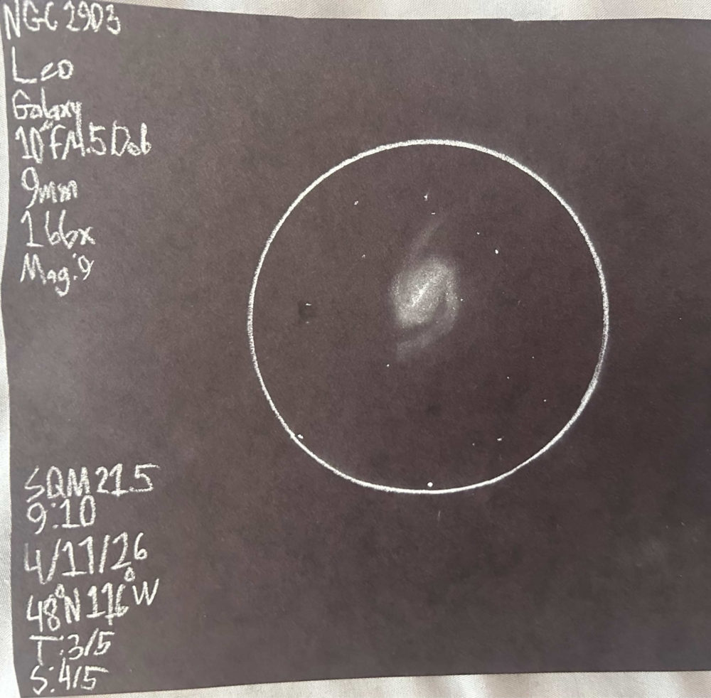
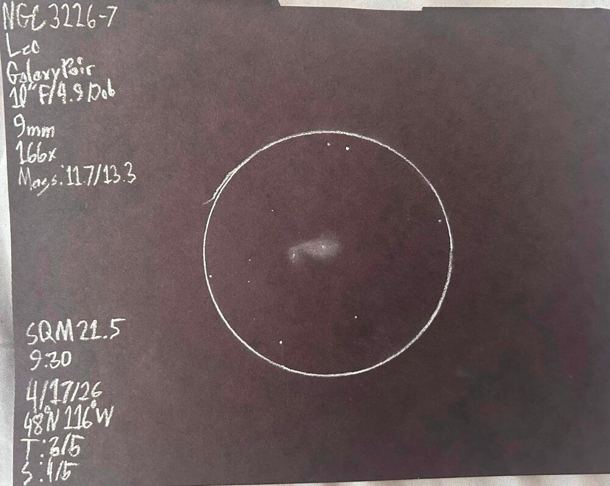
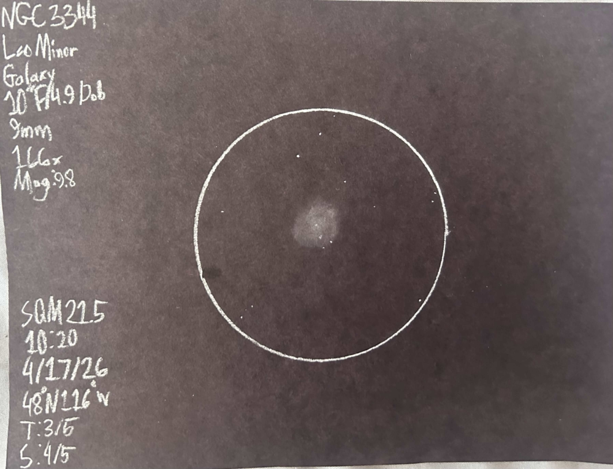
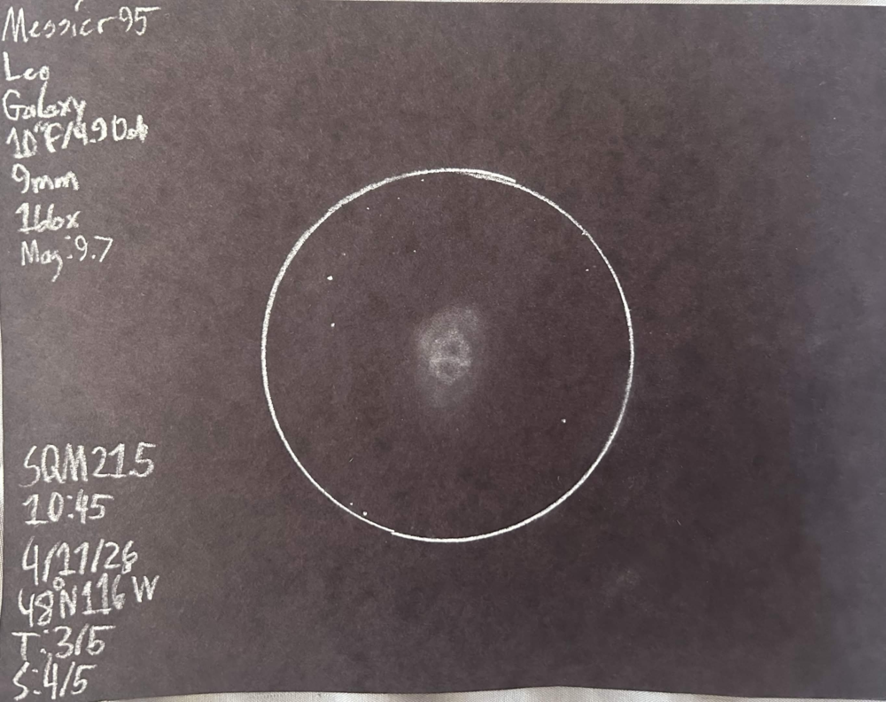
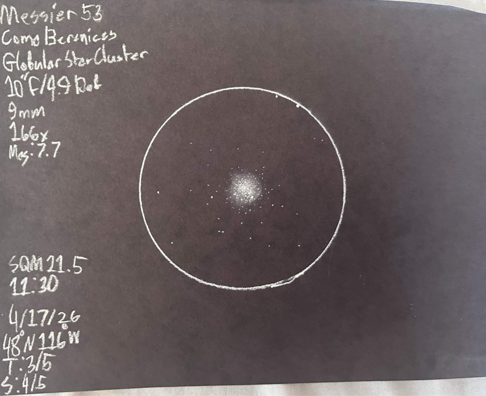

The new moon promised me an uninterrupted night, and into which I was
delivered! Clear skies, good seeing, good transparency, and low-mid 40
degree fehrenheit temperatures. This gave me a wonderfully comfortable
night. Setting up was a breeze due to the low temperatures after the sun
set, my telescope only needed about 20 minutes to acclimate to the
outdoor temps.

To start off the night I did one of my favorite rituals, as the sky
darkens after sunset the stars slowly start to light up the night sky.
This of course is a gradual spectacle, and often hard for someone to
notice as it is happening. So to take advantage of this I lay on the
ground, close my eyes, and listen to music for about 15-20 minutes. When
I had first closed my eyes I could see down to magnitude 3-4, but as I
opened my eyes again stars of magnitude 5, and even 6! Wonderfully calm
way to start the night!

The first target of the night was the spectacular <x-dso>NGC 2903</x-dso>. This is an
object that I had been observing on clear nights for the past two weeks,
so I had racked up experience with this object and had observed much
detail in it. First of note was its oval shape, with a very diffuse edge
on either side of the galaxy. Then I had observed the core, this was
much more than your regular, semi-stellar core with perhaps a bar
exiting out from it. This core was stellar, but it had a fascinating,
extremely uneven bar. With an extension going out from the core to the
west and making a very faint curve, but the bar to the east? Almost half
the length of the other end. Other than the core there wasn’t much
visible in the main body of the galaxy. It seems that this is the end of
the detail I could see without completely transparent skies. But, in the
corner of my eye as I watch the galaxy move out of view I catch a faint
patch of light, just shining through the veil of the void. This
brightness was on either end of the galaxy, extending out longer than
the galaxy itself, this of course was the very faint, but outstretching
spiral arms. This was the grand crescendo for this galaxy, making for a
truly spectacular observation. I couldn’t recommend this galaxy more,
especially for larger aperture telescopes, which could see small spiral
detailing.

I then moved onto a fascinating pair of interacting galaxies near
Algieba: <x-dso>NGC 3227</x-dso>-6. This pair was quite faint, but not too challenging,
once I had found where they were supposed to be it was easy to observe
them. Both had visibly stellar cores, and had readily visible bodies.
The greater of the two, NGC 3227 is an ovular spiral galaxy with
consistent surface brightness all across it. The pair it makes with NGC
3226 is very similar to that of Messier 51and its elliptical companion.
<x-dso>NGC 3226</x-dso> itself is a small elliptical galaxy interacting with a spiral
arm of NGC 3227. Nearby was <x-dso>NGC 3222</x-dso>, a very small elliptical, it is not
shown in the sketch though. 

I had read about one <x-dso>NGC 3344</x-dso> earlier in the day, my interest was piqued
by simply seeing someone talk about it and describing its loneliness. It
is a grand spiral galaxy in Leo Minor, with an incredibly low surface
brightness. I had a hard time confirming it due to just how dim it was,
but I had identified it due to a trio of stars leading up to the core. I
could not confirm the core itself so in the sketch my estimation of the
core is a few arcseconds to the left of where I portrayed it. The two
most fascinating aspects was its almost complete lack of any change in
brightness, except a very gradual disappearance as it faded into the
night sky. Secondly was a faint spiral arm that I was able to spy to the
right, going up and around in a curve about 1/4th of the galaxy's
circumference; this was the only true difference in brightness that I
noticed in the galaxy. A truly fascinating galaxy this one is. The
spiral arm was one of the most invigorating observations I have had.
Whenever I see spiral arms in low surface brightness galaxies like this
it is incredibly rewarding, seeing the faint paint strokes of gravity in
a galaxy's face is incredibly satisfying. They add a layer to galaxies
that a simple nebulous patch really can’t capture, they add personality,
and intensify intrigue.

I then moved down into the belly of the lion, observing one of the most
unique Messiers in the night sky: <x-dso>Messier 95</x-dso>. This was an incredibly
difficult galaxy to observe detail in due to low surface brightness. It
was noticeably dimmer than the neighboring <x-dso>Messier 96</x-dso>. The first detail
I noticed was a barred core, quite interestingly the whole bar had a
very equal brightness, even at the core. This was the most I could
notice at first, so I decided to lower the magnification from 166x to
100x to maximize possible light entendue. At this magnification I
noticed an oval shape expanding from the bar, having a very oblate
shape. Upon further inspection I began to notice what looked like a very
faint ring intersecting the central bar. Turns out this was the full
Theta shape of the galaxy's core! This was an awesome find, and wrapped
up my time with this galaxy.

To end the night I topped it off with a beautiful globular star cluster
in the south area of Coma Berenices, <x-dso>Messier 53</x-dso>. This globular was very
hard to find due to the faint starfield it finds itself in. The nearest
and brightest star is Vindimiatrix in Virgo. The rest is quite difficult
to discern from one another (it is a truly memorable experience to be
lost in the Virgo/Coma region). Upon finding it after many frustrating
star hoppings I was immensely delighted by the view I was greeted with.
It had a very dense, and very concentrated core, making up most of the
visible globular. The brightest stars in the cluster were of the 12th
magnitude, with a majority of the stars being in the realm of 14th-15th
magnitude in my estimation. The outer halo of the galaxy was somewhat
difficult to see, but it made the whole experience extremely memorable.

