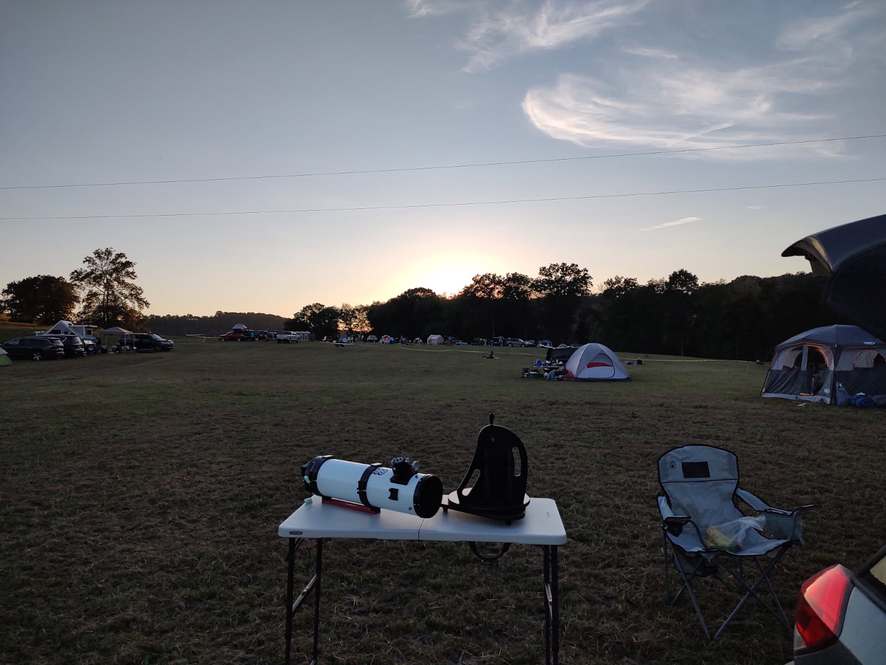
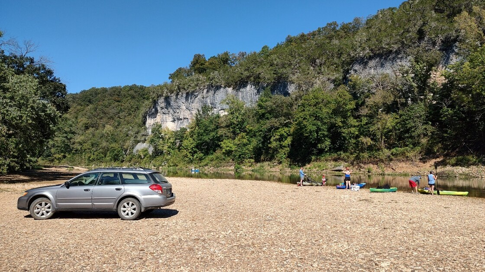
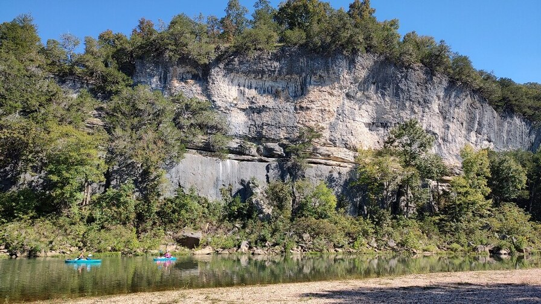
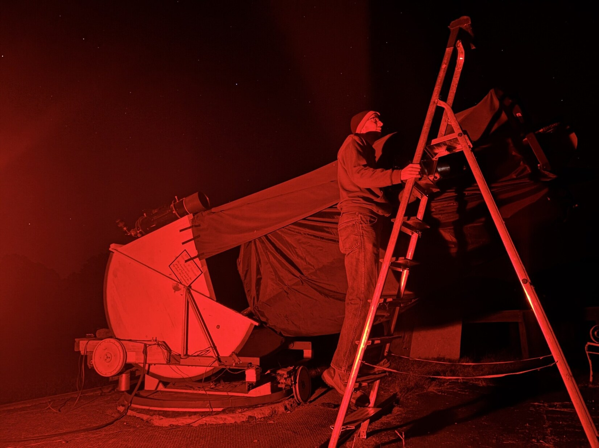
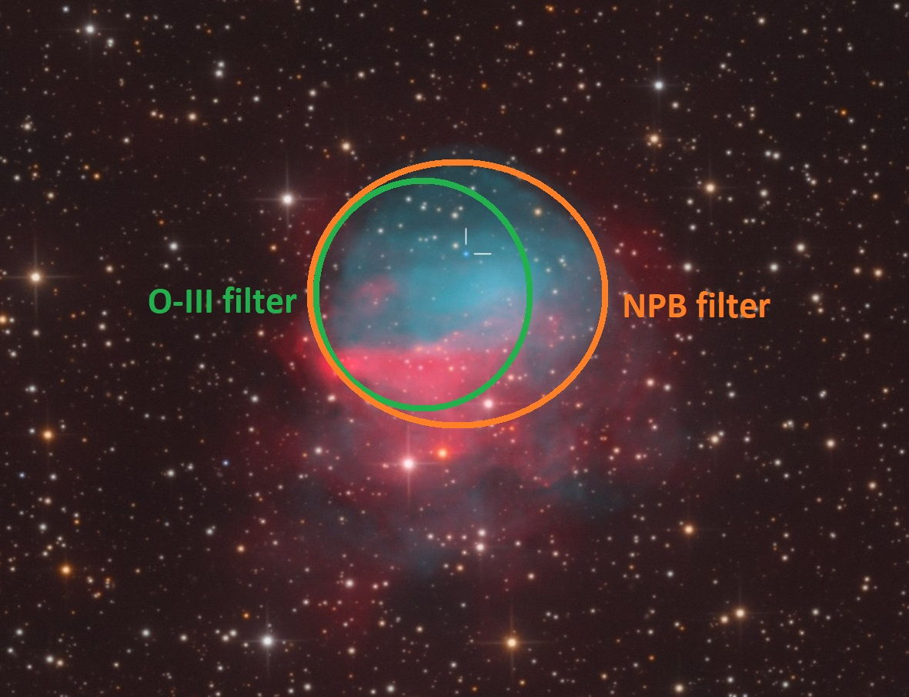
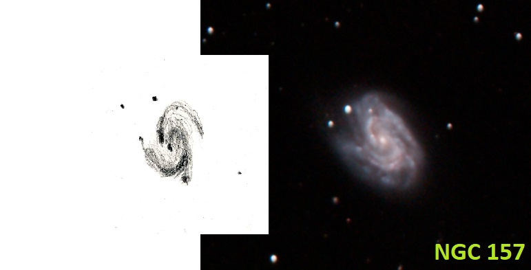
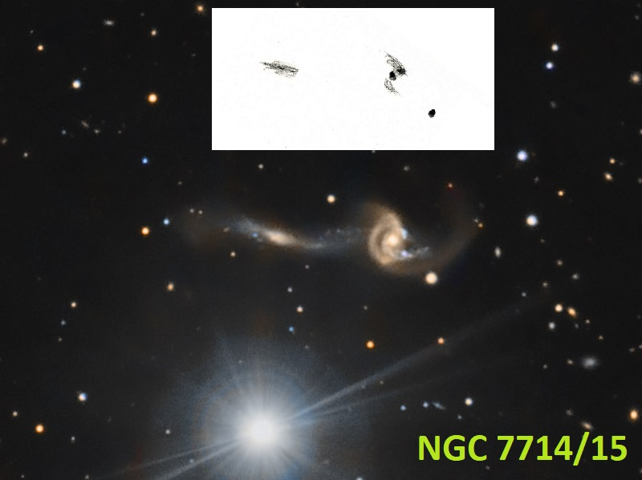
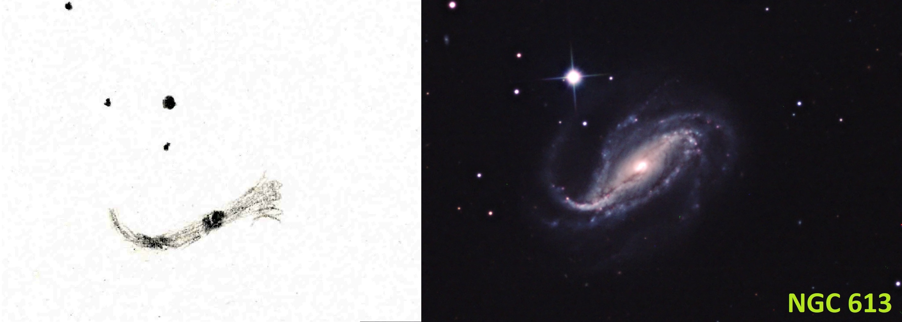
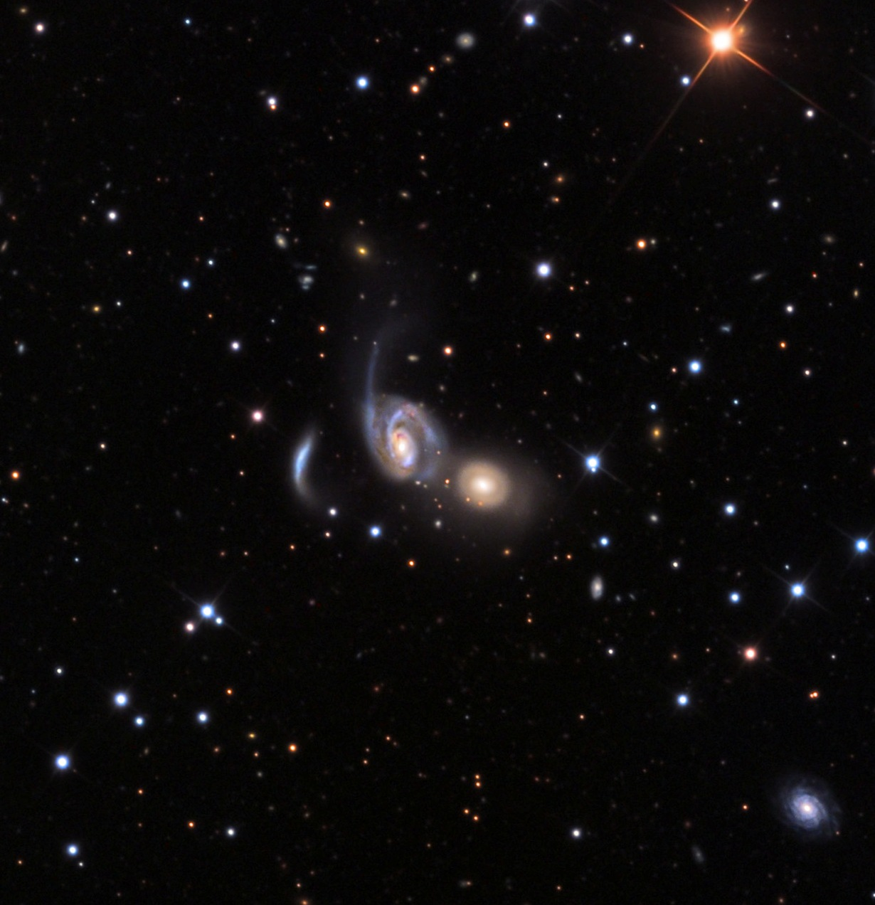

This is probably my first-ever public "observing report"!

I loaded up my older brother's Subaru Outback on Saturday morning with my 6-inch tabletop dob, a twin-sized air mattress, and my observing charts for a Sunday night escapade with a 36-inch. I was going to head 2+ hours southwest to a location of the [Arkansas Dark-Sky Festival,](https://darkskyarkansas.org/darkskyfestival/) which was taking place along Bear Creek in a rural part of the Ozark Mountains. I had never been to this annual star party, so I kept it simple by bringing my most portable telescope. The skies were supposed to be a tad darker than I have at home, so I looked forward to using my SQM-L after the Moon had set. My other motive for going was to meet up for the first time with a friend from the Central Arkansas Astronomy Society named Karl Schulz, who had brought his 16-inch Starmaster from Little Rock.

  

I'm quirky in that I've not observed much from other places than the yard directly east of my house. So, everytime I go to a location that has less trees and more stars visible closer to the horizon gives me an odd feeling. It's not vertigo, but the realization just how large the sky is! Plus, I don't have my house next to me to always subconsciously align me north to south. So, I tend to struggle a bit more in placing the cardinal directions down in the sky unless I know the time that a certain "southern" constellation is supposed to culminate.

I didn't do much observing. I most enjoyed chatting with a few fellow amateur astronomers (Kent Martz from Explore Scientific is just an awesome guy, if I do say so myself). Which is basically what I did this past June in Bryce Canyon while attending the Astronomical League's annual convention. Plus, the fog started rolling in at midnight, so I called it a night and crawled into my sleeping bag in the back of the vehicle. Maybe I'll come back next year and set up my 16-inch for public viewing.

I enjoy every minute I get to hang out at [America's first National River...the free-flowing Buffalo](https://www.nps.gov/buff/index.htm). I drove up to Tyler's Bend and admired the bluff's and such. Amazing how close it is and how little I actually spend over there. One of these days I'm going to kayak some piece of it!

In the afternoon, I made it to my friend's house just a little south of Harrison, AR with the intention of spending one night with his 36-inch and observing a dozen or so objects. But since he hadn't used it since June, some electrical troubleshooting and collimation was in order. But we weren't in any time crunch since the Moon wasn't scheduled to set until 10:45pm. Here is my report once I started observing. But please remember that this telescope's best feature is large aperture and decent tracking. Its coating quality isn't great, there are clamshell chips out of the edge, the collimation always leaves something to desire, and the skies are noticeably brighter than I have at home. But that doesn't seem to stop me from pushing it to its limits...  

September 28-29 (10:30pm-3am; the day’s high around 84 while the morning low I experience was 60; SQM-L reading hovered at 21.05 the whole session; seeing was good; no breeze but a heavy dew) 

36” Moon. Since the Moon wasn’t scheduled to set until 10:45pm, it meant that Tut got to study the Moon a bit and even get Jeannie out there to look at it briefly. I watched it set into a wall of clouds along the horizon.

36” <x-dso>DQ Her</x-dso> nova shell in Hercules (11pm). I’ve wanted to see this ever-expanding nova shell ever since it was born 91 years ago. Just kidding…my interest has only come about in the past few years. Spanning roughly 25” x 40”, it’s a tiny one centered on a 14.5-magnitude star. In fact, befitting its residence in the constellation of the Strong Man, it forms the northeast corner of a trapezoid of stars that has the exact same dimensions as the naked-eye “Keystone”. Plus, the magnitude scheme isn’t too far off since it assumes the place and Pi Her and is currently tied with the Zeta star stand in. Using ~500x, I could not detect any unique glow close around the star. Backing down to 332x and adding an O-III filter got me several intermittent detects of a glow around the star. To be determined! I hope to nail this one with Jimi's telescope in the future.

36” <x-dso simbad="PN Ap 2-1">Ap 2-1</x-dso> EN in Aquila. At 332x the answer was “no” with and without the NPB filter. Rats. This means I still haven’t seen an emission nebula in Aquila and that doesn’t make me sleep well.

36” <x-dso simbad="PN PaStDr 5">Patchick-Strottner-Dressler 5</x-dso> PN in Lyra (11:30pm). Ah, this one is another recently discovered planetary nebula and at the moment, probably the “newest” one I’ve seen ([Thanks, Jiri](https://www.cloudynights.com/topic/976949-pastdr-5-planetary-nebula-candidate-in-lyra/)). AstroBin shows that they posted in 2020, but I’ll be reaching out to Dana Patchick soon to find out the discovery month. Three nights before, I tried with my 16-inch under less than ideal condition and came with a “maybe” detection. Tonight it didn’t give me any trouble in the big ‘scope. I started with 221x and immediately detected something with an O-III filter. But I was unsure. So, I increased it to 332x and used the NPB filter. Boom! The sky grew even darker with this filter but the nebula grew more prominent. Switching between the two filters, I noticed that the NPB made it easier to detect the western end of the nebula. A nice catch that I now feel even more confident that I should be able to see it in my 16-inch.

Patchick-Strottner-Dressler 5

36” <x-dso>CTB 80</x-dso> SNR in Cygnus (near Chi). I was attempting the “O-III bright” western wall. After over half an hour of scrutinizing the area with 221x, 273x, and 332x along with the aid of my O-III and NPB filters, I failed to confidently detect anything. Usually it wouldn’t take me this long to call it, but I kept finding a soft glow on the northwestern edge that took me a long time to convince myself was fainter stars.

36” <x-dso>GM 1-10</x-dso> EN in Cygnus (12:45am). Gosh, how is this one so hard? I was seriously expecting to see it, but couldn’t. My notes don’t mention trying a filter and only state that at ~500x, I occasionally saw something small at the location of the nebula, but have to believe that it was the combined light of the pair of stars. See [my recent OotW](https://www.deepskyforum.com/showthread.php?1873-Object-of-the-Week-September-28th-2025-%E2%80%93-Gyulbudaghian-Magakian-1-10) for more about this strange nebula.

At 1am the SQM-L read 21.07 in Andromeda/Pegasus, which was the darkest part of the sky. For this location, that’s not bad.

36” <x-dso>NGC 157</x-dso> Gx in Cetus. It was on my list of “galaxies that show a spiral structure” thanks to the fine observers on this mailing list. And it didn’t disappoint. I easily found this galaxy and was rewarded with a wondrous view at 332x. The core was soft and nonstellar while the easiest arm to detect was actually the latter end of the northern arm. It stood out thanks to a dark rift driving up between it and the central region. But I also found the beginning of the arm to contain a small bright region with an occasional star seen in it. And further out to the east from there I got plenty of hits from a compact spot that lies at the end of the southern arm. Speaking of the southern arm, its midsection was the brightest while I was pleased to detect a section seemingly thrown off from it to the southwest.

NGC 157 at 332x in 36-inch/[Pat Freeman’s image](http://www.astro-pat.com/Galaxies/NGC157-22-110912.htm)

36” <x-dso>NGC 7714</x-dso>/15 GxP in Pisces ([Hubble Image](https://sci.esa.int/web/hubble/-/55344-the-tell-tale-signs-of-a-galactic-merger-heic1503)). This chaotic scene is us catching a galaxy merger after the first pass (I assume). In images, the western component (NGC 7714) is the brighter while the eastern component (NGC 7715) is a bluer, elongated galaxy that seems to have taken the most damage. At 332x, NGC 7715 is a soft, faint streak that was longer than I expected it to appear while NGC 7714 displayed the beginning of spiral arms. I caught a few sightings of a small knot west-northwest of its bright core, which in images is a piece of NGC 7715 that got stolen.

NGC 7714/15 at 332x in 36-inch/[Rick Johnson’s image](https://images.mantrapskies.com/catalog/ARP-GALAXIES/ARP284-NGC7714-NGC7715/index.htm)

36” <x-dso>NGC 613</x-dso> Gx Sculptor. I ended up looking at this one just as the thin, wispy clouds from Oklahoma were making their way in. So, it may have affected my view some. At 221x I was pleased to quickly notice the eastern end of this galaxy’s bar curving northward with a bright section in the curve. However, the western end seemed to fizzle as it merely grew fainter and expanded north and south. The galaxy’s core was elongated and quite distinct while the bar seemed to be of fairly even width.

NGC 613 at 221x in 36-inch/[Casandra Martin’s image](https://telescope.live/gallery/ngc-613-barred-spiral-galaxy)

36” <x-dso>NGC 7805</x-dso>/7806 (Arp 112) GxP in Pegasus. I’m ashamed to admit that it was only after I observed this pair that I realized it was a trio. I was mainly after the nebulous arc east of the spiral NGC 7806 and was excited that it was seen at 332x as a very short, linear smudge. I had it in my head that this was some weird arm of NGC 7806 after seeing an image of it earlier this year and it was actually on my list to observe with Jimi Lowrey’s 48-inch this autumn. But, while restudying images of it in the daylight after my observation, it clicked. This was merely a small interacting galaxy that has been heavily distorted by the larger pair! And it’s known as MCG +05-01-026. Goodness. Sometimes I think I’m smarter than I actually am. As for NGC 7805, it displayed a compact core while the one at the center of NGC 7806 was more diffuse.

  

**Arp 112 Trio/**[Adam Block’s image](https://planetary.s3.amazonaws.com/web/assets/pictures/20151113_n7806.jpg)

36” <x-dso>NGC 7741</x-dso> Gx Pegasus. This galaxy is probably a flocculent barred spiral inclined such that its western edge is closer. At 332x I was after the H II knot east of the bar and failed to detect it. I thought I was just ahead of the tendrils of clouds by viewing this high up, but all I could make out was a bar of light in a soft, slightly oval halo of nearly equal surface brightness.

36” Saturn. Saw Titan, Iapetus, Rhea, Dione, Tethys, and Enceladus.

At 3am I called it quits with thin, high-altitude clouds covering most of the sky.

I drove home on Monday afternoon after taking a peek at the Sun with Tut's 90mm Coronado SolarMax telescope.

-Scott Harrington-

--   