
<h2>Part 1</h2>

The forecast looked way too good to not go. I was originally slated to go to west Texas to observe with Jimi Lowrey's monster 48" dob along with Howard Banich and our very own Steve Gottlieb, but that plan fell through. Death Valley not only suggested itself because of the good weather forecast and dark skies, but also because of the kind of temperatures that you don't need to have that extra Canadian layer of blubber that folks like Chris and Shane have.

The Clear Sky Chart was surprisingly optimistic, a tad too much. Astrospheric was mostly right \-\- Thursday and Sunday nights were soupy, Friday and Saturday nights were exceptional \-\- it was just the details of when and how the sky would go south that were not quite right.

  

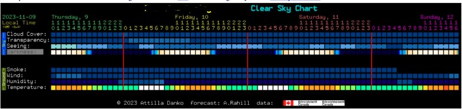  

*
An overly optimistic CSC, enough to induce FOMO. I blanked the location for social media, but it's the Panamint Springs chart.
*

  

Having taken the day off, I made a relaxed afternoon departure from home on Thursday. With the subpar forecast, night 1 was going to be a short 25x100 binocular night. I pulled into a truck stop at Tehachapi so I could use the WiFi to get some work done while I waited for the skies to clear. Perhaps I waited too long, it was 2:30 AM when I set up my binoculars at a site recommended by fellow [TACo](https://observers.org) Tarun Kottary near Olancha. My car thermometer read 26°F when I parked, and 23°F when I went back in to sleep. Yikes.

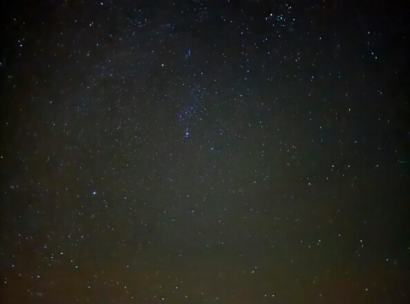  

*
A cold night with usable skies
*

  

The conditions were unimpressive for the arduous drive; a "bad Bortle 2 / good Bortle 3" I logged. However, I picked up hints of the zodiacal band between the winter milky way and Leo. Light domes were present in all directions except north\-east. Surprisingly, the site had great Verizon and AT&T, so I should have done my laptop tasks there instead.

  

Despite the moist conditions, Orion was looking good. For the very first time, I noticed with the naked eye that the belt stars of Orion had halos around them whereas the brighter Rigel did not. This is, I believe, indicative of the nebulosity around the belt! Inspired by how good Orion looked, I held up an H\-beta filter to my eye and looked carefully for Barnard's loop. I wrote in my logs "Not 100% convinced, but likely strong enough to log. A consistent extended glow was seen near the position off M 76, curving and stretching around 4\-5° of the sky. The glow flashed in perhaps 10\-12 times during the course of observation and was very intermittent. Moving my head around helped make it better".

  

I set my binoculars on Pleiades to study the nebulae. Within seconds, the lenses completely fogged. The next hour or so was spent trying to combat condensation on the eyepiece. It was exasperating \-\- I tried to use a CPAP mask to redirect the airflow away and a lot of duct tape to seal the region around my nose to no avail. It definitely made for a funny look, but with thankfully no one to see.  

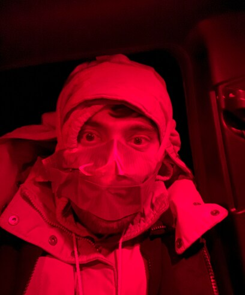  

*
I wondered how many ghost sightings might just be disgruntled astronomers trying to fight condensation in the dark, waving around red lights.
*  

  

  

Well, that was the end of night 1\. I felt like an utter idiot for even staying up so late. Hey, at least I got to see the Barnard's Loop with the naked eye just aided by an H\-beta filter. The moon came up at 4:15, and I decided to see some nebulae in my dreams instead.  

  

Next day I promptly went to the hardware store in Lone Pine looking for a bulb blower, DDK's solution to the evil of condensation. I ended up purchasing a funky air pump as insurance against the dew, which I thankfully did not have to use. Night 2 was not bone dry, but dry enough. On my way out of Lone Pine I learned at the Eastern Sierra visitor center that Death Valley had a number of road closures because of the heavy flooding that the eastern Sierra got from the snowmelt from a record snow year. Unfortunately the road I camped on in March was part of the closures, so I had to get innovative. Having a 4x4 and no telescope trailer is an advantage here, for I used my Benchmark atlas to guide me onto some old mining roads outside the national park on BLM land. As sunlight faded, I searched around a valley surrounded by hills for any spot that would have a decent southern view, and did manage to find one at the cost of substantial obstructions in other directions. A Garmin InReach mini and knowing that a couple had parked in a Sprinter van within a long but doable walk gave me some security for being alone in this desolate location.  

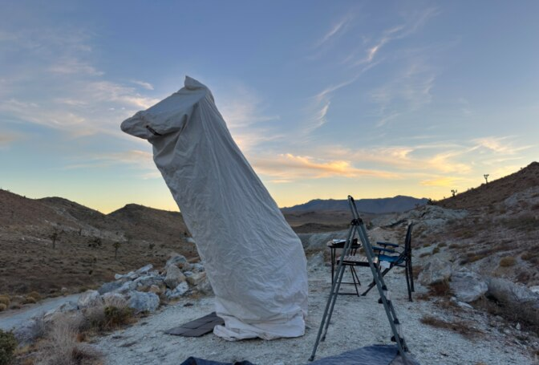  

*
The site outside Death Valley that I used for two nights
*

  

Night 2 made me forget all the efforts of getting there. The skies were exceptional, the conditions at least a Bortle 2, if only because of Los Angeles. The zodiacal band (ZB) was faintly visible, the zodiacal light (ZL) being frustratingly bright. The ZB emanated from the ZL in Sgr/Cap, traversing all the way past Jupiter in Aries. A diffuse but obvious elongated light dome spanned the southern horizon, all other horizons blocked by hills. Winter milky way was structured and strong but vanished into extinction at about \~20° altitude \-\- Tarun had correctly cautioned me that the airglow was going to be bad, I wonder where he gets this information. It was a warm and nice 47°F to start the night off, and surprisingly only dipped to 39°F by the end of the night \-\- way warmer than forecast.  

  

Setting up my 18" telescope naturally got late because of the site hunting: I perhaps burned an hour of darkness. Frustratingly, my plate solving system would not run because of a broken Python environment (the price of living onArchLinux and not testing the stack after an update), so I promptly put in a 9x50 RACI finder in its place and went old\-school starhopping. My equatorial platform, fixed by Randy Pufahl at GSSP, has never worked this well mechanically before. However, perhaps the reduction in friction and contact resistance (we applied carbon grease!) had made the platform run faster so I found myself tracking objects eastward. Over the course of night 2, I managed to trim the pot on the buck converter supplying power to the motor to get perfect tracking, letting me cruise at 590x without trouble on the subsequent night! I did not set up the binocular.  

  

The night was extremely productive, with 29 log entries \-\- gotta love the long winter nights! Whereas some were popular targets like M 31 yet others repeat targets like Barnard's Loop, I also looked at challenging targets like Cas 1 or Eridanus Globular \-\- after all that's what one drives to Death Valley for. My salient observations from the second night detailed below,

  

1\. The "Twist" in <x-dso>M 110</x-dso>
  

Looking at Tarun's photo of M31 made me realize that there's a "twist" on either end of M 110's elongated body, perhaps due to the pull of M31\. I had not heard of any visual observation of this, but I anyway gave it a shot. Sure enough, it could be traced out. I failed to note down which eyepiece I was using, most likely the 31mm Nagler which gives the maximal exit pupil on my scope. I may have had an intuition for how the twist must go at best, but otherwise I tried to sketch without looking at an image beforehand.

  

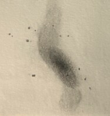  

*
The "twist" in M 110
*

Going back to an image and doing a careful comparison, it turns out I haven't seen all of the tidal tail and the glow is really wider than I've drawn.

  

2\. A bright patch in the zodiacal band?  
  

For some reason, the part of the ZB running through Pisces had a soft brightening right below the face of the eastern fish, to be precise, to its southwest. I have no idea what this is. At first I thought perhaps it could be [Kordylewski clouds](https://en.wikipedia.org/wiki/Kordylewski_cloud), but coming back and measuring the distance from the moon to the eastern fish "circlet" it seems to be around 165°, way more than the 60° expected of the lunar Lagrange points. It was certainly not the Gegenschein, which was nestled between Hyades and Pleiades. I also saw it consistently at the same location, or at least approximately same location the next night.  

  

3\. Star in Andromeda Galaxy, <x-dso>LGGS J004406.32+420131.3</x-dso>

  

Steve Gottlieb published an OR many Calstars ago in which he detailed the observation of an individual star in M31 through his 24". Seeing an individual star 2\.2 million light years away! Wow! Finally, I got around to giving it a shot and (if I did it right) it surprisingly was not too difficult! It is supposedly V \= 15\.60 mag but I logged it as being brighter than a 15\.0 mag star, and way brighter than a 16\.0 mag star. The drawn star field however confirms the sighting.

  

4\. <x-dso simbad="PN BV 1">Böhm-Vitense 1</x-dso>

  

A really oddball planetary nebula discovered by Prof. Erika Böhm\-Vitense of U of Washington, BV 1, appears in Scott Harrington's Dec 2022 Sky \& Telescope article on Cassiopeia planetary nebulae. I finally got around to giving it a go. A ghostly streak was held about 85% of the time with averted vision, and higher power revealed that the eastern side was lumpier / brighter than the rest of the streak.

  

Here's a really nice picture of the planetary: <https://www.astrobin.com/bpnhaq/>

  

5\. <x-dso>Cas 1</x-dso>

  

Cas 1, one of the faint Maffei group dwarf galaxies that has given me much suffering over the years, finally yielded sufficiently to convince me that I've seen it.  A weak, slightly elongated E\-W glow was repeatedly caught at the expected location. The feeling was very intermittent, but reproducible, best when freshly going to the eyepiece. Exact location was discovered and confirmed against DSS2\. The superposed star is intermittently resolved.

  

6\. <x-dso>NGC 918</x-dso> and foreground IFN

  

Prompted by [Uwe Glahn's DeepSkyForum post](https://www.deepskyforum.com/showthread.php?1726-Object-of-the-Week-November-5th-2023-%E2%80%93-NGC-918-and-its-surrounding-Molecular-Clouds), I took a look at the galaxy and tried to sketch the IFN around it. It was not too challenging to see the IFN itself! Without carefully studying the DSS2, I went to the eyepiece and made the following sketch. I'm satisfied to learn that the sketch matches Uwe Glahn's and [Mel Bartels'](https://www.cloudynights.com/topic/546576-4-more-integrated-flux-nebula-including-m13-from-the-oregon-star-party/?p=7373325) in form.

  

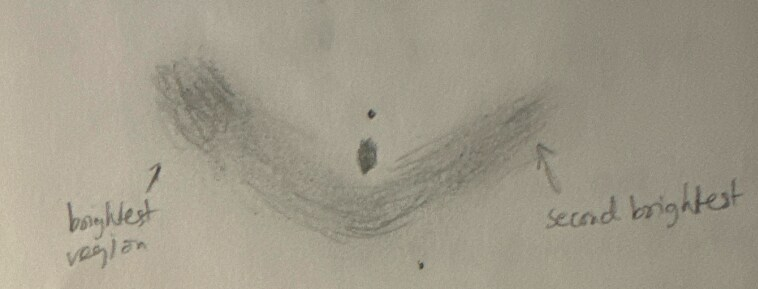  

  

  

7\. <x-dso simbad="Cl Erid 1">Eridanus Globular Cluster</x-dso>

  

This is a Milky Way globular cluster appearing on [Harris' list](https://physics.mcmaster.ca/~harris/mwgc.dat). Whereas I only had a plausible observation of this from Pinnacles in January, I managed to nail down the exact position with only a rough idea of where the object was. A weak roundish glow appeared intermittently in a 18mm Baader Classic Ortho.

  

8\. <x-dso>NGC 1555</x-dso>

  

I took another look at Hind's Variable Nebula, having logged it twice earlier this year. A weak intermittent repeated sensation of a brightening only slightly detached from T Tauri in the correct orientation. The sensation winked in and out as my averted vision scanned the region around the star.  

  

9\. <x-dso>UGCA 105</x-dso>

Yet another Maffei group galaxy, this one was painless unlike the remainder of said group. I had to know where to look, but it was not difficult. An elongated glow was continuously held with averted vision. A core stood out from the glow as a brighter, condensed, fuzzy spot.

  

10\. <x-dso>Arp 123</x-dso>

  

An excellent interacting pair that I had not seen before in Lepus.

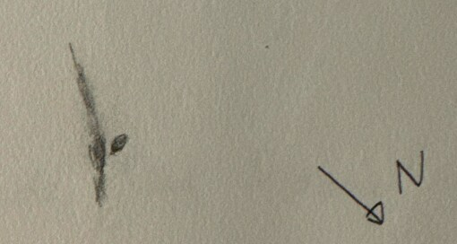  

  

  

11\. Nebulae around Orion's belt

  

I lumped several of these into a single item here \-\- I noted reflection nebulae <x-dso>IC 425</x-dso>, <x-dso>IC 423</x-dso>, <x-dso>IC 424</x-dso>, <x-dso>IC 432</x-dso>, <x-dso>IC 431</x-dso>, and an uncharted (in my planetarium) wall of reflection nebulosity around 5:34:35, -01:20:28. This last bit of nebulosity bears the name <x-dso simbad="[C51] 123">Courtès 123</x-dso> = LBN 940 according to [Victor van Wulfen](https://clearskies.eu/). The <x-dso simbad="NGC 2024">Flame Nebula</x-dso> appeared spectacular. I was compelled to make a quick and rough sketch that is most certainly out of proportion and shape.  

  

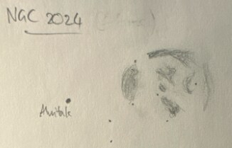  

  

  

12\. <x-dso simbad="Sh2-276">Barnard's Loop</x-dso>

  

Even though I had seen Barnard's Loop over a decade ago through observing buddy John Tatarchuk's 25" in central Texas, I failed to log it. Motivated by it being the last item on the RASC Deep Sky Challenge list, I studied Barnard's Loop through an H\-beta filter, with both the naked eye and the 18".

  

With the 18", I started near M 76 and NGC 2021 and moved in the direction of the nebula. It was not too difficult to pick out, and I was able to trace it a bit, prompted a bit by the DSS2, and made the following sketch:

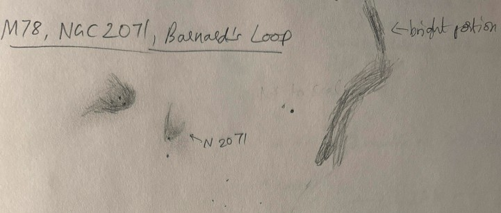

  

With the naked eye on the other hand, I was also able to see it better on night 2 compared to night 1\. I did not know the exact flow of the loop through Orion and the sketch was forced upon me despite misaligned prejudices. The nebulosity was very weak and intermittent, unlike through the 18". The milky way detracts from the view. Two brighter spots were seen along the loop.

  

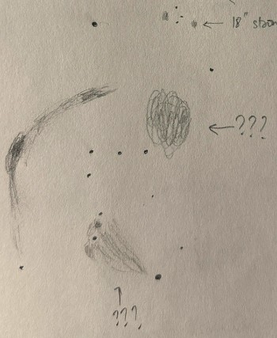  

  

During the naked eye observation, I also noted brightenings in two other regions of Orion (marked ??? in the sketch) and I don't know what they are. Given how bright the Milky Way looked through the H\-beta filter in comparison to the glowing gas of Barnard's Loop, I would not be surprised if these too were star clouds rather than nebulae.

  

I ended night 2 by hand\-holding my iPhone 15 Pro to the eyepiece of my tracked telescope and shooting several 10 second night mode exposures. I was shocked by the results.

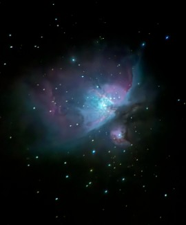

  

The temperatures being pleasant and aluminet draped over my truck, I slept like a baby in complete solitude. There wasn't a single vehicle driving through those roads to awaken me. I started the next day with camping chores and a trip towards Keeler to get some cell service. Clouds coming over the Sierra alarmed me, but Astrospheric (and Tarun) assured me that they would pass. Indeed they did and night 3 was exceptional as well, as I will expound on in Part 2\.

  

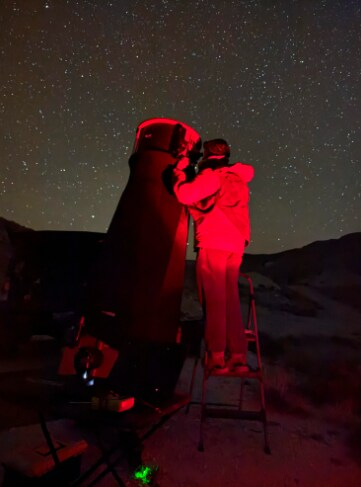  

<h2>Part 2</h2>

Alas, the LA metropolitan area and its surroundings like Ridgecrest and Bakersfield make the general area a Bortle 2 sky instead of a Bortle 1\. I imagine only Ubehebe Crater and thereabouts is sufficiently far from various major metropolitan areas that it perhaps remains Bortle 1, but I haven't been able to spend a night there yet; moreover the roads there are closed at the moment.  
  

A Bortle 1 sky is truly an observer's nirvana, and the mere experience of being under such skies is incredible; I have simply stared at the Milky Way for 20 minutes dropping my observing program to admire its beauty under such conditions. In Bortle 2 the effect is similar away from light domes. Where I was set up in Death Valley, the winter Milky Way away from light domes was simply incredible; notably the band by Gemini was the thickest I've ever seen it. The southern sky was not as spectacular due to the light dome. Yet, experienced observers have iterated that transparency is more crucial than light pollution, and I begin to concur. The excellent transparency made my pointing low south on Night 3 worth it.

  

Although I did make a trip to cell service on Day 3 (Saturday), I did not manage to fix my plate solving Python environment despite a few attempts, and I decided it wasn't worth the time and data. In fact I was strapped for time since I woke up at 12 PM and had to be at camp by the early sunset of 4:45 AM; that too after finishing camping chores, driving to cell service, using the cell service, driving to a restroom and back. I managed to return in time to see a beautiful evening sky with few clouds adding to the view, which thankfully cleared rapidly as it got darker just as Astrospheric had promised. In addition to the 18" I set up my 25x100 binocular on its parallelogram mount, wanting to exploit the wide field instrument that really shines under such dark and transparent skies. Night 3 turned out to have both exceptional transparency and great seeing, a combination that's hard to come by!

  

I awaited astronomical darkness by trying out some iPhone astrophotography, and I had a decent result with the ring nebula:

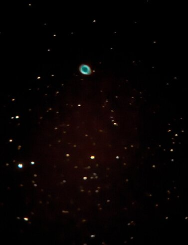  
My observations began with my own Halloween curse taking effect on me. I started by logging M 72 for the first time through my 18", but that wasn't the real goal \-\- M 72 lies not far from one more of those dreaded local group galaxies, the Aquarius Dwarf. Scott Harrington's CN post and Mel Bartels' recent successful observation added impetus to my giving this a try.

  

1\. <x-dso>Aquarius Dwarf</x-dso>

I was surprised because it was much brighter and easier than I had anticipated! But let me not understate the difficulty, it is simply that my expectations were worse. With a 20mm Pentax XW eyepiece, a glow was immediately picked up at the expected location. However, the DSS2 (I have the entirety of JPEG HiPS tiles offline on my laptop) showed a faint asterism of 5 stars overlaid on the location of the galaxy. Could I just be seeing the glow of the asterism? To verify, I upped the power to 147x where the stars were clearly resolved, although intermittently appearing to averted vision. The glow was then localized in a region devoid of stars, confirming that it was not simply the nebulous appearance of an asterism at low power. The visual extent of the glow was larger than what was expected from the DSS2\.

  

The object was really dim. To confirm if I really got the object, I tried to check for glows elsewhere in the field \-\- to see if I could imagine it in other places. Frustratingly, I did sense a brightening in a region south of the object at 20:46:48 \-12:57:47\. It was however reproducible. I vaguely remembered Mel Bartels' post about the object mentioning IFN in the subject line, so I logged it. Turns out that Bartels did sketch IFN in that region, saying it was one of the brighter portions. But I failed to pursue the full IFN and its detailed structure because I wasn't looking for it.  

  

2\. <x-dso>NGC 7135</x-dso>

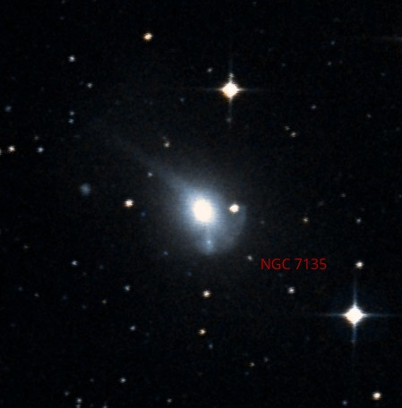

*DSS2 Color image of NGC 7135, north up*  

Next up I attempted this beautiful galaxy, hoping to see the tidal tail. Fairly quickly, I noticed a southward tail\-like extension. At first I thought this to be the long tidal tail I sought. After having several flashes of it, I even managed to convince my averted vision that it was really long. I then went to the DSS2 imagery to confirm the orientation of the tidal tail. I was a bit let down to see that the southward extension was not a long tidal tail, but a short tidal tail leading to a companion galaxy (unresolved) and two misleading stars giving it the look of a long tail. I went back to the eyepiece and tried hard to see the long, bushy tidal tail and also resolve the tiny companion galaxy in the short tidal tail. The companion never resolved, but I managed to get a few flashes of the long tidal tail going north east repeatedly after knowing what to look for. I nevertheless consider this a weak observation because I was unable to call it out and thought the southern tidal tail was this one. I would love to look at this fascinating galaxy through larger aperture or from a place where it is higher up in the sky.

  

While looking for this galaxy, I noticed nearby IC 5135 which seems to be [a Seyfert galaxy that's interesting in its own right](https://articles.adsabs.harvard.edu//full/1990AJ....100.1034S/0001034.000.html). I was unable to see any structure other than that the halo appeared lopsided.

  

3\. <x-dso simbad="R Aqr">R Aquarii</x-dso>

  

I next pointed out to R Aquarii hoping to see some of the nebulosity, but given that my telescope is producing larger\-than\-usual halos around stars (not sure if it is the mirror or my eyes aging, but I suspect the coatings may have degraded a bit from all the pollen and dew we had at spring Calstar?) I was not sure what I was seeing. I therefore logged it as a "Weak observation if at all". I sensed a spiky halo @ 345x and 413x that was oriented N\-S and a weak elongated halo at low power going E\-W. The eastern side was brighter and had a detached brightening at its end, but it was difficult to rule out optics.

  

4\. <x-dso>UGCA 442</x-dso>

  

After a failed attempt at Sculptor Dwarf Irregular Galaxy (SDIG), I looked at this beautiful edge on which was held 90% of the time with averted vision. The SDIG (not to be confused with the Sculptor Dwarf \= Sculptor dSph) is a member of the Sculptor galaxy group and UGCA 442 is a suspected member I believe. I discussed SDIG in [my Deep Sky Forum Object of the Week post on NGC 253 and company](https://www.deepskyforum.com/showthread.php?1725-Object-of-the-Week-October-29th-2023-%E2%80%93-NGC-253-the-Sculptor-Galaxy-and-its-companions) and was hoping to catch it, alas. As for NGC 253 itself, I failed to look at it; shame on me.

  

5\. <x-dso>NGC 7497</x-dso> (galaxy) \+ <x-dso>MBM 54</x-dso> (IFN)

  

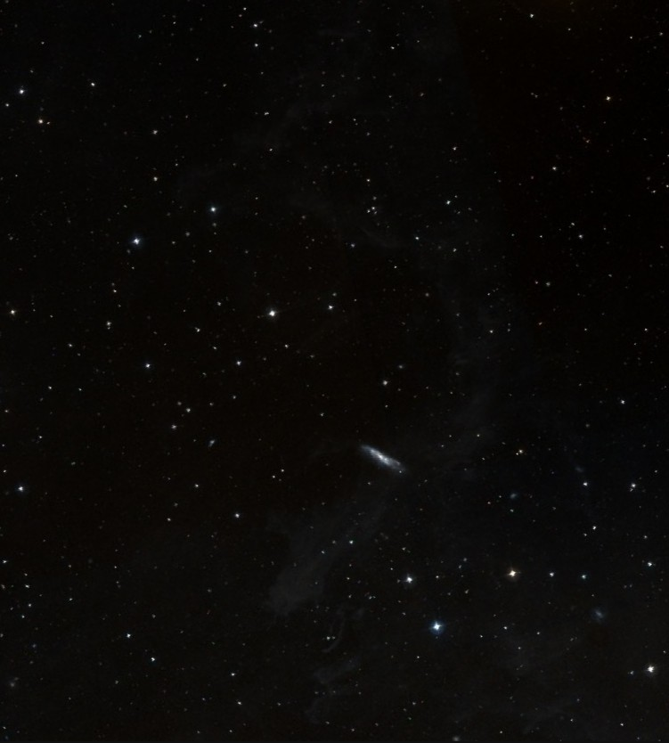

*DSS2 color image of NGC 7497 and surroundings in the observed orientation. North is at 5:30 clock position.*  

This may well be the ["Hello World"](https://en.wikipedia.org/wiki/%22Hello,_World!%22_program) of IFN because the nebulosity is so obvious on the DSS2! Having looked at the IFN around NGC 918 the previous night, this object was obviously on my mind. I tried to make a blind sketch without looking at the DSS2 plates. After about 30 seconds of staring around NGC 7497 through a 31mm Nagler eyepiece (which gives me a 6\.9mm exit pupil), the IFN appeared the strongest SE of the galaxy. With time I could see the IFN spreading behind the galaxy, as if NGC 7497 was the head of a comet and the IFN were its tail. Eventually I noticed the IFN past the galaxy to its northwest.

  

I also noticed the IFN make a sharp corner and turn clockwise right where it ends in the shown DSS2 image below the galaxy. I'm not certain what this extension was, because I'm not able to corroborate it with deeper images. One of the issues with this part of the observation was that it lay at a corner of my highly vignetted eyepiece field and moving it elsewhere would bring the bright star HD 218235 into the FOV ruining my adaptation. Perhaps it's just me being overoptimistic and seeing something that did not exist, or perhaps it was a vignetting artifact that I ended up thinking was a real nebulosity. Either way, I need to be more meticulous. This is after all my third or fourth attempt at seeing IFN. Below is my sketch

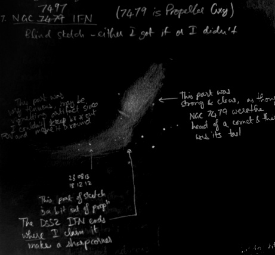  

  

6\. <x-dso simbad="HCG 100">Hickson Compact Group 100</x-dso>

  

This is a beautiful chain comprising of stars and galaxies! I was able to pick out all 4 galactic members, and also Markarian 935 which does not seem to be part of Hickson's group.

  

7\. <x-dso>IC 10</x-dso>

  

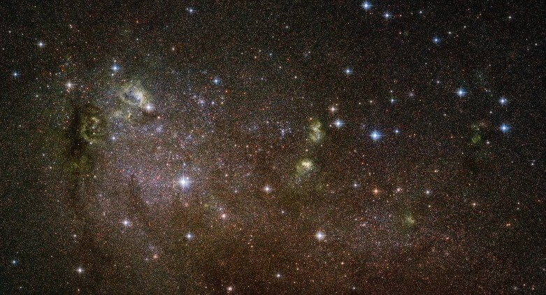

*
Hubble Space Telescope image of IC 10
*  

  

This object was prompted by Scott Harrington's [CloudyNights post](https://www.cloudynights.com/topic/897954-ic-10-the-hidden-dwarf-article-in-sky-telescope/) and article in Dec 2023 Sky \& Telescope. In the article, Scott listed a number of clusters and HII knots in IC 10, a dim local group dwarf galaxy with starburst. I pointed to IC 10 with 25x100 binoculars first to get the positioning, and logged a "very faint oval glow oriented vertically with N at 4 o' clock, which flashed into view several times." Then I got the object in my telescope, where it appeared as a structured, very elongated glow with a brighter central region but no core. I then racked up the power to try for the knots in the galaxy. I was rather fatigued from the constant staring into the eyepiece, and this being the third night. I did not manage anything but for the knots A and B (Scott's designations) despite trying to observe at 590x (a 3\.5mm eyepiece!) on a night with excellent seeing! The tracking platform was fine, but 590x amplified the slightest vibrations of the scope which made it trickier to observe. Knot "A" was a distinct, nebulous blob flanking a star when seen at 350x, and upping the power to 460x shows that star also enshrouded in the nebulosity. As for knot "B", best viewed at 590x, was very weak and intermittent. I got 3\-\-4 flashes at the exact location. I could not detect globular cluster TG24 despite trying hard for it.

  

I subsequently had a string of non\-observations. I tried for And IV where I tried to guess which star of the two in the field had the halo attached, and got it completely wrong. This was discouraging. I also tried for Pisces Dwarf where I instead caught the glow from some faint asterisms. As for Whiting 1, I got the reference star but was unable to see the glow. I realized my eyes were very fatigued and I must observe bright objects for a while and take some rest to recover. I subsequently hit NGC 1360 (Robin's Egg planetary nebula), NGC 1516A (a very nice interaction), Haley's Coronet (NGC 1532/1531\), and NGC 1023/1023A

  

8\. <x-dso>NGC 1023</x-dso>

  

The last time I observed DDK's favorite object, I failed to properly observe the "spur" of NGC 1023, an impression that results from the presence of companion NGC 1023A. I wrote in my logs that NGC 1023, which appeared elongated, appeared a bit puffier on the eastern side, as if bending towards the star HD22241, i.e. southward. The southward curve is due to the glow of NGC 1023A. NGC 1023A's central condensation was not seen, it blended into the main galaxy.

  

After this break from the association of invisible nebulae, I promptly returned with the

  

9\. <x-dso simbad="IC 2118">Witch Head Nebula</x-dso>

  

This faint reflection nebula illuminated by Rigel is a beautiful photographic target but a very challenging visual one. It requires excellent darkness and transparency rather than aperture, as is characteristic of low surface brightness objects. On an excellent night at the 2015 Okie\-Tex star party, I even caught it in my 9x50 finder scope. But this time my aim was to study it using my 25x100 binocular. With careful observation prompted several times by DSS2 to know where the starts of the nebulosity are, I produced the following sketch, which only follows the brightest parts of the nebula at its most contrasty (eastern) edge.   

  

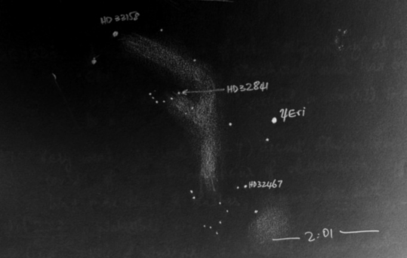

*
Rough sketch of the witch head nebula as seen through my 25x100 binocular
*  

10\. <x-dso simbad="Sh2-276">Barnard's Loop</x-dso>

  

I went back to Barnard's Loop using the unfiltered 25x100 binocular, having studied it through the naked eye and through the 18". Starting from the stars north of M 76, the band of nebulosity could be followed down towards the west of open cluster NGC 2112\. The cluster was almost embedded in the nebulosity, although the main flow runs to its west after turning southwards from the M 76 region. The glow continues south and then appears to curve westwards. I lose it around the same declination as Alnitak

  

11\. <x-dso>NGC 1333</x-dso> and <x-dso simbad="HH 7">Herbig-Haro 7</x-dso>

  

NGC 1333 was a beautiful, curved stream of nebulosity "originating" at a bright star and curving counterclockwise. It was pretty structured and had a notably bright knot of nebulosity around a star east of the bright star.

  

I came to NGC 1333 not only because I hadn't seen this beautiful nebula before, but also because of the [Herbig\-Haro object](https://en.wikipedia.org/wiki/Herbig%E2%80%93Haro_object) HH7\. I found HH7 exceedingly challenging. After nearly an hour of study, I managed to convince myself of having got 6\-\-7 weak flashes at the location of HH7\. The best eyepiece was a 6mm Delos that gives me 345x power and 1\.3mm exit pupil.

  

12\. [HH 222, the Waterfall](https://www.deepskyforum.com/showthread.php?1567-Object-of-the-Week-February-28-2022-%E2%80%93-HH-222-the-Waterfall)

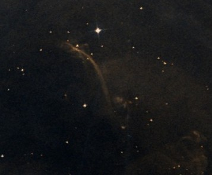

*
DSS2 Color image of the Waterfall
*  

<x-dso simbad="HH 222">The Waterfall</x-dso> is not an easy target, but eagle\-eyed Howard Banich reported it from a mid\-19 MPSAS sky under excellent transparency. Uwe Glahn also followed up with his 27". I gave it a shot with my 18" and perhaps spent over half an hour staring at the region, during which a crescent\-shaped weak feature was detected vaguely several times. After another half an hour of staring I got some convincing flashes of the weak structure. I consider both this and HH7 weak observations, partly because of how fatigued I was.  

  

At this point, astronomical twilight had begun and I added more detail to my sketch of the Rosette Nebula, first started in February when I was observing at WH. This is the first time I have gone back and added detail to an existing sketch.

  

I slept a good chunk after Night 3, packed up and hit the road out of Death Valley to Lone Pine on Sunday afternoon after doing some light exploration of the area I was in. After accessing some good coffee and food in Lone Pine, I made my way up to Big Pine to the pull out off Hwy 168 that has a fantastic view of the Sierra peaks. I needed cell connectivity to take my morning meetings on Monday, plus the forecast predicted plenty of clouds, so it made sense for me to move closer to civilization. It was a night of suckerholing with the 25x100\. The transparency in the holes was pretty good. My modus operandi for suckerholing is to open whichever page on Interstellarum Deep Sky Atlas (IDSA) seems to be in the sucker hole and see what is within reach of my binocular on that map. Lacerta was clear, so I looked at M 39 with the naked eye and figured out how to find Barnard 168 which is called the Dark Cigar in IDSA.

  

1\. <x-dso simbad="Barnard 168">Dark Cigar</x-dso>

  

This was a beautiful dark nebula! A thick dark rift ran roughly NW\-SE. It displayed substantial mottling. Although the Cigar terminates on the Cocoon Nebula, I was unable to see the Cocoon in 25x100 binoculars (I have seen it earlier in my 18").  

  

2\. <x-dso>Barnard 155</x-dso>

  

A sweet\-potato shaped dark nebula extends N\-S with about a 4:1 aspect ratio, and is centered in a region full of Y\-shaped structures of less contrasty dark nebulosity.

  

3\. <x-dso>IC 1613</x-dso>

  

Returning to the local group, this faint dwarf galaxy appeared as a vague, dim, amorphous glow that can be held continuously with averted vision. The glow almost filled the faint triangular asterism that it is nestled in.

  

4\. <x-dso>M 33</x-dso>

  

Studying M 33 for several minutes with averted vision revealed a few flashes of the spiral structure in the 25x100 binocular! Moreover, I managed to pick up on a "double star" at the end of the spiral arm, one of the "stars" being rather intermittently seen. What I was hoping for was correct \-\- the location matched with the position of the great nebula [<x-dso>NGC 604</x-dso>](https://www.deepskyforum.com/showthread.php?453-Object-of-the-Week-October-6-2013-NGC-604) in M 33\. I never imagined it was feasible in a 25x100 binocular!

  

As the suckerholes closed in with constant poor transparency, I figured it was time to sleep. My Monday started with several meetings, in\-between which I managed to grab lunch in Bishop. After work, in the couple hours of daylight left, I proceeded towards Tioga pass which was still open. The fresh dusting of snow on the mountains surrounding Tenaya Lake made for incredible views when the belt of Venus rose behind them. After spending some time at Tenaya Lake and Olmsted Point, I drove home without much ado, with a lot of observations I'm very happy with in my logbooks.

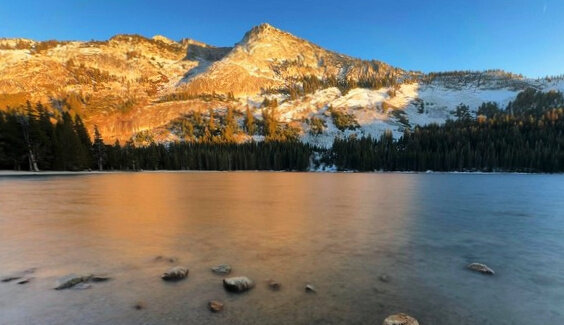

*
Golden hour at Tenaya Lake in Yosemite National Park
*

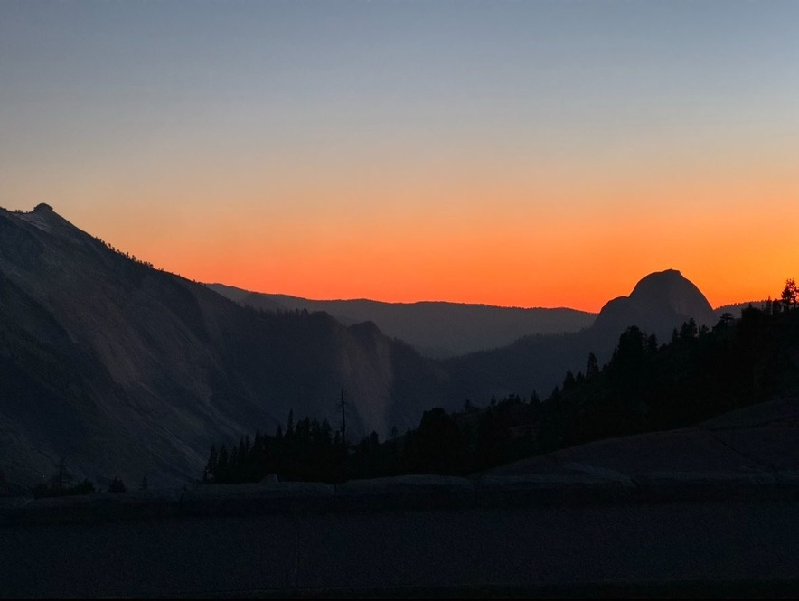

*
Half dome Silhouetted against the sunset colors at Olmsted Point
*
