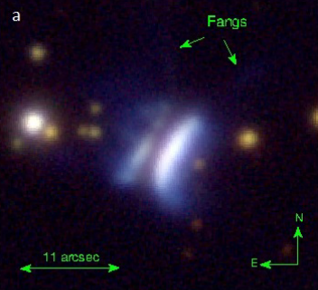

For once, I was only 15 minutes late in leaving home. I'd packed and prepared everything in advance, and laid out everything that needed to get into the truck in the morning in our hallway. Mom was going to make me brunch and dinner. The forecast was looking great except for some smoke. I was going to join Tanveer and Shashi and head out to an observing site I'd never been to before. My mom was going to join with a newfound friend Jan, a beginner in astronomy. Our drive was impeded by unexpected traffic on 101 delaying our ETA at the site to 7 PM instead of the anticipated 6 PM. I was still going to set up in the daylight, right?

  

Arriving at the location, various factors took me on an emotional roller coaster making me anxious, and then absolutely irate and visibly annoyed. I apologize if I pulled my fellow TACos' mood down a bit through this mess. All of this set me back by an hour; so yes I was setting up in the fading twilight. Shashi and Tanveer helped me wrangle the unwieldy rocker box and mirror box and we had the lower assembly done. Still not in the right frame of mind, I slowly put together the rest of the telescope holding a red flashlight in my mouth. I also managed to set up the upper tube assembly by myself—something I had not done before and wanted to practice.

  

Phew, 9 PM, astronomical twilight is fading and my telescope is all set up. I remove the primary mirror cover and start undoing the secondary mirror cover and the velvet bag feels heavier than usual. Oops. I knew the secondary must have fallen out of its holder. How did it happen? I had no clue! This was the second time the scope was set up, so I anticipated trouble of some form—but I should've been crazy to expect this!  

{: .small }

<i>The secondary was my primary concern</i>

  

The velvet bag had protected the secondary and there was only minor damage to the exceptional flat (I have a Zygo test)—it had chipped a bit in a rim region without much consequence (as far as I know). Not knowing what the cause might be, I checked if some of my experienced friends were awake. It's nice to have LTE on the field. Randy and Jimi helped me navigate the issue, saying there was probably nothing wrong with the holder. I was initially confused as the mirror seemed very floppy in its holder. Tanveer, Randy and I figured out why—the foam backing the secondary had collapsed and had to be refluffed. Once we did that, the secondary sat properly; it would have anyway done that under gravity even if we hadn't. Then what caused the secondary to fall out? Still a mystery, but I have an idea—it's the bumpy ride in the bed of my truck that made the mirror momentarily fly up several times, and it finally found its way out of its prison. I'm inviting your ideas (DM me) so I can ensure it never happens again.

  

Anyway, all that was left was to tighten the secondary holder, but I was wiped out by my emotional roller\-coaster that I just sat there staring at the problem not having the energy to do anything about it. Tanveer and Shashi's timely support in restoring the secondary and seeing it all fall (not literally) in place kicked up my spirits. I rapidly became convinced that there was nothing fundamentally gone wrong with the secondary holder, and the result was some bad impact. By 11 PM I was collimating, and by 11:20 PM the scope was operational! The fun could finally begin! I really thought I'd be packing up and going home, but here I was, observing!

  

All this while the skies were excellent, perhaps a good Bortle 3\. I may call it a Bortle 2 if not for the smoke extinction—it was dark, but the milky way looked washed out. There were hardly any light domes visible distinctly to my eyes! The 2 imagers (Tanveer, Shashi) and 2 visual astronomers (Peter K, myself) had set up a healthy distance apart to prevent light interference. Since we had beginners (I was expecting more) and imager friends, I planned a lot of bright and popular targets until 2 AM, including many that I had never seen through this sort of aperture before. We started out with **M 51** which was mighty low by the time we started. Still, the view was great, perhaps on par with my 18" on a good night when it was high up. We then looked at **M 13**, which I felt compelled to describe in my notes despite having seen many times—"Absolutely mindblowing! Slightly elongated fuzzball full of stars! Very bright." I missed one object on my list, Mrk 273, due to the late start.

  

We then went on to <b><x-dso>M 17</x-dso></b>, which was impressive, but Peter suggested that I pop in a UHC filter—for some bizarre reason I had thought it might not help all that much—but the results were mindblowing! That was an absolutely jaw\-dropping view of the swan nebula, bursting with textured threads of nebulosity, completely filling the ½° FOV. The "loop" seen in [Howard's sketch of the nebula](https://lh3.googleusercontent.com/Y31icDAI4xjvb6jd0mnXoqP9v5n7p9SelpegEugR3XQcok-G4QzK1OpL9tI1Z38CeKz93viyBQx3S5AWsdUiJQPuAgUWWPNtEKVSWV6p65YHtVu4=w1280) was plainly visible.

  

Next up was <b><x-dso>M 16</x-dso></b>, which was easy to find thanks to the 9×50 finder scope. I placed it in view (with UHC) and two dark regions jumped out to me. One was the main dark region, but the other was the **pillars of creation** region. At 200x, the middle pillar was visible to direct vision. Both the dark pillars were easily held to averted vision. The low\-contrast northeasternmost pillar required some more work to pull out. It started with a dark base and ran to the north\-east of a bright star. The region of nebulosity around the star as well as at the tip (northwest) of the pillar were brighter. Wow! My mom went up to the eyepiece and easily saw two of the pillars, describing their orientation correctly. Granted, I have hardly looked at the Eagle Nebula and studied the pillars—but I remember I had to work much harder to ferret them out in my 18". Aperture is cheating. Maybe not as much as the tube, but it still is.

  

**M 57** was very bright; I could not easily see a central star, perhaps due to the UHC filter. **Saturn** appeared pretty good, but would not hold over \~300x due to its low elevation. We picked up on perhaps 3–4 moons. I picked up a color variation on Saturn's disk that I had not noticed before (it's because I never look at the planets, not because it was hard).

  

Then I tried to find <b><x-dso>NGC 6537</x-dso></b>, the [Red Spider nebula](https://www.astronomy.com/science/red-spider-nebula/). I hate star\-hopping, even more so in the Milky Way. I located what I thought was the field of the object. At this point it was mighty low with an airmass of 3\.2 on a smoky night, but an NGC planetary should be easy with a 28", I thought. But all I saw at 280x was a stellar point with a very faint asymmetric glow around it that appeared to stream eastwards from the star. A nearby asterism caught my eye repeatedly. I cannot understand what I saw or why this object was so challenging. The point appeared stellar even at 280x. I have to revisit this under better conditions.

  

We looked at <b><x-dso>M 31</x-dso></b> next, where I reconfirmed the inclined core region. At GSSP, Komal and I noticed in my telescope that M 31 has a core region that was inclined about 15° to the main disk of the galaxy. I posted on a telescope makers' group about this and learned that it might be the bar of M 31\. Huh. In the view last night through a \~25' FOV, the core was oriented 11:30\-5:30 clock position, whereas the dark lane and therefore the disk of the galaxy ran vertically up\-down. Tanveer who was viewing with me said that imagers see it in their short exposure images. M 31's dust lanes were thick and raggedy. <b><x-dso>NGC 206</x-dso></b> appeared as an elongated brightening in the arms of M 31 curving along with the arms. A few faint stars were sprinkled on the textured nebulosity. I also noticed that the core of M 31 affected one's night vision. **M 33** appeared as an S\-shaped object studded with nebulosity all over it, we did not study it deeply.

  

**Inchworm cluster** <x-dso>NGC 6910</x-dso>, one of Tanveer's suggestions, appeared as two bright stars with a meandering chain of faint stars connecting them. **The Double\-Double** (eps Lyrae), was a clean split in a 4\.5mm Morpheus eyepiece (632x). The tighter pairs were almost "touching", but definitely split. **Crescent Nebula** (<x-dso>NGC 6888</x-dso>) filled the \~25' FOV and showed a lot of scattered pieces of bright nebulosity apart from the main crescent \+ cross\-arm filaments.

  

{: .medium }

<i>Tanveer on the ladder, probably looking in the Cyngus milky way area</i>

  

<b><x-dso>Sh2-136</x-dso></b>, a fairly small reflection nebula that Tanveer recommended, appeared as a star with a weak elongated halo running roughly north\-south, about 3' in length to my averted vision. The nebulosity appeared weakly curved, concave NNW towards the bright double star. Nearby **Iris Nebula**, <x-dso>NGC 7023</x-dso>, was very structured and reminiscent of a barred spiral galaxy with lots of mottling.

  

<b><x-dso simbad="IRAS 23077+6707">Dracula's Chivito</x-dso></b>, a [newly (Feb 2024\) discovered](https://arxiv.org/abs/2402.01063) protoplanetary disk was brought to my attention by Jimi Lowrey, who posted his [observation](https://www.deepskyforum.com/showthread.php?1786-Observation-of-Dracula%E2%80%99s-Chivito-(IRAS-23077-6707) on DSF. In my finder eyepiece at 145x, the object already looked like a fuzzy star. Going crazy on it with a 4\.5 Morpheus giving 650x, it appeared like an elongated fuzzy spot with an elongation at between \-15° or \-30° position angle east of north, i.e. NNW\-SSE. On about three occasions, I may have sensed a "split" in that same direction of its elongation, as though it was a tight double star, but it was so weak I can't be sure—moreover I can't corroborate this with images. A faint star was seen to about 90° PA, i.e. due east. Peter K also confirmed its diffuse nature looking through my scope. Hand\-tracking at 67° declination was not bad even at this high power. I wish I had carried my 3\.5mm Pentax.

  

<i>Dracula's Chivito, image from the Feb 2024 discovery paper</i>

  

**Eastern Veil** <x-dso>NGC 6992</x-dso> was next on my list. I wanted to see the filamentous structure of this part, and it was jaw dropping. I remember the first time I saw this segment about 12 years ago through John Tatarchuk's 25", and it was about the same. I likened what I saw to the "skin of a pineapple"

  

<b><x-dso>Shk 331</x-dso></b> Alvin has [seen](http://www.faintfuzzies.com/OR-AllShk.html) three members in a 22", but despite my best efforts I could only nail down two clumps. At 485x, PGC 96862 was the brightest (clumped with unresolved companion) and PGC 96865 was the second. No other galaxies were concretely detected.

  

<b><x-dso>VV 738</x-dso></b> was one of my best objects from the night! I'll post the new stuff we've added to [Adventures in Deep Space](http://adventuresindeepspace.com/) in a separate thread at an appropriate juncture, but one of the big new ones is the [DSF OOTW by constellation](http://adventuresindeepspace.com/dsf_ootw_constellation.html) a really handy way to find curated challenging observing targets, as a thumb rule generally targeted at an 18" or smaller. I was rummaging through Pegasus and Andromeda when I found [this thread](https://www.deepskyforum.com/showthread.php?1199-Object-of-the-Week-September-16-2018-%E2%80%93-VV-738). Wow! What an object! I most certainly wanted to see it. I must've spent about half an hour finding, observing and sketching it. I was able to pick up on both tidal tails at 291x, and also two nuclei of the merging galaxies. The object was very easy to re\-acquire because of the blazingly bright 6\.5mag star nearby, which helped me go to my log and find it in the eyepiece again. My 28" is fully manual—no go\-to, no plate\-solving, no tracking as of now :\-(.

  

<i>
VV 738 from the Legacy Survey. 
PSA: Prolonged looking at the Legacy Survey may cause you to quit the hobby out of disappointment.
</i>

I came to <b><x-dso>IC 18</x-dso></b> here for the tidal tail. It was tough. I would've thought it a figment of my imagination if I hadn't nailed down its exact orientation knowing only the rough orientation. I "hallucinated" at least 5–6 tidal tail orientations on both IC 19 (its neighbor, which I first mistook to be IC 18\) and on IC 18; Mel Bartels is right that there is a different "character" to real light compared to confirmation bias. I'm yet to internalize this difference so I can know in the field automatically, so I instead gave myself only one chance to call out the orientation correctly. I tried to "see" tidal tails in many different orientations, but kept going back to one particular direction. When I was sufficiently satisfied, I went to the DSS image and I was amazed to have nailed down the exact orientation! That's how I confirmed this tough nut. This was using 291x. I would expect this to be a lot easier under the right conditions in a 28".

  

By now, it was almost breaking day, but I wanted to "shove in" one more object. I fought astronomical twilight to make this sketch of the Propeller Galaxy, <b><x-dso>NGC 7479</x-dso></b>. Too bad I could not study it to my satisfaction because of the brightening background. Within the propeller, I noticed two brightenings—combined glow of HK 45 and its neighbor, and HK 36 (I think). I was using 290x and 485x with 485x being better for detail. Image is POSSII.  

{:.medium}

  

With astronomical twilight getting me before I could try to study the faint arms, I figured it was time to quit. As I tore down, I decided to use the opportunity to make some measurements on the telescope in working towards making it a one\-person operation. Then I slowly packed my stuff around by when Tanveer and Shashi were awake; so I got their help to lift the mirror and rocker back into the truck—it's much harder at the end of a long night than before starting! Shashi and I drove out together, with Shashi in my mirror almost all the way to Gilroy, reassuring me that my tired roof rigging was being watched and I'd get a call if something got loose!  

  

  

<i>Early morning engineering, taking some measurements</i>

  

I came home, showered, and looked at myself in the mirror—my muscles were pumped up stiff as if I'd just returned from a rigorous gym regimen. I'm sure these health benefits of astronomy are negated by the downsides of staying up through the night.

Clear Skies, 
Akarsh 
PS: I owe the success of this session to Tanveer and Shashi who helped me get the scope fixed up and running last night.

  

