We had a nice crowd at Grey Pine Flat on Saturday night, September 11th, at Lake Sonoma, situated just above the wine\-growing vineyards of Dry Creek in Sonoma County.  The observers included Ray Cash, Carter Scholz, Dennis Beckley, Caroline Scolari and a few others, though not Bob Douglas, who was leaving shortly for France. Conditions were pretty nice \-\- warm and dry with SQM readings between 21\.3 to 21\.4\.  The friendly, enthusasiast crowd made for an enjoyable evening.  

Known as the Berkeley clusters (or Setteducati\-Weaver clusters), these stellar assemblages were discovered around 1960 by UC astronomers Harold Weaver and Arthur Setteducati.  They searched the Palomar Observatory Sky Survey (POSS) plates looking for faint, rich open star clusters and found over 80 new objects (some were previously catalogued objects).  Generally, the Berkely clusters are not impressive visual clusters but there are a few Berkeley standouts.  I spent Saturday night at Lake Sonoma, checking out some of the Berkeley luminaries along with a nice crowd at Grey Pine Flat including Ray Cash, Carter Scholz, Dennis Beckley, Caroline Scolari and several others.  Conditions were pretty nice \-\- warm and dry with SQM readings between 21\.3\-21\.4 \-\- and the friendly crowd made for an enjoyable evening.  

---

**Name**: <x-dso simbad="Cl Berkeley 2">Berkeley 2</x-dso> 
**RA**: 00 25 15 
**Dec**: \+60 23\.3  
**Size:** 4’

  
At 285x, I found a 20" pair of mag 13 stars centered on a 2' unresolved background glow.  Only two additional mag 14 stars were resolved and a couple of mag 10 stars off the N and SW side of the glow don't appear to be related. The cluster is situated 8' SE of mag 7\.6 HD 1950\.  Open cluster NGC 129 lies 35' SE.

  

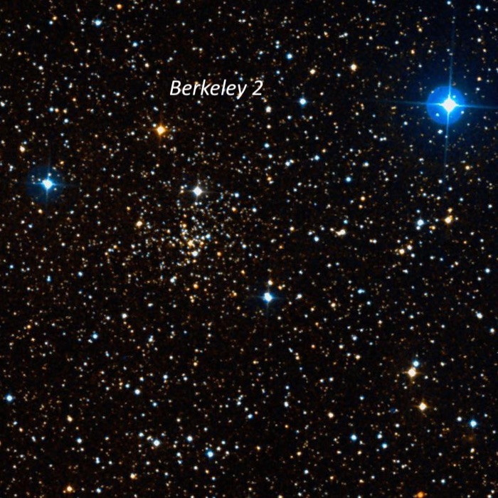  
  
---

**Name**: <x-dso simbad="Cl Berkeley 51">Berkeley 51</x-dso>  
**RA**: 20 11 54 
**Dec**: \+34 24\.3  
**Size**: 4’

  
At 175x, a mag 12\.5 star is surrounded by a faint, hazy glow \~2' in diameter.  Increasing to 285x, a few faint stars sparkled to the north and south of the brighter star including a short string on the NW end.  A total of eight mag 14\-15 stars were resolved over the glow in addition to the brighter star.  I found the cluster 5' SSW of mag 7\.2 HD 192124 and 3' WSW of mag 9\.3 HD 228251\.

  

  

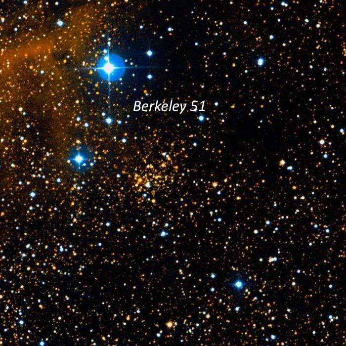  
  
  

---

**Name**: <x-dso simbad="Cl Berkeley 53">Berkeley 53</x-dso>  
**RA**: 20 55 56 
**Dec**: \+51 04\.8  
**Size**: 12’

  
This very faint cluster is situated just west of mag 6\.6 HD 199578\.  At 285x, I resolved about 15 faint stars close NW of the mag 6\.6 star within a 3' circle.  These stars are embedded on the NE side of a larger unresolved background glow. Several mag 10\-11 stars are nearby to the north and west of HD 199578\.  On the DSS the cluster consists of a cloud of extremely faint stars (not resolved) to the W and SW of HD 199578 and surrounding a couple of mag 10\-11 stars. The 15 stars I noted just north may not be cluster members but I probably picked up the unresolved glow of the cluster.

  

A 2009 photometric study found Berkeley 53 is a rich and massive system in the Perseus Arm with an age exceeding 1 billion years. The cluster is significantly reddened by dust in the plane of the Milky Way.

  

  

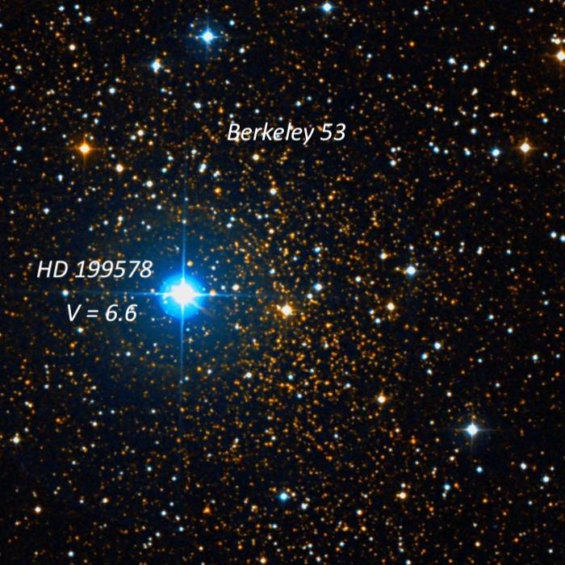  
  
  

---

**Name**: <x-dso simbad="Cl Berkeley 54">Berkeley 54</x-dso>  
**RA**: 21 02 59 
**Dec**: \+40 26\.2  
**Size**: 5’

  
I picked up this cluster using 105x as a very faint, hazy patch with no resolution, \~1\.5' diameter.  It’s situated just NW of a trio of mag 9/10/11 stars.  At 285x, a mag 13\.5 star and three mag 14\-15 star were resolved over the glow, which appeared elongated SW\-NE.  The cluster is located 1\.3° SE of mag 3\.9 Nu (58\) Cygni.

  

Berkeley 54 is one of the oldest open clusters in the Milky Way with an age of \~7\.2 billion years.  Source: "[The age of the oldest open clusters](https://www.aanda.org/articles/aa/pdf/2004/04/aah4736.pdf)", A&A, 414, 163 (2004\)

  

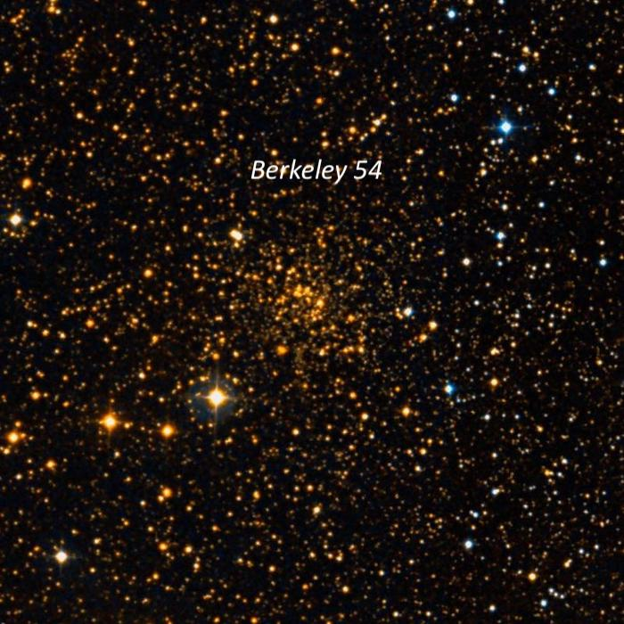  
  
  

---

**Name**: <x-dso simbad="Cl Berkeley 55">Berkeley 55</x-dso>  
**RA**: 21 16 58 
**Dec**: \+51 45 32  
**Size**: 3’

  
I picked up this Berkeley cluster at 105x as a hazy glow with a few resolved stars and roughly 3' diameter.  Increasing to 285x, roughly a dozen stars mag 13\.5\-14\.5 were resolved, mostly in two strings oriented \~E\-W.  The southern string includes 3 equally spaced stars with the star at the west end a close double. The northern string is longer and includes a half\-dozen stars.  The cluster is situated at the western vertex of an equilateral triangle with two 10th magnitude stars \~8' NE and 8' SE. Its age is \~300 million years.

  

  

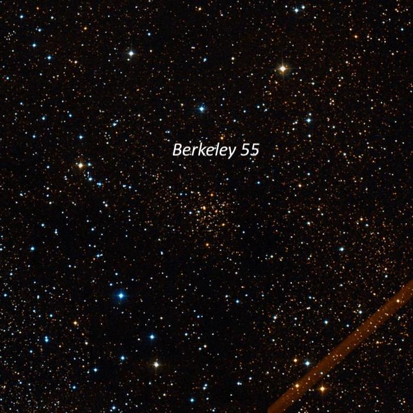  
  
  

---

**Name**: <x-dso simbad="Cl Berkeley 56">Berkeley 56</x-dso>  
**RA**: 21 17 35 
**Dec**: \+41 49 36  
**Size**: 7’

  
Once again the cluster was swept up at 105x as a faintly glowing spot \~3' diameter with a few brighter stars superimposed.  Pumping up the magnification to 285x, the glow was still generally unresolved with just a few mag 15 stars resolved.  An isosceles triangle of mag 11\-12\.5 stars is just at the NW edge and a wide pair of mag 12\-13 stars is at the south edge.  The cluster members were generally too faint (brightest is \~16 mag) to resolve and the glow is unimpressive.  Located 28' SSE of mag 6\.2 HD 202720 and 26' ESE of mag 6\.6 HD 202568\.

  

Berkeley 56 is an ancient open cluster with an age of 5 to 6 billion years!

  

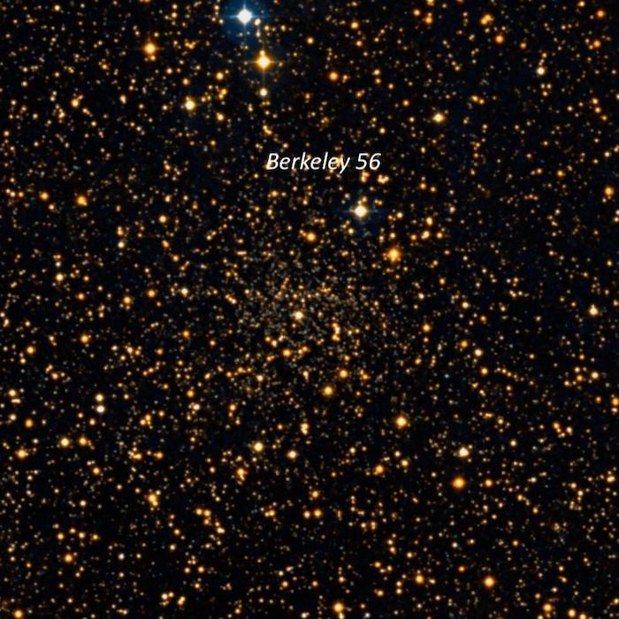  
  
  

---

**Name**: <x-dso simbad="Cl Berkeley 58">Berkeley 58</x-dso>

**RA**: 00 00 12

**Dec**: \+60 56\.5  
**Mag**: V \= 9\.7

**Size**: 5’

  
Roughly 30 stars mag 12\-14\.5 were resolved in a 6' group with many of the stars in chains.  A wide "V" of stars is on the NE side with a mag 9\.8 star near the east end of one branch.  CG Cas, a Cepheid variable, lies 2' SE of this bright star and is a likely member of the cluster.  At the vertex of the V another string extends to the SW and a couple of faint chains of stars branch off from this string.

    
Berkeley 58 resides in a very interesting low power field with two wide bright doubles to the SE (a mag 7\.3/10 pair 10' SE and a mag 6\.8/10 pair 20' SE). Also, clusters NGC 7790 and NGC 7788 lie on the same line 20' NW and 35' NW!  The striking colored pair, STTA 254, with a beautiful, bright deep red variable (WZ Cas) with a wide bluish companion at 58" is situated 36' S of Berkeley 58\.  Finally, three mag 6\-7 stars also adorn the one\-degree field.

  

  

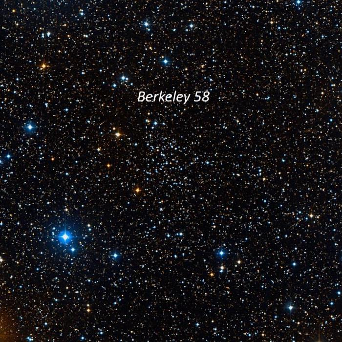  
  
  

---

**Name**: <x-dso simbad="Cl Berkeley 82">Berkeley 82</x-dso>

**RA**: 19 11 20  
**Dec**: \+13 07 06

**Size**: 4’

  
Berkeley 82 consists of a small group of 16\-18 stars packed into a 3’ circle. It includes three mag 10\.2/10\.5/11\.2 stars at 16"/23" separation on the NW side.  A couple of additional faint stars are off either end of the trio forming an arc and a number of mag 14\-14\.5 stars follow this arc.  A close, faint pair (\~6"\-8") is on the south end.

  

This is a nearby cluster at 2800 light\-years, with an age of 30 million years.  The two brightest stars are evolved yellow giants.

  

  

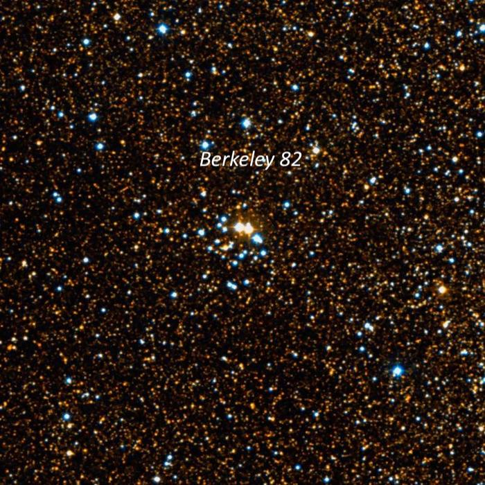  
  
  

---

**Name**: <x-dso simbad="Cl Berkeley 85">Berkeley 85</x-dso>  
**RA**: 20 18 47

**Dec**: \+37 45\.3  
**Size**: 5’

  
The most noticeable part of Berkeley 85 is a 4' string of faint stars oriented NW\-SE.  In total, I resolved \~20 stars at 285x.  Near the SE end is a small knot, \~20" diameter, with several very faint stars embedded over haze.  A few additional stars follow the SE end.  Berkeley 85 is located in a rich star field with a number of mag 9\-10 stars and this cluster does not stand out.  Dolidze 41 appears to refer to the same group though it may include some nearby brighter stars to the NE.  The age is about a billion years.

  

  

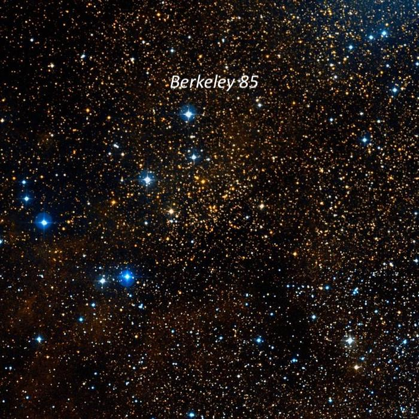  
  
  

---

**Name**: <x-dso simbad="Cl Berkeley 90">Berkeley 90</x-dso>  
**RA**: 20 35 14

**Dec**: \+46 50 48  
**Size**: 4’

  
This small, 3' cluster is mostly huddled around two mag 10\.3/10\.8 stars oriented NW\-SE and separated by 1\.6'.  Near these two stars are a dense group of about a dozen mag 13\.5\-15 stars  I counted \~18 stars in total within 4'.  The stars appear to be set over an unresolved Milky Way background haze, though I may have been picking up the glow of the emission nebula Sh 2\-115, which envelops the cluster.  Berkeley 90 is located 16' NE of mag 5\.8 HD 196178 and 4' following mag 7\.7 HD 196331\.

  

A 2016 preprint notes that "*Berkeley 90 is home to one of the most massive binary systems in the Galaxy, LS III \+46 11, formed by two identical, very massive stars (O3\.5 If\* \+ O3\.5 If\*), and a second early\-O system (LS III \+46 12 with an O4\.5 IV component at least). Stars with spectral types earlier than O4 are very scarce in the Milky Way, with no more than 20 examples*.”  These are the two stars mentioned in my observation.

  

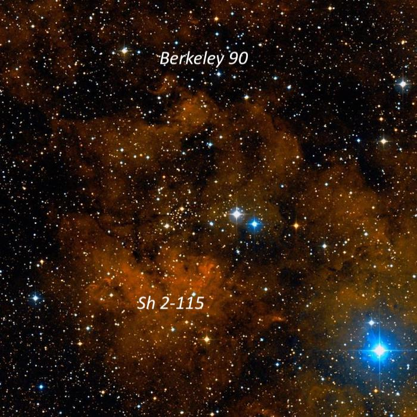  
  
  

---

**Name**: <x-dso simbad="Cl Berkeley 94">Berkeley 94</x-dso>  
**RA**: 22 22 53

**Dec**: \+55 52\.2  
**Mag**: V \= 8\.7

**Size**:  4’

  
Berkeley 94 is a very distinctive, rich group at 285x. You’ll find it 6' SSW of orange mag 6\.5 red supergiant RW Cephei. The brightest three stars are 10th magnitude including one that is detached just north of the main group.  Many of the stars are arranged in an arrowhead shape or narrow "V" with a second mag 10 star at the vertex on the NE side.  Roughly 20 stars are resolved at 285x including several close pairs.  The cluster is very rich near the center, around the third mag 10 star.

  

Sh 2\-132, a huge HII complex, is located to the NW.  It was marginally visible at 73x without a filter as a weak background enhancement in a rich Milky Way field, although it was difficult to confirm with certainty.  But there was an excellent contrast gain adding an OIII filter. This huge HII region appeared roughly 20'x15', elongated in an E\-W direction.  On the west side, Sh 2\-132 encompasses a bright trapezoid of mag 8 and 9 stars (with several other mag 11 stars are nearby).  The surface brightness is highest just E and SE of this group of stars.  The east end tapers down towards mag 8\.8 SAO 34340\.

  

  

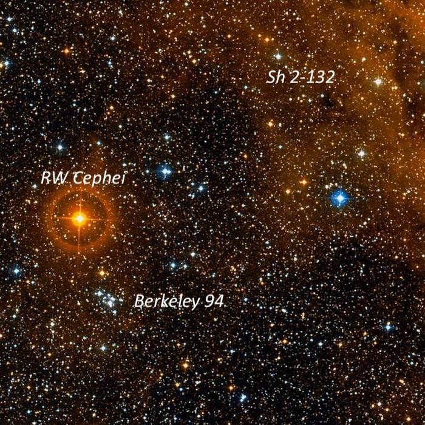  
  
  

---

**Name**: <x-dso simbad="Cl Berkeley 95">Berkeley 95</x-dso>  
**RA**: 22 28 18

**Dec**: \+59 08\.0  
**Size**: 5’

  
I immediately noticed Berkeley 95 at 105x as a distinctive 4' string oriented N\-S with \~15 stars in or near the string.  A detached trio of stars on a line to the north increased the length to 8'.  The cluster is located between mag 9\.4 HD 239959 6' WNW and a mag 10\.8 star 4' E.  The group is more easily resolved at 285x with 28 stars in total, mostly 13\-14th magnitude, including a couple of very close faint pairs and triples.

  

  

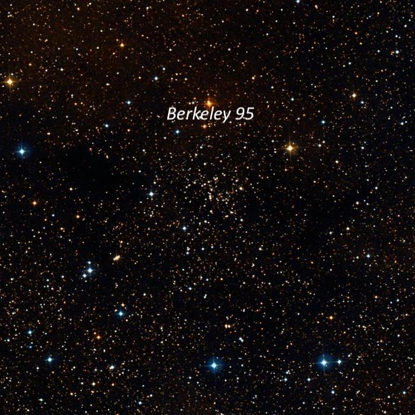  
  
  

---

**Name**: <x-dso simbad="Cl Berkeley 98">Berkeley 98</x-dso>  
**RA**: 22 42 40

**Dec**: \+52 24\.7  
**Size**: 6’

  
At 285x, I resolved roughly 15\-20 faint stars (mostly mag 13\.5\-15\) in a 4’ group. The apparent members were bracketed between two mag 10 stars at the NE end and a mag 10\.5 star at the SW end.  The group is unimpressive as most of the cluster members are probably too faint to resolve.  Berkeley 98 is located 20' WSW of mag 6\.4 HD 215518\.

  

The age of this cluster is \~2\.5 billion years and the distance is 3\.73 kpc (about 12,000 light years).

  

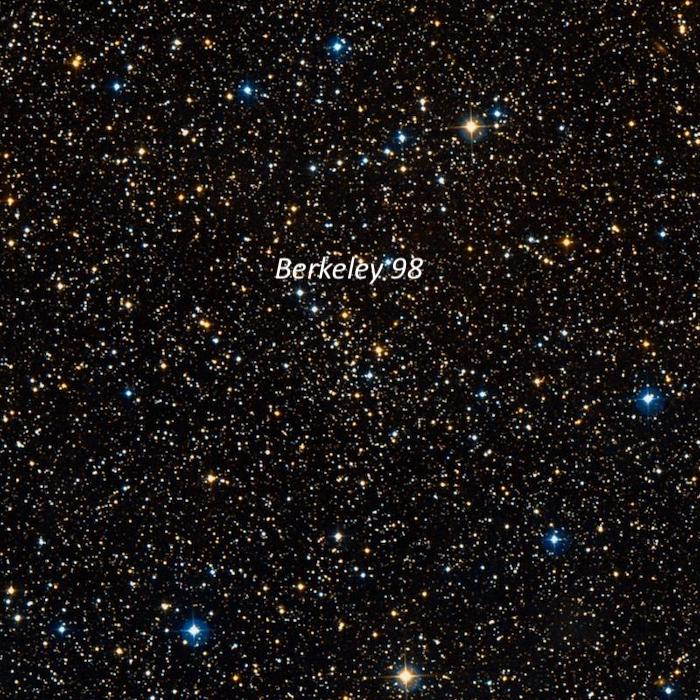

