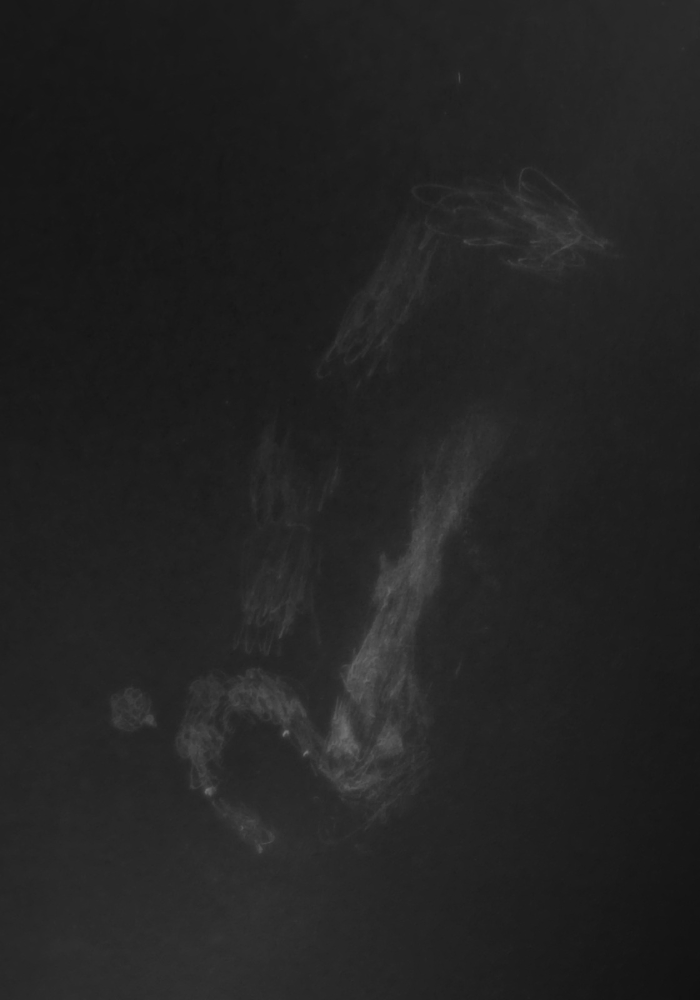

The name "GalStar" for the spring edition of [CalStar](https://calstar.observers.org) has definitely caught on. I went there mostly to socialize, having in some ways jaded from intense observing with my 18", and also because I was frustrated by the halos my optics were producing around stars. I like to push my telescope to find some faint feature of some distant galaxy, but poor optical surfaces are a dealbreaker for such work. Even my plate solving system was broken after a system update, a familiar experience to anyone running Linux and dealing with Python environments. I wanted to meet old friends, new friends and enjoy a chill evening with perhaps some photons involved.

  

I arrived pretty late, after sunset but just before dark, thanks to mounting traffic. Mahesh, who had apparently met me long ago in Bangalore (I used to be a big part of the [Bangalore Astronomical Society](http://bas.org.in) and still run the site) re\-introduced himself. Setting up in the dark is a rigmarole I'm very familiar with, but this time it was made a lot more interesting with the lively conversation with Richard Sutherland ([PiFinder](https://www.pifinder.io/)) and Steven on plate solving, [KStars](https://kstars.kde.org/), astronomical algorithms and such... until I realized I had aligned my equatorial platform to the south pole. Anyway, that was easy to fix with manpower on the field.

  

 It looks like a lot of people had already vacated the star party by the time I arrived. After I roughly set up my telescope, I walked around to Dr. Alan Agrawal to catch up and we spent a good chunk of time discussing eyepieces and optics. Alan, as many of you know, is perhaps our local eyepiece and optics expert. He even gave a highly sophisticated talk on the subject at GSSP several years ago. I also learned a thing or two about mirrors and star testing from Alan. He brought over his Ronchi eyepiece and tested my mirror. Having known about the "polite way to test someone's mirror", I requested Alan to tell me the whole truth and nothing but, and I was pleased to learn that all the astigmatism was in my eyes. Alan showed me the tiny bit of spherical aberration in my mirror. I mean, I hadn't expected my mirror to be terrible after the "Corona Borealis cluster" night at the Warner Mountains ([link](https://groups.google.com/g/sf-bay-tac/c/dK1dstrvGDE/m/0olt9FWFAgAJ)) but it's good to have someone experienced tell me what they see. Alan also pointed out that my secondary mirror was very dirty and perhaps is the culprit for the halos, I don't know why I had failed to notice this. Anyway, it gives me something to work on before the next OI and hope that I can bid the halos goodbye. We also looked at Alan's Zambuto 10" through the Ronchi eyepiece. I thought the fringes were damn straight.

  

While we were doing this, Dan Wright came up to us and invited us to look through his telescope at a train of geostationary satellites. Having seen them just once before, I was excited \-\- they are really quite a sight to behold as the "normal" stars slowly drift past them. Jamie Dillon was amongst the folks in that part of the field with his telescope Johannes I believe, and apparently I need to do better at registering his voice at night as a backup to recognize him during the day...

  

There was more conversation, more banter. We discussed Massacre Rim and the Warner Mountains. I recounted the night Tarun and I had last year right next to a place called "Mosquito Creek" ([YouTube video](https://www.youtube.com/watch?v=O1100kvs8U8&t=399s)) and I showed Alan and Dan the gift of God to humankind called Thermacell. I looked at a few objects through Randy's and Alan's telescopes. Sachin M R and friends arrived pretty late, but not too late for the fun \-\- this was their first star party and it looked like they had a blast just seeing the sheer number of stars from this relatively dark site. I didn't get a chance to catch up with them but it looks like Randy shared a few views with them too. Somewhere along the night, Ted Hauter met us in the dark.

  

My telescope was just standing without any real photons until about 1:30 AM when most folks went to bed. As for the dew situation, being hardened from recent star parties in south India, I figured that if my Telrad was only fogged out but not dripping wet and if my logbook hadn't turned into mush, the show could go on. Delightfully, the dew did not worsen and I just had to wipe the droplets off my laptop screen a couple times and keep my eyepieces warm. In fact I want to say it got a bit less moist as the night progressed. Having nothing else to do and a fully assembled telescope and a Bortle 3\-ish sky, I decided to plow through bright NGC objects \-\- mostly culled from [Steve Gottlieb's excellent DeepMap 600 list](http://www.raycash.org/dmcon.htm) or [Alan Dyer's finest NGC](https://www.rasc.ca/finest-ngc-objects) list. Although by this time Coma and Virgo were way past meridian, GalStar stands for something, so I stuck to the galaxies for the most part.

  

I started on <b><x-dso>NGC 4111</x-dso></b>, a beautiful edge\-on lenticular with a stellar bright core. For some reason to my eyes the light of the galaxy seemed to be more sharply cut\-off to the west of the core, so I thought it had a dark lane (it does not) \-\- I wonder if this is an effect created by the dusty filaments around its core?! It warrants re\-observation with clean optics. The nice thing is that there are several other galaxies around it, so I picked up **NGC 4117, NGC 4118, NGC 4109, UGC 7089, PGC 38276** and **UGC 7069** nearby.

  

<b><x-dso>NGC 4125</x-dso></b> figured next. A bright galaxy with a much brighter condensed core that is almost, but not stellar. The elongation was about 3:1 and there was a weak sensation of an axial brightening within the halo. Once again I slewed to a few bright galaxies nearby that were plotted in KStars. Having the orientation correct made it very easy to find **NGC 4256**, which was nicely framed with **NGC 4210** and **NGC 4221**. I also picked up **PGC 213957** which shines at \~15\.8 mag, not bad for dirty optics, although it flashed in only 3\-\-4 times weakly (exact position called out while knowing only rough position, so confirmed). UGC 7242 near the bright star could not be discerned because of the halos.

  

<b><x-dso>NGC 4157</x-dso></b> is a nice edge\-on with a weak sensation of mottling. I had a few false starts star\-hopping to it, so it took a while to find it, but it was not difficult at all. The nearby field around <b><x-dso>NGC 4187</x-dso></b> seemed very interesting so I moved there. I picked up the five galaxies, in order of increasing cursewords: NGC 4187, **PGC 38982, NGC 4187C, NGC 4187B, PGC 3097730** \+ unresolved neighbors. Of the last one, I only got 4\-\-5 weak flashes.

  

<b><x-dso simbad="K79 54">KTG 54</x-dso></b> is a nice trio I had on my observing list but had never seen. It comprises of NGC 5566, the brightest member, NGC 5560 a fairly bright edge\-on and NGC 5569 a dim roundish galaxy. All three were seen simultaneously and continuously with averted vision once locked\-into the sweet\-spot. If you aren't familiar with the "KTG", it is a catalog of [trios of galaxies](https://skyandtelescope.org/sky-and-telescope-magazine/isolated-triplets-of-galaxies/) by Karachentseva and you can use "K79" as the catalog prefix in SIMBAD to find them. There's also KPG (Karachentseva Pairs of Galaxies).

  

At this point I decided that it was too late for galaxies as the zone of avoidance was overhead. I dropped down to <b><x-dso>Terzan 3</x-dso></b> in Scorpius after seeing that it was well\-placed and on my observing list. Turns out I'm pretty bad at pruning my list because I'd already seen it last year. Anyway, an extra observation doesn't hurt, and I found it surprisingly easy for a Terzan. Just the words "Terzan" and "Palomar" tend to send a chill down my spine so maybe I am overcorrecting. I seem to have described it as "Readily seen" back in 2023 as well, from the Hovatter Road Antenna Site in Arizona.

  

The **Little Ghost Nebula** = <b><x-dso>NGC 6369</x-dso></b> was perhaps the best object of my night! I didn't remember seeing this planetary nebula before, I don't know why, it really is beautiful. Again I'd seen this one last GalStar and failed to prune it off my observing list, but I would definitely revisit this one. This tiny donut has a very asymmetric rim to it, with perhaps intermittent hints of the central star. I did get a sense of a spikey outer halo but was not fully certain because of the optics of my telescope, but I seem to have logged the same thing from last GalStar before this problem began.

  

I ended on an object I had never actually logged before. You may have heard of it, it's called the <b><x-dso>Swan Nebula</x-dso></b>. In all the 18 years of observing, I never actually wrote a description or made a sketch of it until last night. Sketching intricate nebulae like this is still beyond my abilities, but here is the best render I produced in the 15 minutes I had on it before the moon rose.

I woke up to a poorly populated field with Richard, Randy and Alan gone and Rogelio packing up in the distance. Les Niles and Camila, Jamie Dillon and Dan Wright were the only folks left. I packed up pretty quickly because Alan had alerted me to rain in the forecast. I figured if I were anyway packing up my scope for the rain and most folks were already gone, I might as well head back and work on other stuff. As I rolled out, the rain picked up and some part of my drive on 101 was in pretty poor visibility from the downpour. Things settled around Salinas.

  
On my way I was listening to Chris and Shane's "[Actual Astronomy](https://actualastronomy.com/)" podcast and in an episode where they were discussing the Winter Star Party, I came across an interesting snippet: they pointed out there is much to look forward to when going home after a star party is over \-\- like a real bed and the good food you've missed because you've been camping. I'd never appreciated this fact: the end of a star party had somehow always been heavy. But inspired by this, I cooked myself some comfort food (Arachuvitta sambhar, a south Indian lentil\-vegetable stew with fresh ground spices) to put a cap on a short but great GalStar.

Clear Skies, especially to those still out there,  
Akarsh

  

