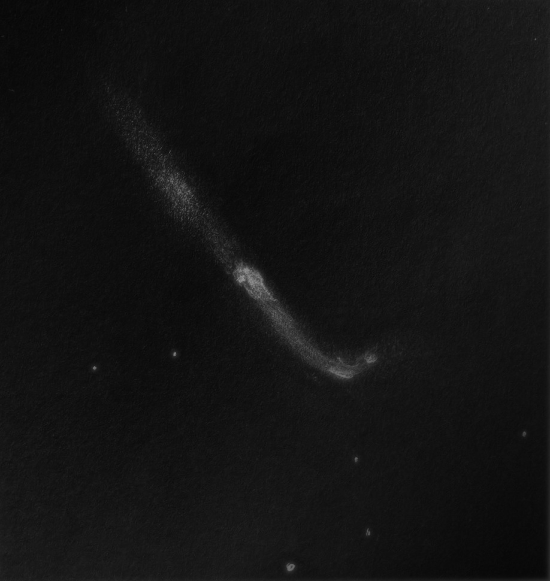

I couldn't resist an outing to Lake Sonoma to meet people I hadn't seen in a long while, even if it meant kicking my GalStar presence down by a night: Steve Gottlieb, Bob Douglas, Dan Smiley were slated to be there and we did. None of them will make GalStar. My other motivation was to test my 18" scope and make sure everything was in the vehicle before I embarked on a multi\-night star party. So I actually took and set up my scope although I was debating against it initially.

  

Lake Sonoma is quite a drive for me, but I do like it more than Pinnacles. Gottlieb's SQM read 21\.34 MPSAS at some point in the night, apparently typical for this location. The weather was less convenient than anticipated: although it only got to the low 50s by the time I left, a strong breeze with intermittent gusts (not enough to knock my telescope down, phew!) made it cold. I had left my best jackets at home, but I always have extra in my truck so I survived fine.

  

The evening started with a bright zodiacal light in the west. I requested Gottlieb to point to M1 so I could hold up my polarizer to it, but then I realized that I had removed my polarizer from my wallet. I used to always carry a polarizer and grating in my wallet as a physics student. Anyway, M1 was pathetic, contrast reduced by the zodiacal light.

  

Steve then showed us SN2024ggi in NGC 3623 and the comet C/2023 A3 Tsuchinshan\-ATLAS (had to look up the spelling). The former, we estimated at about 13th magnitude and the latter sported a really nice tail. Just imagine what it might be like if the predictions of its brightening hold true, if it looked this spectacular now.

  

By this point I had slowly set up my telescope and found out that it was mostly fine. I felt like hitting bright galaxies given my deteriorated coatings (Steve confirmed the halos around stars in my scope, so it's not just my eyes) and given that I was in a Bortle 4 site. NGC 3962 and NGC 4027 were on the menu. What surprised me though was NGC 4027A, which is not particularly easy with my 18" \-\- perhaps I was able to hold it 20% averted vision.

  

Steve had texted me earlier saying that he packed his 14\.5" (due to subpar seeing), which will "force me to look at more spring eye\-candy galaxies instead of 16th mag smudges." For a while he had me believing him, but of course on the field he had promptly resumed looking at IC and UGC smudges. I did log some of these smudges (hey, they're free), IC 746, IC 889 and IC 943\. Bob was trying to look at Sharpless regions that were down low in this time of the year, albeit aided with night vision.

  

Anyway, even I could not resist the allure of challenging nothings: Type II fun. <x-dso>IC 3563</x-dso>, a star forming region in NGC 4559, eluded me in previous attempts but I managed to get perhaps 6\-\-7 flashes of the patch in a 10mm Delos. This observation was aided by my platform tracking perfectly, which it has done ever since Randy Pufahl fixed it up for me at GSSP: it's been more trouble\-free than it was when new.

  

Steve showed me the Stargate Asterism in Virgo and Bob showed me M 51 through his 18" telescope. It left me marveling at Carl Zambuto's optics because the amount of detail was just impeccable for the sky condition.

  

Looking once again at my observing list, I saw <x-dso>NGC 4151</x-dso>, an unusual looking galaxy. Turns out it's a Seyfert with an inner ring structure, nicknamed the "Eye of Sauron". I was able to see in my 18" both of the brightenings in the ring structure visible in the DSS2 image, Steve confirmed (called out, in fact) one of them. The fainter one took more work at the eyepiece. The core of this galaxy was blazing light a bright star. NGC 4156 nearby appeared as a dim amorphous glow with an almost uniform brightness. I knocked off a few more galaxies in the field as "freebies", NGC 4145, NGC 4145A and PGC 38640\.

  

Dan Smiley had packed up by then and took off. I then spent about 20 minutes making a sketch of the Hockey Stick (<x-dso>NGC 4656</x-dso>), and did notice the HII region <x-dso>[MTA2018] 49</x-dso>. Bob Douglas left as I was doing this.  

{: .medium }

  

I packed up slowly, chatting with Steve and learning about how visual observers found targets before the internet... a bit of a history lesson. We were interrupted by a bright flash of light in the east. I immediately looked that way to see a bolide flickering with a beautiful trail and a blue glow. Steve caught a glimpse of its end as well. I continued packing for about 15 minutes after Steve left and had an uneventful drive back home.

  

Rooting for better weather at Galstar this weekend.

  

Clear Skies,  
Akarsh

  

