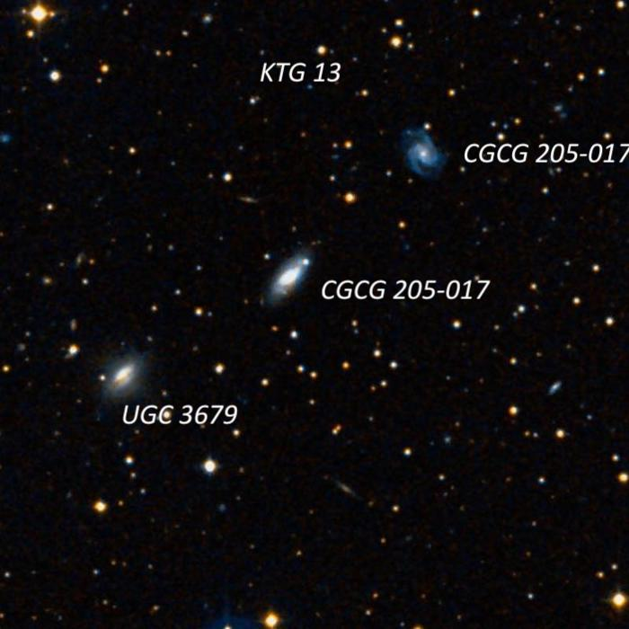

One of my recent observing projects has been working through the [1979 Karachentseva Isolated Triplets of Galaxies](https://ui.adsabs.harvard.edu/abs/1979AISAO..11....3K/abstract) (KTG) catalogue by principal investigators Valentina
Karachentseva (Astronomical Observatory of University
of Kiev, Ukraine) and Igor Karachentsev (Special Astrophysical Observatory, Russia).  This catalogue contains 84 northern isolated galaxy triplets (a few are not physical triplets) found by examining the POSS. I'm really not sure what significant astrophysical interest these groups hold for professionals, but as all the component members are included in the CGCG (mag limit \~15\.7 blue photographic magnitude), this is a good observing project for 12" and larger scopes and with 16"\-18" scopes nearly all the members should be viewable.  
  
Karachentseva classified the configurations as double, line, and triangle, but visually the important factor is that most of these groups are pretty compact \-\- roughly 3' to 7' in total size, so fit nicely in a high power eyepiece. A few though are quite separated like KTG 84, which consists of interacting Taffy Galaxies (UGC 12914/12915\) and UGC 14, located 32' SE. Here are several KTG groups visible in late winter/early spring, mostly observed a couple of weeks back with my 24\-inch f/3\.7 from Willow Springs.   If you check out Alvin Huey's observing reports at <http://faintfuzzies.com/ObservingReports.html>, you'll find a number of the KTG groups included.  If you're not familiar with these triplets, check them out!  The entire catalogue of 84 northern triplets is available to download at <https://cdsarc.cds.unistra.fr/ftp/VII/83/>  

I ended up being the only observer at Deep Sky Ranch, located in the southern part of the Diablo range south of Hollister, although Kevin Ritchel was home inside, along with some friends.  His neighbors well above his house on a hill to the north were home with their security lights on and even a bonfire, which made the conditions challenging, to say the least!  By facing away from their house and making extensive use of an observing hood to shield my eyes, the lights weren't directly visible.  Seeing was fair to fairly good, though tapered off near the end of the night.  My SQM\-L readings were from 21\.5\-21\.6 range and with little in terms of distractions, I powered my way through 60 objects!  Mainly I worked on KTG triplets and observed the following groups:  

---
  
**Name**: <x-dso simbad="WBL 123">KTG 11</x-dso>

**RA**: 07 05 21**Dec**: \+86 36 28  
**Size**: 7\.4’

  
UGC 3536A \= KTG 11B is the brightest member of the triplet (and the elliptical component of the Arp 96 pair). It appeared moderately bright, small, round, 24" diameter, fairly high surface brightness, gradually increased to the center.  A mag 14\.7 star is just off the SW edge and two mag 10\.8/11\.9 stars are less than 2' W.  It forms a pair with UGC 3528A \= KTG 11A 1\.5' NW, the faintest member of the triplet.  This low surface brightness spiral appeared faint, small, elongated 3:2 E\-W, 24"x16". A mag 10\.8 star is 1\.5' SW.  Finally, CGCG 362\-33 \= KTG 11C lies 7' NE and appeared fairly faint, small, elongated 2:1 E\-W, 24"x12", weak concentration.  A mag 13\.5 star lies 0\.9' W.

  

  
  

---
  
**Name**: <x-dso simbad="WBL 120">KTG 12</x-dso>

**RA**: 06 46 13\.9

**Dec**: \+43 49 08  
**Size**: 3\.5’

  
This triplet is located \~15' NNW of 56 Aurigae (V \= 5\.3\) and fits in a circle of 3\.5'. At 375x, UGC 3535, the brightest member, appeared fairly faint, fairly small, slightly elongated WSW\-ENE, 0\.5'x0\.4', brighter core. UGC 3532 lies 2\.8' SW and CGCG 204\-13 3\.8' NW. UGC 3532, the second brightest member, appeared faint, fairly small, very elongated 3:1 E\-W (central bar), even surface brightness, 0\.6'x0\.2'. CGCG 204\-13 is very faint, very small, round, 12”.

  

  

  
  
---
  
**Name**: <x-dso simbad="WBL 130">KTG 13</x-dso>

**RA**: 07 07 14\.4

**Dec**: \+44 49 11  
**Size**: 6’

  
KTG 13 is aligned in a 6’ equally spaced string oriented NW to SE.  CGCG 205\-17 \= KTG 13B is the middle and brightest of the three galaxies in the triplet. At 282x, it appeared fairly faint, fairly small, elongated 2:1 or 5:2 NW\-SE, 25"x12", no zones but contains a faint stellar nucleus with direct vision. A mag 15\-16 star is at the NW tip. UGC 3673 lies 3' NW and UGC 3679 is 3' SE. UGC 3673 appeared faint, small, round, 18" diameter (central core), low even surface brightness. The extremely low surface brightness arms were not seen. Located 10' E of mag 7\.8 HD 53129\. This galaxy has a redshift 2\.6 times the other two members, so it must lie in the background of the other two. Finally, UGC 3679, at the SE end, appeared fairly faint, round, 24" diameter, low even surface brightness.

  

  

  
  

---
  
**Name**: <x-dso simbad="UGC 3706">KTG 14</x-dso>

**RA**: 07 09 47

**Dec**: \+47 54 42  
**Size**: 2\.7’

  

This small triplet is in a 2\.7' string oriented E\-W. CGCG 234\-77, at the west end, is the brightest member of the KTG 14 trio. At 375x it appeared fairly faint, fairly small, slightly elongated, roughly 20"x16", increases to a very small bright nucleus. UGC 3706 (double system) lies 2\.5' E. This trio is located 0\.7° S of the core of AGC 569 and has an identical redshift, so is probably an outlying member. MCG \+8\-13\-83 is the second of three and the northwest component of an interacting double system (UGC 3706\) with MCG \+08\-13\-084\. It appeared faint to fairly faint, small, slightly elongated, 15"x12" diameter. Based on the DSS, I viewed only the brighter core region. MCG \+8\-13\-84 is attached on the southeast side, just 0\.4' between centers, and was barely resolved. It appeared very faint very small, round, 8" diameter (probably the core region), though occasionally dominated by a relatively bright stellar nucleus.

  

  

  
  
  
---
  
**Name**: <x-dso simbad="WBL 136">KTG 15</x-dso>

**RA**: 07 11 21

**Dec**: \+31 10 00  
**Size**: 3\.2’

  
This small triplet of CGCG galaxies is contained within 3\.2'. CGCG 146\-33 is the westernmost and brightest member (total mag) of KTG 15\. It appeared faint, fairly small, round, 24" diameter, low nearly even surface brightness. CGCG 146\-34 lies 1\.9' SE and CGCG 146\-36 is 2\.9' NE. At 375x, CGCG 146\-34 appeared faint, extremely small, round, 10" diameter (core). Although the CGCG magnitude (blue photographic) is 15\.7, making it the faintest in the trio, it has a higher surface brightness than the other two members. A mag 14\.2 star is 30" W and a mag 14\.5 star is a similar distance south. Finally, CGCG 146\-36 appeared faint, small, round, 18" diameter. A mag 15\.5\-16 star is attached at the west end.  
  
  
  
  

---
  
**Name**: KTG 16  
**RA**: 07 17 05\.3

**Dec**: \+34 01 35  
**Size**: 11\.4’

  
KTG 16 is a triplet of thin UGC edge\-ons spread out over 11’ of sky. UGC 3776 is the first and brightest member, appearing fairly faint, moderately large, elongated 5:2 SW\-NE, 0\.8'x0\.3', broad concentration. Located 6' SW of mag 8\.9 HD 56101\. UGC 3780 11\.6' NE and UGC 3779 11' E. UGC 3780 appeared as a faint, thin edge\-on 6:1 SW\-NE, 0\.6'x0\.1', low even surface with no core or zones. Located 5\.2' ESE of mag 8\.8 SAO 59943 and 6' NE of mag 8\.9 HD 56101\. Both UGC 3776 and 3780 are very elongated with similar PA's. UGC 3779, the third and faintest member (also a thin edge\-on), is 6' S but was not visible in soft seeing.

  

  

  
  

---
  
**Name**: <x-dso simbad="WBL 149">KTG 17</x-dso>

**RA**: 07 40 09

**Dec**: \+32 13 36  
**Size**: 5’

  

CGCG 147\-52 is the first of three 15th magnitude galaxies. It appeared faint, slightly elongated, 18"x15", very small brighter nucleus. A mag 10\.8 star is 2’ N. The redshift of CGCG 147\-52 is twice the other members of the triplet, so this galaxy is probably not a physical member. CGCG 147\-53, 2' ENE, appeared extremely faint, very small, round, 12" (core region only). Required averted and only visible 25% or less of the time. Situated 2\.4' SE of a mag 10\.8 star and 2\.5' W of a mag 11\.1 star. CGCG 147\-52 appeared surprisingly faint to be included in the CGCG (V mag of 15\.9\). CGCG 147\-54, 3\.4' NE of CGCG 147\-53 appeared very faint, slightly elongated WSW\-ENE, 24"x20", low surface brightness, very weak concentration. This group is located \~13' N of mag 6\.2 HD 61295\.

  

  
  
  
  
---
  
**Name**: <x-dso simbad="KPG 140">KTG 18</x-dso>

**RA**: 07 44 11\.5

**Dec**: \+29 14 26  
**Size**: 4\.4’  
  

This KTG 18 triplet contains UGC 3995, an overlapping pair which appeared fairly bright, oval 2:1 E\-W, 1\.3'x0\.7', sharply concentrated with a bright 20" core. The halo is fairly uniform except for the nucleus of superimposed KTG 18A \= PGC 93091, which was barely glimpsed as a stellar or quasi\-stellar spot on the west side (30" from the center of the main component). Although UGC 3995 is a physical pair, studies reveal neither galaxy is tidally perturbed. A mag 11 star lies 1\.8' S. CGCG 147\-63 \= KTG 18C lies 4' ENE and appeared faint to fairly faint, small, slightly elongated N\-S, 15"x12", increases to a very small brighter nucleus.

  

  

  
  

---
  
**Name**: <x-dso simbad="WBL 151">KTG 19</x-dso>

**RA**: 07 47 13\.5

**Dec**: \+58 59 26  
**Size**: 10\.9’

  
UGC 4003 is the first and brightest in the KTG 19 triplet with UGC 4012 7\.6' NE and UGC 4020 at 12' ENE. At 375x, UGC 4003 appeared moderately bright, elongated 2:1 WSW\-ENE, 40"x20", well concentrated with a small bright core. UGC 4012 is the faintest in the trio and was logged as a faint, thin edge\-on 5:1 WSW\-ENE, 30"x6", faint stellar nucleus. Finally, UGC 4020 appeared fairly faint, oval 3:2 \~N\-S, 25"x15", weak concentration. I observed the much brighter core region and missed the very low surface brightness arms extending SSW\-NNE. A mag 14\.5 star is just off the south edge. Situated 5\.8' SW of mag 8\.0 HD 62667\.

  

  

  
  
---
  
**Name**: <x-dso simbad="MCG+00-22-003">KTG 21</x-dso>

**RA**: 08 20 39\.0

**Dec**: \-01 23 45  
**Size**: 3\.0’

  
This triplet is located 16' NW of mag 6\.5 HD 70340 and contains two thin edge\-ons. UGC 4349 \= KTG 21A is a challenging edge\-on visible as a very faint "spike" extending west of a mag 13 star, \~20"x6". A mag 9\.5 star is situated 2\.9’ S. THis galaxy is the most western in the KTG 21 triplet with UGC 4352 (overlapping double system) 2\.9' SE. The main component of UGC 4352 (KTG 21C) appeared faint to fairly faint, fairly small, round, 24" diameter. MCG \+00\-22\-002 (KTG 21B) was visible as a very faint spike, extending out of the SW side of the larger glow.

  

  

  

  

---
  
**Name**: <x-dso simbad="USGC U220">KTG 22</x-dso>

**RA**: 09 17 26

**Dec**: \+41 57 18

**Size**: 5\.4’

  

UGC 4904 \= KTG 22A is fairly faint, slightly elongated glow NW\-SE, 25"x20", with a weak central concentration.  This galaxy is situated 5\.4' S of NGC 2798/2799 (Arp 283\).  NGC 2798 \= KTG 22B appeared fairly bright, fairly large, elongated 5:2 NW\-SE, 1\.7'x0\.7', fairly sharply concentrated with a very bright core that increases to a small, intense nucleus.  The extension (spiral arm) to the northwest is brighter.  It forms a striking double system (Arp 283\) with NGC 2799 \= KTG 22C 1\.5' ESE.  NGC 2799 is moderately bright and large, very elongated 4:1 NW\-SE, 1\.0'x0\.25', brighter along a very thin streak of the major axis.

  

  

