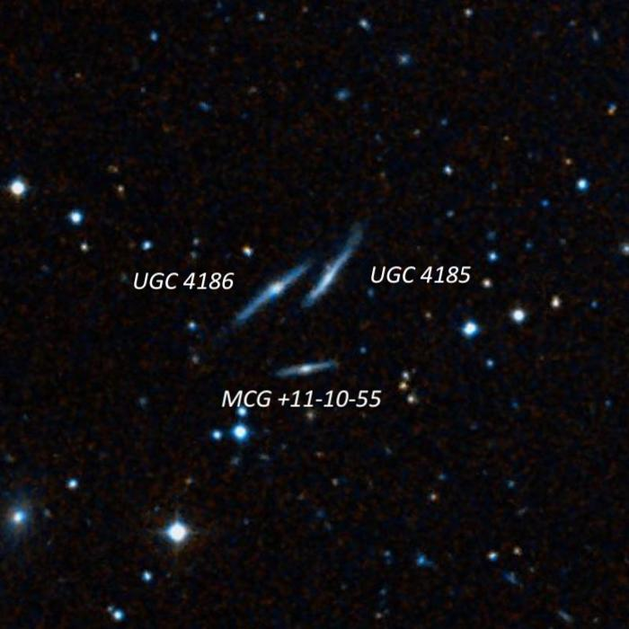

After a bit of fence\-sitting caused by the iffy weather forecast, Bob Douglas and I decided to take our large dobs (28\-inch and 24\-inch) to Lake Sonoma on Tuesday night, February 5th.  When I arrived before sunset, I was greeted by clouds, but they seemed to be clearing up and by the time it was dark, the sky was completely clear.  The conditions were very good, but I was still surprised to find the average SQM readings at 10 PM were in the 21\.50\-21\.55 range, perhaps 0\.3 MPSAS (magnitude per square arc second) darker than typical.  Furthermore, although the seeing was predicated to be poor or fair, it was very good and it was easy to use up to 400x on galaxies.  In fact, Sirius B (the white\-dwarf Pup) was easily seen at 450x and rock steady using an occulting bar.  The one downside was wet (dewy) conditions, which made my charts and table wet, but there was no problems with the optics as I used my secondary dew heater.

  
Bob brought along a "Pup" viewer consisting of an occulting bar attached to a 24\.5mm eyepiece and a 5x Powermate.  This combo yielded 460x and Sirius B was easily visible in my 24\-inch when Sirius was kept just under the occulting bar.  Unfortunately, the Pup landed right on a main diffraction spike, which decreased the contrast somewhat.  In Bob Douglas’ 28\-inch using the same gear, the Pup fell between the diffraction spikes and the Pup was prominent when it popped outside the bar.  Using slow\-speed on the hand control, the Pup could be easily moved back and forth from one side to the other of the bar without exposing the full glare of Sirius.  The separation is currently close to 10”.  

In total, I logged 45 individual deep sky objects, so this was quite a successful night.  
  
---

**Name**:  <x-dso simbad="IC 1910">IC 1900 Trio</x-dso>   
**RA**: 03 16 03\.8

**Dec**: \+37 08 41

**Size**: 4\.4’

  

IC 1900, the brightest member in this trio (known as KTG 10\), appeared fairly faint, elongated 3:2 E\-W, \~20"x14", with a very small brighter nucleus.  A mag 11\.3 star is situated 3’ WNW.  IC 1901, 2\.9’ to its SSE, appeared faint, elongated 2:1 \~N\-S, perhaps 15"x8” (only the central region viewed), with a brighter nucleus.  The galaxy has a similar surface brightness as IC 1900, but it's smaller.  A 1\.2' pair of  mag 10\.3/11 stars lies \~3' WSW.  Finally, IC 1902, 3\.7' NE of IC 1900, appeared fairly faint, just 15” diameter, moderately high smooth surface brightness except for a faint nearly stellar nucleus.

  

  

  
  
---

**Name**:  <x-dso simbad="MCG+05-13-002">MCG +5-13-1/2/3/4</x-dso> 

  

These four numbers — which originate from a galaxy catalogue — are actually a group of compact reflection nebulae (RN), about 3\.5° from the galactic equator in Auriga! SIMBAD and NED have the correct classification but HyperLeda still lists these as galaxies! These RN are located just 15' WNW of the bright triple star 14 Aurigae.  I had searched them before with my 18" without success!

  
MCG \+5\-13\-1: faint glow surounding a mag 13\.5 star, perhaps 20" diameter.  MCG \+05\-13\-002/3 lies 3\.2' NNE and MCG \+05\-13\-004 3\.6' NE.  
MCG \+5\-13\-2/3: a small, faint halo, \~18" diameter, was visible surrounding a 12" pair of mag 12/13 stars. Both components of the pair carry their own MCG/PGC numbers.  
MCG \+5\-13\-4: very small, very faint halo surrounding a mag 12 star, 10"\-15" diameter. MCG \+05\-13\-2/3 lies 1\.1' W.

  

  

  

  
  
---

**Name**:  <x-dso simbad="Sh 2-254" omit>Sh 2-254</x-dso> ,  <x-dso simbad="Sh 2-257" omit>Sh 2-257</x-dso> , and  <x-dso simbad="IC 2162">Sh 2-255</x-dso> 

  

These are a trio of round low\-excitation emission nebulae in Orion (roughly lined up west to east) that respond to an H\-beta filter!  Sh 2\-255 is also known as IC 2162\.

  

Using 125x (21mm Ethos) and an H\-beta filter, Sh 2\-254 appeared as a very large, but ill\-defined glow, roughly 5' diameter with a low surface brightness.  It involves several brighter stars including mag 9\.8 HD 253247, but the border is ill\-defined as opposed to the more symmetric Sh 2\-255 and 2\-257\.  It’s the faintest but largest of the group.

  

Sh 2\-257 to the east was easily visible at 125x with the H\-beta filter as a fairly faint, large, round glow, \~3' diameter.  It surrounds an 11th\-magnitude central (exciting) star but also involves several mag 13\-14 stars.  It’s the middle of the three round “balls" with brighter Sh 2\-255 5' E and larger, but very low surface brightness Sh 2\-254 6'\-7' W. Sh 2\-256 is just off the SW side, but I missed this dim glow.

  
Finally, Sh 2\-255 \= IC 2162 is the brightest and easternmost nebulae in the trio.  It appeared as a moderately bright, round glow, \~3\.5' diameter, surrounding the mag 11\.6 exciting star.

  

  

  

  
  
---

**Name**:  <x-dso simbad="UGC 3714">UGC 3714 group</x-dso> 

  

**RA**: 07 12 32\.9

**Dec**: \+71 45 03

**Size**: 1\.8’x1\.5'

  

The UGC 3714 also includes CGCG 330\-032, UGC 3665, UGC 3701, and the *Integral Sign Galaxy*  <x-dso>UGC 3697</x-dso> .  All 5 galaxies were viewed at 375x within a 25' circle.

  

UGC 3714 is an unusually bright galaxy to have missed in the NGC and IC.  At 375x, it appeared fairly bright, round, 45" diameter, moderately concentrated with a bright core and overall high surface brightness.  You’ll find this galaxy 7\.7' SW of mag 6\.4 HD 54070 and 4' S of right triangle of mag 10\.5\-11 stars (two are collinear with the galaxy).    
  

The Integral Sign Galaxy, UGC 3697, was easily picked up at 125x just south of a line connecting mag 6\.4 HD 54070 12' ESE and mag 7\.0 HD 52762 13' NW.  Upping the magnification to 375x, the galaxy extended 2\.2'x0\.2' (\~12:1 axial ratio!) \~E\-W.  The surface brightness was fairly even with just a slightly brighter core, though it faded on the west end as it bent or hooked towards the north.  This extension has a very low surface brightness.  A mag 14\.5 star is 1' off the east end and a fainter mag 15\.5 star is close south on the west side at the point where the galaxy bends north and dims. I didn’t see any structure or bending on the east end and the brightness falls off rapidly at the tip.

  

  

  
  
  

---

**Name**:  <x-dso simbad="IC 2188">IC 2188 Trio</x-dso> 

  

IC 2188 (also called IC 2186\) is the brightest of a trio of galaxies in Gemini with  <x-dso simbad="IC 2187" omit>IC 2187</x-dso> 1\.8’ S and  <x-dso simbad="2MASX J07224774+2131452" omit>LEDA 3089868</x-dso>  1\.5’ NE.  At 375x, IC 2188 was fairly faint, small, slightly elongated 22”x15" \~E\-W, faint stellar nucleus.  LEDA 3089868 appeared very faint, extremely small, round, only 8" diameter.  This small group is located 45' SE of the double star Delta Geminorum \= STF 1066 (mag 3\.5/8\.5 at 6”).

  

  

  
  

---

**Name**:  <x-dso simbad="V* VY CMa">VY CMa</x-dso> 

  

**RA**: 07 22 58\.3

**Dec**: \-25 46 03

**V mag**: 7\.4\-9\.6

  

VY Canis Majoris is one of the most remarkable stars in the galaxy.  It’s a red hyper\-giant and a pulsating variable star with a period of at least 1000 days. It’s one of the most luminous and largest stars in our galaxy – far larger and more massive than Betelgeuse – on the order of 2,000 times the Sun’s diameter, 500,000 times its luminosity and perhaps 100 times the mass of Betelgeuse. It has experienced multiple, giant eruptions and as a result is encased in a small, irregular reflection nebula comprising ejected material from earlier, high\-mass\-loss outbursts.

 John Herschel was the first observer of this star who noted the color as a "Very intense fiery red.”  French astronomer Jérôme Lalande discovered the variability of VY CMa in 1801\. Argentine observer Luis Guerin at the Cordoba Observatory [discovered the nebula visually with the observatory's 7\-inch Meridian circle](https://articles.adsabs.harvard.edu/cgi-bin/nph-journal_query?volume=35&plate_select=NO&page=233&plate=&cover=&journal=PASP) back in 1917, but this fact seemed to have been unknown until recently.

At 175x, I found an orange\-red star that was slightly fuzzy or soft and wouldn't focus sharply.  At 285x (unfiltered), a very small non\-stellar orange disc was clearly visible surrounding a brighter center.  More surprisingly, a short "tail" clearly extended from the glow to the west.  At 325x, the central star was cleanly resolved within a very small, 4" round halo.  The nebulous tail or filament curved slightly \~8" to the WNW.

  

  

  
  
  

---

**Name**:  <x-dso>UGC 4185</x-dso>  and  <x-dso>UGC 4186</x-dso> 

  

UGC 4185 and 4186 form a striking pair of superthin edge\-on galaxies in Camelopardalis. Both were very, very faint, extended 0\.8’x0\.15’ NW\-SE and had a low even surface brightness.  They were remarkably similar in terms of dimensions, brightness, and even position angle (\~15° difference between position angles)!  At times, one was visible, then the other, and then both.  Fainter  <x-dso simbad="MCG +11-10-55" omit>MCG +11-10-55</x-dso>  to the south was missed.

  

  

  
  

  

---

**Name**:  <x-dso simbad="NGC 2616">NGC 2616 Group = WBL 188</x-dso> 

  

This group surrounds its brightest member NGC 2616\.  I picked up 7 galaxies including 4 that have IC designations, although I accidentally skipped one member.  At 375x (6mm Delos), NGC 2616 was pretty faint but very easily seen as a round, 25” glow with a fairly high surface brightness.  It has a larger halo of extremely low surface brightness but I didn’t notice it. A mag 15 star is superimposed just north of center and a mag 13\.5 star is off the NE side, 50" from center.

  

Two galaxies are lined up on either side of NGC 2616\.  <x-dso simbad="IC 515" omit>IC 515</x-dso> , just 3\.1’ SSW, was a faint even glow, perhaps 18"x14”.  On the opposite site is similar  <x-dso simbad="6dFGS gJ083541.8-014524" omit>PGC 24135</x-dso>  6’ NNE. In addition,  <x-dso simbad="IC 514" omit>IC 514</x-dso>  was also on this line – making a chain of 4 – 9’ SSW of IC 515\.

  

Two more galaxies were visible to the east of NGC 2616 and they nearly formed a parallelogram along with IC 515!  <x-dso simbad="IC 516" omit>IC 516</x-dso>  is 4’ ESE of NGC 2616 and it was very faint, extremely small, slightly elongated, at most 12” diameter, with a stellar nucleus. Very similar <x-dso simbad="PGC 24145" omit>PGC 24145</x-dso>  is 5’ SE of IC 515\.

  

  

  
---

**Name**: UGC 1856

  

**RA**: 02 24 31\.6

**Dec**: \+31 36 55

**Size**: 2\.1’x0\.3'

**V Mag**: 14\.2

  

Here we have another superthin galaxy that seems suspended between two mag 10\.5 stars!  Using 375x, it appeared very faint, extremely thin 'spike' NW\-SE, \~50"x8", very low even surface brightness.  The glow reached the NW star, but the SE end of the galaxy seemed to terminate just south of the SE star.

  

  

