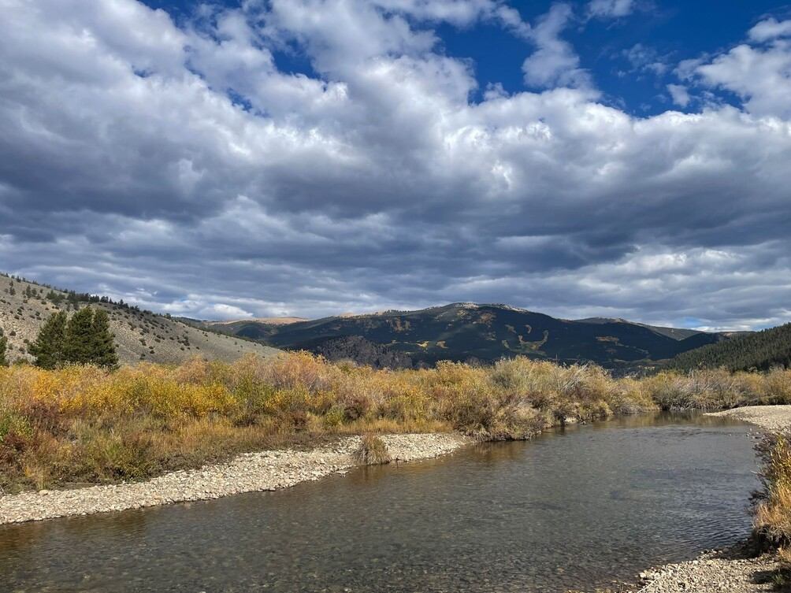

For many of us visual observers, traveling hundreds of miles to dark
skies is a relatively common activity. We leave the vast urban and
suburban landscapes behind, looking for any dark corners to glimpse the
universe from.

My love of the open road has made this activity enjoyable. I derive an
immense amount of satisfaction from getting myself from A to B in a
personal vehicle. The freedom, responsibility, and capacity to see new
places has always excited me. I took my driver’s test at 15.5 years old
and waited several months until my 16th birthday to get my license.
Despite this apparent love of travel, I’d never made it to Western North
America’s high desert climates, regions offering superb transparency and
darkness for observing. Between work, school, and life, there’s always
been an excuse. “I’ll do it when I graduate”, “Maybe when my contract
position goes full-time”, “Someday I’d like to get out there”.

In early June, I was busy going through the motions. As I flipped
through feeds, an email from a local astronomy club member caught my
attention. He was informing the group about this wonderful website
called Adventures in Deep Space; you may have heard of it. I excitedly
chimed in about my recent observing report on the site. After exchanging
a few emails, he suggested that I join them at the Okie Tex Star Party
in Oklahoma’s Panhandle. Initially, I shrugged it off, stating that I’d
love to do it someday. But then I stopped. Why not now? I’d never taken
a week off, but work was going to be relatively slow in late September.
After looking through the Okie Tex website, I made an impulsive decision
to book my registration.

I now had several months to prepare, and I had lots of work to do. I’d
done plenty of local astronomy camping, but it was always a means to an
end. I’d observe all night and crash under a cheap truck bed tent before
driving home. Camping was an afterthought. This trip would require
better provisions. After researching many pickup truck camping setups, I
settled on the versatile and affordable Softtopper shell for my trusty
old 2005 regular cab Tacoma. After testing it on a few local trips, I
realized that my sleeping platform wasn’t up to the job, so I invested
in new foam bedding materials. After much prep work, it was time to hit
the road.

*My truck camping setup with my 15” Obsession Classic under the soft
topper*

My plan was relatively straightforward. I was going to leave on a Friday
afternoon to drive about 250 miles to Southwestern Indiana. The next
day, I’d make it to Central Kansas. On Sunday afternoon, I was to
finally arrive at Okie Tex for four nights of fantastic group observing
with several Michigan club members. The latter half of the week was to
be spent camping with my uncle in the San Luis Valley of Colorado, and
my dad made a last-second decision to join us for some mountain camping
before riding back east with me.

That was the plan anyway, and it all started perfectly on schedule.
After stopping at my 2024 total eclipse site, a park in Defiance, Ohio,
I camped near Lafayette, Indiana. The next day was all about crushing
the miles. After driving across Missouri, I enjoyed the Flint Hills
during sunset, making it comfortably over 620 miles to a free lakeside
campground south of Junction City, Kansas. Sunday was my final day on
the road, and it was an easy drive through the relatively empty
grasslands of Southwestern Kansas. I was well off the interstate, moving
southwest to the Panhandle.

I had made it to my first star party, and I was immediately met with a
magical sight. The rocky cliff faces of Black Mesa towered over the
observing field on all sides. As the late afternoon lighting shifted,
the sun cast new reflections and shadows between the rocks. It was a
truly unique biome, featuring cacti, desert wildflowers, and familiar
grasslands. Recent rainfall had left the field dust-free and the
vegetation green. Looking around, my 15” Obsession was in good company.
Our club was on the southern row of a massive observing field, and
nearly all of the surrounding campers had large Dobsonians parked along
their rows.

*My 15-inch Obsession in the University Lowbrow Astronomers row at
Okie-Tex*

It was finally time for nightfall. The chatter on the observing field
slowly decreased as true dark set in. Despite an estimated 300 people,
the field was pitch black, aside from a few red lights. I immediately
grasped the 36.8-degree latitude. Scorpio and Sagittarius were high over
the mesa, allowing access to many new DSOs without muddiving

**Some of my favorite observations:**

<x-dso>Wray 16-423</x-dso>: "This extra-galactic (!) planetary nebula is located in the
Sagittarius Dwarf Spheroidal Galaxy (SagDEG). It appears small, round,
and stellar at medium powers. The nebula takes power well, but I cannot
resolve its non-stellar nature. I should’ve tried blinking it with a
filter to get more detail, but I didn’t use one. The nebula was
confirmed purely by its position relative to the star field. It looked
like a 14 magnitude star, faint but easily observed with direct vision.
I did not notice any color; it appeared off white. I need to try again
when the seeing is better."

<x-dso>NGC 6729</x-dso> & <x-dso>NGC 6726</x-dso>: "Beautiful, rich star field shows two long and
obvious circular halos of reflection nebulosity. I can also track a
faint and uneven section extending towards HD 7170 with averted vision;
the field is best at low power. Nearby globular cluster <x-dso>NGC 6723</x-dso> shows
some stars resolved across its face; This tight cluster takes power
well."

<x-dso simbad="Sgr DIG">Sagittarius Dwarf Irregular Galaxy</x-dso> (PGC 63287): "Small round puff of
faint nebulosity, needed averted vision to 100% confirm the sighting."

<x-dso>NGC 1333</x-dso>: "Turned north due to cloud cover, this impressive high surface
brightness nebula extends from a field star to the northeast."

<x-dso simbad="PGC 54559">Hoag’s Object</x-dso>: “This faint ring galaxy appeared as a barely visible puff
of even glow in a club member’s 18” Obsession.”

The atmosphere throughout the night was like nothing I’d ever
experienced. Hundreds of dedicated observers and imagers silently
practiced their craft, stopping occasionally to compare views and share
laughs.

I was out of gas at 3:00. It had been a long few days, and transparency
was rapidly reducing with the arrival of a cloud deck. Several of my
fellow Michiganders continued to observe even when 95% of the sky was
covered. I admired their dedication!

*My grandpa and I put together this camping setup in preparation for
Okie-Tex*. *It was tight but cozy.*

After a nice sleep, it was time to explore the star party during the
day. A nearby camper was walking around with a tarantula on his cooler,
looking for a place to set it down. I had many great discussions with
nearby observers, and I enjoyed the air conditioning within Camp Billy
Joe’s mess hall.

Monday night was…interesting. An unforecasted thunderstorm lingered
ominously in the distance. The lightning was incredible, but the winds
were slowly increasing across the open valley. My camping setup
deflected the elements, but I awoke many times due to the noise.

*Another view of Okie-Tex from my camp*

The forecast for Tuesday wasn’t looking good either. I was scheduled to
leave the star party on Thursday to camp with family in the San Luis
Valley of Colorado, so I made a last-minute decision to head to the
Sangre de Cristo Mountains of New Mexico on Tuesday afternoon in pursuit
of clear skies. I had driven way too far for only two nights of
observing opportunity.

It was hard to leave the camaraderie of the star party, but I headed
west along the desolate and beautiful lands of New Mexico. The distances
were vast, and the population incredibly sparse. After two hours, I was
deep in the mountains, climbing through the pine forests to 7,500 feet.
I arrived at my campsite, Rio Grande National Monument, at 6:00. In an
incredible stroke of good luck, a site was open overlooking the canyon
without any nearby neighbors. I had a perfect southern horizon and
ridiculously good transparency. The dark lanes of our galaxy punched
through the sky vibrantly, like an oily black pen spilled across a white
paper of unresolved stellar glow. It was unbelievably beautiful, and I
observed many faint objects from 7,500 feet over the Rio Grande:

<x-dso>IC 4604</x-dso>: "Best view yet. Lots of nebulosity with a very subtle dark
nebulosity scattered across the nebula complex. The lower latitude made
this complex much simpler to study. In my prior attempts near 45N, I was
barely able to resolve nebulosity around Rho Ophiuchi. On this night in
New Mexico, nebulosity was immediately apparent with 56x, and averted
vision extended the complex considerably. It was bright and easy
compared to my prior attempts from further north."

<x-dso simbad="HCG 93">Hickson 93</x-dso>:

- <x-dso omit>NGC 7549</x-dso> "Interesting galaxy. It had a very bright core that tapers
  gradually. Across its surface, there are hints of mottling, especially
  near the core. I cannot trace any outer structure.

- <x-dso omit>NGC 7550</x-dso> “Small, round, quite dim with low surface brightness across.”

- <x-dso omit>NGC 7547</x-dso> “A dim and round galaxy that has an even surface brightness.”

<x-dso>Palomar 12</x-dso>: "One of the toughest Palomars yet! It's a super dim glow
near a magnitude 14 field star. The cluster has a fairly even surface
brightness, but averted vision was needed to identify the cluster at the
correct location."

<x-dso>UGC 3697</x-dso>: "Great edge on, there is an uneven core that tapers rapidly.
It's quite large and spans far across the 330X field of view. I did not
log any bends in this galaxy’s structure."

<x-dso simbad="PN A66 39">Abell 39</x-dso>: "Super faint ring-like structure that's slightly brighter on
the northwestern wall. I can trace a very small section of its southern
and northern walls with averted vision. It's hard but rewarding to
confirm at high powers, probably needed a filter!"

<x-dso>NGC 520</x-dso> (ARP 157): "Fantastic galaxy that rewards careful study. It has
high surface brightness across its oddly bulged edge-on shape. There
seems to be a knot (OB association?) on the northern side. Averted
vision just barely reveals a dark lane cutting across the southern end
of the galaxy. I can only see it across the high surface brightness
core, not on either side of the main structure. I can also see the
beginning of a very faint hook shape extending from the southern extent
of the galaxy, but it's hard to trace."

Here's an annotated image that shows the knot, lane, and outer
structure. I was pretty skeptical about the crossing lane, but it was
there with averted vision and careful study over the course of the hour
at 330x.

*NOTE: The picture credit belongs to The Sky Live. Please check out the
original at:
[<u>https://theskylive.c...y/ngc520-object</u>](https://theskylive.com/sky/deepsky/ngc520-object)*
 
*I've rotated the field to capture what I saw at 1:30 AM. I suspect this
would be a tough observation to duplicate with a 15" outside of a
7,500-foot altitude location; the transparency is unreal up there!*

Cave Nebula (<x-dso>Sh2-155</x-dso>): "Photography icon, it's pretty underwhelming
visually with faint and uneven bands of nebulosity across a rich field.
Hard to detect without a hard edge, best at low power."

<x-dso>NGC 55</x-dso>: "Spectacular edge on, very bright and irregular, with tons of
mottling. I identified the following HII regions: DV 1, DV 2/3, DV 6.
Great object to spend an hour on, the 36-degree latitude makes a huge
difference!"
      

*Finder chart for objects in NGC 55 by Scott Harrington. Original photo by Mark Hanson.*

<x-dso>NGC 134</x-dso>: "Near stellar core paired with a nearby field star. The galaxy
has hints of mottling to the northeast and southwest, great to study."

<x-dso simbad="Sculptor dSph">Sculptor Dwarf</x-dso> Galaxy: "Another faint local group! Round and even patch
of nebulosity with a nice starfield to the southeast."

*My observing site in New Mexico’s Rio Grande National Monument*

After two nights at 7,500 feet, I knew why the professionals place their
observatories at high elevations. The transparency was unreal. It’s hard
to place these conditions into words, and I spend a good amount of time
under dark skies in the northern lower peninsula of Michigan.

*Crossing the Sangre de Cristo Mountain Range in New Mexico*

It had been two epic days of remote solo camping, and I was looking
forward to familiar faces. Two hours of gorgeous desert roads were all
that it took to finally arrive in Colorado, and I sat waiting at a set
of coordinates south of Great Sand Dunes National Park in public BLM
land. The San Luis Valley had immediately captivated me on my drive in.
This vast and arid plain was surrounded by impressive towering peaks on
all sides. It was incredibly beautiful. After a quick nap, I saw a
pumpkin orange Tacoma coming down the dirt road. My dad, uncle, and his
girlfriend had found me!

We talked, laughed, and ate some delicious Chili. Moonset over the peaks
was beautiful, as was the distant glow of the Rio Grande River across
the valley when the setting sun caused the water to reflect brightly.
The day and night views alongside Blanca Peak were quite spectacular,
but distant light pollution was worse than in Okie-Tex or New Mexico. I
had fun showing my family members many bright DSOs, such as structure in
the Andromeda/Triangulum galaxies and M13. When they went to bed, I
still had a few hours of energy left in me to observe more difficult
objects before crawling into the truck when the wind picked up around
1:00 AM.

*My telescope amidst the beautiful scenery in the San Luis Valley*

**Some highlight objects from nearly 8,000 feet in the San Luis
Valley:**

<x-dso>Palomar 9</x-dso> (= NGC 6717): "Easily the brightest Palomar I've done so far,
appears very close to a field star. There are 2-3 foreground stars very
close by that almost appear to resolve the cluster, but I don't think
they are related."

<x-dso simbad="[CB88] 187">CB 187</x-dso>: "Great dark nebula, inky back uneven patch that is framed well
with the field stars."

<x-dso simbad="PGC 3097691">Cetus Dwarf</x-dso>: (PGC 3097691): "Extremely tough, needs averted vision and
high power to catch a faint wisp at the correct spot, might be slightly
brighter in the center of the halo, tough to confirm."

The Cetus Dwarf was unbelievably tough and annoying to pull off.
Appearing as a small puff that was slightly brighter in the center, I
only knew that it was detected based on the star field. It took around
an hour to convince myself that I wasn’t seeing a faint star or other
object. It was there, but just barely.

I had been on the road for 7 days. My dad and I hit one more incredible
BLM campsite just south of Leadville, Colorado, deep in the mountains on
Friday night. It was the most gorgeous campsite of the whole trip,
located in a valley surrounded by massive peaks. As the sun set over the
cloudy sky, the evening light cast its illumination on the peaks like
spotlights on art gallery paintings. The view was simply breathtaking,
quite literally since we were all the way up above 9,000 feet! Looking
at the forecast for down the mountain in Buena Vista, it was only going
down to 50 degrees Fahrenheit, a comfortable night compared to my New
Mexico mid-30s lows. This was a good revelation since my Dad’s
last-minute tent wasn’t designed for winter weather, featuring a rain
fly that had a massive gap on the door. If you’ve spent time in the
mountains, you can already see the problem. Elevation and mountain air
currents can make the weather very different in localized areas. We both
awoke feeling quite cold, and I was almost glad that it had been cloudy
the night before to remove any observing temptations. Both of our
respective camping setups were covered in a deep layer of frost. My Dad
said it was his coldest night in a tent ever, an impressive record since
he has hiked and slept in the bottom of the nearby Black Canyon dozens
of times with my uncles. Even with the extra insulation of the canvas
truck top, I didn’t fare much better since my sleeping bag isn’t rated
for sub-freezing temps. Despite this challenge, we both agreed that the
surrounding views were worth it.

*Our campsite south of Leadville, CO*

*The views south of Leadville, CO.*

The entire drive from Alamosa to Denver was just phenomenal. My little
157-horsepower truck rumbled diligently up to 11,100 feet, the highest
point of the Interstate network on I-70’s Eisenhower Tunnel. It
complained the whole way through, struggling to maintain 55 mph in third
gear. It was a challenging and rewarding drive, and the yellow (fall
colored) aspens stretched far above, stopping sharply below the summits
on all of the great 14,000-foot peaks. Every corner yielded another
picture-perfect view. I enjoyed the challenge of mountain driving,
especially in an underpowered yet capable little Toyota. I was so proud
of her for taking us up and down those peaks. Colorado was just
unbelievable, and I immediately understood why so many people had
flocked there despite the challenging terrain and crowding.

Just when the excitement seemed over, an unsettling clunk appeared after
a 780-mile day to Des Moines, Iowa, my first hotel on the entire trip.
We figured the floating brake pads were moving more as a result of the
desert two-track roads, a known Tacoma issue, so we hit the road the
next morning. This was a mistake. Both front wheel bearings were shot.
We tried to limp to Iowa City on US-6 but towed the truck 20 miles out.
I couldn't believe our luck. It was a Sunday afternoon, and we had found
a tow truck in under an hour. What’s more, we found the most honest
mechanic imaginable. He quickly placed my truck at the front of his
to-do list. My dad and I hung out in the nice town of Iowa City,
enjoying some good food and drinks at an Irish pub downtown. We watched
the Lions and reflected on the exciting morning. Before I knew it, both
bearings were replaced for a very fair price. I was glad this issue
didn’t happen in remote New Mexico, and it was a valuable lesson to
replace old maintenance items on my truck before the next long trip. It
nearly doubled my trip costs, though! Back on the road at 5:30, we
pushed hard through the night, taking turns swapping drivers every few
hours. I did the last stint through Chicagoland and across Michigan. We
finally arrived at my parents’ house at 1:30 AM.

*Whoops!*

This trip taught me many lessons. I’m capable of solo camping for over a
week at a time, and I actually enjoy the camping element now! It also
made me aware of how privileged we are in the U.S. There is so much
public land out there, especially in the West. While more 3,000-mile
trips are certainly in my future, I’m going to frequent my local public
lands here in Michigan. I’m also hoping to get West of the Mississippi
on a more consistent basis, maybe every other year. The breakdown
doesn’t bother me in the slightest. Adventures are bound to have
challenges, but the old truck did a great job all things considered. I
can’t fault her for shedding wheel bearings after 206,000 trouble-free
miles. The \$300 tow bill was quickly covered by my insurance as well.
I’m glad that I added that option before leaving, just in case!

I experienced many twists and turns along this trip. Before I left, I
would’ve never guessed that I would end up solo camping on top of a
canyon in New Mexico, but that’s part of the fun. You never know where
the adventure will lead. Astronomy and the pursuit of dark skies have
made me a more adventurous person. I now realize how incredible it is to
explore both the cosmos and our beautiful planet. If you find yourself
in the U.S., you owe it to yourself to get into the vast and open
expanses of the West. Big road trips like mine can be done for under
\$1,000 if you camp in public land while traversing the landscapes.

*Leaving the incredible Great Sand Dunes National Park in Colorado*

