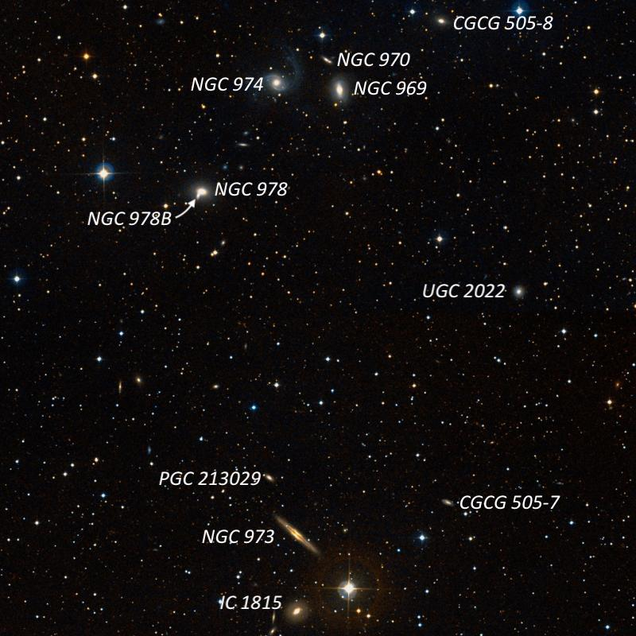
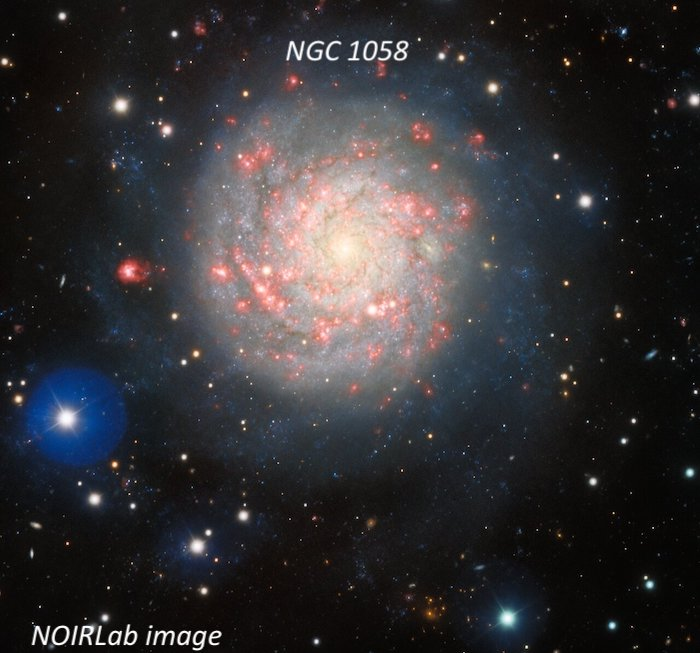
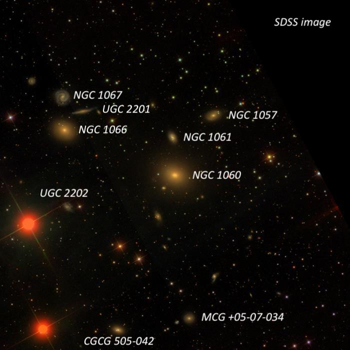
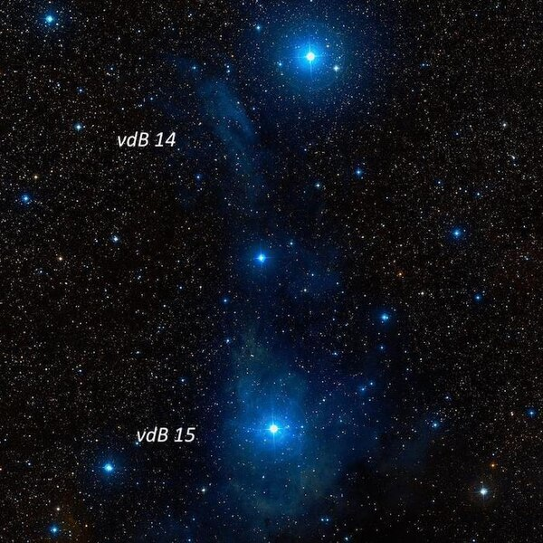
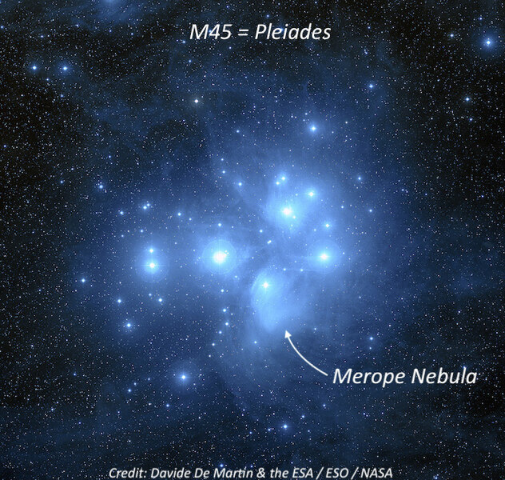
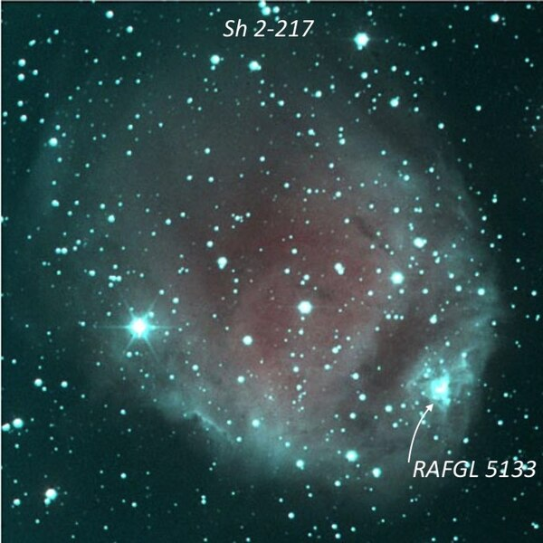

Despite a totally overcast sky in the Berkeley area on Wednesday afternoon January 26th and a pretty dismal CSC forecast for the early evening, Carter Scholz and I decided to take a chance and headed north to Lake Sonoma.  When I left home around 3:30 for the 90\+ minute drive, a band of clouds stretched across the south and north bay, but the infrared animated image showed that this band was heading south, so we were hoping it would clear out from the Lake Sonoma area in the early evening.  Fortunately, things turned out even better.  
  
As twilight darkened, the clouds disappeared from the north and were drifting further south than our location.  And by the end of astronomical twilight (about 7:00PM), the skies were completely clear.  Most encouranging was a very prominent zodiacal cone extending up in the western sky into Aries and nearly reaching Taurus.  As the evening progressed, the skies became progressively darker, probably due to local ground fog that was forming in the Santa Rosa valleys.  Around midnight my SQM was reading fainter than 21\.45, pretty close to the best readings at this site (21\.45\-21\.50\).  I ending up logging about 40 objects. Carter hung around a little later than I did and hit 60 new objects. Unless mentioned otherwise, my observations were made with an 18\-inch f/4\.3 Starmaster using 285x.  

---

**NGC 978 field** \- 12 galaxies observed

  

1\)   <b><x-dso simbad="UGC 2022" omit>UGC 2022</x-dso></b>  \- Faint, round, 22" diameter, slightly brighter core.  Located 16' SW of N969 and 20' WSW of N978\.  A mag 10\.5 star lies 5\.7' NE.  
2\)   <b><x-dso simbad="PGC 2023426" omit>PGC 2023426</x-dso></b>  \- Very faint, round, 10" diameter.  Located at the NW end of the N969/N978 group, 4\.5' E of mag 9\.8 SAO 55651 and 13' NW of N969\.

  
3\)   <b><x-dso simbad="CGCG 505-007" omit>CGCG 505-007</x-dso></b>  \- Extremely faint, round, 15" diameter. Located 9' WNW of N973 and 8' NW of mag 7\.5 HD 15896\.  A mag 10\.5 star lies 2\.6' NW.  An extremely faint star is close off the west side.

  
4\)   <b><x-dso simbad="CGCG 505-008" omit>CGCG 505-008</x-dso></b>  \- Faint, irregularly round, 15"x12".  Located 7' NW of N969 (trio with N970 and N974\) and 4\.7' E of mag 9\.4 SAO 55654\.  A mag 11 star lies 1\.8' ENE.

  
5\)   <b><x-dso simbad="NGC 969" omit>NGC 969</x-dso></b>  \- Moderately bright and large, elongated 2:1 N\-S, 1\.0'x0\.5', sharp concentration with a small, very bright core.  In a tight trio with NGC 970 2' NNE and N974 3\.8' E.

  
6\)   <b><x-dso simbad="NGC 970" omit>NGC 970</x-dso></b>  \- Faintest in a trio with N969 2' SSW and N974 3\.3' SE.  At 285x appeared extremely faint, elongated 3:2 SW\-NE, 15"x10".  Located 1\.5' S of a mag 10 star. NGC 971 is a 15\.5 magnitude star 0\.9' E.

  
7\)   <b><x-dso simbad="IC 1815" omit>IC 1815</x-dso></b>  \- Fairly faint to moderately bright, round, 35" diameter, even moderate concentratin to a small bright core and stellar nucleus.  Located 3\.5' SE of mag 7\.6 HD 15896 and 4\.5' S of N973\.

  
8\)   <b><x-dso simbad="NGC 973" omit>NGC 973</x-dso></b>  \- Fairly faint, very elongated 4:1 SW\-NE, 1\.0'x0\.25', sharply concentrated with a bright elongated core and very faint thin extensions.  A faint star is very close preceding the SW extension.

  
9\)   <b><x-dso simbad="NGC 974" omit>NGC 974</x-dso></b>  \- Fairly faint, slightly elongated SW\-NE, 1\.0'x0\.8', broad concentration in the halo, then sharply concentrated with a small bright core.  Bracketed by a mag 14 star 0\.8' S, and a mag 14\.5 star 0\.9' N.  Forms the eastern vertex of a small triangle with brighter N969 3\.8' W and N970 3\.3' NW.

  
10\)  <b><x-dso simbad="PGC 213029" omit>PGC 213029</x-dso></b>  \- Extremely faint, elongated \~3:2 SW\-NE, 20"x12".  Located 3\.7' NNE of N973 and 8' NE of mag 7\.6 HD 15896\.

  
11\)  <b><x-dso>NGC 978</x-dso></b>  \- At 285x appears moderately bright, irregularly round, 40"x32". Sharply concentrated with a high surface brightness core and a thin faint halo.  Forms a contact pair with N978B at the SE end.  The companion appeared as an elongated brightening, \~15"x10" N\-S, within the SSE portion of the outer halo.  

  

  

  

  
---

  

**NGC 1058 region**

  

1\)   <b><x-dso>NGC 1058</x-dso></b> : This Seyfert Type 2 galaxy appeared fairly bright, irregularly round, 2’ diameter.  There was a broad, weak concentration to a very small brighter nucleus \~5” diameter. Overall, the surface brightness was irregular with an asymmetric appearance.  A star is superimposed on the NW side \~35" from the center.  The halo is more extensive or brighter on the W side and very weak on the E side, so the nucleus appears offset towards the NE side.  A mag 15 star is at the S end of the galaxy.

  

The galaxy lies about 30 million light\-years away and is a member of the NGC 1023 Group in Perseus.  Three supernovae have been observed in the galaxy: Type IIIP SN 1969L, Type Ib/c SN 2007gr, SN 1961V (possibly Type II), though SN 1961V was an abnormal, supernova\-like event and may be a supernova impostor. (perhaps an outburst from a luminous blue variable (LBV).

  

2\)   <b><x-dso simbad="CGCG 523-088" omit>CGCG 523-088</x-dso></b>  \- I located this galaxy 34’ to the SW of NGC 1058\. It was faint, elongated 2:1 SSW\-NNE, 0\.4'x0\.2', very small brighter nucleus with faint extensions.  The galaxy forms the E vertex of a small quadrilateral with three mag 12, mag 13 and mag 14 stars.

  

3\)   <b><x-dso simbad="CGCG 524-006" omit>CGCG 524-006</x-dso></b>  \- this galaxy is only 14’ NE of NGC 1058\. It appeared faint, slightly elongated, 20”x15”. A 10th mag star is 3\.6’ WNW.

  

  

  

  
---

  
**NGC 1060 group**

  

1\)  <b><x-dso>NGC 1060</x-dso></b>  \- Brightest member of an excellent group that includes 5 NGC galaxies (also known as WBL 085\). I logged it as bright, fairly large, elongated 4:3 WSW\-ENE, large low surface brightness halo extending 2\.0'x1\.5’.  The center was sharply concentrated with a large, very bright core that increased in intensity to the center.

  

William Herschel discovered NGC 1060, along with NGC 1066, on September 12th, 1784 during his 268th sweep with his 18\.7\-inch reflector.  Remarkably, earlier in the same sweep he discovered the trio NGC 379, 380 and 383, which are members of the excellent Pisces Chain, as well as 5 galaxies in the NGC 507 group and the pair (in two fields) NGC 736 and 750!

  

2\)  <b><x-dso simbad="NGC 1057" omit>NGC 1057</x-dso></b>  \- Very faint, elongated 3:2 NW\-SE, 0\.7'x0\.45', low even surface brightness.  This galaxy is situated 4\.7' NW of NGC 1060 and NGC 1061 is 3' SE.

  

3\)  <b><x-dso simbad="NGC 1061" omit>NGC 1061</x-dso></b>  \- faint, elongated 3:2 SSW\-NNE, 30"x20”.  NGC 1061 lies in the center of the group, just 2\.5' N of N1060\.

  

4\)  <b><x-dso simbad="NGC 1066" omit>NGC 1066</x-dso></b>  \- moderately bright, irregularly round, 1\.5'x1\.2', broad concentration in halo.  NGC 1066 contains a small brighter core that increased to the center.  Forms a pair with N1067 2\.2’ N and marginal  <b><x-dso simbad="UGC 2201" omit>UGC 2201</x-dso></b>  is 1\.7’ NW

  

5\)  <b><x-dso simbad="NGC 1067" omit>NGC 1067</x-dso></b>  \- very faint, irregularly round, \~40"x35", very low surface brightness and only a weak concentration.  Located 2\.2' N of NGC 1066\.

  

6\)  <b><x-dso simbad="MCG +05-07-034" omit>MCG +05-07-034</x-dso></b>  \- very faint, fairly small, very low even surface brightness.  Two faint stars lie 50" E and 1\.7' SE (this is a close double on the DSS).  MCG \+05\-07\-034 was found less than 10’ S of NGC 1060\.

  
7\)  <b><x-dso simbad="CGCG 505-042" omit>CGCG 505-042</x-dso></b>  \- fairly faint, elongated 3:2 E\-W, 30"x20", weak concentration, slightly brighter core.  A 14th magnitude star lies 1\.5’ E.

  

  

  

---
  
 <b><x-dso>vdB 15</x-dso></b>  and  <b><x-dso>vdB 14</x-dso></b> 

  

 vdB 15 is an extremely large (30’ x 20') reflection nebula, seen as a very irregular glow surrounding 4\.6\-magnitude HD 21389 \= CE Cam.  This A0\-type Supergiant is a member of the Cam OB1 association.

  

The edge is better defined along the SE to NE boundary.  The brightest section is a roughly 7' circular region around the illuminating star.  The outline is an irregular triangular shape, tapering on the NE end and widens on the SW side.  On the NW edge is a string of three collinear stars SW to NE and the border on this side is oriented SW\-NE.  On the east side the border is oriented N\-S.  vdB 15 is part of a complex with vdB 14 situated \~1° NNE.  
  

vdB 14 is part of the same complex and was identified \~1\.0 degree to the north.  At 105x (unfiltered) it appeared a fairly faint, very large glow, very elongated SW\-NE, roughly 20'x5'.  The SW and NE ends are irregular but roughly round.  An elongated group of stars is just off the NW edge.  The center of this reflection nebula is \~20' SE of HD 21291, which is a  double star (STF 385\) with components of V \= 4\.3 and 8\.2 at 2\.3”).  I found this a difficult pair to resolve due to the glare of the primary, the large magnitude delta and a relatively close separation.  It was cleanly resolved at 264x with a relatively faint pinpoint secondary just separated from the glare on the SSE side.  STF 384, a wide pair, is 4\.8' SW.

  

  

  
  
  
---

 <b><x-dso>NGC 1435</x-dso></b> **\= Merope Nebula**

  

The Merope Nebula was immediately seen using 73x (unfiltered) as a huge wedge\-shape or comet\-shaped glow with Merope near the focus on the NE end and the nebula spreading out generally to the south and west.  The most striking feature of the nebula is the well\-defined and approximately eastern edge oriented N\-S that heads south from Merope, passing through a 1' pair of mag 10/11 stars as well as a 1' pair of mag 10/12\.5 star.  The nebulosity can be traced a bit over 20' along this side.  On the west side of Merope the border is more ill\-defined but roughly heads southwest for \~20'.  The southern border is also ill\-defined but is roughly oriented NW to SE and nearly extends nearly as far as mag 9 HD 23326\.

  

The Merope Nebula was discovered visually in 1859 by the German astronomer Wilhelm Tempel (his first of many deep sky discoveries).  He initially thought it was a comet, but the next night (20th), he checked the position and found no movement.  Christian August Peters, the editor of the German journal *Astronomische Nachricten*, soon confirmed the observation using a 7\-inch refractor.  Arthur Auwers also observed it in early 1861, but another German astronomer, Heinrich Louis d'Arrest was unsuccessful using the 11\-inch Merz refractor at Copenhagen in 1862\.  Based on his negative results on several attempts, he reported "I have hitherto been able positively to see nothing. ...I therefore, even yet, am of opinion that this nebula is variable, otherwise the original announcement of the discovery ... must be looked upon as been greatly exaggerated.  This report began a heated interchange involving many of the world's most prominent visual observers over the next 30 years!

  

  

  
---

  
 <b><x-dso>Sh 2-217</x-dso></b>  and  <b><x-dso>RAFGL 5133</x-dso></b> 

  

This relatively bright Sharpless HII region shows up fairly well unfiltered at all powers, and there no significant response when I inserted a UHC filter.  At 175x, it appeared \~6' diameter, though with an irregular outline.  A number of stars are superimposed including a mag 9\.4 star on the E end and the general field is rich in stars.

  

While observing Sh 2\-217 I noticed a fuzzy mag 12 "star" or very small knot on the SW end that wouldn't focus cleanly.  Using 275x, the mystery object was clearly non\-stellar at 275x.  Checking later, I discovered this is an ultra\-compact star cluster (resolved on infrared images) and an HII knot at the SW edge of the ionization front of Sh 2\-217\.  it corresponds with the position of **RAFGL 5133**.  The discovery article with an image of the cluster is available at A&A 399, 1135–1145 (2003\) or [tinyurl.com/ye58ywo](http://tinyurl.com/ye58ywo).

  

Near the southern border is a very small knot, \~15", surrounding a faint star.  This small “knot” is a young, ultra\-compact HII region with an embedded infrared star cluster \[FSR2007] 696a that is thought to have formed recently by triggered star formation along the edge of the Sh 2\-217\.

  

  

