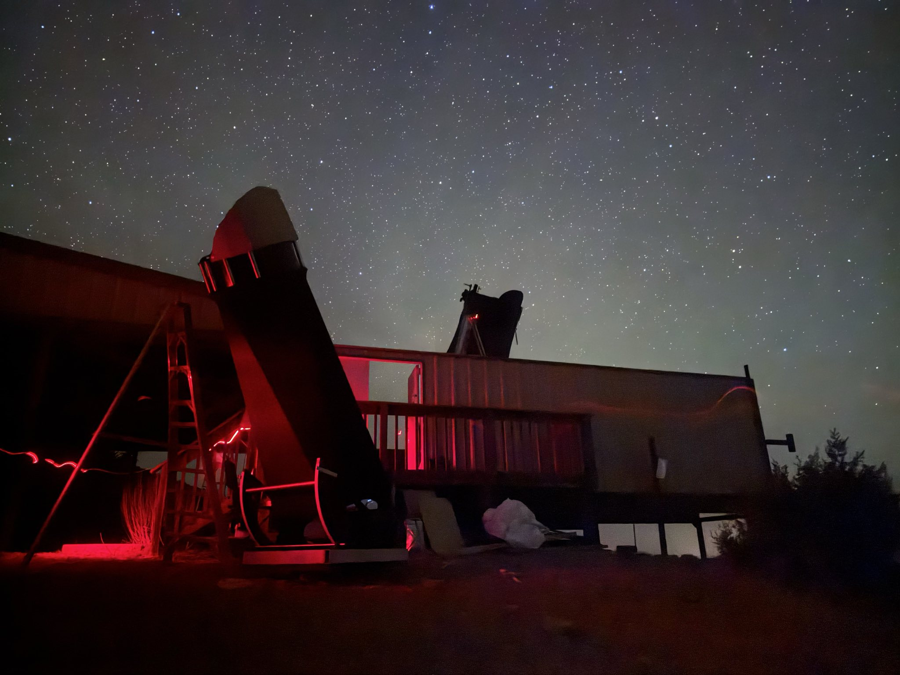
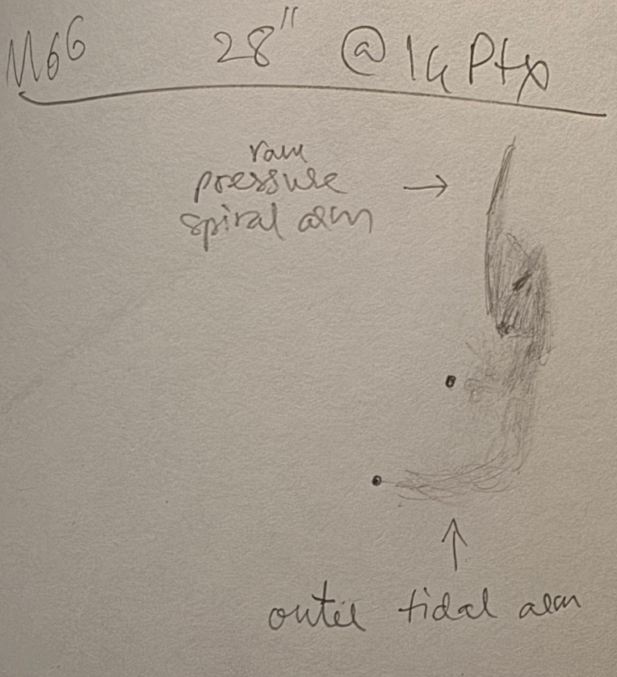
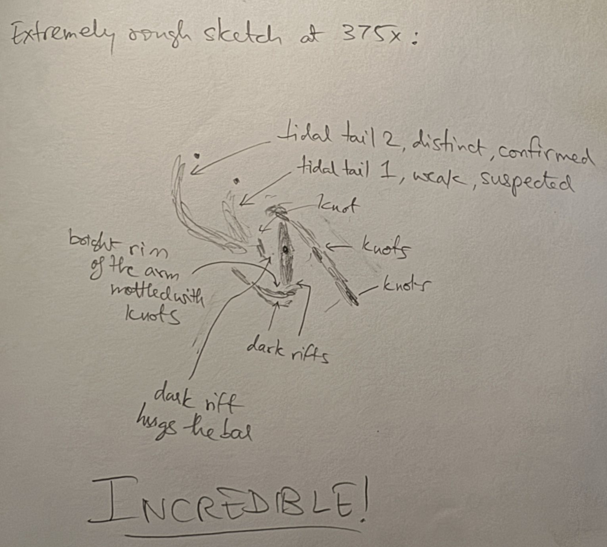
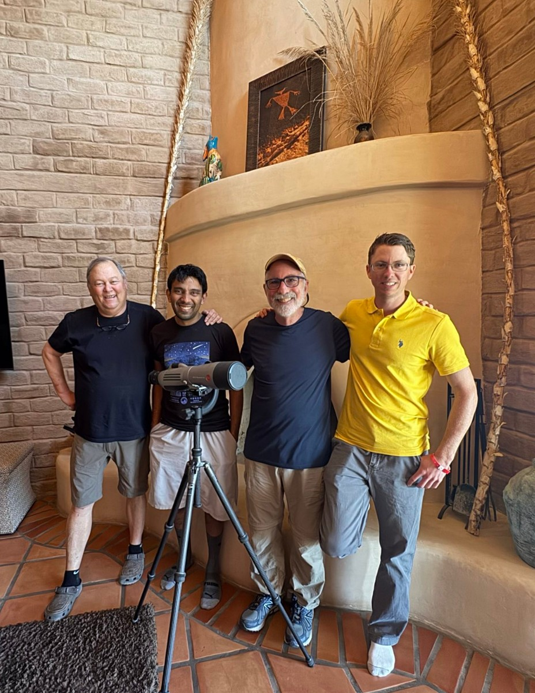

Whenever the Texas Star Party comes around, some of us end up at Jimi Lowrey's for a pilgrimage to his observatory. This year, Steve Gottlieb and I planned our trips to Jimi's to overlap. While I was there, Jimi's observatory was visited by many very well\-known people in visual deep\-sky astronomy. Howard Banich was sorely missed, but it looks like he won much better sky conditions in this new moon's lottery elsewhere.  

I took with me a fellow amateur astronomer, Sanath Kumar Sastry, visiting from India. He signed up for the star party so that he could showcase his new travel telescope product. Sanath and I left the bay area on the Sunday of TSP week in my vehicle. I was carrying my 28" so I could work on observations for a forthcoming Sky \& Telescope article, and also balance out the load on the 48". We made it Tuesday morning to Jimi's, shortly before Steve arrived. That evening, I set up my telescope in a small patch of level ground right outside Jimi's observatory. I lost the east and some of the north, but I chose this so I could be close to the action in the observatory. It also made for this nice photograph that Sanath took, my 28\-inch in the foreground and Jimi's 48\-inch in the background.

{:.medium}

My telescope needed some troubleshooting during setup on Tuesday. Scott, Steve and Sanath observed on Jimi's scope whereas I missed several of the cool things they were looking at, while sneaking in a few views every now and then. I hope Scott and Steve will post on what they observed.

  

The conditions were moderate for the first five nights \-\- lots of extinction due to smoke from fires in Mexico, high dust particle count, and oddly enough, dew (in west Texas!) Every night the Milky Way appeared somewhat washed out and the stinger of the Scorpion was murky with hardly any structure around the false comet \-\- but we observed regardless.

  

On Wednesday we were joined by Josh Wright from Pennsylvania (I first met Josh on the field of TSP in 2012\). On Thursday we were joined by Larry Mitchell, Stephen J O'Meara, Brent Archinal and Doug McCormick. That night was better \-\- we were able to see the Zodiacal Band. After almost everyone left on Thursday night, Jimi and I were so pumped up that we even observed some with Josh Wright's fine 25" Zambuto mirror Obsession, into the wee hours of morning. On Friday night, Sanath was at Texas Star Party showing the travel scope off, so it was just Steve and me with Jimi on the 48" \-\- the conditions were very underwhelming and we quit early due to high humidity and high particle count. Saturday night was decent, but we packed up on the 48" early since Steve had an early flight; I switched to my 28\-inch and pushed through until astronomical twilight. Everyone but for me had left by Sunday, and the conditions were unusable as clouds and winds came in Sunday and Monday nights. The wind was so bad, I tore down my telescope on Sunday and packed it up on Monday. Tuesday and Wednesday nights had spectacular conditions (except for the seeing) and I am glad I stayed on to observe with Jimi on his 48".

  

Some highlights of my observing run:

  

<b><x-dso>Twin Quasar</x-dso></b> (48" at 1040x): A clean split, southern quasar image substantially brighter.

  

<b><x-dso>NGC 4650A</x-dso></b> (28" at 486x): I got many flashes of the polar ring with averted vision. (I'd never been able to see the polar ring in my 18" and it was easy in Jimi's 48")

  

<b><x-dso simbad="Arp 244">Antennae Galaxies</x-dso></b> (28"): This was my first look at the Antennae in my 28". At 139x, the bright tidal tail segment (which I reported with my 18" in S\&T Feb 2025\) was not difficult and very diffuse. The tidal tail actually extended a bit longer than this section, though; which means that under better conditions I expect to be able to pick out the antennae. At higher power (486x), the galaxies were bursting with knots. I remembered Howard Banich's likening the view to flying over a lit\-up city at night.

  

**<x-dso>NGC 4298</x-dso> and <x-dso>NGC 4302</x-dso>** (28" at 291x): I have loved looking at this fantastic pair after being inspired by Howard's excellent sketch (can't remember where). I was able to pick up the dark lane of NGC 4302\. NGC 4298 showed weak mottling.

  

**<x-dso>UGC 10043</x-dso>**: At 610x in the 48\-inch, this galaxy showed appeared like an edge\-on with a huge bulge cut by a contrasty dark lane. With my 28\-inch at 291x, the bulge was almost visible with direct vision; averted vision clearly showed the elongated fins. Funnily enough, the first couple times I tried to tack on higher power to see this galaxy, I was thrown completely off by the view \-\- turns out Hickson 77 had drifted in by the time I swapped eyepieces!

  

**<x-dso simbad="NGC 6302">Bug Nebula</x-dso>** (NGC 6302; 28" at 583x): Very beautiful, bright nebula, reminiscent of an edge\-on galaxy. There is a knot on the leading side of the core as well as a long extension headed northwest.

  

**Nebulosity around <x-dso>NGC 3242</x-dso>**: Stephen O'Meara and Larry Mitchell told us about a dim ionized nebulosity near NGC 3242, seen in [this image](https://noirlab.edu/public/images/noao-ngc3242/). The conditions were subpar, but I am fairly confident of picking up a section around 10h 24m 09s \-18° 40' 38". The rest of the nebula was picked up after studying an image. The brightest part of the nebula is a bit further SSW and is visible on the DSS2 images. The best views were through UHC and H\-Beta filters, not so much through OIII. I would like to reattempt this under better conditions for further confirmation. If Mel is reading this, I would love to know his results. Jimi and a few others saw it on the 48", but I missed the bus. I believe Scott and Keith Rivich had caught it on the field of TSP a few nights prior.

  

**<x-dso>NGC 2903</x-dso>** (48"): An exceptional view! Spiral arms emanate from either end of a thin, bright bar. The bar ends are brightened and mottled with lots of knots.

  

**<x-dso>M 66</x-dso>**: Ever since I learned about the faint hook\-shaped tidal arms of M 66, I'd wanted to try see them. Initially, I had assumed that the distorted spiral arm of M 66 was due to tidal interaction with NGC 3628, but apparently it is due to ram pressure \-\- the actual tidal arms are on the opposite side and way fainter. Putting 208x on my 28", the outer tidal arm was not too difficult. The contrast on it seemed to be better. Before I studied an image I could only pick up a brightening in the general area to the north of M 66, so I suspected that the tidal tail was there, but I wasn't able to nail down the exact structure until after I looked at the picture (I didn't spend a lot of time). Several nights later, I requested to look at M 66 again on the 48\-inch, and it was an incredible sight! My logs read "Holy smokes! The galaxy's structure is incredibly detailed, showing the bar and two spiral arms in stunning detail. The arms show an interplay between dust and light, studded with knots and contrasty dark clouds." The contrast between the dark and bright regions of the arms was so stark that I remembered the photography concept of chiaroscuro. The tidal tail was extremely distinct in the 48\-inch under the exceptional conditions, and its curve was really evident. Jimi and I were both pushing through fatigue, so I did not invest the time beyond making a very rough sketch, setting my logbook on top of the 14 foot ladder while making sure I didn't lose balance. Here are my two sketches, first one with the 28\-inch and second with the 48\-inch. In both cases, I did not spend enough time studying the galaxy carefully; I will reserve that for a future observation.

  

{:.medium}  {:.medium}

  

**<x-dso>NGC 5215</x-dso>** (28" at 486x): Wow! The light bridge between the galaxies is continuous to near\-averted vision, fairly easy. The tail of NGC 5215B (\=ESO 383\-29\) could be held in averted vision for long stretches, albeit still intermittent. The tail of NGC 5215A (\=ESO 383\-28\) was faint, offering frequent flashes to averted vision.

  

**Webb's Wreath** (48"): Steve posted about Webb's Wreath [here](https://www.cloudynights.com/topic/936390-webbs-wreath-historic-but-seldom-observed-asterism-in-hercules-by-rev-tw-webb-in-1881/?p=14112022) on CloudyNights. <x-dso>PGC 1772537</x-dso> was extremely faint, condensed, and I only got a few weak flashes of it. I could only confirm it because of figuring out the exact location. The stars in the field were bothersome. <x-dso>PGC 1768412</x-dso> was easy, bright, edge\-on. The anonymous galaxy Steve refers to was fairly easy, I didn't have to know exactly where to look, it was low in surface brightness.

  

**The Little Pinwheel Galaxy, <x-dso>NGC 3184</x-dso>** (48" @ 375x) The conditions are terrible, but the view was still excellent. The galaxy appeared heavily mottled with two heavily mottled spiral arms going counterclockwise from the core. On the arm due west of the core, lay a prominent knot (NGC 3181\). A less prominent HII region, NGC 3180, lay due northwest on the same arm, but it was tough to isolate at 375x from the star that seems to be involved as seen from images. Steve pointed me to another knot at 10:18:08 41:26:48 that lay collinear with NGC 3180 and a bright star, and this knot was picked up with averted vision.

  

**<x-dso>NGC 4178</x-dso>** (48" @ 375x): The galaxy is perhaps 5:1 elongated, core is a stretched out bright streak. The rest of the galaxy is a dim averted vision halo, except for two bright HII knots on the southwestern end.  

**<x-dso>Terzan 4</x-dso>** (28" @ 291x): The seeing is terrible. However, Terzan 4 appears as a modestly bright glow continuously visible with averted vision. It appears like a condensed fuzzy patch. Cannot try more power due to junk seeing.

  

**<x-dso>VV 560</x-dso>** (48" at 488x). The bright core of PGC 200338 was visible continuously to direct vision. The brighter elongated region of the PGC 58267 was visible almost continuously with averted vision. I got brief, occasional glimpses of the hook\-shaped tidal tail of PGC 58267\. We owe Uwe thanks for this excellent object recommendation.

  

**<x-dso>VV 256</x-dso>** (48" at 488x). UGC 8932 was easy. NGC 5410 sported a very bright core and a bright bar, along with a rather knotty ring visible intermittently with averted vision. I also picked up a knot along the ring, perhaps at 14h 00m 54s 40° 59' 33".

  

**<x-dso>NGC 5297</x-dso>** (48" at 488x): This is a galaxy with a hook\-shaped tidal feature which Jimi featured as a [DeepSkyForum Object of the Week](https://www.deepskyforum.com/showthread.php?1703-Object-to-the-Week-July-9-2023-NGC-5297-%25E2%2580%259CThe-Hook-Galaxy%25E2%2580%259D) a couple years ago. The galaxy was somewhat mottled, bright, and had a slightly elongated much brighter core. On the south\-southeast of the galaxy lay a triangle of stars and the galaxy extended beyond the triangle. I was able to see the hook, it was surprisingly easier than expected.

  

**<x-dso>Rose 16</x-dso>** (48" at 610x): A beautiful line up of four galaxies in a chain, all four visible to direct vision. There were a couple of interlopers, PGC 1838572 which appeared bright, and almost stellar at lower power. PGC 1839315 was visible intermittently to averted vision.

  

**<x-dso>Segner's Wheel</x-dso>** \= Arp 241 (48" at 488x): Both tidal arms were picked up; they appeared very infrequently to averted vision.

  

**<x-dso>Frosty Leo</x-dso>** (48"): I had longed to see Frosty Leo through Jimi's 48" for a while, we finally hit it. At 610x the two lobes were separated by a thin but obvious dark gap. The southern lobe appeared a tad brighter and more condensed than the northern one. The lobes had a distinct orange tinge. At 813x, I was also able to pick up faint extensions on either lobe. The northern one was more prominent and ended in a knot.

  

**<x-dso>NGC 3169</x-dso>** **trio** (48" at 610x): This was Owen Brazell's [OOTW on DeepSkyForum](https://www.deepskyforum.com/showthread.php?1847-Object-of-the-Week-April-27th-2025-NGC-3166-and-friends) this week which prompted us to take a look. NGC 3169 was an incredible view. It sported a bright core and a stark dust lane hugging the southeastern side of the core. Careful averted vision showed a bright lane immediately southeast of it, followed by a second dark lane. I could see multiple dark structures. NGC 3166 was very bright, had an elongated core in a slightly elongated halo. There was a faint fin emanating from the galaxy to the east. I could not see the western fin. The core seemed to have dust strewn around it. It had a stellar nucleus. NGC 3165 showed weak mottling with an asymmetric structure. A faint star was superposed. I picked up hints of knots in the body but could not isolate any. Deep images of NGC 3169 show an incredible structure \-\- one such image is linked in the OOTW post. We went after one of the "shred"s (not sure what to cool them) from the galaxy at 10h 14m 13s 03° 33' 54". This shred was picked up after knowing roughly where to look. A chain of faint stars almost leads to it. I studied it for a while and later confirmed the exact location against Legacy survey imagery. The brightest portion lies due east\-northeast of the brighter, off\-chain star flanking it.

  

**<x-dso>UGC 9509</x-dso>** (48" at 610x): The galaxy UGC 9509 is visible continuously to direct vision. It's tidal tail is continously visible to averted vision and shows suspicions of mottling. The length of the tidal tail is about equal to the distance between the galaxy and its neighbor PGC 52729\. Wow!

  

Finally, the best thing I saw all week was   

  

**<x-dso>M 51</x-dso>** (48" at 375x): Wow! What a fantastic, jaw\-dropping view! The amount of detail is mesmerizing on this fantastic night. (We had excellent conditions during this observation). The "E"\-shaped tidal feature of M51b is visible continuously to direct vision. M51b has a bright core, beautiful variation of bright and dusty. M51a is a dizzying swirl of bright and dark, with the bright regions studded with knots. A dust lane hugs the core region and you can trace it around for a bit. The spiral arms are not just merely thin curving streaks, but are actually thick and fade off into the background. In other words, we can see not just the luminous front of star formation studded with knots, but also the light from the fainter stars from previous generations of star formation. This is particularly stark in the southern arm. The "connecting" arm is obvious. The fourth tidal tail of M51b took some work and I didn't study it carefully. <x-dso>IC 4278</x-dso> nearby was picked out easily. This is my best attempt at capturing a view beyond words in human language!

  

Finally, here is a picture of Jimi, Steve, Scott and me taken on one of the days:

