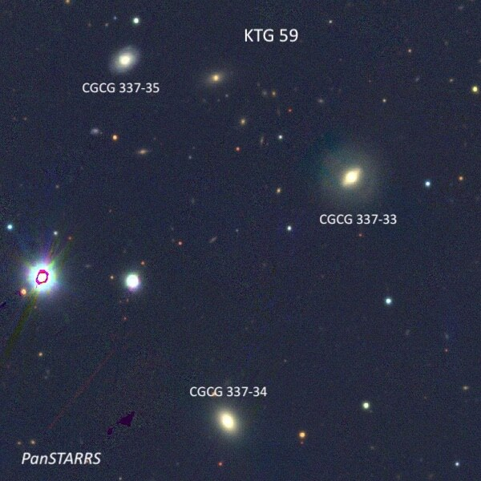

Last Saturday night, May 11th, I met up with Mark Wagner, Mina Reyes, Richard Navarette, Carter Scholz, and Mark Johnston at Kevin Ritschel's "Deep Sky Ranch”, in a sparcely populated area southeast of Hollister.  Conditions were a mixed bag — we sometimes had high clouds so parts of the sky would look awful (often low on the horizons), but at the same time other parts of the sky could be surprisingly good.  Same this applied to the seeing.  During the night, Kevin offered some great views of spring galaxies in his 33\.4” beast, dubbed Dobzilla.  
I really had just one observing project – continue working through the 84 trios listed in the little\-known 1979 "Isolated Galaxy Triplets" catalogue by Karachentseva, Karachentsev and Shcherbanovsky, known as the KTG. This catalogue contains isolated galaxy triplets (a few are not physical triplets) in the northern sky that were found by examining the Palomar Sky Survey plates.  I'm really not sure if there is any astrophysical importance of these groups to professionals, but all the component members have a photographic magnitudes of 15\.7 or brighter, so this is a nice observing project for 12" and larger scopes.  In fact, I got Carter Scholz hooked on going through this catalogue with his new 16\-inch f/4\.5\.  
  
Karachentseva classified the configurations as double, line, and triangle, but what makes the groups attractive is they are generally pretty compact \-\- roughly 3' to 7' in total size, so fit nicely in a high power eyepiece. I made all of the following observing using my 24\-inch f/3\.7 Starstructure, typically at 375x, which was about the highest power the seeing would consistently allow this night.  The sizes listed below refer to the maximum separation of any of the members in each trio.  

---

**Name**: <x-dso simbad="IC 749">KTG 40</x-dso>

**RA**: 11 58 43

**Dec**: \+42 39 08  
**Size**: 10\.2’

  
IC 750 \= KTG 40B appeared bright, very elongated 3:1 SW\-NE, 1\.5'x0\.5', well\-concentrated with a bright, elongated core that gradually increased to the center.  A mag 16 star lies 1' S of center.  IC 750 forms an usual 3\.4' pair with IC 749 \= KTG 40A, which is a Sc face\-on with a much lower surface brightness.  IC 749 appeared moderately bright, slightly elongated \~N\-S, 1\.3'x1\.1', diffuse appearance with an ill\-defined halo due to low surface brightness around periphery.  But the surface brightness appeared irregular or mottled with a very small, slightly brighter nucleus and I had the impression of spiral structure.  The SDSS image resolves the spiral arms into numerous blue HII regions and that probably contributed to the visual impression of mottling. Mag 8\.9 HD 103954 lies 3\.1' SW.

  

IC 751 \= KTG 40C, located 10' S, appeared fairly faint to moderately bright, very elongated 7:2 SSW\-NNE, 40"x12”.  It was sharply concentrated with a very small bright nucleus.  Forms a pair with IC 752 4\.1' E (not part of the KTG 40 triplet).  IC 751's redshift is 10x that of IC 749 and IC 750, so there are apparently two physical pairs of galaxies (along with IC 751/752\) in the eyepiece!

  

  

  
  

---

**Name**: <x-dso simbad="UGC 7064">KTG 41</x-dso>  
**RA**: 12 04 45\.3

**Dec**: \+31 10 31  
**Size**: 2\.0’

  
This small triplet (total size 2') consists of UGC 7064, CGCG 158\-11 (a very close pair) and CGCG 158\-12\.  The trio is located 9' WSW of mag 8\.3 HD 104998\.  At 375x, UGC 7064 \= KTG 41A appeared moderately bright, round, 30" diameter, gradually increases to a small bright nucleus.  A mag 10 star lies 2\.8' S, but it didn’t affect viewing the trio.  CGCG 158\-011 \= KTG 41C (double system) is 0\.9' NNW and appeared fairly faint, round, only 18” diameter.  CGCG 158\-010 \= KTG 41B is 1\.1' SSE of UGC 7064 and it was the faintest member of the triplet.  I logged it as faint, very elongated 3:1 NNW\-SSE, 24"x8".  This trio also is catalogued as Rose 8\.

  

  

  

---

**Name**: <x-dso simbad="IC 871">KTG 46</x-dso>  
**RA**: 13 18 16

**Dec**: \+04 26 42  
**Size**: 10\.2’

  
This is a nice 10' string of three IC galaxies oriented SW to NE.  At 375x, IC 871 \= KTG 46A appeared fairly faint, elongated 2:1 WSW\-ENE, 0\.8'x0\.4', sharply concentrated with a bright core and diffuse halo.  A mag 12 star lies 1\.3' E.  IC 873 \= KTG 46B, situated 5\.7' NE, appeared fairly faint, round, 18", weak concentration.  Compact galaxy with a moderately high surface brightness. IC 876 \= KTG 46C, 4\.8' ENE, appeared fairly faint, elongated 4:3 N\-S, 24"x18", weak concentration, small brighter nucleus.

  

  

  
  
---

**Name**: <x-dso simbad="IC 904">KTG 47</x-dso>  
**RA**: 13 38 34

**Dec**: \+00 31 42  
**Size**: 3\.5’

  
This triplet is dominated by IC 904 \= KTG 47B which appeared moderately bright and large, elongated 2:1 NW\-SE, 40"x20", fairly high surface brightness, brighter nucleus.  Much fainter UGC 8631 \= KTG 47C lies 1\.9' E and CGCG 17\-46 \= KTG 47A is 2\.0' SSW.  CGCG 17\-46 appeared extremely faint, 15"x6", required averted to glimpse. A mag 16 star lies 25" SSW.  UGC 8631 was also extremely faint, elongated 2:1 E\-W, 0\.4'x0\.2', very low surface brightness.  Situated 1\.9' E of IC 904 and 1\.4' W of a mag 12\.5 star.  The trio spans 3\.5' SW to NE.

  

  

  
  
---

**Name**: <x-dso simbad="UGC 8686">KTG 48</x-dso>  
**RA**: 13 43 52

**Dec**: \+03 53 48  
**Size**: 6\.2’

  
UGC 8686 \= KTG 48A is westernmost in the KTG triplet and forms a close pair with CGCG 45\-81 1\.2' SE.  At 375x, UGC 8686 appeared fairly faint, very elongated 4:1 SW\-NE, 0\.8'x0\.2', weak concentration.  CGCG 45\-81 \= KTG 48B appeared faint, round, 12" diameter, no other details.  Lastly,  CGCG 45\-84 \= KTG 48C, located \~6' E of the pair, appeared fairly faint, elongated 2:1 WNW, 30"x15", sharply concentrated with a bright round nucleus. A mag 13\.3 star lies 1\.1' WSW.

  

  

  
  
---

**Name**: <x-dso simbad="MCG\+00\-35\-020">KTG 49</x-dso>  
**RA**: 13 46 18

**Dec**: \-03 24 00  
**Size**: 3\.1’

  
This triplet consists of a close pair (CGCG 17\-67 \= KTG 49B and 49C) and a very diffuse, low surface brightness spiral (CGCG 17\-67 \= KTG 49A).  At 375x, KTG 49B appeared fairly faint, elongated 2:1 N\-S, 25"x12”.  It forms a close pair with KTG 49C 0\.8' NNE.  KTG 49C appeared faint, slightly elongated, high surface brightness, 15"x12" diameter. A mag 15\.2 star lies 0\.8' NNE.  Based on the SDSS image, I picked up the core of this sharply concentrated galaxy.  KTG 49A \= CGCG 17\-67 appeared extremely faint, round, 18" diameter, very low even surface brightness. It required averted vision to glimpse at 375x.

  

  

  

  
---

**Name**: <x-dso simbad="IC 962">KTG 51</x-dso>  
**RA**: 13 57 16

**Dec**: \+11 59 54  
**Size**: 3\.1’

  
KTG 51 consists of the high surface brightness galaxy IC 962, along with two CGCG galaxies, extending 3\.1' NW to SE.  At 375x, IC 962 \= KTG 51A appeared fairly bright, round, 24", small bright nucleus, high surface brightness.  It sits 8\.7' NW of mag 7\.7 HD 121845 and is first (west) in the triplet with CGCG 74\-14 1\.4' S and CGCG 74\-16 3\.1' SE.  KTG 51B \= CGCG 74\-14 appeared fairly faint, elongated 3:2 NNW\-SSE, 0\.4'x0\.25', sharply concentrated with a very small bright nucleus and a diffuse halo. KTG 51C \= CGCG 74\-16 lies 1\.8' SE and appeared faint to fairly faint, round, weak concentration, 18" diameter, small slightly brighter core.

  

  

  

  
---

**Name**: <x-dso simbad="UGC 8939">KTG 52</x-dso>  
**RA**: 14 02 08\.9

**Dec**: \-01 22 38  
**Size**: 2\.5’

  
UGC 8939 \= KTG 52A is the brightest member of this triplet. At 375x, it appeared fairly faint to moderately bright, round, 35" diameter, broad concentration.  CGCG 18\-29 \= KTG 52B lies 3\.3' SSE and CGCG 18\-31 \= KTG 52C is 2\.6' SE.  CGCG 18\-29 appeared fairly faint, round, high surface brightness, 18” diameter with a stellar nucleus.  I wasn’t able to confirm CGCG 18\-31, although thin clouds probably affected the observation.

  

  

  
  
---

**Name**: <x-dso simbad="Z 103\-60">KTG 53</x-dso>  
**RA**: 14 04 34

**Dec**: \+16 18 18  
**Size**: 8\.1’

  
CGCG 103\-060\= KTG 53B is the brightest member of this triplet.  At 375x, it appeared fairly fairly, slightly elongated, compact, with a fairly high surface brightness and a diameter of roughly 18"x15".  CGCG 103\-65 \= KTG 53C lies 5\.6' ESE and appeared extremely faint, round, 15" diameter, low even surface brightness.  A mag 11\.4 star lies 2\.8' ENE.  UGC 8987 \= KTG 53A, a very low surface brightness edge\-on (interacting?), was missed.

  

  

  
  
---

**Name**: <x-dso simbad="NGC 5566">KTG 54</x-dso>

**Alias**: Arp 286  
**RA**: 14 20 18

**Dec**: \+03 58 12  
**Size**: 7’

  
NGC 5560 \= KTG 54A appeared fairly bright, very elongated 7:2 WNW\-ESE, 2\.0'x0\.6', relatively large bright core, fades and tapers towards tips.  First in a trio with NGC 5566 5\.3' SE and much fainter NGC 5569 7' E (the trio forming Arp 286 \= KTG 54\).  A mag 14 star is 40" N of center and mag 8\.2 HD 125505 is 5' WNW.  NGC 5566 \= KTG 54B appeared very bright and large, elongated 3:1 SW\-NE.  It was very sharply concentrated with a large, bright elongated core that was also sharply concentrated with an intense elongated nucleus, angled with respect to the major axis.  The halo is quite diffuse without a sharp edge, but extended at least 4\.0'x1\.3'.  The core is bracketed by mag 12 and 14 stars to the east and west, respectively.  Finally, NGC 5569 \= KTG 54C was surprisingly low surface brightness in the 24" and appeared as a faint, very diffuse glow with a very weak core, slightly elongated, \~1\.2'x1\.0’.

  

  

  
  
---

**Name**: <x-dso simbad="2MASX J14224016\+0610005">KTG 56</x-dso>  
**RA**: 14 22 55

**Dec**: \+06 09 40  
**Size**: 7\.4’

  
This triplet consists of three elongated Sb spirals in a 7\.5' string oriented E\-W, all with similar sizes, magnitudes and axial ratios.  At the west end is CGCG 47\-27 \= KTG 56A, which appeared faint, elongated 2:1 NW\-SE, 18"x9".  CGCG 47\-28 \= KTG 56B at 3\.5' E appeared faint, elongated 3:2 N\-S, 15"x10", weak concentration.  Finally, CGCG 47\-29 \= KTG 56C at 4' further east, was faint, elongated 2:1 SW\-NE, 18"x9" and just distinguishable as the faintest in the triplet.

  

  

  
  
---

**Name**: <x-dso simbad="NGC 5619">KTG 57</x-dso>  
**RA**: 14 27 26\.7

**Dec**: \+04 48 05  
**Size**: 3\.7’

  
NGC 5619 \= KTG 57A is brightest member of this trio. It was fairly bright, very elongated 5:2 N\-S, \~1\.6'x0\.7', sharply concentrated with a very bright, very small core.  IC 4424 \= KTG 57C, located 3\.7' ENE, is the second brightest and appeared fairly faint, elongated 3:2 NW\-SE, \~24"x14".  A mag 16 star is just off its south side, 15" from center.  Finally, UGC 9258 \= NGC 5619B \= KTG 57C, situated  2\.6' SSW, appeared fairly faint, low surface brightness (face\-on spiral?), round, diffuse glow, very weak concentration, 24" diameter.

  

  

  

  
  
---

**Name**: <x-dso simbad="NGC 5736">KTG 58</x-dso>  
**RA**: 14 43 36

**Dec**: \+11 10 48  
**Size**: 4\.8’

  
NGC 5736 \= KTG 58A is the brightest member of this triplet.  At 375x, it appeared fairly faint, elongated 3:2 WNW\-ESE, 45"x30", small bright core.  Forms a pair with CGCG 76\-9 \= KTB 58C 2\.7' NE.  The companion appeared very faint and small, slightly elongated, low surface brightness, 20"x15”.  I was unsuccessful with UGC 9490, a superthin hidden in the glare of a mag 11\.5 star (3" double).

  

  

  
  
---

**Name**: <x-dso simbad="MCG\+12\-14\-021">KTG 59</x-dso>  
**RA**: 15 15 49

**Dec**: \+69 18 18  
**Size**: 0\.7’x0\.4'

  
CGCG 337\-33 \= KTG 59A appeared fairly faint, round, 18" diameter (the extremely low surface brightness outer halo wasn't noticed), brighter core, faint stellar nucleus.  This galaxy is the brightest in KTG 59 with CGCG 337\-35 \= KTG 59C 2\.7' NE and CGCG 337\-34 \= KTG 59B 2\.8' SSE.  A mag 9\.8 star lies 3\.4' ESE.

  

The three galaxies and the brighter star form a striking kite\-shape (nearly a square), with sides 2\.4'\-2\.8’. CGCG 337\-34 appeared faint, slightly elongated, 15"x12" and CGCG 337\-35, the faintest and last of three, was very faint, round, a mere 10" diameter.  It lies 2\.4' NNW of the mag 9\.8 star.

  

  

  
  
---

**Name**: <x-dso simbad="NGC 5911">KTG 60</x-dso>  
**RA**: 15 20 24

**Dec**: \+03 28 54  
**Size**: 6\.6’

  
NGC 5911 \= KTG 60A, the brightest member of KTG 60, appeared fairly faint, elongated 4:3 SW\-NE, 30"x24", small brighter core. It forms a pair with CGCG 49\-134 \= KTG 60B 1\.6' NE.   A mag 12 star and three mag 14 stars in a group lie \~3' E. CGCG 49\-134, the faintest in the trio, appeared very faint, round, just 12" diameter.  The three mag 14 stars mentioned above are collinear and equally spaced with this galaxy.  CGCG 49\-135, 6' SE of NGC 5911, appeared very faint, round, 15" diameter.

  

  

