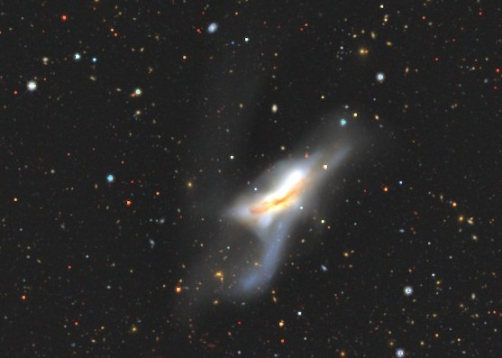

Jonathan, who was looking at the Astrospheric Pro forecast, pointed out that there were clouds predicted on Saturday and he would instead join me on Sunday. I mulled over the updated weather information for a while and decided to go to Tranquility Base anyway since I was gonna do two nights – if one night got skunked, I would still meet Kingsley's criterion.  

  

I arrived just around the end of astronomical twilight, and there was only one tiny cloud lingering on the horizon. Energized, it took me just about an hour to set everything up including my laptop and get going. Just in time for the clouds to arrive. I pointed to <b><x-dso>Stephan's Quintet</x-dso></b> in pursuit of the 5th true member of the quintet – while talking to Howard Banich at GSSP earlier this year, I learned of his then\-anticipated S&T article on the group (2024 September issue) in which he talks about <b><x-dso>NGC 7320C</x-dso></b>, a galaxy actually gravitationally bound to the four true members of the group. As I was trying to eke out the orientations of the galaxies while wondering why my equatorial platform was tracking intermittently, I got suckerholed. I spent 20 minutes waiting for the clouds to pass and went back to catch NGC 7320C after. It was very dim, flashed repeatedly to averted vision pretty frequently. It appeared as a uniform dim glow about which nothing further could be ascertained. A strong wind, which was seemingly helpful in blowing the clouds out, deteriorated the view and made it harder to hold my telescope steady.

  

Surprisingly, the sky cleared subsequently and remained clear for most of the night, except for the occasional small cloud that would pass by. As you may have guessed from the title, I had two amazing, very productive nights; but you know what scintillation means in astronomy – the stars at 200x were baseballs. During both nights, I twiddled the focus knob back and forth constantly in disbelief because I'd never observed with such terrible seeing before. Wiser people who knew to trust the seeing forecast and the jet stream had anticipated my fate, but I have a tendency to ignore the bottom row on the forecast (saying "seeing is believing") and so I was taken aback.

  

Normally, I like to eke out detail in distant galaxies using high power. I had already abandoned this regimen since I was taking the 18" out and not the 28". Instead on my observing list were things that were mostly large / low\-surface brightness objects, as well as objects that did not offer much detail but only the pleasure of detecting the galactic glows – Abell planetary nebulae, Hickson groups, Abell clusters, Sharpless nebulae. What a happy coincidence, this is exactly the sort of thing that fits well with nights of terrible seeing. I stayed at or below 300x for the most part during both nights and checked off a lot of galaxies and nebulae!

  

<b><x-dso>Hickson 91</x-dso></b> has four bright compact group members and a smattering of dim galaxies surrounding it. Despite the junk seeing I was able to see all four members simultaneously for short periods with averted vision. Of the surrounding galaxies, only **IC 5168** yielded, and it was an extremely dim smudge.

  

<b><x-dso>NGC 7396</x-dso> and co.</b> were a pretty good sight as well. I was able to hold NGC 7396, 7, 8 and NGC 7401 simultaneously in the same field at 200x. Also picked up **NGC 7402** which was dim, **PGC 214871, PGC 1182665, PGC 194158** in the region. PGC 1182665 may be the galaxy I saw with the lowest flux over the two nights, at an estimated 16\.2 V\-magnitude.

  

Frustrated with the seeing, I moved on to a few nebulae – **Sh2\-155**, **NGC 7380**, **Bubble Nebula**, and **NGC 7538**, all HII regions in Cepheus/Cassiopeia. Of these, I had seen the Bubble before but spent a good 15 minutes studying it and making a rough sketch. <x-dso>NGC 7538</x-dso> was the most interesting of the four – it was sort of reminiscent of the crab nebula, and dark filaments chopped it apart randomly. Incidentally, I paused at the open cluster <b><x-dso>M 52</x-dso></b> en route here and noticed that it was wedged in beautiful dark nebulae on either side. In fact two filaments of dark nebulosity formed a nice V\-shape on the south\-southeast. Ten\-years\-ago\-me would have never noticed something like this, experience counts. **[Neckel\-Staude 2](https://www.deepskyforum.com/showthread.php?1727-Object-of-the-Week-November-12th-2023-Neckel-Staude-2)** is a patchy region of what looks like reflection nebulosity, also in Cassiopeia. It was pretty dim but most certainly there.

<i><x-dso simbad="[NS84] 2">Neckel-Staude 2</x-dso>, DSS2 Color</i>
  

I looked up at the sky with the naked eye. The **Gegenschein** was very obvious, just south of Aries. Bits of the **Zodiacal Band** (not light) were also visible, perhaps stretching around 3½ zodiacal constellations. The sky still looked murky, as though the transparency was poor. I'm not sure what was going on, because my next observation blew my mind.

  

The last I looked at <b><x-dso>NGC 520</x-dso></b> (Arp 157\) with my 18" was way back in 2014 from central Texas, when I picked up the four protuberances of this galactic trainwreck. Surprisingly, my sketch has an extension on the southern edge that is longer than the bright protuberance with a "?" on it. Ten years later, that "?" has turned into an "!". Yet another great tidal tail for an 18" – At 147x, the galaxy seemed embedded in a Y\-shaped halo with the left prong of the Y being longer. I got many repeated flashes of the tidal tail going to the south\-southeast. I tried hallucinating the feature in other directions, to no avail. The sensation was pretty strong, I was just surprised to see it under these conditions. I did not see exactly how the tail emanates from the galaxy or which way it was curved, but I was able to generally sense something 1\.5' long in that general direction. The northwestern tail also kept calling out to me, and it looked longer than in the DSS2 images perhaps because of the effect of two nearly collinear stars. The only time I used 413x during the two nights was to take a look at the inner detail of the galaxy, and I could see all four protuberances, the southwestern one being much dimmer than the rest. When I began this observation it was about 1:30 AM (PDT), and I ended at 1:15 AM (PST). I realized I had just spent my "extra hour" in such a satisfying way. This was one of my highlights of the two nights.

  

<i>NGC 520, Legacy Survey. The Y-shape I describe has the stem of the Y pointing at 1:30 clock position.</i>
  

  

The next object was also a hit – the polar\-ring galaxy <b><x-dso>NGC 660</x-dso></b>. I had seen this from Okie\-Tex back in 2021, where I saw the dark "cut" in the body of the galaxy due to the dusty polar ring passing over its body. This time, I could not see that cut (likely thanks to the jet stream), but I was surprised again to see (at 147x) the two streams of light twisting out of its two ends. The POSSII image had me believing that these are parts of the polar ring, but the Legacy Survey image suggests that it might be something else. I need to dig deeper to find out what it is, but nevertheless it is something I was surprised to see in my 18".

 

<i>NGC 660, Left: DSS2 Blue Plate, Right: Legacy Survey</i>
  

  

Even though I've seen **NGC 891** countless times, its beauty in the eyepiece made me wish I could share the experience with a close friend. I enjoy how wide the dust and evident the dust tail is, and that it is not of uniform thickness. The bulge shows some gentle mottling too. NGC 891 is a popular anchor to star\-hop to galaxy cluster **[<x-dso>Abell 347</x-dso>](http://adventuresindeepspace.com/agc347ch.htm)**, from which I systematically dug out **18 galaxies** before I got fed up. I lost my resilience to continue in part because the hot\-glue fix on my equatorial platform was finally showing signs of giving out – it did track a good amount of time (many of my observations would be impossible without tracking), but it would also randomly disengage in\-between and engage again. The other reason was that stars were basketballs at 200x. The seeing was less unreasonable in the previous couple hours, but it rapidly worsened perhaps around 2:30 AM (PST) as I was tackling this cluster.  

  

My last object for the first night (it was 4 AM in PST at this point) was <b><x-dso>NGC 1502</x-dso></b>, the Golden Harp cluster that's in Kemble's Cascade. It looked like a duck with wild evil eyes, and I was unable to visualize the harp.

  

On the second night, I was joined by Jonathan Lawton who brought his 16" scope. I felt less intense about observing during the second night; not only was I weary from the previous night, but I also wanted to hang out with Jonathan. We had a good time observing and sharing conversation. The seeing on Sunday night seemed worse than Saturday, who would've thunk there was even room for that. I eschewed the temptation to go after galaxies, but caved in a few times.

  

PN <b><x-dso simbad="PN A66 81">Abell 81</x-dso></b> appeared "reasonably bright" and responded strongly to an OIII filter. I was only able to weakly sense that the rim was brighter and mottled, darned seeing. **Sh2\-132** is an interesting nebula, which spanned almost 40 arcminutes in breadth. PN **Abell 79** was picked up as a dim amorphous glow, slightly elongated ENE\-WSW. I wish it looked anything like its photograph – maybe with the 28" on a night of exceptional seeing?

<i>PN Abell 79 by <a href="https://app.astrobin.com/i/34ruh1">Jerry Macon</a></i>

Unable to resist the extragalactic temptations, I tried to savor a bit of <b><x-dso>Hickson 94</x-dso></b>. The turbulent air made for a frustrating experience, but three of its four members were bagged at 350x. I promptly returned to nebulae. <b><x-dso>Sh2-174</x-dso></b> was a dim nebulous glow that showed some mottling. Despite being fainter than many other nebulae on the DSS2 images, the contrast with the surroundings and the lack of confounding stars and star clouds made it easy.

  

My next object had me recall a CloudyNights thread: [What DSO did you just observe for the first time? Rate it 1 to 5\.](https://www.cloudynights.com/topic/638383-what-dso-did-you-just-observe-for-the-first-time-rate-it-1-to-5/page-38#entry13773505) Finally, I have something to give a 1 or even better, a negative rating to. After an excruciating eternity of trying to pick out anything in the field, I may have seen one tendril of the supernova remnant **Abell 85** also known as CTB 1\. There seem to be hardly any observations of this object, and mine should not be counted as anything beyond "weak" (so not really a positive observation). Reiner Vogel's Abell PN atlas lists no observing notes, and the ADS article [here](http://adventuresindeepspace.com/ctb1.htm) mentions experiences very similar to mine, albeit one positive observation by Ronald Stoyan. In any case, there were filaments of star glow and halos around chains of stars all over the place, not just at the location of the tendrils of this supernova remnant. Trying all three nebula filters (H\-beta, OIII, UHC), I was able to consistently pick out a small filament, about 5' long, going north from the star BD\+61 2574\. This segment seemed to not be caused by the glow of stars and appeared truly nebulous, but there is really no way of confirming it as there were star chains looking similarly nebulous. I also consistently sensed a curving filament due east of the same star in the H\-Beta filter, but there were stars superposed all along. I wonder if this frustrating experience is not a coincidence – generally the mechanism that causes an SNR to glow (as far as I understand) is the collision of the expelled material with the interstellar medium, dumping energy into the gas and causing it to emit light; such collisions also trigger star\-formation. So I wonder if it is not a coincidence that star chains follow filaments of nebulosity, making for a frustrating experience for visual observers. BTW, I see that it is also listed on Rich Jakiel's "[Ultimate Challenges](http://adventuresindeepspace.com/ultimate.htm)" article on ADS along with other nearly impossible targets.  

  

After such observations, I generally want to pick a target that I can actually see, so I went for **M 74**. Thank goodness the galaxy was visible, but seeing its arms proved harder than anticipated. It looked very mottled even through the boiling atmosphere. **Horsehead Nebula** through Jonathan's 16" was a delightful sight. Jonathan and I agreed on the direction of the head of the horse. It was his first time seeing the horsehead, and I recalled my first time as well – a decade and a half ago, it was the holy grail of visual observation for me. The goalpost keeps moving.

  

At some point in the night, the Zodiacal Band ran all the way from near Hyades, through the Gegenschein, almost to Saturn which was about 15° above the horizon – not bad eh? BTW, no planets ruined my dark adaptation in this true deep\-sky session.  

  

Perusing my observing plan, <b><x-dso>Hickson 14</x-dso></b> looked like something that could handle the Pickering \-10 conditions. Three galaxies were spotted making a nice chain at 200x, and all three could be held simultaneously with averted vision for several seconds! <b><x-dso>Hickson 15</x-dso></b> also looked pretty easy on the DSS plate. It was a delight at 200x, as both Jonathan and I were able to see all 5 blobs of light in the same FOV, amidst less\-blobby stars. Tacking on 300x, I was able to get a few weak flashes of resolving the sixth member (HCG 15f) but I am not positive – this one would need better seeing.

  

Back to nebulae, PN <b><x-dso simbad="PN A66 4">Abell 4</x-dso></b> was a small round blob about 0\.4' in dia that was "not too difficult". En route to Abell 4, I paused at open cluster **M 34**. The three curved chains of stars meeting at the center of the cluster made me think of the Flux Capacitor from Back to the Future! With people giving random names to deep\-sky objects of late, can I call this the Flux Capacitor Cluster please? **Abell 6** was a weak brightening that was barely above the background. It was only a subtle sensation with averted vision, but something was definitely there. I estimated the diameter of the glow as 9 arcminutes, which is a gross overestimate: it's actually about 3 arcminutes. That means I didn't see it correctly – I must've blended in the nebulous patch along with glows from the dim asterism near it. Drat, it stays on the list. I've observed both of these objects before, but only with John Tatarchuk's 25" in Texas. PN <b><x-dso simbad="PN A66 2">Abell 2</x-dso></b>, appeared as a very dim glow that responded strongly to an OIII filter. A chain of 3 stars points to it from afar, and by comparing with the chain, I estimated the glow to be about 45" (actual size around 32"). I was looking through substantial airmass since Cassiopeia was low. BTW, my interest in Abell planetaries for this season was kindled by [this CN thread](https://www.cloudynights.com/topic/942362-abell-planetary-nebula/#entry13773761), after which I ferreted out good candidates from the [pages on ADS](https://adventuresindeepspace.com/abellpn.htm).

  

I ended my two nights of observing on the <b><x-dso>Crab Nebula</x-dso></b>. With an OIII filter at 147x, the nebula showed an extremely mottled appearance. The outline was serrated as seen with averted vision. I could pick out perhaps 2–3 sharp filaments in the interior. Without the OIII filter, the nebula brightened up (this is because a lot of its light comes from synchrotron emission which is broad\-band). The edge looked even more serrated, but the filamentous structure was washed out. Frustratingly, the seeing had just started getting good at this point, and I was out of energy. One of my motivations for looking at M 1 was to see if it would respond to a polarizing filter. The synchrotron light coming from the electrons gyrating at speeds nearing the speed of light around the magnetic field lines of the pulsar is strongly linearly polarized due to relativistic effects. Some amateurs have tried to [photograph](http://www.narrowbandimaging.com/color_polarization_imaging_page.htm) and [visually observe](https://www.deepskyforum.com/showthread.php?934-The-Stokes-Parameter-of-M-1) the polarization properties of M 1\. My attempt here was rudimentary as I just held a variable neutral density filter (a pair of polarizers) made for camera lenses between my eye and the eyepiece – I wanted to see if I'd see any obvious changes by rotating the polarizer. I stuck the ND filter at its maximum transmission (uncrossed polarizers) and just rotated the filter as a whole. Unfortunately, I did not see any substantial change. I could "sense" perhaps some subtle changes, but nothing concrete that I could pin down. It doesn't seem to be a night\-and\-day difference with a polarizer like I saw with, for example, the Egg Nebula (after [Steve Gottlieb pointed it out](https://groups.google.com/g/sf-bay-tac/c/TsTg0Pn4hH8/m/cT6cp2jmCAAJ) several years ago). A better way to do this might be to use a moon filter (again set to max transmission) which can actually screw to the back of the eyepiece, have an index mark on the eyepiece, and rotate it – a note for next time. The crab nebula looked so beautiful, as usual I wondered why I see those faint blobs of light instead of looking at targets like this one. I will hit it with my 28" whenever I can next.

  

The total haul was 54 galaxies and 11 nebulae (not counting Abell 6 and Abell 85\), most new, some old. Thank you, Jonathan, for the company. I'm glad I got out.

  

Clear Skies 
Akarsh

  

