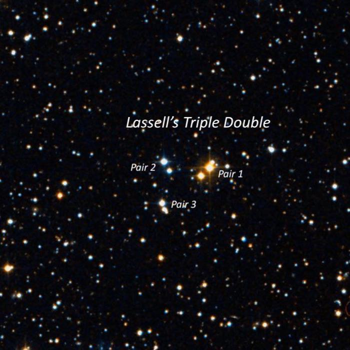
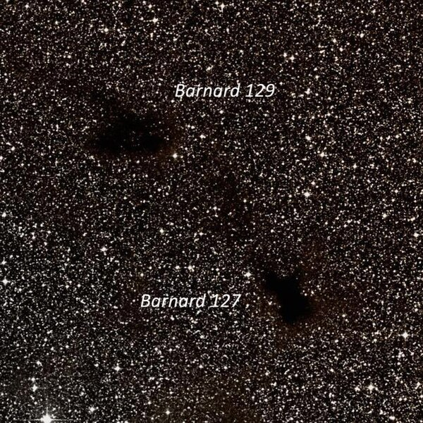
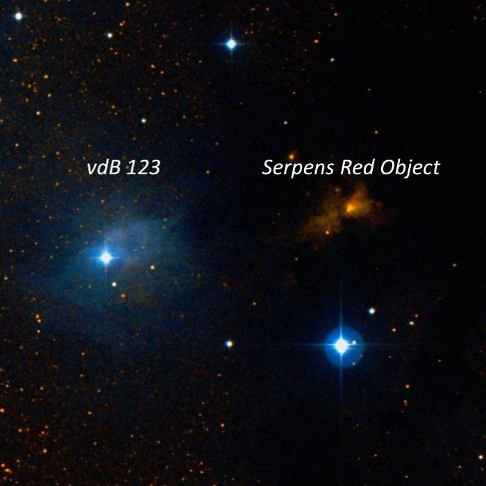
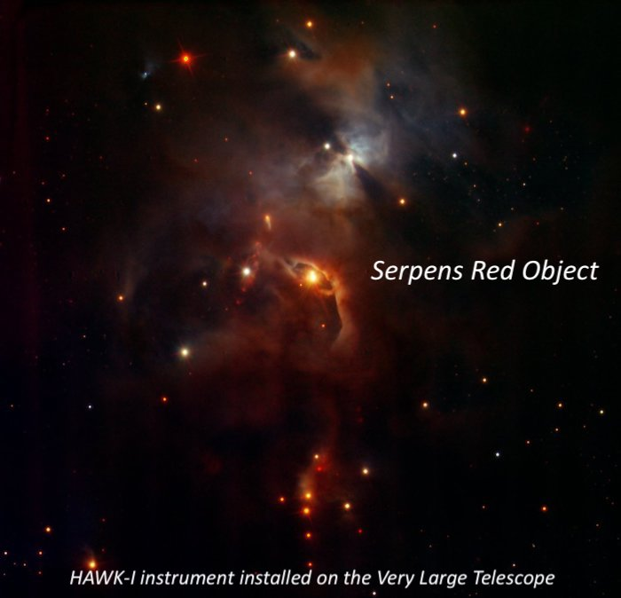
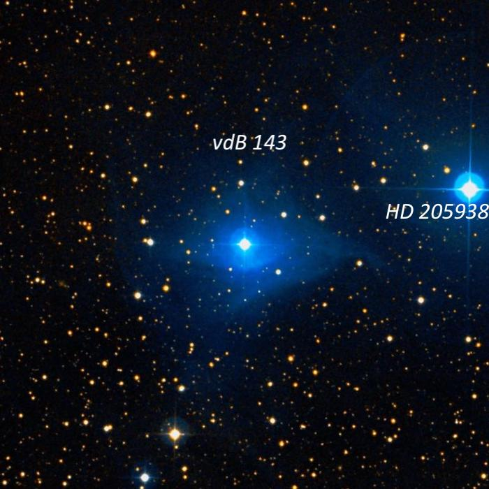
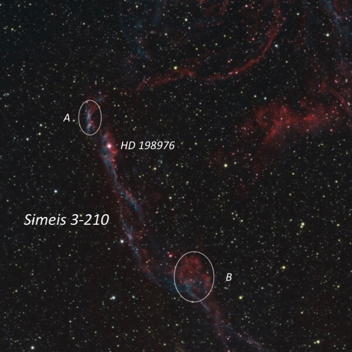
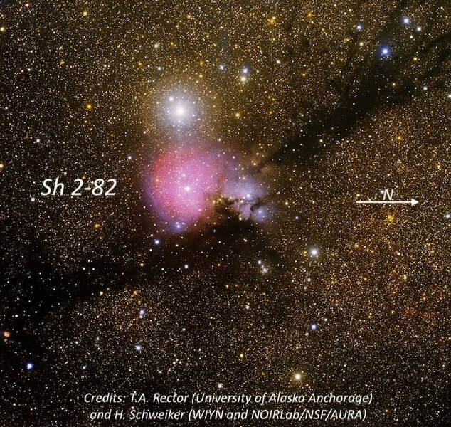
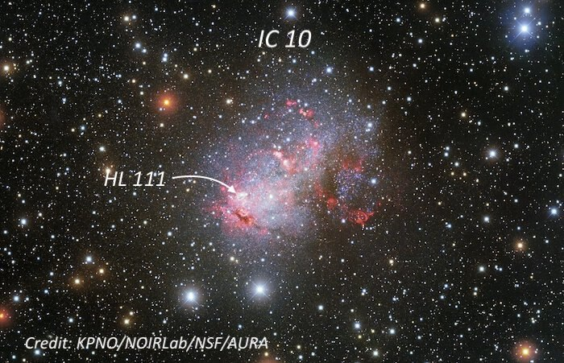

On Monday night, September 6th, Labor Day – three months after retiring from teaching – I met Bob Douglas at our usual observing spot on Rockpile Road at Lake Sonoma.  While setting up after sunset we enjoyed views of Venus, Mars and Spica, which were were setting low in the west. Conditions at night were very comfortable; fairly warm and dry with an occasional warm breeze.  Although not as dark as the past few months' outings to Lassen and GSSP it was still an enjoyable evening.  

Transparency was perhaps slightly better than average for Lake Sonoma, though the seeing was a bit soft at time.  Targets included the comet 103P/Hartley (fairly large but pretty low surface brightness), some Sharpless HII regions, a couple of obscure reflection nebulae (vdB 123 and vdB 143\), Lassell’s Triple\-Double (haven’t heard of it?), Simeis 3\-210 — the filament at the extreme southern end of the Veil nebula, IC 10 and the Serpens Red Nebula.

---

**Name**: [LSL 1 (Lassell 1\)](https://www.stelledoppie.it/index2.php?iddoppia=95581)

  

**RA**: 21 34 50

**Dec**: \+32 04 30

**Mags**: 10\.6/11\.9,11\.8/13\.5,12\.1/12\.1

**Separations**: 22"/19"/12"

  

  

In 1857, William Lassell (discoverer of Neptune’s largest moon Triton and Uranus’s moons Ariel and Umbriel) announced he had stumbled upon "*a singular group of three stars, each attended by a small companion.  The three principal stars form a right\-angled triangle, with one side about one\-fifth shorter than the other*."  The stars are described as "rather brighter than 10th magnitude" to 12th magnitude for two of the companions.

  

I found Lassell’s Triple\-Double to be a striking trio of doubles separated by 1’ to 2' with the three individual pairs (separations of 12"/19"/22") easily resolved at 175x.  The general arrangement is a right triangle, as stated by Lassell, with two pairs oriented \~E\-W and the third pair (separation 12") due S of the NE pair.  The pair to the NW has a third close companion and the two main components "point" to the pair forming the SE vertex.

  

  

  
  
---

**Name**:  <b><x-dso>Barnard 129</x-dso></b> 

  

**RA**: 19 02 07

**Dec**: \-05 18 30

**Size**: 5'

  

Barnard 129 and 127 form a pair of dark nebulae in Aquila.  E.E. Barnard described B 129 as "Very black; sharply defined; diameter 5'; a small star at the W end.  Somewhat rectangular in form with projections to the east.  It is the blacker portion of a dark region 10' in diameter.”  A 2006 study by Maheswar and Bhatt in the *Monthly Notices of the Royal Astronomical Society* placed B 129 at a distance of 650 ± 130 l.y.  He described its companion B 127 as "Irregular; diameter 4\.5'; very black in its southeast portion, diffused on the west side.  B 127, 129, 130 are connected in an irregular curve, convex to the west.”

  

I picked up B 129 at 108x as a roughly circular, darker patch, \~5' diameter.  The contrast was fairly low contrast but noticeable against the rich Milky Way background glow surrounding the dust cloud.  There were no stars within the boundaries of the patch.  B 127 lies \~12' SW and was seen as a small, less\-defined patch.  Barnard 130 lies 15' SSW, but it was too contaminated by field stars to be clearly distguished.

  

  

  
  
  

  
---

**Name**:  <b><x-dso simbad="HD 170634">vdB 123</x-dso></b> 

  

**Type**: Reflection Nebula

**RA**: 18 30 23

**Dec**: \+01 13 42

**Size**: 10’x5'

  

**Name**:  <b><x-dso simbad="NAME Ser Nebula">Serpens Red Nebula</x-dso></b> 

  

**Type**: Highly obscured reflection nebula

**RA**: 18 29 56

**Dec**: \+01 14 48

**Size**: 1'

  

vdB 123 is an easy reflection nebula that was picked up at 108x surrounding a mag 9\.3 star.  It extended mostly NW, with the star offset to the SE side of the glow and a diameter of \~3’.  Using 175x provided a nice view, with the diffuse glow extending \~3\.5'x2’.  A string of three double stars extends to the SW!  In the DSS2 image below the bright star is actually the double STF 2321, a 6” pair of mag 8\.5/9\.6 stars.

  

You’ll notice the field to the right (west of vdB 123\) is nearly void of faint stars, which is due to heavy dust obscuration.  We’re viewing into the heart of the Serpens Dark (Molecular) Cloud.  The highly reddened Serpens Red Nebula is a stellar nursery a distance of \~ 1300 light\-years.  Infrared\-sensitive instruments have revealed it’s the home to a dense cluster of newly forming stars, perhaps 100,000 years old.  For visiual observers, we’re left trying to detect a highly\-reddened reflection nebula illuminated by the pre\-main sequence star \[SVS76] Ser 2 \= HBC 672\.  

  

Even knowing the exact position due north of STF 2321, this is a tough object!  It appeared extremely faint, small, round, \~15"\-20" diameter.  Using averted vision, the glow popped \~20% of time at most, but enough to be confirmed.

  

  

  

  

  
  
  
---

**Name**:  <b><x-dso>vdB 143</x-dso></b> 

  

**RA**: 21 36 57

**Dec**: \+68 11 07

**Size**: 8'x8'

  

This obscure reflection nebula in a dusty region of Cepheus surrounds the 8th magnitude star HD 206135, a blue giant of type B3V.  Using 108x, I immediately noticed a faint, large, low surface brightness glow, \~5' diameter, surrounding the star

  

  

  
  
  
---

**Name**: **Simeis 3\-210**

  

**Type**: Supernova Remnant piece

**RA**: 20 53 07

**Dec**: \+29 39 00

  

Simeis 3\-210 is a long, thin filament at the extreme southern end of the Veil Nebula and seems virtually unknown (not listed separately in SIMBAD), although it is outlined on the Uranometria 2000 and Millennium star atlases. It was discovered by Russian astronomer Gaze & Shain of the Simeis Observatory and included in their 1952 catalogue of emission nebulae.

  

Although much fainter than the other main sections of the Veil, Simeis 3\-210 was easily picked up at 105x using an OIII filter as it passes through mag 6\.4 HD 198976\.  This narrow strand extended N\-S at least 20' with the northern half mainly consisting of an elongated patch A (\~3'x1'), centered about 6' NNE of the bright star.  The southern section is a very dim filament beginning at the mag 6\.4 star though it brightens somewhat \~10' SSW of the star.  There also appears to be some streaky, detached nebulosity just west of a mag 7\.7 star further south, extending the total length to 25'\-30'.

  

  

  
---

  
**Name**:  <b><x-dso>Sh 2-82</x-dso></b> 

  

**Type**: Combination EN and RN

**RA**: 19 30 24

**Dec**: \+18 16

**Size**: 7’ × 7'

  

Sh 2\-82 was picked up at 108x as a moderately bright, 4' roundish glow surrounding a 1\.1' pair of mag 10/12 stars and a much fainter 3rd star.  The mag 10 ionizing star (B0\.5\-type) with a mass of 18 solar masses is situated just north of center, with the glow extending further to the south.  An extension attaches at the NE side and connects to a 45" pair of mag 10\.5/13 stars situated 5' N.  The pair is also enveloped in a low surface brightness 1' glow.

  

Two molecular clumps have been identified in Sh 2\-82 from the archival data of the Galactic Ring Survey, and the 2MASS infrared catalog reveals two corresponding young clusters embedded in the molecular clumps.

  

  

  
  
---

 <b><x-dso>IC 10</x-dso></b> 

  

  

"One of the most curious objects in the sky” — that's how Edwin Hubble described the Local Group galaxy IC 10 in his 1936 classic book "*The Realm of the Nebulae*". This low surface brightness dwarf Irregular lies only 3\.3 degrees from the galactic plane so it's heavy obscured by dust and it appears more like a diffuse emission nebula in a rich Milky Way field. Although I would consider it pretty faint, IC 10 is an easier target than several other Local Group members such as WLM, Draco Dwarf, Ursa Minor, Sculptor Dwarf and and Fornax Dwarf.   
  
Of special interest, IC 10 is the closest known "starburst galaxy" with two episodes of star formation, one occurring at least 350 million years ago and an energetic outburst as recently as 4\-10 million years ago. This galaxy has been a popular target for professional studies, focusing on star formation and its high number of HII regions and Wolf\-Rayet stars. In a 1990 study, Paul Hodge and Myung Gyoon listed positions and diameters for 144 HII regions in IC 10\. As I enjoy resolving structure in nearby galaxies (last month's targets were the HII regions and brightest globular in Barnard's Galaxy), high on my observing list for Monday night at Lake Sonoma was Hodge\-Gyoon (HL) 111, the largest and brightest HII complex in IC 10\. A schematic of the galaxy showed HL 111 is located about 1' following a single brighter star that is superimposed on the galaxy, so I knew it would not be difficult to pinpoint the location.   
  
IC 10 was immediately picked up at 108x (without a printed finder chart) as a large, low surface brightness hazy glow, \~4'x2\.5', roughly elongated NW\-SE, though the outer extent increased with averted vision and careful viewing. The galaxy is located 12' NE of a mag star and just north of a right triangle of mag 10\-11 stars. A mag 13 star is superposed to the SE of center and a few faint stars are at the NW end. The 1\.5' region surrounding the mag 13 star is the brightest portion of the galaxy and the W and NW regions of the galaxy have a very low surface brightness and an irregular and patchy appearance.   
  
Using 175x, HL 111 was clearly visible as a very small 15" knot about 50" following the mag 13 star with a much fainter star at its west edge. At 285x with direct vision the faint star at the west edge was  equally as noticeable as HL 111, but with averted vision the HII knot was more evident. I'm assuming I picked up the brightest component of this HII complex, which Hodge and Gyoon catalogued as 111c, with a diameter of 11". Two mag 10\.5 stars 3\.5' S and 5\.5' S of the galaxy (part of the right triangle mentioned above) provide a useful guide to pinpoint the location of HL 111\. The HII region is directly on a line and equally spaced with these stars \-\- just follow these stars to the small knot and you've reach the site of active star formation.  Paul Hodge called this object stellar association A12 in his *Atlas of Local Group Galaxies*. It contains the super\-star cluster TG 54, with a V mag of 16\.9 and an age of 5\.5 Myr.

  

  

