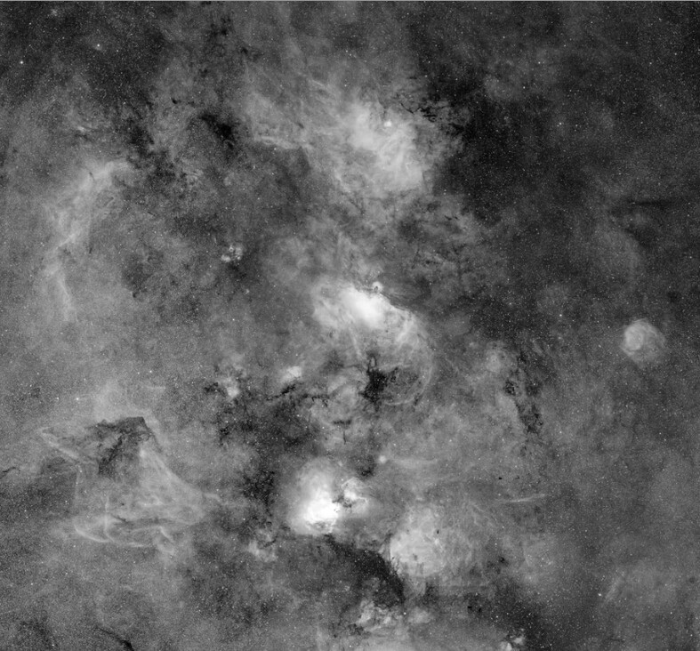
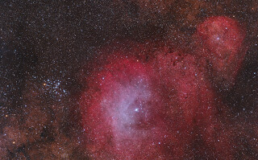
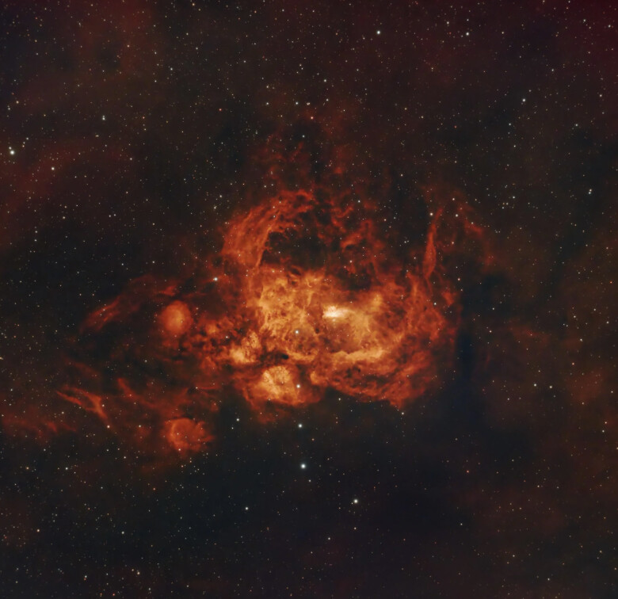
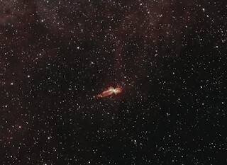
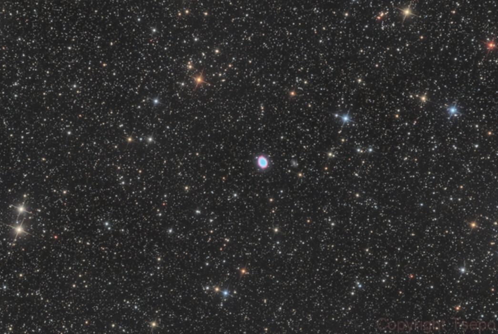

I decided last minute to head to one of the observing sites near Lake
San Antonio on 24 August. I could fit one quick trip so long as I
started driving back at around 4am to get back home to Fremont to attend
to family matters. After the 3-hour drive, I planned to have around 3.5
hours of observing, (8:30pm to midnight), 3-4 hours of sleep, and then
the 3-hour drive home. While places like Lake Sonoma and Fremont Peak
were shorter drives, their transparency forecasts were poorer.

Once fully dark, my SQML read 21.35 -- not great but around as good as
I've had from this area. Around 11pm I noticed the sky quality had
dropped, to 21.2, as some high puffy clouds drifted from the north and
surrounded Polaris. West and south were still clear, so I continued
until midnight. I used my 10-inch f/3.75 Newtonian with a PVS-14 night
vision device, afocal with a 67mm Plossl+ eyepiece (14x, 2.8° TFOV) and
an assortment of filters. Here are some highlights:

**<x-dso>M16</x-dso>** Obvious pillars of creation, particularly the two opposite the
triangular dark nebula intrusion which points at them -- along with a
finger-like pillar to one side. The nebula was like a shell, the obvious
effect of stellar winds blowing gaseous material away. I traced the
wisps of nebula which surround the brightest part of M16 to other nearby
nebula and was reminded of how connected they all are -- the bright
objects like the Eagle, Swan, Lagoon, etc. are simply more visible
because stars illuminate them. I can't find a good image to show this
interconnectedness -- the following, from the MDW Sky Survey, shows the
nebula brighter than what I saw, but hopefully conveys what I mean. M16
is in the lower-center of the image.

**<x-dso>Sh2-12</x-dso> / NGC 6383**: Bright star with a small associated cluster,
surrounded by very faint, large, mottled round nebula, larger than the
field so I needed to pan around to its irregular edges, which are
nibbled with dark nebula. Just off the side from it is M6 the Butterfly
Cluster, which when I center in the field, I can see the outer arc of
this nebulous sphere.

**<x-dso>NGC 6357</x-dso>** Was a very small intense elongation in the center of a
large nebulous field. Many wisps and knots surrounded it, streaked with
dark nebula, speckled with spheres, and faint nebulous streams flowing
from it in all directions.

**<x-dso>NGC 6302</x-dso>** Bug Nebula.  I could see it unfiltered, but it completely
disappeared with the 685nm longpass filter, best viewed with a TriBand
OSC filter (Ha+Hb+OIII).  Though at small scale, I can see the two
ansae, one longer than the other.

**<x-dso>M57</x-dso>**: Bright and round.  Due to small scale, I didn't look for fine
detail.  But in a 2.8° field, the goal was not to see particulars of the
nebula, it was to see it floating in the myriad of stars the night
vision device reveals.

I woke at 3am after a fitful nap in my car and got out to stretch. 
Looking up, I could see M31 in between puffs of cloud.  I heard the soft
leathery flaps of bat wings and looked around to see a very large bat 10
feet above me, making its rounds.  Starting the drive home, I listened
to Heinrich Ignaz Franz Biber's "The Mystery Sonatas."  I bought the CDs
from Half Price Books out of curiosity a few weeks ago, not knowing
anything about the music, and left them in my car.  I was shocked by the
beauty and the virtuosity of the playing.  Biber wrote in the late
1600s, and in parts the sonatas sounded like the honed results of his
improvisations on the violin. This was not the ornate, decorative
Baroque fabrication I expected, but an austere contemplation of the
ultimate, with just a violin, cello, and muted organ, sounding like it
was played in a small chilly chapel on a mountainside.

I don't know if it was my exhaustion, the exhilaration of seeing things
in the sky very few humans even know about, or the transcendence of the
music, but I was in a mystical state of mind.  Starting on the main
road, it seemed the tunnel of light my car headlights formed was leading
me through a sort of hell, at least an astronomer's hell, complete with
vapors and chimera lights.  I almost never drive to or from our
observing sites at night, so it was disturbing to see why the sky
quality is not as good as the light pollution maps would promise, and
why we resort to ever larger aperture telescopes or technology
(astrophotography, night vision) to enjoy this hobby.  The nearby
military base casts its own light dome.  Individual farms blazed with
security lights on sheds and barns.  The hazy fog sunk into the Salinas
valley diffused the light into the sky.  I noticed a pillar of light,
like something from the Bible (Exodus 13:21), forming an awful vertical
rainbow miles ahead of me. Finally I came upon its source: nighttime
pickers at their hard labor, following behind the brightly lit sorting
machine and tractor.  Multiple buildings along route 101 have bright
unshielded lights pointed up.  A large multistory building under
construction had around 10 floors framed but lacked outer walls.  The
entire inside was brightly lit up -- I presume for nighttime
construction crews. It was bright enough to light the interior of my car
though it was a quarter mile away, and it formed a sickly glow in the
sky above.

Fortunately, the 2 CDs of Biber's music carried me home safely, but
drained an troubled.
