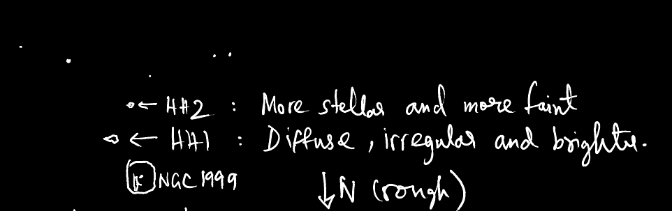
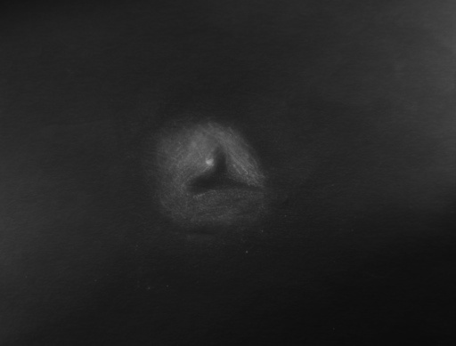
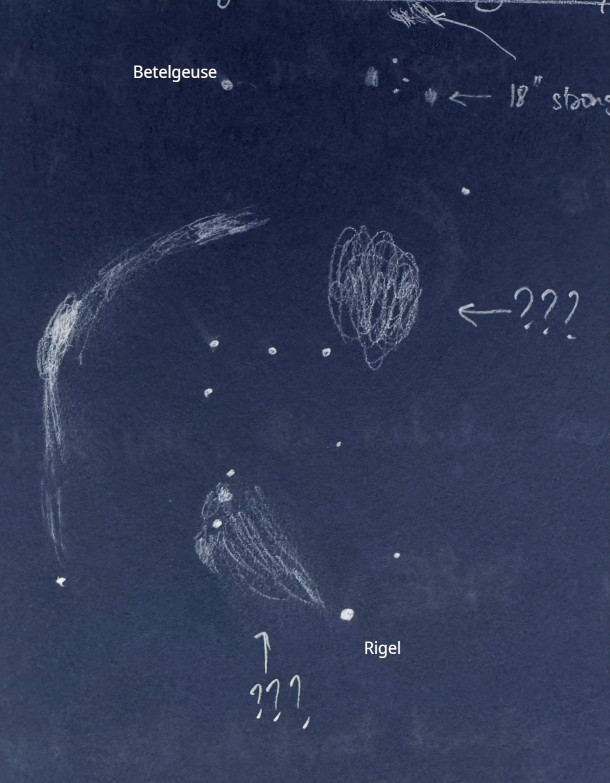
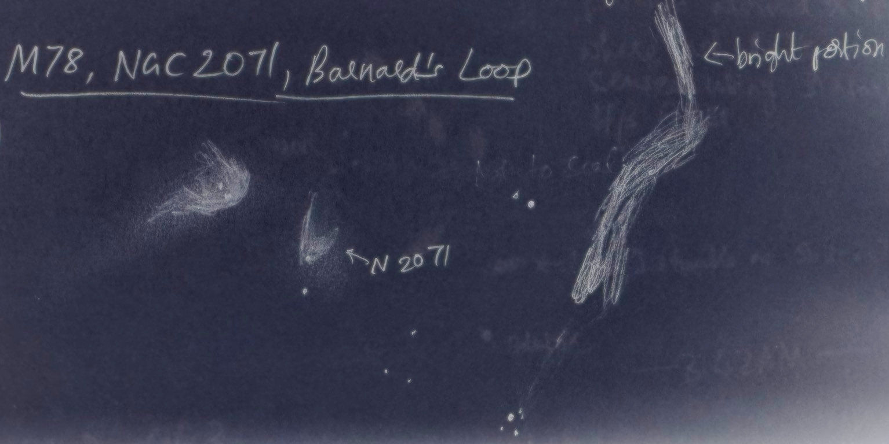
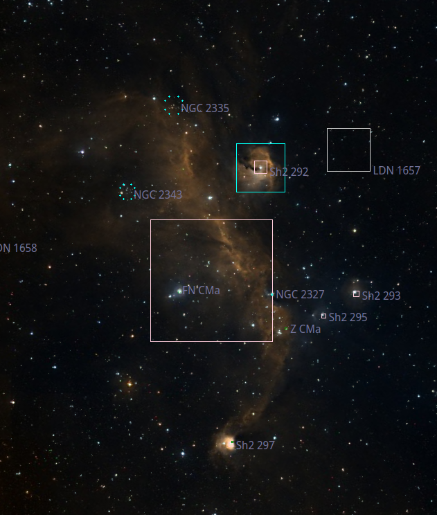

This is the second part of my experiences with the RASC Deep-Sky Challenge List, covering objects 10 through 18.

### <x-dso>NGC 1499</x-dso>, the California Nebula

The California nebula is a large nebula that is very low in surface brightness. Even though it has a reputation for being a "photographic nebula", it was discovered by eagle-eyed E. E. Barnard visually using a 6-inch refractor! 

My most memorable observations of this nebula are from the time when I was in Utah post the 2023 Annular Solar Eclipse (see [Part 1, IC 1795](/RASC-Part1.html#ic-1795-and-the-heart-and-soul-nebulae)). Through my unfiltered 25×100 binocular, the California nebula appeared as a region brighter than the sky background readily detected by scanning the general region which was thereafter confirmed against images as the brightest edge of the nebula. The entire nebula was not visible, but the brightest portion was not too difficult. This was despite the low altitude of California Nebula during observation.

Two days later from a rest area off highway UT-95 a few miles west of Natural Bridges National Monument, I noted the nebula as "blatantly obvious", running roughly ENE to WSW (directions may be very rough). I believe I was picking on only the brightest parts, but even that covered 80% of the 2.5° FOV in length.

I have also looked at the California nebula through my 18-inch f/4.5 telescope from Atoka, OK in November 2013. Although an H-beta filter is generally recommended on this object, I preferred the view through a Lumicon UHC over an Orion H-beta.

### <x-dso>IC 405</x-dso>, the Flaming Star Nebula (and the tadpoles of IC 410)

Here comes another tough winter nebula. The Flaming Star nebula, IC 405, was discovered photographically. This is an emission nebula, so a narrow-band filter like UHC helps a lot.

My first observation was made in November 2013 with my 18-inch equipped with a Lumicon UHC filter from Bortle 2 skies in central Texas. I picked up on a glow to one side of a star. In January 2023, I looked at the nebula with my 18-inch from the rather light-polluted sky of Pinnacles National Park. Using a 31mm Nagler (67×) with an H-beta filter, I was able to pick up on a lot of faint, mottled nebulosity. On another occasion, using Karthik Subramanian's 17.5-inch f/5 (which is the revival of my old Discovery 17.5-inch) at a [BAS](https://bas.org.in) Star Party in southern India, I had a fantastic view of the Flaming Star nebula using an H-beta filter; the dark rifts in the nebula stood out.

At another recent BAS star party in January 2024, I happened to hold a DGM Optics NPB filter against the sky, and noticed that whereas the rest of the Milky Way appeared dimmer through the filter, the vast region around IC 405 did not dim as much—does this mean the nebulous region is visible to the naked eye? I would like to confirm this from a darker and more transparent sky.

The RASC spreadsheet also mentions the nearby nebula <x-dso>IC 410</x-dso>, which I find visually far easier than IC 405. Way back in October 2015, I took a look at this nebula from [Austin Astronomical Society](austinastro.org) member Greg Taylor's Bortle 2 property in central Texas. I was using my 18-inch f/4.5 at 103× equipped with a Lumicon OIII filter, and logged a "beautiful nebula with lots of dark rifts!". In December 2022, I observed it using Karthik's 17.5-inch and logged it as resembling a barking dog.

A pretty challenging target within IC 410 are the two cometary Bok globules designated as <x-dso simbad="Sim 130">Simeis 129</x-dso> and <x-dso simbad="Sim 129">Simeis 130</x-dso>, commonly referred to as [the "Tadpoles"](https://www.deepskyforum.com/showthread.php?475-Object-of-the-Week-November-17-2013-The-two-Tadpoles-of-IC-410-in-Auriga). It's worth noting that the designation Sim 130 refers to the brighter south-eastern tadpole, and the SIMBAD database has the designations swapped as of this writing. I picked out these globules with much difficulty during my 2015 observation of IC 410. I could not see the "tails" of the tadpoles. Sim 130 was the brighter of the two, and appeared as an oval shaped glow around a pair of stars. The best view of the tadpoles was at 148×. I also preferred an OIII filter over a UHC. In my more recent January 2023 observation from Pinnacles National Park, I was only able to pick up on the "head" of Sim 130. One of the best sketches of the tadpoles I've seen is by [Uwe Glahn](http://www.deepsky-visuell.de/Zeichnungen/IC410.htm), and his sketch inspires me to revisit this region with my new 28-inch f/4. The Tadpoles are featured in my article in the October 2024 issue of Sky & Telescope magazine.

 
<i>My favorite photo of the Tadpoles is <a href="https://cs.astronomy.com/asy/b/daves-universe/archive/2014/02/28/tony-hallas-phenomenal-tadpole-nebula-shot.aspx">by Tony and Daphne Hallas</a> of northeastern California</i>

### <x-dso>HH 1</x-dso> (<x-dso>HH 2, <x-dso>NGC 1999</x-dso>, <x-dso>HH 222</x-dso>)

I was super stoked when I first read about Herbig-Haro objects. Herbig-Haro objects are patches of emission that are formed when bipolar outflow from a protostar hits the interstellar medium (ISM). The magnetic fields carried by the plasma in the accretion disk around the forming star get twisted around as the material spirals into the star. Somehow, this has the effect of creating jets of plasma thrown out along the polar axes of the star. (See Figure 18-16 in "Universe" 3rd Ed. by Freedman and Kaufmann.) Where these jets meet the ISM, they ionize it causing the ISM to glow. Although the protostar itself can generally only be seen using infrared light that can penetrate its dusty cocoon, the Herbig-Haro objects that are imprinted by them in the ISM are accessible to amateur astronomers. The Herbig-Haro objects are as erratic as the formative stars that cause them: they can vary in brightness, position and structure on a timescale of years! It's worth checking out this [amazing timelapse](https://en.wikipedia.org/wiki/File:HH_34_jet_video_HST.ogv) of <x-dso omit="true">HH 34</x-dso> by the Hubble Space Telescope.

HH 1 and HH 2 were the first two Herbig-Haro objects to be discovered. They both lie near the beautiful reflection nebula NGC 1999, sometimes called the 13th Pearl Nebula, in Orion. HH 2 is generally the easier of the two, but I was surprised when I dug through my old logs from January 2016, when I first observed the duo with my 18-inch. Therein I wrote that the Herbig Haro objects were distinct, but still very faint. Neither one could be held 100% of the time. I described HH 2 as more stellar and more faint, but HH 1 as diffuse, irregular and brighter. I further went on to write that I held HH 2 about 10% of the time and HH 1 about 50% of the time. Surely I must have swapped the two designations, I thought—but I had thankfully made a sketch in my logs. To my astonishment, the identifications are correct. Could I have just caught HH 1 when it happened to be brighter?! In my subsequent observations, in 2021 and 2024, I found HH 2 much brighter and easier than HH 1; in fact I could not pick up on HH 1 in my January 2024 observation from south India. I posted about this on [Cloudy Nights](https://www.cloudynights.com/topic/912552-herbig-haro-1-and-2-variability/) and did not find anyone to corroborate or refute my 2016 observation, although Steve indicated that he found HH 1 fainter in all cases. The amount of detail in the notes in my 2016 January log entry is what made me take this observation at face value.

 
<i>Extract from my January 2016 log entry on HH 1 and HH 2</i>

I wrote about my observations of HH 1 and HH 2 in a Going Deep column for the October 2024 issue of Sky & Telescope magazine. This is not the first time the region has been highlighted in Sky & Telescope though—Howard Banich wrote a beautiful article in the February 2022 issue on NGC 1999 and the two Herbig-Haro objects. I was amazed that Howard managed to pick up on them in an 8-inch f/4 telescope [unprompted](https://www.deepskyforum.com/showthread.php?1552-Object-of-the-Week-December-5-2021-%E2%80%93-HH-1-and-HH-2)! It speaks to his skill as an exceptional deep-sky observer. 

The beautiful reflection nebula [NGC 1999](https://www.deepskyforum.com/showthread.php?277-Object-of-the-Week-December-30-2012-NGC-1999-and-the-quot-Key-Hole-quot) is fascinating in its own right. The "key hole" in it is not a dark nebula as one might assume, but an actual void! I've looked at it many times through my 18-inch, but also have viewed it through Jimi Lowrey's 48-inch f/4 back in October 2014. I wish I had put more words to describe the view through his telescope, all I wrote was "Wow! Wow! Wow! Very clear key hole!".

 
<i>NGC 1999 sketched through my 18-inch; Jan 2023, Pinnacles National Park</i>

Before we depart this region, Howard mentions an intriguing filament known as HH 222 or the "Waterfall" in his Sky & Telescope article that eluded him. Since that article was published, he reported a [positive observation](https://www.deepskyforum.com/showthread.php?1567-Object-of-the-Week-February-28-2022-%E2%80%93-HH-222-the-Waterfall) of this faint streamer! Motivated, I gave it a try on a November 2023 night of incredible transparency at the Saline Valley region of Death Valley National Park. Over more than half an hour of staring, a crescent-shaped weak feature was detected vaguely several times. After another half hour of staring, I got some convincing flashes of the weak structure. Did I see it? Maybe. I would love to go after it with my 28-inch.

 
<i>The Waterfall, as seen on <a href="https://apod.nasa.gov/apod/ap111024.html">Astronomy Picture of the Day, October 24 2011</a>. 
Image Credit: Z. Levay (STScI/AURA/NASA), T.A. Rector (U. Alaska Anchorage) & H. Schweiker (NOAO/AURA/NSF), KPNO, NOAO</i>

### <x-dso>IC 434</x-dso>, <x-dso>Barnard 33</x-dso> the Horsehead Nebula (and <x-dso>NGC 2023</x-dso>, <x-dso>NGC 2024</x-dso>)

The famous Horsehead Nebula is considered a challenging visual target, but it is probably easier than many of the other objects on the RASC Challenge list. The designation IC 434 is generally ascribed to the bright background nebulosity and Barnard 33 to the dark nebula, although Williamina Fleming did describe the dark notch in the discovery images of IC 434, see [Gottlieb's notes](/IC 1 thru IC 1000.html#IC 434).

My first successful view of the Horsehead was with my then new 17.5-inch f/5 Discovery dob, back in perhaps December 2009. We were using a 31mm Nagler and an H-beta filter. Below you can see my early sketch of the nebula:

 
<i>My first sketch of the Horsehead, December 2009</i>

Of course I've looked at this nebula a number of times since, including through my 25×100 binocular (unfiltered). Under the dark skies of the 2021 Okie-Tex Star Party, I was able to detect a nebulous background with a vague dark region.

While we are in the area, it is worth mentioning the much easier and brighter nebulae that are not far out. NGC 2023 is a bright reflection nebula in the field of the Horsehead and NGC 2024 is the famous Flame Nebula. I've seen NGC 2023 through my old 8-inch f/8 telescope, and also more recently through my 25×100 binocular at Okie-Tex.

The Flame Nebula is beautiful in any aperture. I did not know that it would be visible in a 10×50 binocular until I tried it with my mom's Nikon Aculon while at a BAS Star Party in south India. It appeared as though there was an optical artifact causing a lopsided halo only around Alnitak, in the correct orientation! But through my 25×100 binocular, I was able to see a few dark rifts, which I have captured in the sketch below!

 
<i>Sketch of the Horsehead and Flame Nebulae through my 25×100 binocular</i>

I should also mention entry #46 on the [AINTNO list](aintno.htm)—the observing report that claimed the coveted piece of black paper is a fascinating read. Incidentally, the galaxy MAC 0538-0223 now carries the LEDA designation <x-dso>LEDA 3097143</x-dso>. I must try it out some night.

### Barnard's Loop <x-dso>Sh2-276</x-dso>

When I thought I had finished the RASC Deep-Sky Challenge list, I realized that although I had observed Barnard's Loop before I could not locate a log entry! So in November 2023, I made it a point to carefully study and log it, and with that I completed this amazing list.

On the night of exceptional transparency I witnessed at Saline Valley, I held up an Orion H-beta filter to my eyes. I did not know the exact flow of Barnard's Loop through Oriopn and this sketch was forced upon me despite misaligned preconceptions. The nebula was very weka nad intermittent with the unaided (but filtered) eye, and the Milky Way band was a source of distraction. The sketched structure with two brighter regions was noted. BTW, the regions marked "???" appeared brighter but I don't know what they are—could they just be an overdensity of stars? I don't see any features matching them on the DSS2 HiPS images. I should also mention that the lambda Orionis nebulosity was studied with the 18-inch and not naked eye, although I've marked it in this sketch.

 
<i>Naked-eye + H-beta filter sketch of Orion showing nebulous and brighter regions (except for the lambda Ori part, which was made with 18-inch)</i>

The loop is much easier to trace with binoculars or a telescope. Using my unfiltered 25×100 binocular starting from the stars north of <x-dso>M 78</x-dso>, the band of nebulosity could be followed down towards west of open cluster <x-dso>NGC 2112</x-dso>. The cluster appeared almost imbedded in the nebulosity although the main flow, turning southwards around this region, ran to its west. The flow continued south and then appeared to curve west. I lost it around the declination of Alnitak.

With my 18-inch, Barnard's loop wasn't difficult to trace. I started from M 78, also sketching <x-dso>NGC 2071</x-dso> on my way, and moved north-east to find the band of nebulosity. I've sketched the view below.

 
<i>Sketch of M 78, NGC 2071 and Barnard's Loop as seen through my 18-inch</i>

### <x-dso simbad="PN A66 12">Abell 12</x-dso>

Planetary nebula Abell 12 is made challenging by the glare of the 4th-magnitude star µ Orionis. This also makes it very easy to find and recall. With my 18-inch at 200× and an O III filter, I saw a glowing disk with a raggedy brighter boundary. This was back in January 2015; I must revisit this cool object.

### Jellyfish Nebula <x-dso>IC 443</x-dso>

I have looked at this supernova remnant in Gemini several times, mostly with my 18-inch f/4.5 telescope. Most recently in October 2020, I was able to see an arc-shaped glow using a 31mm Nagler (67×) and UHC filter. My log entry from Texas Star Party 2012 is similar, in that I just saw the brightest part as an arc.

The RASC Spreadsheet mentions two other nebulosities—<x-dso>NGC 2174</x-dso>, which Steinicke identifies as a knot in <x-dso>NGC 2175</x-dso>, and Sh2-247. [Steve Gottlieb](/NGC 2001-3000.html#NGC 2174) concurs that the designation NGC 2174 actually refers to a small bright patch within the Monkey Head Nebula (NGC 2175). I have logged the Monkey Head multiple times, but never attempted Sh2-247 which looks mighty dim on the DSS2.

In November 2013 from Atoka, OK, I logged the Monkey Head as a remarkable, very beautiful nebula which was heavily mottled. I was using 80× power and a UHC filter. More recently in January 2024, I used the Bangalore Astronomical Society's 16" GSO dob with an H-beta filter to look at this region. A bright star lay embedded on the eastern side but vertical center of a vaguely U-shaped faint region of nebulosity. There were two fingers of darker nebulosity detected, one dipping down (north is at 11:30 clock position, so this is roughly south) from the north towards the star, and one parallel to it to its right (west). There was also a much fainter and structured nebulosity lying to the east of the star, but the previously described brighter region was quite well demarcated from this by a sharp increase in brightness right around the star; more precisely, this sharp increase in brightness occurred at a N-S chain of about 4--5 faint stars just north-east of the bright star.

I should add that there is a fairly recently discovered planetary nebula called [Howell-Crisp 1](https://www.deepskyforum.com/showthread.php?524-Object-of-the-Week-February-16-2014-%E2%80%93-Howell-Crisp-1-a-recently-discovered-PN) not far from the Jellyfish Nebula. This one is still on my list.

Finally before we leave the region, don't forget the pair of open clusters <x-dso>M 35</x-dso> and <x-dso>NGC 2158</x-dso> = Mel 40. The stark difference in their distances makes this pair appealing—M 35 lies only 2800 ly away whereas NGC 2158 is about 14700 ly away.

### <x-dso>Jonckheere 900</x-dso>

This tiny planetary nebula has a high surface brightness, but is rather challenging to pick out in a star-rich field as it appears very stellar even at high power. In my 18-inch f/4.5 nebula appeared distinct from a star at about 400×, but I had to ramp up to 590× to start seeing some detail. It showed a fainter outer halo which was not too thick, and a brighter inner halo. I vaguely sensed that the inner halo may have an oval-shaped brighter rim around a central star. Perhaps I did pick up rudimentary hints of the complex structure of this PN. The best sketch I have seen of this object is by [Uwe Glahn](http://www.deepsky-visuell.de/Zeichnungen/J900.htm) who was using a whopping 1172×. I would love to revisit this with my 28-inch and see what it will show me!

### <x-dso>IC 2177</x-dso>, the Seagull Nebula (and <x-dso>Z CMa</x-dso>)

This is a really fascinating region of the sky that can be an entire article on its own. There is so much to observe in the Seagull Nebula area!

The Seagull Nebula is very popular amongst astrophotographers, but not so much among visual observers—as expected, this is because of its low surface brightness and H-alpha emission that is not picked up well by the eye's scotopic response. But with a good, transparent sky and narrow-band filter, one does not have to be afraid of this nebulosity.

First, a quick anatomy of the region with designations. IC 2177 = Sh2-292 is the "head" of the gull. <x-dso>Sh2-296</x-dso> designates the wings of the gull. <x-dso>Sh2-297</x-dso> is a bright knot of nebulosity at the southern end of the wings. <x-dso>NGC 2327</x-dso> is another bright knot of nebulosity just off the wing. There are two NGC-designated open clusters <x-dso>NGC 2343</x-dso> and <x-dso>NGC 2335</x-dso>. The "head", IC 2177, was discovered photographically in 1898 by Welsh astronomer Isaac Roberts. Roberts also perhaps discovered parts of the "wing" Sh2-296. It is plausible that Max Wolf discovered parts of the Seagull Nebula before Roberts, according to [Harold Corwin](haroldcorwin.net/ngcic/icnotes.all). The brightest knot, NGC 2327, was discovered in 1785 by William Herschel. [Steve Gottlieb](https://www.deepskyforum.com/showthread.php?1660-Object-of-the-Week-February-19th-2023-The-Seagull-Nebula&p=9358&viewfull=1#post9358) points out that Sh2-297 was visually discovered by E. E. Barnard but not published.

 
<i>The various parts of the Seagull, screenshot from KStars with imagery from DSS2</i>

Wow, what a happening place. One of the reasons for this is that the region has been shaped by many supernovae! The supernovae shocking the ISM have triggered multiple generations of star-formation, leading to a complex scene with structures of many ages. I vaguely remember it being presented in some textbook as a canonical example of supernova-induced star formation, but I simply can't find the reference.

In two sessions in early 2023, I explored various parts of the Seagull Nebula using my 18" f/4.5, and it was "not too difficult" despite being under Bortle 4 conditions. My pandemic project of using [plate solving to help point my telescope](https://github.com/kstar/zero-in/) really paid off here—by interfacing it with a rotatable offline DSS2 (HiPS) overlay in the [KStars](https://kstars.kde.org) planetarium, my system was able to show me which part of the nebula I was on as I scanned across it. I was using a 31mm Nagler equipped with a Lumicon UHC filter. My logs from the first sitting read: "Too difficult to sketch. IC 2177 is a relatively bright but not contrasty, irregular, large nebulosity around a star. The visually most contrasty part of the nebula is on the body of the gull." My rough sketch of the area shows the region between IC 2177 and NGC 2343 as the most contrasty region. This observation was made just after an observation through a night-vision device on a 4-inch telescope and the NV experience did not detract from the visual one, both of them being rewarding in their own ways. I missed Sh2-297 in the first session, so I went back and took a look at it the next time I had a chance. I described it as "A halo around a bright-ish star. A sharp dark nebula lies to the west and north west of the star. The dark nebula appears mottled. The bright nebula also seems to harbor some isolated dark patches to the east of the star.". To my eyes once again Sh2-297 was not the most visually contrasty part of the Seagull; rather, the region to SW and SE of, and around the A-shaped star cluster NGC 2343 was more contrasty.

Before we end this part, I should mention Z CMa, a young stellar object within the area. Steve Gottlieb wrote about it in his March 2012 Sky & Telescope article on the Seagull Nebula. One night at Pinnacles National Park, using my 18" at 200× (2.22mm Exit Pupil) with averted vision, I was able to see a clear streak of nebulosity "jutting out" from the star. I wrote "looks like a comet tail". Racking on more power (340×, 1.3mm EP), I noticed that the ray of nebulosity seemed slightly offset from the star in the northern direction. Although the young binary system thought to be making up Z CMa sports a 1–2 arcsecond long jet, in my understanding that is not what we see visually. I don't know what is the astrophysics behind the ~10-arcsecond long cometary nebula we can visually observe and whether it is related to the bipolar outflows from the young stars.

I copied much of this content from two [DeepSkyForum OOTW](/dsf_ootw_constellation.html) posts I made on Z CMa and the Seagull complex, which are linked here for convenience: [Z CMa](https://www.deepskyforum.com/showthread.php?1641-Object-of-the-Week-November-27-2022-Z-Canis-Majoris), [Seagull Nebula](https://www.deepskyforum.com/showthread.php?1660-Object-of-the-Week-February-19th-2023-The-Seagull-Nebula)

I will return to the Seagull Nebula to further explore the parts I haven't explored yet!