

Okay, it is evident if you search my blog that I do love supernovae.
They are to me, the most fascinating subject because they not only
signal the death of a star, but because they also signal how the
universe continues to create new things from old. From Disney's 1994
animated movie (great year, it was the year my son was born and a year
after my daughter had arrived) the Lion King, some call this the Circle
of Life. Items are created or living things are born, they live out a
life, and then are recycled so that other things may be created, come
into existence. We ourselves exist because of this cycle that exists in
the stars. The iron in our blood, the calcium in our bones, the oxygen
in our lungs, the carbon in our bodies are all elements made in stars or
massive stars. Indeed, the only place that iron is made is in the core
of a massive star and that signals the very death knell for that star
when the core churns out iron.

So, to celebrate the roles that Supernovae play in creating the very
elements that make up our earth and ourselves, I have decided to come up
with a Supernova Observing Challenge. I hope you accept this challenge
for the true joy in completing this challenge. I believe it is in
observing the objects themselves or giving them a go that the greatest
reward is found. Here is what equipment I would recommend.

1\. At least a 10-inch dob. You can try it in a smaller one and I would
be anxious to hear if someone does one or all of these in a dob smaller
than 8 inches.

2\. A good wide field eyepiece. For me this is the 31mm Nagler, 26mm and
22mm T4 Nagler and sometimes the 35mm Panoptic.

3\. Also have two eyepieces that provide from 100× to 200× also as you
will want to look at some parts of what you view with a little more
magnification. For me in the 17.5mm dob or in the 24mm dob I would
probably use the 22mm T4 Nagler and 10mm Pentax XW. Similar eyepieces
can be used.

4\. A 2 inch OIII filter and a 2 inch Narrowband filter, and have a 1
1/4 inch filter of the same types for higher magnification eyepieces. I
have the Orion Ultrablock, the DGM OIII and NB, and the Thousand Oaks
OIII and NB filters in these sizes to choose from.

5\. The finder charts here or the ones I will link to and good
transparent skies. It helps if you also can sketch an outline of what
you've seen I think as part of recording your observation.

So what are the objects we are going after? Here is the list:

* [Simeis 147 or Sharpless 2-240](#1-simeis-147-or-sharpless-2-240), a SNR that is a winter observation between Auriga
and Taurus.
* [IC 443 or Sharpless 2-248](#3-ic-443-supernova-remnant-in-gemini), another winter SNR found in Gemini.
* [SN 1054 or Messier 1](#2-messier-1), the Crab Nebula in Taurus will be part of this.
* We then move into the warmer SNR's with [Sharpless 2-91](#6-sharpless-2-91-in-cygnus) in the
southern part of Cygnus the Swan,
* and then to the [Veil Nebula](#5-veil-nebula), made up of NGC 6960, 6974, 6979, 6992, and 6995.
* As summer wanes and fall constellations appear we will end (or begin since you can do summer and
fall now if you're up late enough) with [Cassiopeia A](#7-cassiopeia-a).
* Finally we'll end with [Abell 85 or CTB1](#8-abell-85--ctb-1-or-snr-g1169001-in-cassiopeia) in Cassiopeia as well.

I have created a log book that I will attach or provide a link to my
Google Docs where you can access it. Feel free to modify it as you wish.

## 1. <x-dso simbad="Sim 147">Simeis 147</x-dso> or Sharpless 2-240

First item up is Simeis 147. This is a faint supernova remnant in Taurus
and Auriga, and you must not be faint of heart. It took me 3 seasons
before I caught a wiff of this one. I have included an enlarged version
of a star hop map by Reinar Vogel from his WebSite at this
[LINK](http://www.reinervogel.net/index_e.html). The finder charts come
from his Sharpless Catalog, a free download and one I highly recommend
[LINK](http://www.reinervogel.net/pdf/Sharpless.pdf). Here are the
finder charts for this object(s).

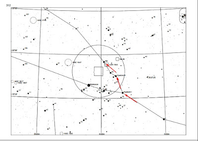

On the chart above it shows how to get to Al Nath in Taurus starting
from Hyadum I and going to Hyadum II and then to Al Nath. From Al Nath
you can do the star hops below to get to Simeis 147 and begin to explore
the Supernova.

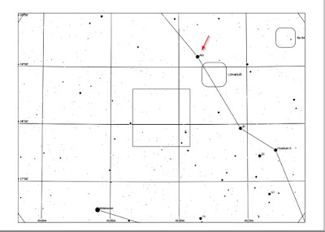

I labeled the star hops with red arrows so you can seem them better. In
this
[LINK](http://astronomy-mall.com/Adventures.In.Deep.Space/simeis.htm)
you can actually go and see a larger map of the Supernova, with the
sections A, B, C, D, E that you can explore, with sections A &B being
the easiest (still very hard) to see. This
[LINK](http://astronomy-mall.com/Adventures.In.Deep.Space/s147.htm)
shows a CDD Image by Steve Mandel and a sketch overlay by Rich Jakiel
that is tremendous! That should help you to trace down this object. Oh,
in Reinar's Sharpless Catalog, on page 432 are the two charts above, and
on page 433 is an image of the entire SNR so you can use that also to
help

hop if you want to print them out.

## 2. <x-dso simbad="M1">Messier 1</x-dso>

The next object is Messier 1, the Crab Nebula. Here is the initial
information from Wikipedia ([LINK](https://en.wikipedia.org/wiki/Crab_Nebula)):

"The Crab Nebula (catalogue designations M1, NGC 1952, Taurus A) is a
supernova remnant and pulsar wind nebula in the constellation of Taurus.
It is not, as its name might suggest, in Cancer. The now-current name is
due to William Parsons, 3rd Earl of Rosse who observed the object in
1840 using a 36-inch telescope and produced a drawing that looked
somewhat like a crab. Corresponding to a bright supernova recorded by
Chinese astronomers in 1054, the nebula was observed later by English
astronomer John Bevis in 1731. The nebula was the first astronomical
object identified with a historical supernova explosion.

At an apparent magnitude of 8.4, comparable to that of Saturn's moon
Titan, it is not visible to the naked eye but can be made out using
binoculars under favourable conditions. The nebula lies in the Perseus
Arm of the Milky Way galaxy, at a distance of about 2.0 kiloparsecs
(6,500 ly) from Earth. It has a diameter of 3.4 parsecs (11 ly),
corresponding to an apparent diameter of some 7 arcminutes, and is
expanding at a rate of about 1,500 kilometres per second (930 mi/s), or
0.5% c.

At the center of the nebula lies the Crab Pulsar, a neutron star 28–30
kilometres (17–19 mi) across with a spin rate of 30.2 times per
second,\[6\] which emits pulses of radiation from gamma rays to radio
waves."

Messier 1 is significant because as stated, it is the first object
identified and linked to a historical supernova explosion. In addition
we are seeing the remains of a Type II Supernova here, one that resulted
from a star that according to "theoretical models of supernova
explosions suggest that the star that exploded to produce the Crab
Nebula must have had a mass of between 9 and 11 M☉ (solar masses)." As
an amateur what is cool to me about this SNR, is one, the pulsar, and
two, the fact that ancient Chinese and Asian astronomers, using math and
recording their observations, provided modern scientists with the links
and information needed to connect this to the 1054 A.D. supernova. That
helped to move our knowledge of the Cosmos and of the Universe and
Supernova along so that we can have the understanding we have today.

Here is an image taken by the Salt Lake Astronomical Society in 2009
using the Fawkes 1 Telescope out of Hawaii. You can see the pulsar in
the center, there are two stars that are close together, the bottom one
is more gray or bluish gray and it is the bottom one that is the pulsar.
Also, if you look to the immediate right of the pulsar you can see two
shock waves going out from the pulsar. You can also see one to the left
going out in that direction as well. I can see in the gray mist/cloud
the shape of the nebula I see visually when I observe this object with
the added detail in there. Rather cool!

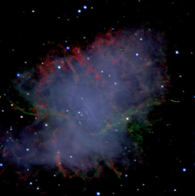

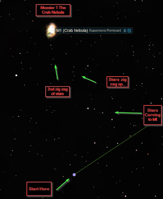

I will include two star hops and you can choose which one you want.
Start at Zeta Tauri and work your way up to the stars on the curve left
above. Then from the top star, the bright one, HIP 26272 goes up to that
first group of zig zag stars and then over to the left to the second
group. Follow the second group straight up to Messier 1.

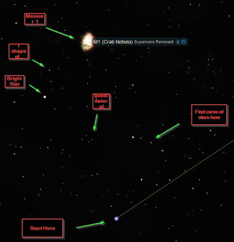

This is similar but you go from the first curve set of stars, to a
quadrilateral on its side to the bright star, up to Messier 1 that way.
Rather easy to find and one to mark down.

To observe this one a medium to high power eyepiece helps and try a
filter, both OIII, NB, and perhaps a light pollution filter if you have
it. I have used my 7mm Pentax XW and my DGM NB filter and seen filaments
so do something similar and see if you draw out the filaments in your
observations.

## 3. <x-dso>IC 443</x-dso> Supernova Remnant in Gemini

This is another winter supernova remnant, in the generally same area as
Simeis 147 and M1. It makes sense to me to go for Simeis 147, then M1
then IC 443 as they rise in that order. When observing this one,
aperture surely helps as does an OIII filter for the NE part and a
Narrowband or UHC filter on the SW part. See how much detail you can
tease out of this. It's there, more than most will see but you have to
be patient and dark adapted. Observe this one for a good long while
before sketching or moving on.

Some information IC 443 or Sharpless 2-248;
[LINK](https://en.wikipedia.org/wiki/IC_443): IC 443 (also known as the
Jellyfish Nebula and Sharpless 248 (Sh2-248)) is a Galactic supernova
remnant (SNR) in the constellation Gemini. On the plan of the sky, it is
located near the star Eta Geminorum. Its distance is roughly 5,000 light
years from Earth. Observing at Skyhound has a good article on IC 443
also at this
[LINK](http://observing.skyhound.com/archives/jan/IC_443.html).

IC 443 may be the remains of a supernova that occurred 3,000 - 30,000
years ago. The same supernova event likely created the neutron star CXOU
J061705.3+222127, the collapsed remnant of the stellar core. IC 443 is
one of the best-studied cases of supernova remnants interacting with
surrounding molecular clouds.The SNR optical and radio morphology is
shell-like (e.g. a prototypical shell-like SNR is SN 1006), consisting
of two connected sub-shells with different centers and radii. A third
larger sub-shell, initially attributed to IC 443, is now recognized as a
different and older (100,000 years) SNR, called G189.6+3.3. The
remnant's age is still uncertain. There is some agreement that the
progenitor supernova happened between 3,000\[3\] and 30,000 years ago.
Recent Chandra and XMM-Newton observations identified a plerion nebula,
close to the remnant southern rim. The point source near the apex of the
nebula is a neutron star, a relic of a SN explosion. The location in a
star forming region and the presence of a neutron star favor a Type II
supernova, the ultimate fate of a massive star, as the progenitor
explosion.

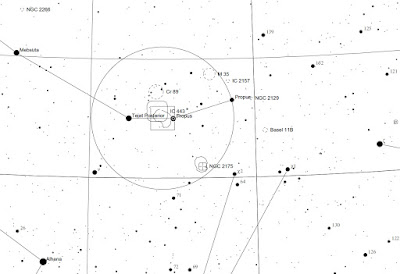

Reinar agreed to let me use his charts so others can get interested and
observe these fun objects! Here is his finder chart that I have made
quite larger.

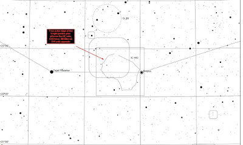

The one above and below are the same chart, close in, and the top one is
simply telling you where to look for the SNR.

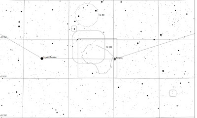

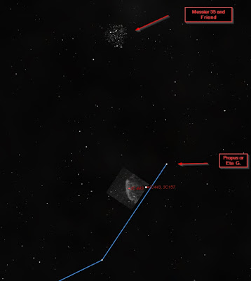

The image above is a more widefield shot I took from Starry Night Pro 6
to show IC 443 and how it sits in relation to Propus and M35.

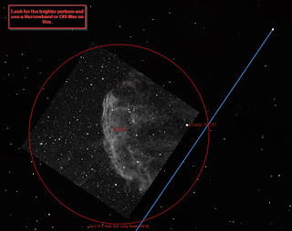

Above is another shot of IC 443 from Starry Night Pro 6 with Eta at the
end of the Constellation stick figure.

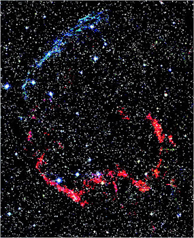

2MASS Atlas Image of IC 443. In this false-color infrared image, blue
marks expanding gas where emission is dominated by excited iron atoms;
the southern ridge (in red) is dominated by molecular hydrogen emission.
In the image North is up, East is left. It is the blue segment of Iron
molecules that are excited that you are going after and will use the
OIII filter on. The Hydrogen needs the Narrowband filter and is hard to
tease out as you must have very good skies that night.

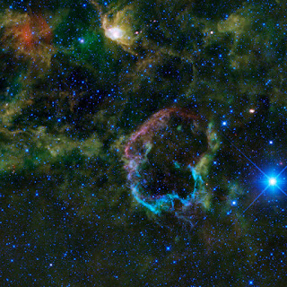

This is from the NASA/WISE team capture of IC 443.This oddly colourful
nebula is the supernova remnant IC 443. IC 443 is the remains of a star
that went supernova somewhere between 5,000 and 10,000 years ago (they
have narrowed down the time frame now). The blast from the supernova
sent out shock waves that traveled through space, sweeping up and
heating the surrounding gas and dust in the interstellar medium, and
creating the supernova remnant seen in this image. What is unusual about
the IC 443 is that its shell-like form has two halves that have
different radii, structures and emissions. The larger north-eastern
shell, seen here as the violet-colored semi-circle on the top left of
the supernova remnant,(the one that you are going after here as the main
part of your observation and responds well to the OIII filter) is
composed of sheet-like filaments that are emitting light from iron,
neon, silicon and oxygen gas atoms and dust particles heated by the
blast from the supernova. The smaller southern shell, (needing the
narrowband filter to bring out parts if your lucky and the sky is with
you) seen here in a bright cyan color on the bottom half of the image,
is constructed of denser clumps and knots primarily emitting light from
hydrogen gas and heated dust. These clumps are part of a molecular cloud
which can be seen in this image as the greenish cloud cutting across IC
443 from the north-west to south-east. The color differences seen in
this image represent different wavelengths of infrared emission. The
differences in color are also the result of differences in the energies
of the shock waves hitting the interstellar medium. The north-eastern
shell was probably created by a fast shock wave (100 kilometers per
second), whereas the southern shell was probably created by a slow shock
wave (30 kilometers per second). If you look at what a lot of
astro-photographers capture and other images (Hubble) of IC
443/Sharpless 2-248, you see the Jellyfish structure that gives it its
name. In this image by WISE, I think IC 443 looks much more like a
Supernova Remnant. To be honest, in many Type II SNR's I see many
similar structures in them which raises questions but not for here.

I shared the following in my previous posts to show growth as a sketcher
and I decided to share the three posts here to show this object
sketched. The two sketches are rather different. The first shows the
structure that I saw in IC 443 quite well and the second shows it in
more detail with higher magnification. The first used both a wider field
lens, the 27mm Panoptic I believe with the 14mm and 10mm Pentax XW and
Type 1 Paracorr at the time. The second shows the 10mm and 7mm Pentax XW
with the Paracorr. Finally I will add in the STSci Image here as I
realized I use to do that all the time in my sketches and I think it
brings merit. I believe if I recall, in the first sketch north is down
and west is to the right.

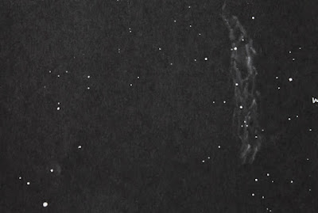

Above is my first sketch of IC 443 and the one I like the best.

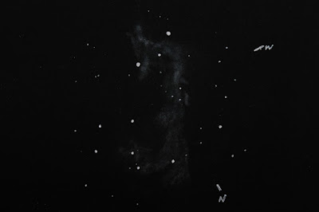

Second sketch is similar in direction but at higher magnification.

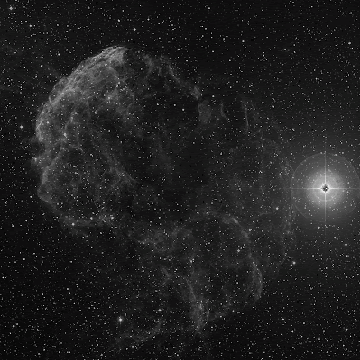

Above is the STSci Image of IC 443 showing the Jellyfish nature of the
SNR. This image I really like for it shows clearly the brighter part of
the SNR you want to go after. I am going to try to sketch the various
parts and overlay them on this image. That will be a fun night of
observing and challenging to see what I can see!

## 4. Barnard's Loop <x-dso simbad="Sh2-276">Sharpless 2-276</x-dso> in Orion.

I am including Barnard's Loop because though old compared to us, it is
most caused by winds of massive stars in Orion blowing stellar winds out
or by Supernova's that exploded and created the bubble. Discovered in
1894 Barnard's Loop (catalogue designation Sh 2-276) is an emission
nebula in the constellation of Orion. It is part of the Orion Molecular
Cloud Complex which also contains the dark Horsehead and bright Orion
nebula. The loop takes the form of a large arc centred approximately on
the Orion Nebula. The stars within the Orion Nebula are believed to be
responsible for ionizing the loop.

The loop extends over about 600 arcminutes as seen from Earth, covering
much of Orion. It is well seen in long-exposure photographs, although
observers under very dark skies may be able to see it with the naked
eye.

Recent estimates place it at a distance of either 159 pc (518 light
years) or 440 pc (1434 ly) giving it dimensions of either about 100 or
300 ly across respectively. It is thought to have originated in a
supernova explosion about 2 million years ago, which may have also
created several known runaway stars, including AE Aurigae, Mu Columbae
and 53 Arietis, which are believed to have been part of a multiple star
system in which one component exploded as a supernova.

Although this faint nebula was certainly observed by earlier
astronomers, it is named after the pioneering astrophotographer E. E.
Barnard photographed it and published a description in 1894.

So though not a specific supernova remnant like the other objects here,
it is a fun, challenging object to go after in the cold of winter. I
want to give it a go with one of my refractors, if not both and see what
comes up this winter. Stephen Waldee in his web page as a great article
on his observation of Barnard's Loop, and shares the brightest part that
he focused on at this
[LINK](http://freescruz.com/~4cygni/astro-app/essays/fuzzy-objects02.htm)
(about 1/3 of the way down the page). Here are the finder charts I
gathered and enlarged from Reinar.

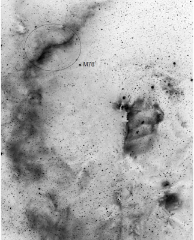

The above image shows the Orion Complex with Barnard's Loop on the left,
and agreeing with Stephen Waldee, Reiner V. has circled the part of
Barnard's Loop most easily visible. Can you identify before looking at
the next image the Flame Nebula, B33 The Horsehead Nebula, Messier 42
and 43 and the Witch's Nebula?

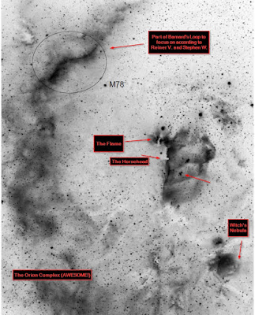

There it is all labeled, and I hope correctly.

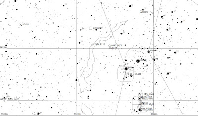

Above is a broad, wide version of the finder chart.

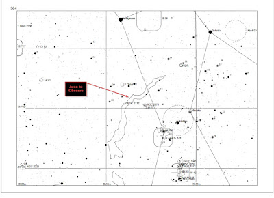

Here I have labeled on the finder chart where both Mr. Waldee and Reiner
say is the easiest part of Barnard's to see.

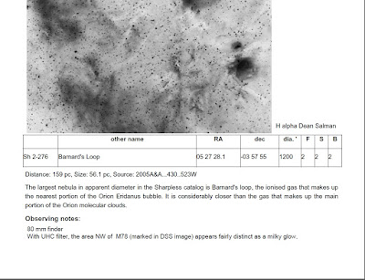

Here are Reiner V.'s notes for you to use.

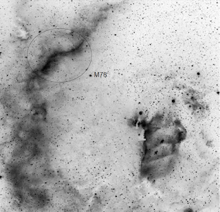

A close up of the images so you can see more of the region (I have
removed the bottom portion).

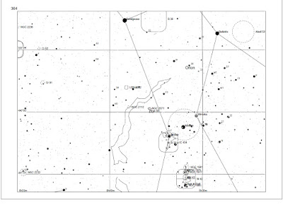

Above is the shorter finder chart as well. I have all of these available
and will be uploading them AFTER the month's new moon (maybe this
weekend, we'll see) into a booklet to download but you'll have to get
them off my Google Drive.

# 5. Veil Nebula

Well now we leave the confines of winter and move to summer to observe
two similar SNR's that are in the same constellation of Cygnus the Swan.
The first is the ever well known and well observed Veil Nebula. Veil Nebula is made up of <x-dso>NGC 6979</x-dso>, <x-dso>NGC 6960</x-dso>, <x-dso>NGC 6992</x-dso>, <x-dso>NGC 6995</x-dso>, and other
parts. Here is
a decently recent NASA image of the Veil Nebula that has its various
parts labeled and identified.

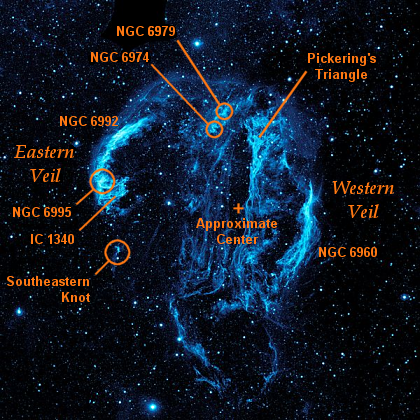

What is interesting to me, is that in looking online for over two hours,
I found spots and pieces, professional articles but not a lot on this
tremendous object. Most of us have looked at NGC 6960 and NGC 6995 in
our telescopes. I encourage you this time not to rush your observation,
but to really study the details and seek out the parts that you haven't
seen or studied before. Pickering Triangle sticks out for me as a place
to go and really study as does NGC 6979 and NGC 6974. This
[LINK](http://astroanarchy.blogspot.com/2012/10/ic-1340-project-finalized.html)
to J P Metsavainio work shows Pickering's Triangle with detail and this
[LINK](http://astroanarchy.blogspot.com/2015/02/a-two-frame-mosaic-of-veil-nebula.html)
to his page will blow you away. Finally I love his animated view of the
entire Cygnus Loop in this
[LINK](https://www.youtube.com/watch?v=Vdz7njiLvM0) over on his YouTube
channel. For me personally, I need to view the Southeastern Knot and I
need time studying IC 1340 (I have observed both of these before) and
Pickering's Triangle. You'll need to determine your goals on these
objects.

Here are two quick finder charts in case someone doesn't know how to
spot the Cygnus Loop.

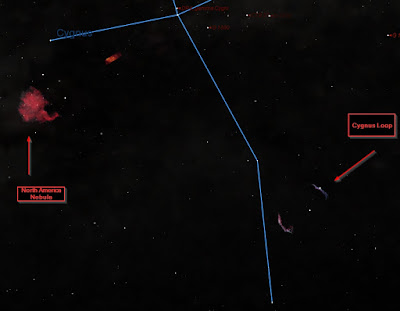

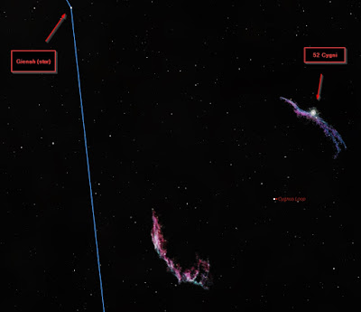

## 6. <x-dso simbad="Sh2-91">Sharpless 2-91</x-dso> in Cygnus

This is a SNR that isn't as well known as the Veil Nebula/Cygnus Loop.
However, it is very similar and it is older and a good challenge. Reiner
Vogel over on the Deep Sky Forum has a wonderful post about this object
there
[LINK](http://www.deepskyforum.com/showthread.php?186-Sharpless-91-and-Friends-The-complete-ring-of-the-G65-3-5-7-SNR).
This [LINK](http://old.observers.org/reports/2001/2001.07.17.10.html)
will share Steve Gottlieb's observation of this object fourteen years
ago in 2001. I've posted this before but this
[LINK](http://www.skyandtelescope.com/observing/celestial-objects-to-watch/summers-overlooked-deep-sky-objects-08072014/)
to Sky & Telescope's article on viewing this other Veil Nebula provides
good insights and good links also. Adventures in Deep Space at this
[LINK](http://www.astronomy-mall.com/Adventures.In.Deep.Space/sh2091.htm)
has observations by Jim Shield and details on observing this complex. .

I have observed this myself several times now, and have sketches located
on my blog here back in August 2013 for the first time
[LINK](http://jaysastronomyobservingblog.blogspot.com/2013/08/observing-report-for-august-9th-and.html)
(last object at the bottom of the post). I know from experience this is
a fun bugger to chase down and filter and aperture make the difference
when combined with the right atmosphere.

So how to get there? Go to Alberio and then work your way up to 9th
Cygni. Here are the finder charts thanks to Reiner.

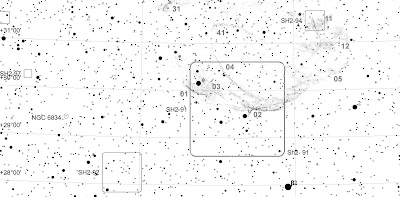

In the finder chart above, Alberio is that bright star at the bottom, B
2 for beta 2. Go up as I said to 9th Cygni and you're right in the
middle of one of the brighter parts of the SNR.

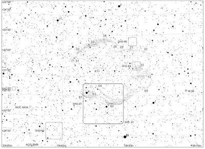

The finder chart above gives you a better overall view of the SNR and
how to navigate which is not an easy task with all the stars that are
present here. Don't forget to put the map as your reflector or dob or
SCT or whatever instrument you use to see this.

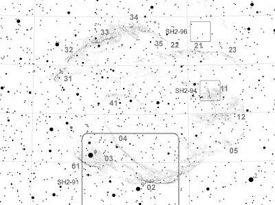

Here I took Reiner's finder chart and enlarged it so that you can really
see where the brighter filaments are and where to navigate to see them.
Check out Jim Shield's link above for more information. Personally I
need to do more than just go after 01 and 02, I need to actually take an
evening and find out how much of this SNR I can really see. I would LOVE
to do a sketch like the one above for Simeis 147 where I put an overlay
on a photograph for this object(s). That is a very worthwhile sketching
goal. So see what you can see here!

## 7. <x-dso>Cassiopeia A</x-dso>

**UPDATE: 12/8/24**: I wanted to update this and share the Webb Website called Take a Tour of Cassiopeia A – [LINK](https://webbtelescope.org/contents/media/videos/2023/149/01HH3QHZ4F3JXEGDXWS2SS2MVR?keyword=HD%20Video).

This is a unique supernova remnant and I have observed it before
[LINK](http://jaysastronomyobservingblog.blogspot.com/2013_11_09_archive.html)
(sketch and observation at the bottom of that post). In truth, it is my
desire to observe this object again this fall that made me put this post
together. To be truthful, this is my major sketching project over the
next year or so (as I observe my Herschel 2500 and sketch them as well)
that I want to make a compilation of to submit for publication. I think
that will make a good adventure, observing the visual SNR of the Milky
Way. Anyway, Cassiopeia A is observable and Sue French in the December
2013 Deep Sky Wonder column discusses it.

Deep Sky Forum at this
[LINK](http://www.deepskyforum.com/showthread.php?229-Object-of-the-Week-October-14-2012-Cassiopeia-A-SNR)
by Howard has a wonderful entry of his observation of Cassiopeia A of
the main arc. I also as in my post above captured that but Howard
mentions going after the southern arc and that is something worthy to
emulate. Howard states there (and please read his entire post, it is
worth it) " Cassiopeia A is plotted in Uranometria (page 18). I've found
that star hopping from M52 to the Bubble Nebula (NGC 7635) and then
along a ragged line of faint stars to Cas A is a relatively easy way to
get to the right spot.

To see what Cassiopeia A looks like photographically, James Webb
Telescope along with the Chandra telescope link up to provide this view
and the corresponding article at this
[<u>LINK</u>](https://webbtelescope.org/contents/news-releases/2023/news-2023-121).
Scroll over the image and a circle will go around it. If you look
carefully you can see the southern arch of the SNR. Okay, lots of star
hops views coming up.

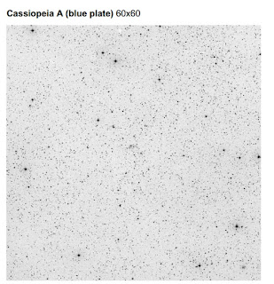

The plate above shows the field of Cassiopeia A in a somewhat wide
field. You can see Cass.A in the middle and if you look, you can see the
southern arc.

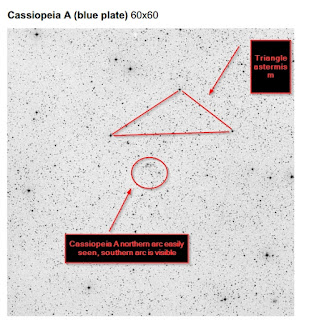

In the plate above I have labeled the triangle that I use to find
Cassiopeia A and then circled the part of Cassiopeia A I can actually
see, the arc that is.

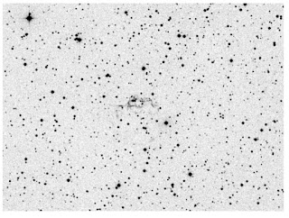

In the plate above here is a closer view of Cassiopeia A with its
northern arc showing nicely and the southern arc is in view here.

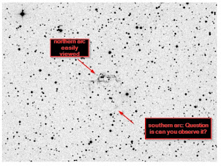

The image is same as above but labeled so you can identify the parts of
Cassiopeia A

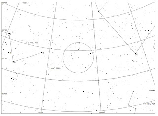

Here come the wide field finder charts. I have included the original
above, and then the next one is blown up so you can identify parts more.
Let me state to find Cassiopeia A you may need to use a combination of
these images to get there.

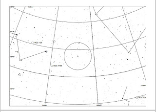

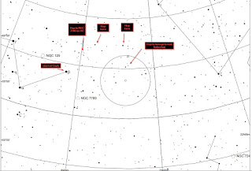

The finder chart labeled here is ONE WAY, not the only way to get to
Cassiopeia A. You will see in the Starry Night Images below that you can
get to M52 and then hop right down to it.

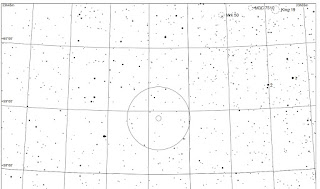

This is the close in finder chart for Cassiopeia A.

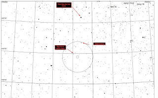

I have labeled how I star hop to Cassiopeia A and then use the images
above to complete my hop to this fun object.

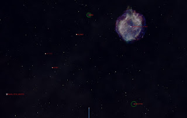

Starry Night 6 I use somewhat (Sky Tools 4 is my main astro software)
but here it is decently effective. Please note you just need to Star Hop
to Messier 52 here. Also, Tycho's SNR is labeled here but DO NOT try it.
This links answers the question if parts of SNR 1572 are visible
[LINK](http://astronomy.stackexchange.com/questions/888/can-the-supernova-remnant-sn-1572-be-observed-by-amateur-astronomers).
Right now, no but then again, neither was Cassiopeia A in the past.
North is to the left, south is to the right, east is up, west is down in
the Starry Night 6 images.

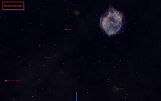

Repeat

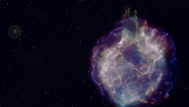

Let me point out that Cassiopeia A may be this bright and big but you
are not going to see that bubble or that much of it. You are going to
see an arc or two if you're lucky (the northern arc should be somewhat
easy).

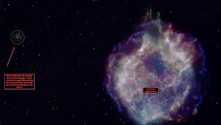

Here I have labeled the key parts to this star hop. How you decided to
go from Messier 52 to the triangle is up to you. Once at the triangle
you should be able to get it with these and the images above. Let others
know how you did with this. Remember a dark site, clear transparent
skies and aperture help to nail this one.

Finally, here is the STSci Image of Cassiopeia A. You can see the ring
in this image easily.

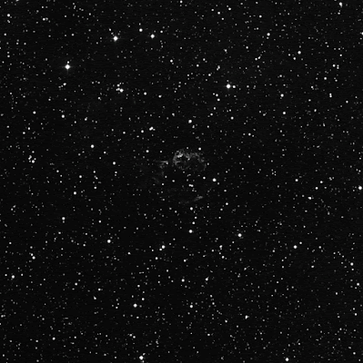

## 8. <x-dso simbad="PN A66 85">Abell 85</x-dso> / CTB 1 or SNR G116.9+00.1 in Cassiopeia

Isn't it funny how these SNR tend to group together in the plane of the
Milky Way? I mean look, Auriga/Taurus, Taurus, Orion, Gemini, Cygnus,
Cygnus, Cassiopeia, Cassiopeia. I would throw in SNR 1006 in Lupus but I
haven't read if that is doable though I doubt it. Perhaps in time. Abell
85 or CTB 1 is one of the most difficult objects to observe. It is close
to Simeis 147 in seeing it and don't get discouraged. It just may take
more than one night, with conditions coming together along with
everything else to nudge this one out. Check out this
[LINK](http://simbad.u-strasbg.fr/simbad/sim-id?Ident=SNR+G116.9%2B00.1)
in Sinbad to see how faint this object is but don't scroll over the
image or you will need to refresh as you'll change locations!

Here we go. Abell classified it as a Planetary Nebula at first, but in
time it became quite evident this is a Supernova Remnant. It has very
faint HII and OIII lines and thus one reason why those filters just
don't always help on this object. My take and I haven't done any
studying on this object yet, is that the star was very large and shed
off via a stellar wind much of its oxygen layer (and hydrogen and helium
layer) before going supernova. You can do a Google Search for (in this
order) CTB 1 Abell 85 and get lots of information and color images. I
think on this faint SNR though, I like it in black and white as the
contrast really comes out. See this
[LINK](http://www.astroimager.net/Page-180-CCD-172.html) to see if you
agree. Richard Murray imaged it and has a quick write up on it at his
blog at this
[LINK](http://ricksastropics.blogspot.com/2008/09/ctb-1-supernova-remnant-in-narrowband.html).
Rich Jakiel describes his visual observation at this
[LINK](http://www.astronomy-mall.com/Adventures.In.Deep.Space/ctb1.htm).
Finally J.T. Metsavaiani (showed his stuff under the Veil Nebula and
Cygnus Loop) has a wonderful set of images (though we will not see this
visually) on his blog at this
[LINK](http://astroanarchy.blogspot.com/2015/02/abell-85-ctb1-dim-galactic-supernova.html).

To get there here are the finder charts.

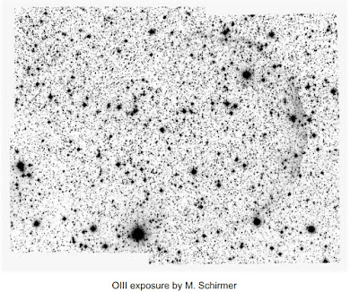

Above is the wide field view of CTB 1 or Abell 85. The bright star at
the bottom of the image is 9 Cass.

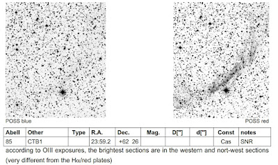

In the image above you can see a wide field view on the left, and a
closer image on the right.

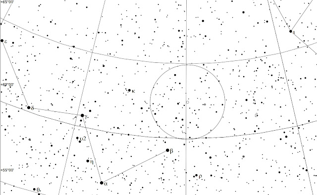

Above is the wide field finder chart for CTB 1 or Abell 85. Caph is the
starting point up to NGC 7790 and up from there.

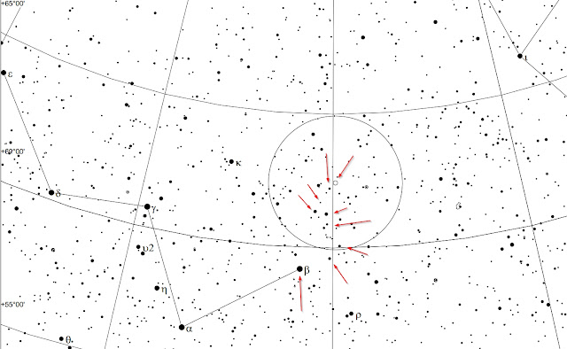

Here is the wide field chart again, zoomed in so you can see my star hop
to this object.

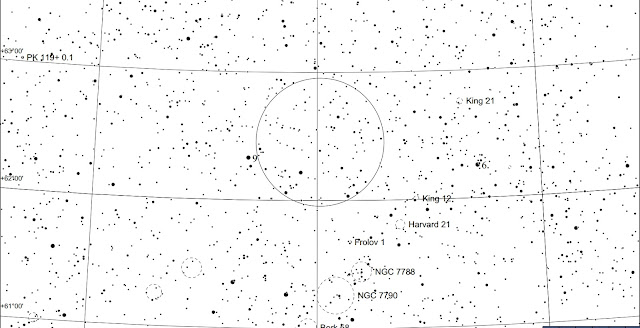

This is the zoom in finder chart. If you use a good image of CTB 1 you
can see where the SNR filaments are. Get to NGC 7790 on your star hop
then use this chart to hop up to CTB 1 or Abell 85.

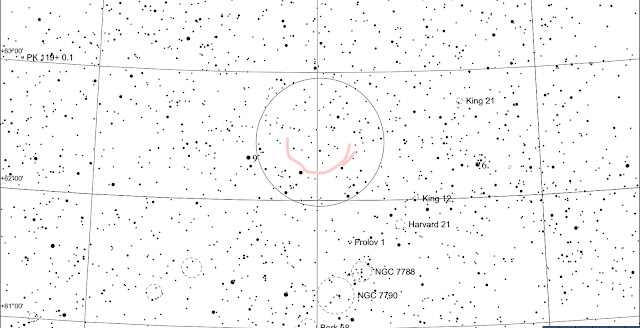

This chart is important as I have roughly lined in where the brightest
and most likely to visually see/observe the filaments to this SNR are
located. Hope this helps and feedback or corrections are welcome.
Remember on this one, aperture and you can try the OIII filter or other
filters but most visual observers share the fact that they don't really
improve the image though one said the OIII darkened the image (as it
should) but brought out the filaments a little more.

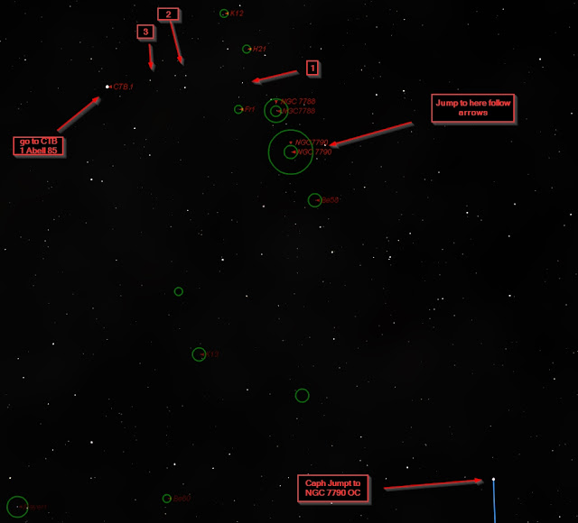

The wide field map from Starry Night Pro 6. It may help but I think the
charts above are excellent so those are the ones to go with. I can't
wait to give this one a go real soon!

Well there you go. 8 SNR objects or related to an SNR in some way in the
case of Barnard's Loop. I hope some of you give this a go and let me
know how your observations of these objects go. I am sorry I have no
reward other than the fun, frustration, and the challenge of seeing some
of these faint SNR that exist in our own Milky Way Galaxy. Perhaps in
what remains of our short lives we will have the opportunity to see a
bright supernova that will create a SNR for our descendants to view one
day! Enjoy the wonders of the night sky!
