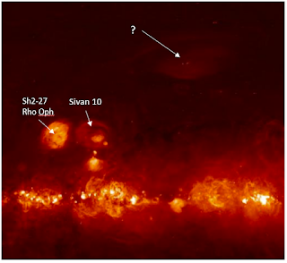
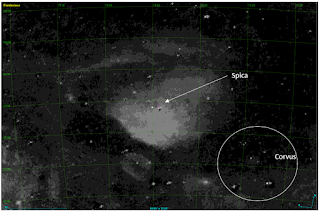
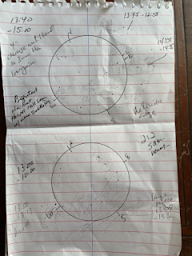
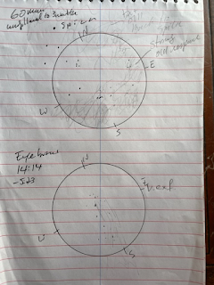
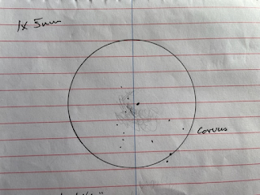

Spica Nebula

Mark McCarthy

In order to explore more of the large gas structures of our Milky Way, I
have started to use the Finkbeiner H-alpha all-sky map as my atlas. 
I've printed out sections of it by constellation so I can refer to it as
I explore all the wisps and tendrils which connect all the familiar (and
not so familiar) nebula with my night vision device.  One area which
caught my attention was a cloud floating above the plane of the Milky
Way somewhere to the northwest of Scorpio.  It's pointed out here and
looks like an eye with an eyebrow.  It is considerably fainter than
Sivan 10, which is in turn considerably fainter than Sh2-27, a
difficult object visually but which many a night vision device user has
discovered by panning around the sky.  

While on the Finkbeiner Gas line layer in Aladin, I navigated to the
spot but at first there was no nebula seen.  I needed to adjust Aladin's
pixel mapping (like adjusting the contrast on a TV) to make it appear. 
To my shock I found the nebula is nearly centered on Spica.  This is what it looks like on Aladin:

It is enormous, roughly 20-degrees W-E by 18-degrees N-S--larger than
the main star grouping of Corvus.  In the Finkbeiner image it appears to
be either lit from below (from the main plane of the Milky Way) or
perhaps even illuminated by Spica itself.  Curiously, there is a
noticeable lack of galaxies plotted in atlases in this region of Virgo
-- I wonder if they are being obscured by this cloud?

I first tried to view this during the May 2023 new moon from a site in
San Benito County, CA.  I only used 1x (ie. no magnification, just
looking through the device) and a 7nm Ha filter.  I used a mirror mount
to hold the device steady.  I made a sketch of what I perceived as a
very excessively faint wash of nebula south of Spica.  Mark Wagner, who
was with me, sketched nearly the same view, but he was more confident in
his observation than I was of mine.  I needed to try again to be sure.

A week later I went up to Williams Hill, south of King City, CA, and
found a turnout on the road to the communications tower at the summit. 
It was very windy and cold, mid- to low- 40s.  I brought a NP-101
(4-inch refractor, 4-degree FOV), a 60mm f/5 refractor (8-degree FOV),
and my mirror mount and a monopod to view at 1x (40-degree FOV).  I also
printed a finder chart of the nebula from Aladin with the coordinate
grid included, so I could use my alt/az mount's DSC to locate specific
parts of the nebula.  During the hour I observed it my SQML read between
21.2-21.4 -- transparency was not as good as expected. 

Once dark I pointed my 4-inch to what looks like the brightest part, at
approximately RA 13:40 Dec -15:00.  I set the device's gain quite low
(which darkens the sky and stars but gives more contrast for the
nebula).  As I flipped my filter wheel from unfiltered to a 3nm Ha, I
immediately saw an expanse of very faint mottled nebulosity.  It was
like blinking an OIII filter to see a planetary nebula: at first, it's
not there; then--add the filter, and there it is.  The nebula faded
from view, so I had to flip back and forth between unfiltered and
filtered to get used to seeing it -- eventually I could pick it out
against the sky background regularly.  In this area, the nebula to the
north was weaker, but nebula obviously filled the eastern, western, and
southern parts of the field, and beyond the edge of the field as I
panned.  This is as should be expected according to the finder image.

I tried the NW corner centered at RA 13:00 Dec -10:00.  Just as before,
the nebula appeared when flipping from unfiltered to filtered.  Weak
nebula to the north, less faint to the west, and stronger east and
south.  I switched to the 60mm telescope, and brought it back to the
brightest section in the SE.  The nebula was relatively strong in this entire
quadrant, and I followed a loop of it to the east back up to Spica. 
Both the Ha+OIII and OIII filters showed different aspects of the
nebula.  I also looked at the "Eyebrow" portion centered RA 14:14 Dec
-5:23 and found a very faint E-W wisp and a stronger N-S stream in the
east of the field. 

Finally, I mounted the device on the monopod and scanned the area at 1x.  This
time I had less difficulty seeing the southern portion of the nebula (I
could not see the eyebrow), and more confidently sketched it (though my
sketch shows it “brighter” than it actually was).  I scanned over to
Sh2-27 and judged its brightness against Siv 10, and then panned over to
the Spica Nebula.  While the entire extent of the nebula is
fainter than Siv 10, the brightest pocket to the SE of Spica is not excessively
difficult.  

So, what is this mysterious object? It turns out, there is a SIMBAD
entry for it, “Spica Nebula -- HII Region.” The Spica Nebula is
estimated to be 68-92 parsecs distant, and Spica is 77 parsecs, and
Spica is playing a role in ionizing the hydrogen in the cloud. As J.W.
Park explains in a 2010 study,

> HII regions are generally located in the vicinity of OB stars because
> these hot stars can produce strong ultraviolet radiation, thereby
> photoionizing hydrogen atoms in the region…The α Vir (Spica), one of
> the brightest stars at high galactic latitude, was found to be a
> double-lined spectroscopic binary with spectral types B1 V and B4 V
> (Herbison-Evans et al. 1971). The existence of an H ii region around α
> Vir was suggested because the region appeared to be a hole in radio
> observations (Fejes 1974) and ultraviolet absorption lines were seen
> for the star of the nearby sightline (York & Kinahan 1979). Equipped
> with a Fabry–Perot spectrometer, Reynolds (1985) made Hα scans and
> revealed that the region was indeed ionized with a gas density of ∼0.6
> cm−3. The hydrogen ionization rate of the whole H ii region was
> estimated to be ∼1046.3 photons s−1. The ratio of \[S ii\] λ6716 to
> the Hα line, which signifies the contribution of collisional
> excitation with enhanced temperature, was also made for the Spica H ii
> region (Spica Nebula). While the Spica Nebula is generally accepted to
> be a normal H ii region, the ratio was found to be rather high (0.16
> at the center and 0.21 at the edge) compared to those of other H ii
> regions such as the Orion Nebula (0.019, Peimbert & Torres-Peimbert
> 1977) and the Sharpless 261 (0.059, Hawley 1978), though its origin
> was not clearly identified (Reynolds 1988). Recently, the Spica Nebula
> was observed in the WHAM survey (Reynolds 2004), but no detailed study
> of this set of data has yet been published….Si iv and C iv ion lines
> were detected in the far ultraviolet (FUV) absorption line study
> toward Spica, and their origin was ascribed to the Local Bubble (LB)
> surrounding the Sun (Savage & Wakker 2009).

There you have it, an obscure nebula lying just outside our Local
Bubble, off plane of the Milky Way and not in an area one would expect
to find nebula, large and diffuse because of its close proximity to us.
I suspect if it were further away it would appear smaller, but more
concentrated and relatively brighter, and be a more familiar object to
amateur observers.

References:

J.-W. Park et al 2010 ApJ 719 1964
