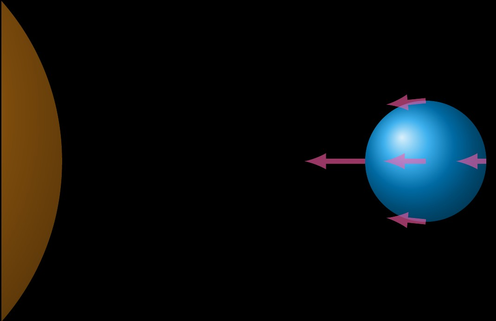
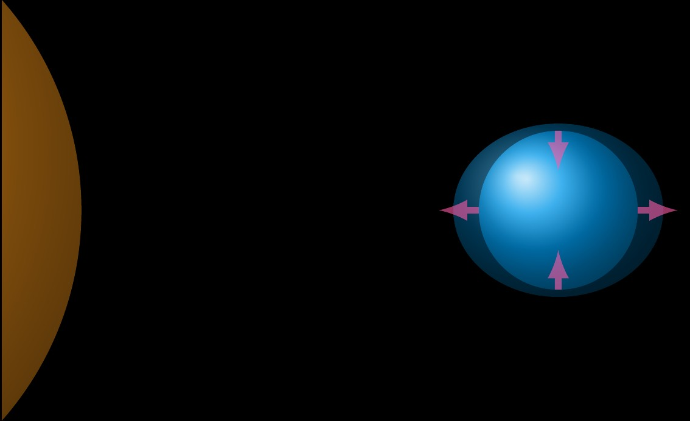
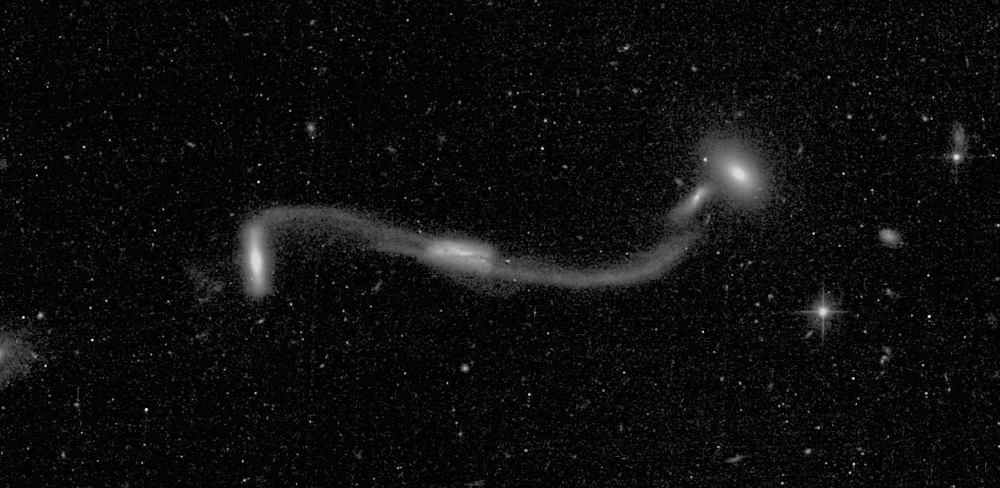
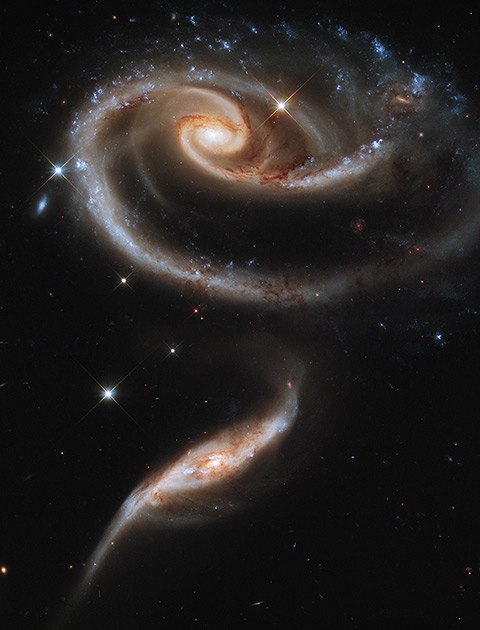
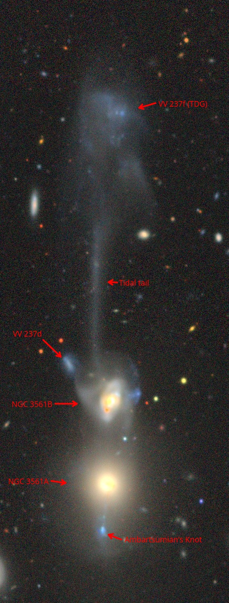
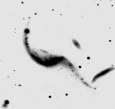

**Note 1:** I wrote an article on visually observing some exemplary tidal tails for [Sky & Telescope magazine, February 2025 issue](https://shopatsky.com/products/sky-telescope-february-2025-magazine?variant=49647315583192), titled "Galactic Tides", professionally edited by Dr. Diana Hannikainen. This webpage expands on that article with more information and observing targets.

**Note 2:** This webpage is a living document, and as I learn more about the subject or come across more interesting targets, I will add them.

## Introduction

If I were to pick my favorite kind of DSO to observe, it would be peculiar galaxies. The reasons, perhaps, lie in their diversity of shape and form and the mindboggling length, time and distance scales that underscore the physical processes of galaxies. Many galaxies develop peculiarities through interacting and merging with other galaxies. Mergers between galaxies are now believed to be commonplace. Deep images of galaxies formerly considered "normal" have revealed faint tidal streams, such as in the case of <x-dso omit>NGC 5907</x-dso>. One outcome of interaction between galaxies is the effect of tidal forces that they exert on each other. These can manifest in the form of tails, bridges and streamers. The tidal forces also trigger increased star formation in the galaxies.

## Tidal Forces

What is a tidal force? It is nothing but an effect of gravity. The tidal force is the effect of the difference in gravitational force between two points. This is why it can appear to be "repulsive" where it causes tails to shoot away from a galaxy. 

The following two images illustrate how tidal forces can stretch an object. The force of gravity gets weaker farther from a massive object. The center of gravity of the object is in an orbit ("free fall"), whereby if you were riding with the object, you would not feel the force of gravity acting on the center of the object but instead only experience the effects of the differences between forces at different points. The first illustration shows the gravitational forces acting on the earth from the point of view of someone stationary in space, the second one shows the same forces as seen from the earth's standpoint where the force acting on the center of gravity of the earth has been subtracted. More precisely, the latter is as seen from the freely falling reference frame of the earth. (Free fall describes a situation where gravity is the only force acting on a body)

{:.medium} {:.medium}

A thorough tour of tidal forces is given in Bernard Schutz's excellent book [Gravity from the Ground Up](https://www.gravityfromthegroundup.org/) which explains concepts in Newtonian and relativistic (Einsteinian) gravity using mostly high-school algebra and trigonometry. Einstein's theory of gravity elevates tidal forces to being the main effect of gravity, which cannot be made to vanish by changing the frame of reference to one that is freely falling.

When it comes to galaxies, picture a galaxy falling towards another: the gravity of the other galaxy acting on each galaxy is stronger at the closer edge than the far-away edge. The material at the closer sides is tugged on stronger than the material at the farther sides, so whereas the closer end moves faster towards the other galaxy, the faraway edge lags behind. This momentarily pulls the circular disk galaxy into an oval. With respect to the center of the galaxy, the far-away edge has been thrown out! The rotation of the galaxy then causes the material to be flung into tidal tails and bridges. A good explanation is provided on [Wikipedia](https://en.wikipedia.org/wiki/Galactic_tide).

## Peculiar Galaxies and Tides

In the [Atlas of Peculiar Galaxies](https://ned.ipac.caltech.edu/level5/Arp/Arp_contents.html), Halton Arp observed that "when looked at closely enough, every galaxy is peculiar". Many of these peculiar galaxies were shortly after understood to be double or multiple galaxies. Astrophysicists identified the hallmark of real interaction between galaxies to be the detection of long and thin filaments either connecting two galaxies ("bridges") or pointing away from them ("tails"). The exact reason for the presence of these tails and bridges remained open for debate until the computer simulations of Alar and Juri Toomre in 1972. For example, Zwicky had proposed that supernovae could be responsible for ejecting material to form these filmanetary structures.

Even before the work of the Toomre brothers, tides were considered as a possible explanation. Simulations showed that this was plausible under certain conditions. Of these simulations, Swedish astronomer [Erik Holmberg's 1941 work](https://ui.adsabs.harvard.edu/abs/1941ApJ....94..385H/abstract) is of particular interest, as he created an analog computer made of photocells and light bulbs, using the inverse square law of light intensity to simulate the inverse square law of gravitational force!

[Alar and Juri Toomre (1972)](https://adsabs.harvard.edu/full/1972ApJ...178..623T7) simulated a number of interacting systems and showed that a brief but powerful tidal impulse from the passage of one galaxy near another could produce the observed filamentous tails and bridges. They modeled galaxies using a number of "particles" and simulated the gravity between them with some approximations. They reproduced the morphology of several examples including <x-dso>M 51</x-dso> and <x-dso simbad="Antennae">Antennae Galaxies</x-dso>. Alar and Juri Toomre's [1973 article in Scientific American](https://www.jstor.org/stable/24923264) (paywalled) explains the ideas in more laymans terms – the galaxies come close, they pull on the stars and gas in each other, and continue marching on their orbit. The momentum imparted to the stars and gas causes the tidal tails and bridges to rise up long after the perturbing galaxy has marched along in its orbit. The metaphor they use, "galactic hit-and-run", stuck with me!

More refined simulations have since reproduced the morphologies of many interacting systems. These more recent simulations capture the motions of both stars ("points") and gas ("fluid"). They tune the initial conditions, masses, interaction timescale and other unknown parameters that give rise to the exact morphology and therefore estimate the physical parameters. I exchanged several e-mails with [Prof. William Keel](https://physics.ua.edu/people/william-c-keel/) who is one of the experts in this general area to gain a better understanding of the process, and the physics here seems pretty complicated! First some jargon – astronomers call a galactic encounter _prograde_ if the orbit of a perturbing galaxy is aligned with the rotation of the perturbed galaxy, and _retrograde_ otherwise. The closest approach of the orbit (periapsis) is in this case referred to as the _perigalacticon_. It turns out that beautiful long tails are formed by prograde encounters between disk galaxies (i.e. spirals and lenticulars), because the stars feel the perturbation for longer since they are rotating in the same sense as the orbit of the perturber. The effect is also stronger when the plane of the orbit matches the plane of the perturbed galaxy. Polar orbits, i.e. highly inclined orbits, apparently give rise to a single tail instead of pairs. Elliptical galaxies are less disturbed by encounters (see [Duc and Renaud (2011)](https://ned.ipac.caltech.edu/level5/Sept11/Duc/frames.html), Figure 6) and usually form tidal sheets; <x-dso>Keenan's System</x-dso> seems to be a notable exception. BTW, the terms prograde and retrograde are with respect to a given galaxy in an encounter, since there is no distinction between the "perturbing" and "perturbed" galaxy -- both galaxies are perturbing each other. So you can have an encounter which is prograde from one galaxy's perspective and retrograde from the other's, so one of the galaxies will develop much nicer tails than the other.

Tidal tails from disk galaxies are generally thin and ribbon-like. In three dimensions, therefore, they are like curved ribbons, sometimes having twists. The tidal tails from the two galaxies that constitute the <x-dso>Mice</x-dso> are therefore very different in appearance -- the northern tail is viewed edge-on, whereas the southern tail is not. In contrast, tidal tails from elliptical galaxies tend to fan out.

Another fascinating thing is that just like tides on earth's oceans rise and falls, the expectation is that tidal tails of galaxies do the same. If the galaxies are just passers-by, i.e. in a hyperbolic orbit, it is plausible that the tails will eventually fall back into the galaxy. It should be borne in mind that the very interaction will change the orbit, as it takes energy to raise the tides.

BTW, I based a lot of the introduction here on the introductory material in the review by Duc and Renaud, available [here](https://ned.ipac.caltech.edu/level5/Sept11/Duc/frames.html) and [here](https://ned.ipac.caltech.edu/level5/Sept11/Duc/paper.pdf), as well as my understanding from my e-mail conversations with Prof. Keel.

It must also be noted that not everything that looks distorted is due to tidal effects. It appears that [ram-pressure effects](https://en.wikipedia.org/wiki/Ram_pressure) from the galaxy's motion through the intergalactic medium (IGM) can also lead to some distortions. This is most profoundly seen in [jellyfish galaxies](https://en.wikipedia.org/wiki/Jellyfish_galaxy), but [this paper](https://www.aanda.org/articles/aa/pdf/2012/08/aa18436-11.pdf) suggests that perhaps some of the features of <x-dso>M 66</x-dso>'s western arm are due to ram-pressure. Scott Harrington sent me [a paper](https://ui.adsabs.harvard.edu/abs/2012MNRAS.422.2444S/abstract) and quoted from it "Short tails are also of interest, though it is not always entirely clear that they are tidal products. It is possible that some may be spiral waves in relatively low surface brightness discs." Scott pointed out to me that papers list Arp 72's eastern faint plume as a tidal tail, but do not mention the western bright, distorted spiral arm as resulting from tidal interactions. Therefore it is tricky to know for sure. I have not verified the tidal nature of every feature in this listing, although where it was readily available, I have provided some supporting evidence.

## Simulations of observed systems

A number of observed interacting galaxies have been simulated. Toomres' paper and popular article already render some simulations. [This fascinating video](https://esahubble.org/videos/heic0810d/) shows how a simulation of colliding galaxies stopped in different stages and presented at different viewing angles can reproduce a number of familiar examples of mergers, many discussed in this list! Below is the same video embedded in the webpage for your convenience:

<iframe width="560" height="315" src="https://www.youtube.com/embed/nCSUCA63WPE?si=uIdnuOLmWlHMH64H" title="YouTube video player" frameborder="0" allow="accelerometer; autoplay; clipboard-write; encrypted-media; gyroscope; picture-in-picture; web-share" referrerpolicy="strict-origin-when-cross-origin" allowfullscreen></iframe>

A number of merger simulations are available [here](http://burro.astr.cwru.edu/models/models.html) as well as [here](http://www.tapir.caltech.edu/~phopkins/Site/Mergers/). The [Galaxy Zoo Mergers paper](https://academic.oup.com/mnras/article/459/1/720/2608940) is also of interest.

## The Toomre Sequence

Alar Toomre organized eleven galaxies in a supposed evolutionary sequence of interaction in a [1977 paper](https://academic.oup.com/mnras/article/459/1/720/2608940). A similar sequence of five stages is explored in Steve Gottlieb's article in Sky & Telescope, June 2022 issue, which also covers several famous tidal tails. [Here](http://burro.cwru.edu/Talks/GLC03/toomre.html) is a representative montage of Toomre's sequence. The same montage is also presented as Figure 3 in Duc and Renaud (2011) with the designations of the galaxies. Perhaps excepting NGC 3256 (in Vela), many will be familiar to northern hemisphere observers.

Care must be taken in interpreting the Toomre sequence. [A 1996 study](https://articles.adsabs.harvard.edu/pdf/1996AJ....111..655H) seems to vindicate the idea that the Toomre sequence organizes galaxies roughly in order of time left until the merger is complete, but emphasizes that it is not a homogenous or universal sequence. See Section 5.1 of the paper for more details. There is also a [recent paper finding](https://ui.adsabs.harvard.edu/abs/2010ApJ...715L..88K/abstract) that the Mice should come before the Antennae in a true evolutionary sequence -- i.e. in opposite order from how it is presented in Toomre's original work.

## Tidal Dwarf Galaxies

The tidal tails contain all the necessary ingredients for star formation – gas and dust – that have been pulled out of the host galaxy. Therefore star formation can occur, and this includes the formation of clusters / OB-associations in the tidal tails. A good example is the Tadpole Galaxy (see [this write-up](https://hubblesite.org/contents/media/images/2002/11/1181-Image.html)) which shows numerous star-forming knots which can be visually picked up in e.g. Jimi Lowrey's 48" telescope. More information on this is available in Duc and Renaud (2011).

It appears that when a star forming region involves a mass that is typical of a dwarf galaxy (above 108 solar masses), one might call it a tidal dwarf galaxy. These are regions that essentially have the properties of dwarf galaxies – they are self-gravitating systems that are kinematically decoupled from (i.e. do not share the motion properties of) the parent galaxies, predominantly consisting of blue stars and gas albeit of higher metallicity. The first example of this that was described appears to be the <x-dso simbad="[MDL92] TDG">TDG in Antennae Galaxies</x-dso>, but many more examples have since been identified. The tidal tail of the <x-dso>Dentist's Chair</x-dso> for example contains many blue knots of sufficient luminosity to be considered as TDG candidates, as indicated in [this paper](https://iopscience.iop.org/article/10.1086/345318/pdf).

Not all brightenings in tidal tails correspond to tidal dwarf galaxies. For example, [this paper](https://iopscience.iop.org/article/10.1086/344160/pdf) points out that no blue star-forming regions similar to tidal dwarf galaxies were found in HCG 79, Seyfert's Sextet. Thus, the brightening at the end of the tidal tail of HCG 79b is presumably not a tidal dwarf galaxy.

## Tips for observing tidal tails

First a comment on aperture -- aperture helps a lot in revealing these dim features. It is however very hard to determine what is the minimum aperture needed to attempt something, because the results you may have vary very much depending on the quality of the optics and baffling, the observer's skill and experience, and sky conditions. If I were to pick the few brightest and easiest tails that are considered an entry into this project, they would be: NGC 4676 (the Mice), NGC 520, and NGC 3509. Perhaps M 51's E-shaped tidal feature should come next in difficulty, as it requires excellent sky conditions; aperture, in my experience, compensates somewhat for a poor sky on this feature. I would try all of these with a 15-inch or larger, M51's probably even smaller but under exceptional conditions.

I use the DSS2 imagery as a guide to guess whether something is within the range of my telescope. If the feature is diffuse, then I assume that it is more sensitive to sky conditions than to aperture. This thumb rule comes to me from my experience, and I don't have an objective scientific basis for it. A dark sky background is essential to detect the low contrast offered by these dim features. I would put the tails of M 51, NGC 3628, and M 66 in this category.

The scale of the feature and its diffuseness guides my choice of magnification. A bright feature but tiny (in angular size, of course) feature like the tidal tail of the Mice would benefit from a smaller exit pupil, i.e. higher magnification, to render it large enough for the eye to pick it up well. I usually start at 2-3mm exit pupil and try a bunch of different magnifications going up and down from there. A faint and diffuse feature like M 51's E-shaped tidal tails would be something that can be attempted even in a smaller telescope, and I would choose as close to the maximum exit pupil (6~7mm depending on your eyes) to detect.

The above is motivated by some interesting ideas -- the surface brightness of an object as rendered in the eyepiece is diminished when the exit pupil is small; so we would ideally observe everything at maximal exit pupil. Except there is another factor -- the eye cannot pick up tiny detail very well in dim-light; Mel Bartels and others have noted that the feature of interest must subtend perhaps somewhere around a degree or two at the eyepiece for good detection. This means that if we wanted to see a 0.1 arcminute feature at maximum exit pupil, we would ideally want a gigantic 200-inch telescope! Of course, not everyone has a 200-inch lying around, so we make do by tacking on higher power and trading off the apparent surface brightness or the size. The more interested reader is referred to a German publication "Praxishandbuch Deep-Sky" by Kosmos publishers. Please get in touch with me if you would like my translated notes.

## The List

This list includes many tidal tails I've observed, plus several additions from Steve Gottlieb and Jimi Lowrey which I've not necessarily observed. Some of these targets are definitely very difficult, with the tidal features being challenging even in Jimi Lowrey's 48-inch telescope. Others are diffuse and are tractable even in smaller telescopes, but need exceptional skies and a lot of patient observing. Many of these tidal tails are not too difficult with a 16"-24" telescope! BTW, the common names listed in double quotes are our own monikers, either due to Jimi Lowrey or myself or someone in my observing circles.

<table>
<tr><th>Object</th><th>Coordinates</th><th>Constellation</th><th>Common Name</th><th>Remarks</th><th>Feature</th></tr>

To update this data, please edit docs/_data/TidalTails.csv



<tr><td><x-dso>{{entry.Object}}</x-dso></td><td>{{entry.Sexagesimal}}</td><td>{{entry.Constellation}}</td><td>{{entry.Common}}</td><td>{{entry.Remarks}}</td><td>
<a href="#{{entry.Feature}}">LINK</a>
</td></tr>

</table>

## Featured Objects

### M 51

For details on my observations of M 51 with my 18-inch, please see Sky & Telescope Feb 2025 issue.

A large aperture helps with the "E" – it is difficult but detectable in my 28-inch on moderately good nights. I find it easy to see through Jimi Lowrey's 48-inch monster telescope even on a moderate night. Of course, on a perfect night when the transparency is excellent, it is easily visible to direct vision and looks phenomenal! Howard Banich shared his sketch of M 51 in Sky & Telescope July 2011. It can also be [seen on his website](https://sites.google.com/site/howardbanichhomepage/observations/observing-notebook-scans/notebook-1?authuser=0).

### NGC 3628

The tidal tail of NGC 3628 was very difficult in my 18-inch. The details are reported in Sky & Telescope Feb 2025. Below is my best attempt at sketching it through my 18-inch. During one of my observing sessions, I was accompanied by experienced observer Mark McCarthy, and he picked up on it as well.

I have not yet tried it in my 28-inch, but Howard Banich wrote about the observation through his 28-inch in Sky & Telescope April 2021 (and on DeepSkyForum [here](https://www.deepskyforum.com/showthread.php?1479-Object-of-the-Week-March-28-2021-NGC-3628-Tidal-Tail)). Until I saw that article, I had assumed that this diaphonous tail was not visually observable. Of course, one needs very good transparency.

NGC 3628's tidal tail features a tidal dwarf galaxy cataloged [in NED as Leo TDG](https://ned.ipac.caltech.edu/cgi-bin/objsearch?objname=Leo%20TDG), which Howard mentions [in the DeepSkyForum OOTW post](https://www.deepskyforum.com/showthread.php?1479-Object-of-the-Week-March-28-2021-NGC-3628-Tidal-Tail). Howard's post also has a deep image with the TDG marked, that can be employed as a finder chart. Here is the [discovery paper](https://iopscience.iop.org/article/10.1088/0004-637X/786/2/144/meta). Jimi may be the only person to have seen the TDG, through his 48-inch.

### M 66

At first, I thought M 66's spiral arm was distorted due to tidal interaction with NGC 3628. However, [this paper](https://www.aanda.org/articles/aa/pdf/2012/08/aa18436-11.pdf) suggests that perhaps some of the features of <x-dso>M 66</x-dso>'s western arm are due to ram-pressure. Nevertheless, M 66 actually has two hook-like tidal streams, seen even in the POSSII blue image. Perhaps Alar and Juri Toomre were to first suggest the tidal nature of these, in their [1972 paper](https://articles.adsabs.harvard.edu/cgi-bin/nph-iarticle_query?1972ApJ...178..623T&defaultprint=YES&filetype=.pdf) from which I quote: "That the blame indeed belongs to M66 is corroborated not so much by its asymmetric spiral structure as by two hooklike faint extensions to the northwest of M66 which can be recognized in the group portrait Arp 317 and which are unmistakable in a deep IIIaJ photograph that Sandage showed us recently."

Well, seeing the hook-like tidal structure is definitely challenging, but not impossible. Using my 28-inch in Fort Davis, TX, I picked up on a weak brightening in the area north of M 66, beyond its bright disk. The region of the brightening was confirmed against the images later. This corresponds to the outer of the two hook-like arms, which has the better contrast. The feature was a lot easier through Jimi Lowrey's 48-inch on an exceptional night. More details are in [my observing report](https://adventuresindeepspace.com/OR__Seven_nights_in_west_Texas.html) from that run. Here is a reproduction of the rough sketch shown in that observing report:

### M 101

I mention M 101 here although it is not on my list, because there was some speculation that its northeasternmost spiral segment was a tidal arm. I marked it as such on [my 18-inch sketch](https://asimha.net/Astrosketches/M_101.jpg), but that seems to not be the case according to a [recent paper by Linden and Mihos (2022)](https://iopscience.iop.org/article/10.3847/2041-8213/ac7c06/pdf) that Scott Harrington found and sent me. From it, I quote: "However, recent data have provided new constraints on our understanding of the M101 system. Deep imaging of M101ʼs outer disk has revealed additional signatures of recent interaction, including the extended NE Plume and E Spur (Mihos et al. 2013), but no evidence for long tidal tails or connecting tidal bridges between M101 and any of its companions."

Tidal or not, the galaxy is worth seeing and its arms are beautiful under excellent skies.

### Taffy System

The nickname "Taffy System" for the pair of galaxies UGC 12914 and UGC 12915 in Pegasus comes from <a href='https://adsabs.harvard.edu/pdf/1993AJ....105.1730C'>this paper</a>, which discovered a bright radio bridge stretched like taffy filaments between the two interaction galaxies. The two gas-rich spiral galaxies are counter-rotating, with the collision being prograde for UGC 12915. This, according to the same paper, is responsible for turning it into a one-armed spiral.

I found the Taffy galaxies reminiscent of the planetary nebula <x-dso simbad='PN Jn 1' noindex>Jones 1</x-dso>! The brighter member <x-dso noindex>UGC 12914</x-dso> appeared narrower in comparison to the fainter galaxy <x-dso noindex>UGC 12915</x-dso> which was broader. I also sensed a stellar core in UGC 12914. The cool feature is the tidal hooks, they're curved towards each other as if trying to meet! The brighter galaxy has a strong curved feature as if trying to meet the fainter galaxy, which also sports a curved arm, albeit less curved. The observation was made at 345× through my 18-inch.

### Bruno's Violin Clef

Discovered by a volunteer named Bruno on the [Galaxy Zoo](https://zoo4.galaxyzoo.org/) project, this is a fantastic example of four, presumably lenticular, galaxies at a redshift of z = 0.095 connected by what appears to be tidal tails. The merger bears the coordinates <x-dso>SDSS J000415.42+032301.8</x-dso> and it was reported in the [Galaxy Zoo: Mergers](https://academic.oup.com/mnras/article/459/1/720/2608940) paper, which made dynamical models to simulate many of the mergers discovered through the Galaxy Zoo project and otherwise. I got some of the other details from Prof. William Keel. Here is a Hubble image of the system

_HST image of the Violin Clef, courtesy of Prof. William Keel_

Jimi Lowrey and I looked at it with his 48-inch at 610x power in 2016. This object is so dim, that it was very hard to see anything in the field. Occasionally, there were cores popping into view. There were moments when the three brighter cores were glimpsed simultaneously for short durations, but those moments were rare. There was no sign of the tidal tail, even in the mighty 48-inch.

<!--
### NGC 34

Also designated as NGC 17 and VV 850

Through Jimi's 48-inch at 488x: Bright core, tuft towards NWW, and occasional glimpses of tidal tail. The conditions seem to be making what should be a fairly easy object in a 48" very difficult. At 610x, the tuft was better, but the tidal tail was harder (possibly due to deterioration of seeing conditions).

In my 18-inch at 345x, it appeared as a nonuniform patch that was reminiscent of a planetary nebula. It appeared spikey to averted vision.

### Arp 256

Using my 18-inch at 345x: The distorted galaxy was bright, but hard to see unless you know you're on the correct field. The edge on appeared much fainter, but showed more elongation. It appears elongated away from the star and towards the brighter galaxy. Other than this, no features could be discerned. The faintest member was elusive, and I may have had 2--3 weak pops after knowing exactly where to look, but not strong enough to log. No mention of the tidal arms in my notes.-->

### IC 18

Also known as Arp 100, this galaxy sports a tidal tail that was difficult but definitely picked up in my 28-inch. I would've thought it a figment of my imagination if I hadn't nailed down its exact orientation knowing only the rough orientation. I tried to "see" tidal tails in many different orientations, but kept going back to one particular direction. When I was sufficiently satisfied, I went to the DSS image and I was amazed to have nailed down the exact orientation! That's how I confirmed this tough nut. This was using 291x. I would expect this to be a lot easier under better conditions in a 28".

### NGC 474

NGC 474 constitutes Arp 227 along with NGC 470 nearby. NGC 474 is itself a highly disturbed shell-galaxy, one of the best exemplars of the class. It's many shells and tidal streams are believed to be the result of it accreting a smaller galaxy. I posted about it [on DeepSkyForum](https://www.deepskyforum.com/showthread.php?1555-Object-of-the-Week-December-26-2021-%E2%80%94-NGC-474) earlier.

Jimi Lowrey's 48-inch managed to reveal several aspects of the faint shells of this galaxy, as I've reported on in the DeepSkyForum post. Multiple observers gathered that night, including Steve Gottlieb, observed the shells. However, I have not heard any reports in smaller aperture yet.

### NGC 520

NGC 520, also known as an Arp 157, is an excellent galactic merger!

During my first observation with my 18-inch from central Texas, I picked up the four protuberances of this galactic trainwreck. The sketch I made in 2014 had an extension on the southern edge that is longer than the bright protuberance with a “?” on it, indicating that I suspected the tidal tail.

I looked at it again in 2024 with the same instrument. At 147x, the galaxy seemed embedded in a Y-shaped halo with the left prong of the Y being longer. I got many repeated flashes of the tidal tail going to the south-southeast. I tried hallucinating the feature in other directions, to no avail. The sensation was pretty strong, I was just surprised to see it under poor conditions. I did not see exactly how the tail emanates from the galaxy or which way it was curved, but I was able to generally sense something about 1.5’ long in that general direction. The northwestern tail also kept calling out to me, and it looked longer than in the DSS2 images perhaps because of the effect of two nearly collinear stars. At 413x despite terrible seeing, I could see all four protuberances, the southwestern one being much dimmer than the rest.

Scott Harrington reported to me a successful observation of the southern tidal tail in his 16-inch telescope at 440x.

### Arp 273

This is a beautiful pair of galaxies, imaged famously by the Hubble Space Telescope:

[This NASA press release](https://science.nasa.gov/image-detail/a-rose-made-of-galaxies/) says "The distorted shape of the larger of the two galaxies shows signs of tidal interactions with the smaller of the two. It is thought that the smaller galaxy has actually passed through the larger one." Therefore it is in our list. The spiral arm of UGC 1810 does indeed seem very disturbed, and UGC 1813 has a faint southeastern tail.

Under good conditions at the 2015 Okie-Tex Star Party, the distorted arm of UGC 1810 was picked up, spanning at least up to a star that lies to the ENE of the core of UGC 1810 that flanks the arm. This was at 395×. I have been unable to see the connection section in my 18-inch.

Here are my notes through Jimi Lowrey's 48-inch: Faint, but distinct!
So much detail! Almost all brighter detail found in the DSS image is
visible. Both cores are obvious, the edge-on being more distinct. The
tidal "curling" of the edge on could be seen.

### NGC 1097

NGC 1097 is listed as Arp 77 in the Atlas of Peculiar Galaxies as a galaxy having a small, high surface-brightness companion. The companion, of course, is NGC 1097A. Otherwise, NGC 1097 seems like a regular barred spiral galaxy.

However, somewhere in the 1970s, Halton Arp and others discovered a faint network of optical "jets" around the galaxy. Notably, the northeastern "jet" makes an L-shape like a dog-leg and is therefore referred to as the "dog-leg" jet. This dim feature is very faintly visible on the POSSII Blue plate around 02:46:19.10 -30:16:29.70.

These "jets" are tidal streams made of stars and not radio jets from an AGN, see [this paper](https://www.aanda.org/articles/aa/pdf/2010/13/aa13518-09.pdf) for example. Fig. 1 of the paper shows a deep image of the dog-leg jet. [This paper](https://arxiv.org/pdf/1504.03697) shows another image.

Barbara Wilson and Larry Mitchell listed visual observation of the dog-leg jet as entry #67 on the famous [AINTNO list](/aintno.htm). I do not know of any observations (or attempts) till date.

### NGC 2207 and IC 2163

This pair found atypically in Canis Major, oddly does not seem to be in Arp, VV or KPG catalogs. It is a very early-stage merger, although that has been sufficient to turn IC 2163 into an _ocular_ galaxy: a galaxy having an eye-shaped central oval with a sharp apex at each end (see [Elmegreen et. al. (1995)](https://articles.adsabs.harvard.edu/cgi-bin/nph-iarticle_query?1995ApJ...453..100E&defaultprint=YES&filetype=.pdf)). Oculars are thought to be formed in prograde encounters where the impulse along the azimuthal direction is substantial, see [this page](https://ned.ipac.caltech.edu/level5/Struck/St3.html). It seems like the ocular appearance [is a short-lived phase](https://core.ac.uk/download/pdf/1637642.pdf), which makes IC 2163 all the more interesting. NGC 2207 is located in front of IC 2163 and hides the western tidally-extruded arm of IC 2163. [This short paper]((https://core.ac.uk/download/pdf/1637642.pdf) has some interesting details. Jimi Lowrey has some more interesting details on the system in his [DeepSkyForum Object of the Week post](https://www.deepskyforum.com/showthread.php?286-Object-of-the-Week-January-13-2013-NGC-2207-and-IC-2163-(Cosmic-Ballet)). Arp 82, also on the list, is another example of an ocular galaxy.

I haven't looked at this pair through Jimi Lowrey's 48-inch, but I can imagine it must be a fantastic view. In my 18-inch, I could very prominently see the eastern arm of IC 2163 at 460x. NGC 2207 appeared mottled and I could pick out parts of its spiral structure. A bridge of bright light appeared to connect the core of NGC 2207 with that of IC 2163, which could potentially be the western arm of IC 2163, although the [HST image](https://en.wikipedia.org/wiki/NGC_2207_and_IC_2163#/media/File:NGC2207+IC2163.jpg) suggests otherwise -- it may just be the chain of knots in NGC 2207's arm giving that impression. I have included the HST image below:

{:.medium}

### NGC 2146

This amazing galaxy has two protuberances on either end, but it appears that de Vaucouleurs proposed a model involving three spiral arms that acccounts for the two protuberances and the dust lane correctly, see [this paper](https://articles.adsabs.harvard.edu/cgi-bin/nph-iarticle_query?1975A%26A....41...91B&defaultprint=YES&filetype=.pdf). The paper also includes a blue photograph that "reveals details which are not accounted for in the model proposed by de Vaucouleurs. An elongated knotty feature, probably consisting of HII regions, running parallel to the principal dust lane at a distance of 40" north of the nucleus does not belong to any of the three arms...". Moreover they state that the highly bent feature north-east of the core appears highly unusual for a spiral arm.  [Here is an article](https://academic.oup.com/mnras/article/426/2/1185/974023) describing the discovery of a ring-like complex of clusters in one of the tidal streams, and the stream structure seems to be overlaid in line with the optical feature that was confounding in the previously linked paper. Therefore, in my understanding, the faint stuff looping on the north-east of the core is a tidal stream. [Another paper](https://www.aanda.org/articles/aa/pdf/2001/03/aah2217.pdf) seems to find large-scale tidal streams in HI 21cm line, but does not comment extensively on the odd optical morphology beyond referencing the first paper. Indeed the latter two papers indicate that this is amerger.

I looked at this galaxy with my 18-inch on a subpar night at Death Valley National Park. The conditions were really poor, and I could only make out the main spiral structure of the galaxy. However, I could imagine parts of the tidal stream being visible in this aperture class on an excellent night, with lots of patience.

### Arp 245

I wrote about my observation of Arp 245 with my 18-inch in Sky & Tel, Feb 2025 issue. I've observed this galaxy on two occasions in my 18-inch and in both cases, picked up on the tidal tail of NGC 2992 and the tidal dwarf galaxy in it. [Here is the discovery paper](https://iopscience.iop.org/article/10.1086/301516/pdf) of the tidal dwarf galaxy, which is cataloged as <x-dso>[BLD2000] A245N</x-dso> in SIMBAD.

Jimi Lowrey's 48-inch brings out suspected hints of the dim bridge between the two galaxies, and reveals the stubby protuberance of NGC 2993. In that scope, the very faint background galaxy PGC 90942 is also seen as part of the scene.

### NGC 3509

I wrote about my observation of NGC 3509 with my 18-inch in Sky & Tel, Feb 2025 issue. NGC 3509 is part of the Toomre sequence outlined in Toomre's 1977 paper. When writing that article, I wasn't fully clear on the tidal nature of the "hook-like" northern arm of the galaxy, especially because the [Wikipedia article](https://en.wikipedia.org/wiki/NGC_3509) has a rather ambiguous statement about Toomre's impressions proven incorrect. Digging through [the cited article](https://iopscience.iop.org/article/10.1086/379676), we find a few statements of interest which I quote here: "The sketch of this system by Toomre (1977) suggests that he envisioned a large tail curving to the northwest and a shorter tail extending to the southwest. Deep ground-based CCD imagery obtained by one of us (J. E. H.) suggests that the southeastern feature is not a tail, but rather the bright ridge of an inclined disk.", "In the absence of an obvious second tidal tail in the ground-based imagery, we find little evidence that NGC 3509 is the obvious result of a major disk-disk merger."

The idea is that generally minor mergers produce a single tail (I don't know why yet), but major mergers produced pairs. It does appear from a careful reading of the aforementioned paper that they are not disputing that the "hook-like" northern arm is a tidal tail. However, in the interest of not propagating false information, I wrote that its tidal nature is in question in the S&T article. I'm now more inclined to believe that this is indeed a tidal tail, and if that is correct, it would be one of the brighter and easier tidal tails to see!

### Arp 105

The famous Guitar Galaxy in the cluster <x-dso noindex>Abell 1185</x-dso> is one of the most fascinating interactions in the night sky. It is also known as VV 237 and NGC 3561. There is a lot going on here, so perhaps an annotated picture is in order:

_Image from the Legacy Survey_

The interacting system sports a long tidal tail (the guitar's fretboard) to the north from NGC 3561B, and this tail bears a tidal dwarf galaxy at its end (the guitar's body). [Here](https://www.cambridge.org/core/journals/highlights-of-astronomy/article/tidal-dwarf-galaxies/9A1A3745078A8E5D1B606CD1D15FCCAC) is a paper discussing this tidal dwarf, which is listed as <x-dso>VV 237f</x-dso> in SIMBAD. This interaction is a challenging visual target, even for Jimi's 48-inch.

[Viktor Ambartsumian](https://en.wikipedia.org/wiki/Viktor_Ambartsumian), the celebrated Armenian astrophysicist, described a blue, high-luminosity condensation called Ambartsumian’s Knot. [He (and Halton Arp)](https://articles.adsabs.harvard.edu/cgi-bin/nph-iarticle_query?1999IAUS..194..473A&defaultprint=YES&filetype=.pdf) believed that this was ejected out of NGC 3561A as part of its southward "jet". The present understanding is that it is [actually a young tidal dwarf galaxy](https://iopscience.iop.org/article/10.1088/0004-6256/137/6/4561/pdf), and the blue southward "jet" is a tidal tail just like the northern jet.

I would love to read a comprehensive review on the region. I have been able to [find literature](https://iopscience.iop.org/article/10.1088/0004-6256/139/3/1212/pdf) indicating that VV237d has a velocity that differs from that of the Arp 105 spiral by 2700 km/s, and is thus likely a foreground galaxy, but I have not found information on the other blue protrusion seen on the west-northwest of NGC 3561B.

With two tidal tails and two tidal dwarfs to see, there is plenty of scope for visual observation -- except these objects are extremely dim! The southern tidal tail containing Ambartsumian's Knot is on the [venerable AINTNO list](/aintno.htm) as #22.

I've viewed the system twice with Jimi Lowrey's 48-inch, and neither time were the conditions exceptional. Yet, the TDG at the northern end, VV 237f, was seen on both occasions at 375x. Moving the telescope was helpful to confirm it. On both occasions, Ambartsumian's Knot was challenging to see, flashing few times into view. The northern tidal tail was detected on the better of the two nights, and scanning for brightness change across the Guitar's fretboard it helped.

Alvin Huey and Jimi Lowrey had excellent conditions during their observation of Arp 105 through the 48-inch, and Alvin has [his notes on the DeepSkyForum OOTW post](https://www.deepskyforum.com/showthread.php?1273-Object-of-the-Week-April-28-2019-Arp-105-%C3%82%E2%80%93-NGC-3561B-and-3561A) he made. Clearly, they knocked off AINTNO #22.

### Arp 248

Also known as Wild's Triplet, and <x-dso simbad="K79 38" noindex>KTG 38</x-dso>, this triplet of galaxies shows plenty of signs of interaction, notably the bridge between PGC 36733 and PGC 36723. All three galaxies are detected in my 18-inch, but the bridge was not picked up. I've only seen the bridge in Jimi Lowrey's 48-inch, although I imagine it may be detectable in a smaller telescope.

### Antennae Galaxies

I wrote about this beautiful interaction in the article in Sky & Telescope, Feb 2025 issue. I have only detected the brightest, stubby tidal segment going south from the eastern end of <x-dso noindex>NGC 4039</x-dso> in my 18-inch. Jimi Lowrey's 48-inch shows a spectacular view of the starburst in the two galaxies, but more relevantly, it shows the two faint tidal tails that give this galaxy it's name. At the far end of the southern tail lies a faint tidal dwarf galaxy cataloged in SIMBAD as <x-dso>[MDL92] TDG</x-dso>, which is also detected in Jimi's 48-inch.

I believe the Antennae are within the scope of a 28-inch under exceptional skies, as I weakly suspected hints of them in my most recent observation. In fact, Howard Banich reports sighting them with his 30-inch under exceptional conditions.

### The Eyes

The Eyes are the pair of galaxies, NGC 4438 and NGC 4439, that lie along Markarian's Chain. I believe the name is due to San Francisco poet and amateur astronomer Leland S. Copeland. Howard Banich wrote an article about observing the Markarian Chain in Sky & Telescope, April 2022 issue. His sketch therein shows the tidal features of NGC 4438, and it inspired me to try with my 18-inch.

I wrote about my observation of NGC 4438 with the 18-inch in the Sky & Telescope article in the Feb 2025 issue. Essentially, I was able to pick up the northern tidal tail. In May 2023, Jimi and I enjoyed an excellent view of NGC 4438 through his 48-inch on a moist night that turned out to have exceptional seeing. Using 810x, we were able to see the entire looping tidal structure. In addition, we saw the third short tidal tail headed roughly south of the core towards the galaxy VCC 1040, which is thought to be responsible for drawing it out. More details of this observation are reported [in an e-mail I wrote to TAC](https://groups.google.com/g/sf-bay-tac/c/Y9wIPIGQOOE/m/g1BJB9AfAQAJ).

### NGC 4449

This famous galaxy is a spectacle in any telescope, and larger telescopes can reveal a plethora of HII regions, star clusters and even globular clusters. However, our focus here is on a [tidally distorted dwarf galaxy](https://arxiv.org/pdf/1202.2316) that was discovered near NGC 4449. This object is available in SIMBAD as <x-dso>NGC 4449B</x-dso> and is visible faintly on the DSS2 blue image, especially when stretched. Apparently it was discovered by [Karachentsev et. al.](https://arxiv.org/pdf/0708.3547) who note that "This object appears as a partially destroyed 'tail' pointing away from the galaxy NGC 4449 southward. ... This may be an example of the formation of the so-called tidal dwarfs or, conversely, the capture of a dwarf system by a bright galaxy just like the Sagittarius dSph phenomenon around the Milky Way."

[This paper](https://iopscience.iop.org/article/10.1088/2041-8205/748/2/L24/pdf) displays a deep image of the system, and confirm its physical association with NGC 4449. They also interpret the stellar stream as the ongoing disruption of a dSph galaxy by a larger dwarf (namely NGC 4449, which they describe as a dwarf starburst galaxy). Hence the title of their paper, "dwarfs gobbling dwarfs".

Visually speaking this stream is extremely dim, as evinced by the POSSII blue image. However, that should not deter the determined visual astronomer from trying.

I only had a marginal observation of the stream in Jimi Lowrey's 48-inch under excellent skies. I admit my technique for LSB material wasn't as honed back in 2019 as it is now (in 2025). My logs read "Borderline sensation, would not confirm, about 3 pops, should repeat". I believe Jimi and a few others confirmed sightings.

There is a good deal of material on NGC 4449 and its tidal stream [on this CloudyNights thread](https://www.cloudynights.com/topic/918424-dissecting-a-dwarf-ngc-4449/) as well as this [DeepSkyForum Object of the Week post](https://www.deepskyforum.com/showthread.php?694-Object-of-the-Week-March-8-2015-NGC-4449-Train-Wreck-Galaxies). Uwe Glahn and Frank Richardsen report a "60/40 positive observation" on the latter thread.

### Umbrella Galaxy

NGC 4651 is nicknamed the "Umbrella Galaxy" and a deep-image immediately shows why:

<i>Image by R. Jay GaBany from Wikimedia Commons</i>

[This paper](https://academic.oup.com/mnras/article-abstract/442/4/3544/1347679) has a number of details about the Umbrella Galaxy. They point out that the Umbrella was first described by Fritz Zwicky in 1956, and [an earlier paper](https://iopscience.iop.org/article/10.1088/0004-6256/140/4/962/pdf) inferred that the observed features could plausibly have formed in the tidal disruption of a low-mass galaxy on a near-radial orbit around 6–10 Gyr ago.

[Mel Bartels](https://bbastrodesigns.com/drawings.html) who is a pioneering expert in visually observing low surface-brightness features, has [drawn the Umbrella](https://bbastrodesigns.com/drawings.html#NGC4651) using his 30-inch f/2.7 telescope. Here is [some discussion on the Umbrella on DeepSkyForum](https://www.deepskyforum.com/showthread.php?1588-NGC-4651-(Umbrella)-tidal-streams-IFN)

I attempted the Umbrella with my 18-inch at Death Valley National Park and had a partial observation of the tidal tail, which I reported [here](https://www.deepskyforum.com/showthread.php?1588-NGC-4651-(Umbrella)-tidal-streams-IFN). I would like to repeat and reconfirm it when I get good conditions.

### The Mice

The Mice are one of the most iconic tidal tails visible from our insignificant planet. The two galaxies together are cataloged as NGC 4676, Arp 242, VV 224, KPG 355. The northern tidal tail of NGC 4676A is so bright, that I have viewed it with my 18-inch even from subpar and light-polluted skies. If there is one tidal tail to try, it would be this. The tidal tail of the Mice appears bright, straight and thin because we are viewing it almost exactly edge-on. Below is the Hubble Space Telescope image of this iconic interaction:

{:.medium}

I wrote more about my observations of the Mice through my 18-inch in the Sky & Telescope February 2025 issue. With Jimi Lowrey's 48-inch, the southern tidal tail going from NGC 4676B is also not too difficult to see. This southern tail is seen in a more face-on orientation.

### Keenan's System

In 1935, Philip Keenan [reported on an "Unusual Pair of Nebulae"](https://articles.adsabs.harvard.edu/cgi-bin/nph-iarticle_query?1935ApJ....81..355K&defaultprint=YES&filetype=.pdf) -- NGC 5216 and NGC 5218. He observed that the two apparently well-separated galaxies were connected by a faint but definite band of nebulosity. The interacting galaxies, also known as Arp 104, now bears his name. The Toomre brothers mentioned Keenan's System in [their Scentific American article](https://www.jstor.org/stable/24923264) (paywalled), and state "as for Keenan's system, no one as yet seems to have any inkling of whether its origin was mundane or exotic." I'm not sure when it became clear that this is a tidal bridge.

However, in that same article, the Toomres propose a process for the formation of bridges: "Bridges result if the passing galaxy is of fairly small mass, whereas tails require that the two galaxies be nearly equal." I am not aware if there is any new insight on this, my cursory search didn't turn up any material.

Certainly, Keenan's System is one of the most iconic examples of a tidal bridge. This exceedingly faint bridge is challenging to observe, even for Jimi's 48-inch. However, equipped with an incredible eyepiece (a 25mm Zeiss Abbe ortho providing 195x), this marvelous instrument did not disappoint! The bridge could be detected as a weak brightening of the sky background when scanning perpendicular to the separation between the galaxies. For some reason, the visual sensation of the bridge makes it appear thicker than it actually is.

### NGC 5215

This interaction in Centaurus, also designated VV 693, comprises of NGC 5215A and NGC 5215B. The galaxies are bright and are connected by a bridge as well as sport (presumably) two tidal tails. [This paper](https://adsabs.harvard.edu/pdf/1991MNRAS.252P..27K) has studied the system, and indicates that <x-dso noindex>NGC 5220</x-dso> nearby is physically related.

My 28-inch at rendered a very good view of the pair at 488x. The light bridge between the galaxies was continuously visible to near-averted vision, and I considered it fairly easy. The tail of NGC 5215B (=ESO 383-29) could be held in averted vision for long stretches, albeit still intermittent. The tail of NGC 5215A (=ESO 383-28) was faint, offering frequent flashes to averted vision.

### Arp 240

Steve Gottlieb wrote about this galaxy in his excellent article on stages of mergers in the June 2022 issue of [Sky & Telescope](https://skyandtelescope.org/), where he describes it as an early-stage merger. He notes that the two galaxies, NGC 5257 and NGC 5258, have become LIRGs (Luminous Infrared Galaxies), and their closest approach occurred about 250 million years ago according to simulations. I recommend this article, as it also features an excellent sketch of this pair made by [Howard Banich](https://sites.google.com/site/howardbanichhomepage/) through Jimi Lowrey's 48-inch.

{:.medium}

Howard's sketch is etched in my mind, because it captures so well the photographic view that this pair must have rendered. In that sketch, NGC 5257 has a structure very reminiscent of IC 2163 -- is it an ocular galaxy as well? I couldn't find any literature calling it an ocular galaxy.

My notes through Jimi Lowrey's 48-inch at 697x state "the bridge is obvious when moving the scope" -- I'm referring to NGC 5257's tidally distorted arm. NGC 5258 showed mottling, and hints of a dust lane. NGC 5257 also showed mottling. I've never looked at the pair through any of my telescopes.

### Mrk 273

Ever since I read about Mrk 273 in Steve Gottlieb's excellent article on stages of mergers in the June 2022 issue of [Sky & Telescope](https://skyandtelescope.org/), I really wanted to see it. Gottlieb describes it as a late-stage merger, with a single nucleus and some remaining tidal features. This galaxy, he writes, is an example of a ULIRG -- ultraluminous infrared galaxy, with a quasar-like core that shines with over a trillion solar luminosities.

{:.medium}

What struck me the most is its very straight and thin tidal tail. Accompanying the Hubble image on that article, is Howard Banich's sketch through the 82-inch Struve telescope at the McDonald Observatory at 617x which shows the tail clearly. Steve also writes, that the "real thrill was its prominent tail, which looked like a jet contrail streaming away from Mrk 273!"

With that kind of description, I had to hit it with my 28-inch. I had pretty poor sky conditions on the one night I tried this object, but I was still able to clearly glimpse the tail with averted vision. It was not too difficult, offering many intermittent flashes. The tail is at one end of the galaxy's body. I had the best view at 291x.

### Dentist's Chair

Yes, this is the official nickname of <x-dso noindex>AM 1353-272</x-dso>, perhaps first introduced [in this paper](https://iopscience.iop.org/article/10.1086/345318/meta)?

The main dentist chair galaxy and its companion <x-dso noindex>PGC 752558</x-dso> have similar redshifts, see [this paper](https://arxiv.org/pdf/astro-ph/0004405). The image in the paper also shows a striking string of knots seemingly linked with the main galaxy. [Later studies](https://arxiv.org/pdf/astro-ph/0601250) identified seven of the knots as tidal dwarf galaxy candidates!

_Image of Dentist's Chair from [Weilbacher et. al. (2000)](https://arxiv.org/pdf/astro-ph/0004405)_

As for visual observations, I heard of this object from Jimi Lowrey, and I believe he has observed it, perhaps along with two others. I only learned from him that it was a tough object for the 48-inch! I long to attempt it some day.

### Arp 84

### Segner's Wheel

### VV 109

### VV 59

### NGC 5907

### VV 705

### Arp 72

### Seyfert's Sextet

### IC 1182

### Tadpole Galaxy

### Arp 81

### NGC 7135

### Atoms for Peace Galaxy

### The Kite

