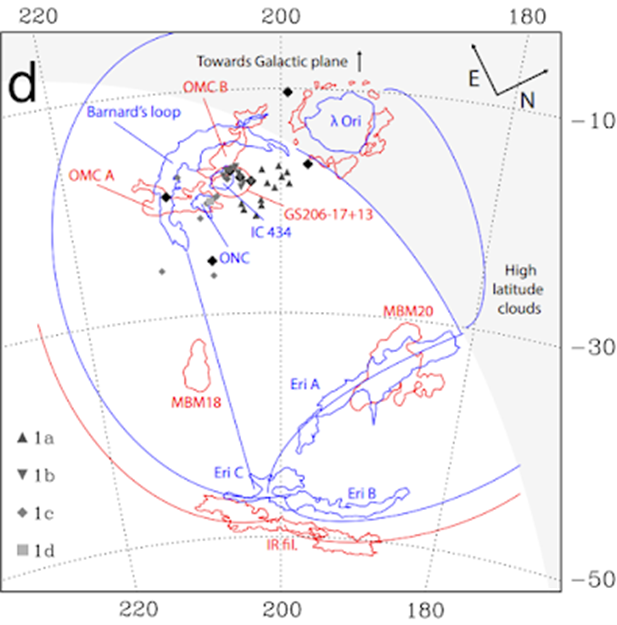
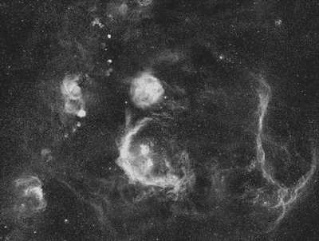
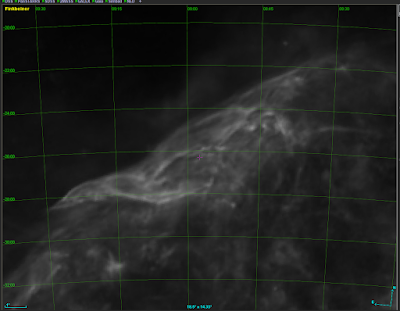
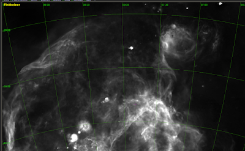
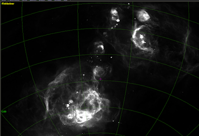

One of the joys of observing with night vision is the low-power views of large nebulous structures it provides.  Familiar nebula take on new, vibrant personalities, and one is able to observe many unfamiliar, faint nebula and those which are unnamed.  Like many I want to plan my observing and find what I’m looking at on an atlas.  But most atlases only plot the brightest nebula, or at least the brightest parts of nebula.  I searched for resources to give me an idea of what could be observed, eventually finding the H-alpha Full Sky Map  created by Douglas Finkbeiner of Harvard University.  Finkbeiner created a composite of the WHAM (Wisconsin H-Alpha Mapper), VTSS (Virginia Tech Spectral-Line Survey), and SHASSA (Southern H-Alpha Sky Survey Atlas).  The map’s 6' FWHM resolution gives a good approximation of the views in the PVS-14, as long-exposure astro-photos tend to have far finer resolution and closer image scale of individual features.  The Finkbeiner map is available as a gas-line layer on Aladin, which allows me to pull coordinates of specific features I want to observe.

I immediately noticed many large wisps of nebula which seem to connect brighter, well-known objects.  I was especially drawn to the image of the Orion-Eridanus Superbubble, of which Barnard's Loop is only a part.  The super bubble is a series of nested shells of supernova remnants and the resulting ionizing of the gas.  It appears large in the sky because it is relatively nearby.  According to one source, the nearer parts of the Superbubble are 150-200pc from the sun, and the farther portions 388pc distant.  As a whole, it is around 370pcs across and fills an apparent field of a whopping 60°-45°.  While I have visually observed small bits and pieces of Barnard's Loop, the brightest section of Eridanus A, and the Lambda Orionis Nebula in telescopes ranging from 10- to 24-inches aperture, it is only with night vision that I hoped to see not just these relatively brighter structures better, but also their faint connecting filaments.

In December 2023 I had the opportunity to visit a dark site on the California central coast, which has no light domes south or west.  Transparency was average and seeing poor to start, improving to average around midnight.  The light dew froze to frost by 11pm.  SQML was 21.3 at zenith.  I used a PVS-14 night vision device at 1x with a 7nm Ha filter, though the nebula appeared rather weak with this set-up.  I had the best views with a 3nm Ha filter front-mounted to a 3x magnifier, which was screwed to the PVS-14's objective.  I used a mirror mount for a steadier (but flipped) view, as well as a monopod.  The 3x's field of view is 10° and captured the entirety of the Lambda Orionis Nebula with room to spare.  I wanted to observe all of the shell nebula I could, beyond Barnard’s Loop and the other familiar objects.

 

 

I found it easiest to navigate by finding a bright and familiar nebula, then following any filaments I noticed coming off it.  Barnard's Loop was bright, thick, and heavily knotted.  The northern fork, which flows to Betelgeuse, was easy.  The bright & mottled eastern part of the "C" had a haze of nebula coming off it to the east, like a fog evaporating from ice.  I could not see individual fine strands of filaments, but by panning the device north-to-south, I could easily distinguish the faint, subtly mottled nebula separated from the darker sky background -- it had a soft but distinct edge.  Following the nebula trail to the east led me just north of the Seagull, which showed not just the bright body and wings, but the wider, fainter extensions which form a complete bubble.  I then panned to the north following the diffuse knots of Sivan 5 & 7, then three bright Sharpless nebula (Sh2-282, -283, and -284) leading to the Rosette and the Fox Fur.  The Rosette was very bright, shot through with dark lanes, numerous inner and outer ring crenelations, and had two bowed extensions forming a twisted path to the large and diffuse Fox Fur.  I could make out the Christmas Tree cluster and the bright star lying at the tip of the Cone Nebula, and with some concentration could see a hint of the dark nebula itself (at only 3x, it was very small scale).

Back to the Lambda Orionis, or Angelfish nebula: I could see its dark eye, and the dark lanes which separate the dorsal and pectoral fins.  There was a small round bright nebula (Sh2-63) near its mouth like a piece of bait.  From the dorsal fin I followed a moderately bright fission of nebula which hooked west and -- to my amazement -- went through the southern half of the Hyades!  Continuing east the nebula stream thickened and brightened and then turned sharply south -- this was the eastern arm of the Eridanus nebula, Eri A.  It dimmed somewhat further south, but I distinguished where it forks with the western arm, Eri B, and followed that until it petered out.  Moving back to the fork, I followed the dim diffuse nebula fog as it made its broken way back toward the southwest end of Barnard's Loop below Rigel.

Back to Lambda Orionis, on the southeast side there is a faint haze which organizes into a flow to the west, barely detected.  I did not see this clearly, but the haze flows (what appears to be) behind Eri A and connects to the tip and body of Eri B.  To my eye, this forms one large, quarter section of a unified bubble, though the paper I referenced labels these as merely "high latitude clouds."

The whole thing is enormous and engrossing, and probably the most satisfying observation I've ever made.

But wait, there's more!

After making the Orion-Eridanus observation, I moved on to finish up my Sharpless Catalog observations (I'm happy to say I've now made observations of all the Sharpless Catalog!).  The last item was Sh2-312, which was in Pyxis (09 25 00 -28 00 00).  Once it had risen sufficiently, I made my observation, again with the 3x and Ha.  What a beautiful nebula!  It filled more than 2 fields (roughly 15-degrees long and 5-degrees wide) and looks like a comet: starting from a bright point in the southeast, it fans out to the northwest and forks into two relatively bright filaments, which then fade and fan out slowly.  Here's what it looks like in the Finkbeiner All-Sky map (a little brighter and more detailed than as I saw it):

 

Well, that got me panning around the area and it turns out I could see the upper loops of the Gum Nebula (Gum 12)!  The bright claw-like body in the upper right is Sh2-310, which lies behind the "feet" of Canis Major.  I saw the two bright N-S mottled loops below it, along with the bright patches to the east (RCW-19, -20, 27, & -33).  

 

The entirety of Gum 12 is now on my bucket-list.  I need to head south and get a view of this enormous structure, which is as large as the Orion-Eridanus super bubble, but much brighter, at least as Finkbeiner illustrates:

  

### References:
* [Finkbeiner All-Sky Map](https://faun.rc.fas.harvard.edu/dfink/skymaps/halpha/processing.html)
* Ochsendorf et. al., Nested Shells Reveal the Rejuvenation of the Orion-Eridanus Superbubble, 2015 ApJ 808 111
* Joubaud et. al., The cosmic-ray content of the Orion-Eridanus superbubble, A&A 635, A96 (2020)
