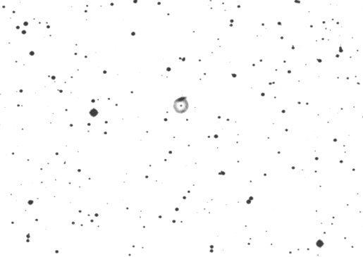

This is an example of how the simple "markup" language called Markdown
can be used to create websites for Adventures in Deep Space. There are
many Markdown tutorials on the internet, but we want to provide a
quick, ADS-tailored intro here.

## Preamble

Every markdown page starts with **Front Matter**, which contains the following format:

```
---
layout: default
title: <Title of the Page>
author: <Your Name>
---
```

The title should not contain the "Adventures in Deep Space", doing
that in the page title is taken care of by our HTML generation engine

## Sub-headings

You can create different levels of headings by using different number
of # marks before the heading content. I suggest starting with level-two
headings (i.e. two # marks before the heading) since the title of the
page uses the first-level heading.

## Bold, italics etc.

Bold text is marked with \*\* around it, e.g. \*\*bold text\*\*
produces **bold text**.

Italics are marked with either a single \* or a single \_,
e.g. \_emphasize\_ produces _emphasize_.

## Blockquotes

Blockquotes are prefixed with \>. So for example adding the line:

\> Use high power to observe the \_tiny\_ knots in the galaxy

produces:

> Use high power to observe the _tiny_ knots in the galaxy

## Horizontal Line Breaks

Use `---` on a standalone line to achieve a horizontal line break. The exact number of dashes is irrelevant as long as it is more than 3. Example:

---

## Annotating DSOs

We have some SIMBAD integration in place for handling DSO
names. Usually this is used the first time you introduce the DSO, so
that a SIMBAD page can be displayed upon hovering the mouse cursor on
the DSO name.

To attach this feature to a DSO name, simply mark it with `<x-dso>`
HTML tags as follows:

```
<x-dso>NGC 1999</x-dso>
```

This produces:
<x-dso>NGC 1999</x-dso>

If the name is not understood by SIMBAD, you can do the following:
```
> Consider observing <x-dso simbad="PN A66 37">Abell 37</x-dso> and <x-dso simbad="K79 54">KTG 54</x-dso>.
```
to get:

> Consider observing <x-dso simbad="PN A66 37">Abell 37</x-dso> and <x-dso simbad="K79 54">KTG 54</x-dso>.

## Links

A link can be added by putting square brackets around the text and putting the URL in parantheses:
```
Also check out the [Deep Sky Forum](https://deepskyforum.com)
```
produces the following:

Also check out the [Deep Sky Forum](https://deepskyforum.com)

## Tables

Tables can be written pretty naturally in markdown:

```
| Object | Type | Constellation |
| ---- | ---- | ---- |
| M 31 | Galaxy | Andromeda |
| M 42 | HII Region | Orion |
| M 66 | Galaxy | Leo |
```

turns into

| Object | Type | Constellation |
| ---- | ---- | ---- |
| M 31 | Galaxy | Andromeda |
| M 42 | HII Region | Orion |
| M 66 | Galaxy | Leo |


## Images

The method to add an image is very similar to a link, except there is an `!` before:
```

```

produces


The text `Abell 70` went into the alternative text for the image which
will be used in case the image cannot be rendered and helps
accessibility.

Of course this leads to a sizable image. If you want to show a small
resolution version, simply add `{:.small}` after the image to get the
small version (300 pixels width):

```
{:.small}
```

produces

{:.small}


Many a time, you want to invert a sketch or an image, i.e. turn white-on-black into black-on-white. That's made easy too: just add `{:.invert}` after your image:

```
{:.invert}{:.small}
```

produces

{:.invert}{:.small}


For the above to work, the image must first be added to the `docs/assets/` folder in the
repository if referencing it locally as above. One can also instead
refer to an image that's on the internet,

```
{:.small}
```

The above fetches the image from the STScI website, as seen below:

`{:.small}


We also have `{:.tiny}` which sizes the width to 100 pixels:

```
{:.tiny}
```

results in

{:.tiny}

## Mathematical Equations

Mathematical equations can be typeset through LaTeX-style code using [MathJax](https://www.mathjax.org/), e.g.:
```
To calculate the magnification use the formula $$\text{Magnification} = \dfrac{f_o}{f_e}$$
```
produces

To calculate the magnification use the formula $$\text{Magnification} = \dfrac{f_o}{f_e}$$

As you can see in this example, equations are hilighted in a different color from the rest of the text to make them stand out better. If you do not like this behavior, you can disable it by adding:
```
no_equation_hilight: false
```
to your front-matter, like:
```
---
layout: default
title: Example Markdown Page
author: Akarsh Simha
no_equation_hilight: false
---
```

To get full-fledged equations as opposed to inline ones,  separate the equation by an empty line as in this example:
```
----
The light-travel time for redshift $$z$$ can be calculated as

$$ t_L(z) = \frac{1}{H_0} \int_0^z \frac{dz'}{(1 + z') \sqrt{E(z')}}, $$

where

$$ E(z) := \Omega_\Lambda + \Omega_K (1 + z)^2 + \Omega_M (1 + z)^3 + \Omega_R (1 + z)^4. $$

----
```

The above results in:

----
The light-travel time for redshift $$z$$ can be calculated as

$$ t_L(z) = \frac{1}{H_0} \int_0^z \frac{dz'}{(1 + z') \sqrt{E(z')}}, $$

where

$$ E(z) := \Omega_\Lambda + \Omega_K (1 + z)^2 + \Omega_M (1 + z)^3 + \Omega_R (1 + z)^4. $$

----

## Advanced features

To write raw HTML, you can enclose it between `raw` and `endraw` instructions as follows:

&#123;`% raw %`&#125;
```
Image Width: <input id="icon_size" type="number" min=10 max=300 step=10 value=30 onchange="document.getElementById('resizable_icon').width=document.getElementById('icon_size').value;"/> pixels<br/>

```
&#123;`% endraw %`&#125;

produces


Image Width: <input id="icon_size" type="number" min=10 max=300 step=10 value=30 onchange="document.getElementById('resizable_icon').width=document.getElementById('icon_size').value;"/> pixels<br/>



Avoid writing too much raw HTML and styling elements using custom CSS, as it may deviate from the uniform look-and-feel we envision for the website.

The &#123;`% ... %`&#125; instructions are read by the [Liquid templating engine](https://shopify.github.io/liquid/). It allows you to do some pretty advanced stuff, for example:

`{``% assign pne = "02,04,12,65,70" | split: "," %``}`<br/>
`{``% for pn in pne %``}&nbsp;{``% endfor %``}`<br/>

gives


&nbsp;

## For more

See the KramDown quick reference [here](https://kramdown.gettalong.org/quickref.html)
